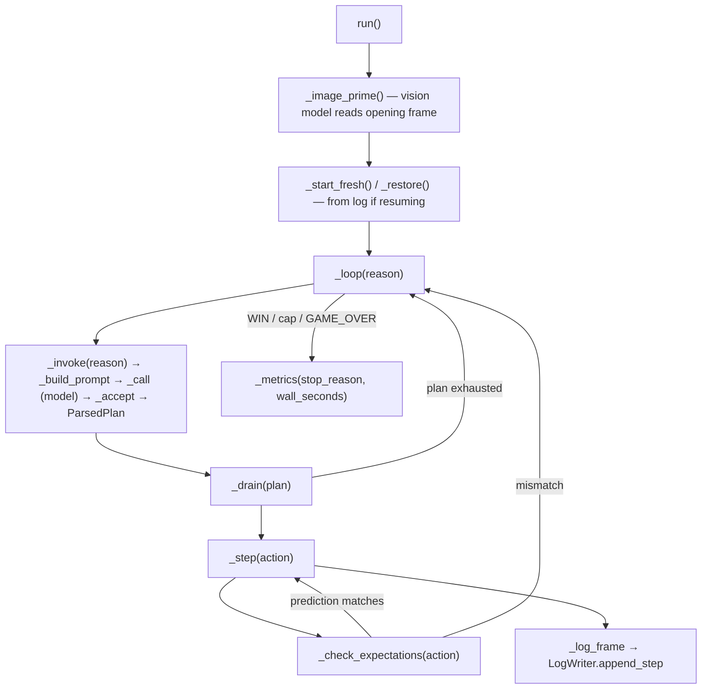

# GameRunner — the retrodiction-gated play loop

<!-- connect:up:begin -->
> **Cross-repo concept:** part of [verification-independence](../../../concepts/verification-independence.md) across this wiki's repos.
<!-- connect:up:end -->
## Overview

`GameRunner` is Retrodict's entire agent loop: [`run`](../catalog/src/arc3/runner.md#GameRunner.run) plays
"until WIN, a cap, or a failure" (the method's own docstring), alternating between asking the model for a
plan and executing that plan action-by-action against the real ARC-AGI-3 environment. What makes it
"retrodiction" rather than an ordinary agent loop is that every planned action must carry an explicit
prediction, checked against reality after each step, and the entire run state can be **rebuilt from the
log alone** — the log is not just an audit trail, it is the source of truth the agent's own memory is
allowed to be wrong about.

## Diagram

## Design rationale (why it's built this way)

**`_restore` treats the log as ground truth the agent's live state can diverge from, not a cache of it.**
Its own docstring is exactly this claim: *"Rebuild env state by replaying the logged actions; continue
accounting."* When a session resumes (after a context reset — see the source page's `playbook.md`/`log.txt`
split), [`_restore`](../catalog/src/arc3/runner.md#GameRunner._restore) replays every logged action back
through the real environment rather than trusting any cached belief about where the game currently stands,
and [`_seed_level_signals`](../catalog/src/arc3/runner.md#GameRunner._seed_level_signals) recovers the
current level's stuck-detection signals from that same replay — *"Recover the current level's stuck signals
from the replayed log."* Nothing about the current level's state survives a reset except what the log can
reconstruct.

**A prediction mismatch halts the *rest of the plan*, not just the one action.** [`_drain`](../catalog/src/arc3/runner.md#GameRunner._drain)
executes a `ParsedPlan`'s actions one at a time via [`_step`](../catalog/src/arc3/runner.md#GameRunner._step),
and `_step` calls [`_check_expectations`](../catalog/src/arc3/runner.md#GameRunner._check_expectations)
after every action — a non-`None` return (a mismatch) breaks out of the drain loop back to `_loop`, so a
model that predicted wrong doesn't keep executing a plan built on a false premise for its remaining steps.

**Escalation is signal-driven, not turn-count-driven.** [`_escalation_directive`](../catalog/src/arc3/runner.md#GameRunner._escalation_directive)'s
own docstring — *"Escalate a stuck level (par-free signals only) and render the binding directive, or
''"* — states the escalation only fires on evidence of being stuck: it computes the tier itself from
actions-spent-on-this-level against fixed thresholds, and
[`_record_escalation`](../catalog/src/arc3/runner.md#GameRunner._record_escalation) then persists that tier
change (to `invocation_log` and the transcript) as an auditable event, separating "decide to escalate" from
"record that it happened."

## Entry points
- [`GameRunner.run`](../catalog/src/arc3/runner.md#GameRunner.run) — the top-level entry point; primes with
  a vision read, starts fresh or restores from log, loops until a terminal condition, returns metrics.
- [`GameRunner._restore`](../catalog/src/arc3/runner.md#GameRunner._restore) — the resume path, reached
  instead of `_start_fresh` when prior log records exist.

## Mechanism (step-by-step)
1. [`run`](../catalog/src/arc3/runner.md#GameRunner.run) calls [`_image_prime`](../catalog/src/arc3/runner.md#GameRunner._image_prime)
   once — *"Ask a vision model to read the opening frame; store its answer for the first prompt"* — giving
   the otherwise-text-only loop one visual read before it starts reasoning purely over the log.
2. [`_loop`](../catalog/src/arc3/runner.md#GameRunner._loop) calls [`_invoke`](../catalog/src/arc3/runner.md#GameRunner._invoke),
   which builds a prompt ([`_build_prompt`](../catalog/src/arc3/runner.md#GameRunner._build_prompt)), calls
   the model ([`_call`](../catalog/src/arc3/runner.md#GameRunner._call)), and validates the reply into a
   `ParsedPlan` via [`_accept`](../catalog/src/arc3/runner.md#GameRunner._accept).
3. `_loop` hands the plan to [`_drain`](../catalog/src/arc3/runner.md#GameRunner._drain), which plays each
   `PlannedAction` through [`_step`](../catalog/src/arc3/runner.md#GameRunner._step) — advancing the real
   environment and logging the frame via [`_log_frame`](../catalog/src/arc3/runner.md#GameRunner._log_frame).
4. Each step is checked against its prediction by
   [`_check_expectations`](../catalog/src/arc3/runner.md#GameRunner._check_expectations); a mismatch ends
   the drain early and returns control to `_loop` for a fresh `_invoke`.
5. On WIN, a hard cap, or a failure, [`run`](../catalog/src/arc3/runner.md#GameRunner.run) calls
   [`_metrics`](../catalog/src/arc3/runner.md#GameRunner._metrics), which folds in
   [`_cost`](../catalog/src/arc3/runner.md#GameRunner._cost) computed from tracked token usage.

## Key data structures
- `state: RunState` — the runner's live view of the game (see
  [`GameRunner.state`](../catalog/src/arc3/runner.md#GameRunner.state)), continuously rebuilt-or-extended by
  the log rather than trusted as an independent source of truth.
- `frame` — the current board observation, threaded through nearly every method in this packet's subgraph.

## Edge cases
- [`_reset_after_game_over`](../catalog/src/arc3/runner.md#GameRunner._reset_after_game_over) is a distinct
  path from a normal expectation-mismatch break — a `GAME_OVER` state gets its own recovery rather than
  being treated as just another failed prediction.
- `_check_expectations` and `_step` both read `frame` and `state` directly rather than through a return
  value chain, so the check is against the environment's *actual* post-action state, not a value threaded
  through the call stack — a subtlety worth knowing if extending the expectation-checking logic.

## See also
- [`arc3-logwriter`](arc3-logwriter.md) — the log format `_restore`/`_log_frame` read and write.
- [`arc3-plan_parser`](arc3-plan_parser.md) — where `PlannedAction.expect` (the prediction
  `_check_expectations` verifies) comes from.
