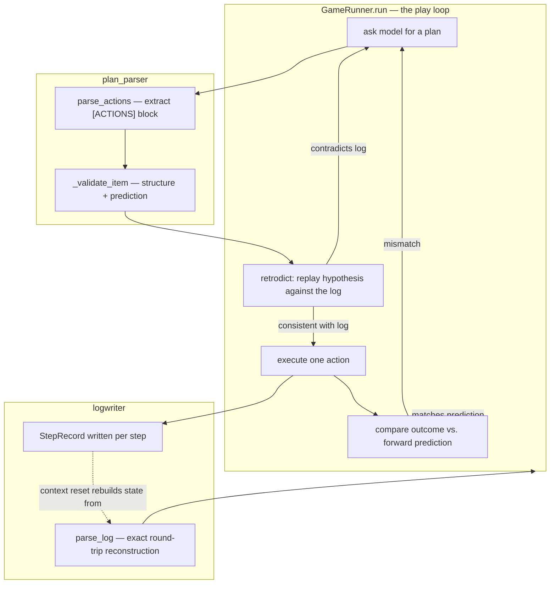

# Retrodict — what it is and how it fits together

> Grounded code wiki for [ryanbbrown/Retrodict](https://github.com/ryanbbrown/Retrodict), Ryan Brown's
> ARC-AGI-3 agent, pinned @ `71672e8e5a`. This is the *implementation* companion to the paper/writeup
> summary in [`../../sources/retrodict.md`](../../sources/retrodict.md) and the benchmark background in
> [`../../sources/arc-agi-3.md`](../../sources/arc-agi-3.md). Read those for *why retrodiction as a strategy
> works on ARC-AGI-3*; read this for *how the code actually implements it*.

## In one paragraph
Retrodict plays each ARC-AGI-3 game by **retrodiction**: before it spends a real action on a hypothesis
about how a game mechanic works, it replays that hypothesis in Python against the game's own recorded
history and checks whether the replay is consistent — a hypothesis that contradicts something already
observed is rejected for free, without touching the live environment. [`GameRunner`](concepts/arc3-runner.md)
is the retrodiction-gated play loop; every planned action carries a forward prediction, produced and
validated by [`plan_parser`](concepts/arc3-plan_parser.md), that is checked against reality immediately
after the action executes, halting the rest of the plan on a mismatch rather than continuing to act on a
now-falsified model. [`LogWriter`](concepts/arc3-logwriter.md) is what makes both directions possible: every
step is written as a `StepRecord` to a plain-text log that can be exactly reconstructed, so the log — not
the agent's live in-memory state — is the ground truth both the pre-action retrodiction check and a
context-reset session's rebuilt understanding of the game are checked against.

## Core architecture

## Main concepts
- **The retrodiction-gated play loop.** [`GameRunner`](concepts/arc3-runner.md) plays "until WIN, a cap, or
  a failure" (the method's own docstring) — alternating between asking the model for a plan and executing it
  action-by-action, gating each hypothesis against the recorded log before it can spend a real action.
- **Where the per-action prediction is born.** [`plan_parser`](concepts/arc3-plan_parser.md) turns the
  model's free-text reply into validated, structured `PlannedAction`s, each carrying the forward prediction
  that gets checked against reality once the action executes.
- **The log as replayable ground truth.** [`LogWriter`](concepts/arc3-logwriter.md)'s `StepRecord` format
  round-trips exactly through `parse_log` — the property that lets both the pre-action retrodiction check
  and a context-reset session rebuild an identical understanding of the game from the same artifact.

## How a run flows
`GameRunner.run` asks the model for a plan, `plan_parser.parse_actions` extracts and validates it into a
sequence of `PlannedAction`s (each with a forward prediction attached), and before any action in that plan
is sent to the real environment, its underlying hypothesis is retrodicted — replayed against the
`StepRecord` history `LogWriter` has accumulated so far. Only a hypothesis consistent with everything
already observed is allowed to spend a real action; after it executes, the actual outcome is compared
against the action's forward prediction, and a mismatch halts the rest of the plan rather than continuing
on a model of the game that's just been falsified. Every step — planned, retrodicted, executed, checked —
is appended to the log, so a session that resets context can call `parse_log` and rebuild the exact same
understanding of the game the live session had, treating the log as ground truth its own in-memory state
can diverge from.

## Map of the wiki
- *"How does the retrodiction gate work end to end?"* → [`retrodiction-methodology`](doc-concepts/retrodiction-methodology.md).
- *"What happens on a context reset?"* → [`context-reset-and-playbook`](doc-concepts/context-reset-and-playbook.md).
- *"Where is a per-action prediction created and checked?"* → [`arc3-plan_parser`](concepts/arc3-plan_parser.md).
- *"What's the log format and how does replay work?"* → [`arc3-logwriter`](concepts/arc3-logwriter.md).
- *Exhaustive per-module symbol index* → [`catalog/`](catalog/); *concept table + coverage* →
  [`index.md`](index.md).

## Cross-repo concepts
All three concept pages in this silo are tagged
[`verification-independence`](../../concepts/verification-independence.md) — retrodiction (checking a
hypothesis against a frozen, recorded artifact before committing a real action) and forward-prediction
checking (verifying the mechanism fired, not just that a scalar moved) are both instances of that concept's
"make the evidence an artifact, not an assertion" mechanism, applied one level down from an independent
verifier *process* — inside a single agent's own reasoning, against its own recorded log rather than a
separate grader. See that page's comparison table for how this sits relative to the other silos' verifier
designs.
