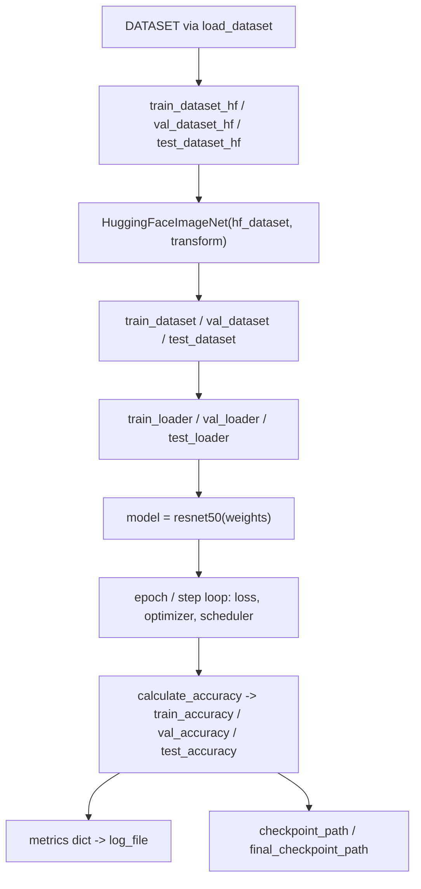

# The ICBINB seed idea — an example Stage-1 starter script

## Overview
This module is not shared framework machinery — it is one bundled **example idea**
under `ai_scientist/ideas/`, shipped as a triple: a workshop-topic abstract
([`i_cant_believe_its_not_better.md`](../../../../raw/code/ai-scientist-v2/ai_scientist/ideas/i_cant_believe_its_not_better.md),
the "I Can't Believe It's Not Better" negative-results workshop's own TL;DR/keywords),
a list of candidate hypotheses
([`i_cant_believe_its_not_better.json`](../../../../raw/code/ai-scientist-v2/ai_scientist/ideas/i_cant_believe_its_not_better.json),
three proposals: compositional regularization, interpretability-failure analysis, and
real-world pest detection), and this `.py` file — a flat, top-to-bottom Python script
that is the concrete, runnable "flavor" attached to the idea. It shows what a
Stage-1 seed script looks like for an image-classification demo: how to pull a
Hugging Face dataset, wrap it as a `torch.utils.data.Dataset`, and run a
train/val/test loop with periodic accuracy checks and checkpointing. A sibling file,
`i_cant_believe_its_not_betterrealworld.py`, is the same pattern applied to a
different (real-world) dataset and is covered on its own concept page.

## Diagram

## Design rationale (why it's built this way)
The file reads as two very different halves, and that split is itself informative.
Lines above the "MINI-IMAGENET REFERENCE" comment are a cookbook of copy-pasteable
snippets — alternate HF datasets to swap in, and pretrained feature-extraction
pipeline examples — rather than code meant to execute as one program. The clearest
evidence: the snippet that computes a [`pipe`](../catalog/ai_scientist/ideas/i_cant_believe_its_not_better.md#pipe)-based
similarity score builds [`outputs`](../catalog/ai_scientist/ideas/i_cant_believe_its_not_better.md#outputs)
from [`image_real`](../catalog/ai_scientist/ideas/i_cant_believe_its_not_better.md#image_real)
and [`image_gen`](../catalog/ai_scientist/ideas/i_cant_believe_its_not_better.md#image_gen)
(fetched via [`img_urls`](../catalog/ai_scientist/ideas/i_cant_believe_its_not_better.md#img_urls)
and a shared [`device`](../catalog/ai_scientist/ideas/i_cant_believe_its_not_better.md#device))
and then calls a `cosine_similarity` function that is never imported anywhere in the
file — running this script top-to-bottom as literal Python would crash before it
ever reaches the actual training loop. That is a strong signal this half is
reference material to read and cherry-pick from, not a template to execute verbatim.

> [!inferred] The comments on the mini-imagenet config constants — `BATCH_SIZE`
> "Increased from 128 to utilize H100's memory", `NUM_WORKERS` "Reduced as too many
> workers can cause overhead", `NUM_EPOCHS` "Increased for better convergence",
> `STEPS_TO_LOG` "Reduced for more frequent feedback", `NUM_TEST_BATCHES` "Reduced
> while maintaining reasonable evaluation" — read like an agent's own rationale
> after tuning a knob, not upfront documentation. It's plausible this checked-in
> copy is itself a once-mutated snapshot rather than a pristine hand-written seed,
> but nothing in this packet confirms that; it's a reading of the comments, not a
> verified fact.

> [!inferred] The broader claim that AI-Scientist v2's tree search only needs small
> per-topic "flavor" scripts like this one, where v1 needed a fuller human-authored
> template, is plausible given how thin this file's actual training logic is
> relative to the surrounding reference cookbook — but this packet's subgraph is
> scoped to this one file, so the comparison to v1 is not something this page can
> ground; treat it as background, not a verified claim.

## Entry points
- [`train_dataset`](../catalog/ai_scientist/ideas/i_cant_believe_its_not_better.md#train_dataset),
  [`val_dataset`](../catalog/ai_scientist/ideas/i_cant_believe_its_not_better.md#val_dataset),
  [`test_dataset`](../catalog/ai_scientist/ideas/i_cant_believe_its_not_better.md#test_dataset) —
  the three `HuggingFaceImageNet`-wrapped splits. The file has no `if __name__`
  guard, so control simply falls through top to bottom; this is where the *real*
  (executable) half of the script begins, right after the config constants.
- [`model`](../catalog/ai_scientist/ideas/i_cant_believe_its_not_better.md#model) —
  the `resnet50(weights=weights)` instantiation. Control reaches it once the three
  loaders exist, and the same `model` object is threaded through every later call:
  the training loop, every [`calculate_accuracy`](../catalog/ai_scientist/ideas/i_cant_believe_its_not_better.md#calculate_accuracy)
  invocation, and both checkpoint saves.
- [`calculate_accuracy`](../catalog/ai_scientist/ideas/i_cant_believe_its_not_better.md#calculate_accuracy) —
  the one factored-out function in an otherwise flat script. Control reaches it
  three times per logged step (once each for train/val/test), not once per batch.
- [`checkpoint_path`](../catalog/ai_scientist/ideas/i_cant_believe_its_not_better.md#checkpoint_path) /
  [`final_checkpoint_path`](../catalog/ai_scientist/ideas/i_cant_believe_its_not_better.md#final_checkpoint_path) —
  reached inside the logging cadence (every `STEPS_TO_LOG` steps, only if validation
  accuracy improved) and once more, unconditionally, after the epoch loop exits.

## Mechanism (step-by-step)
1. The three splits are pulled from the Hugging Face Hub — [`train_dataset_hf`](../catalog/ai_scientist/ideas/i_cant_believe_its_not_better.md#train_dataset_hf),
   [`val_dataset_hf`](../catalog/ai_scientist/ideas/i_cant_believe_its_not_better.md#val_dataset_hf),
   [`test_dataset_hf`](../catalog/ai_scientist/ideas/i_cant_believe_its_not_better.md#test_dataset_hf) —
   each a plain `datasets.arrow_dataset.Dataset` keyed off the same
   [`DATASET`](../catalog/ai_scientist/ideas/i_cant_believe_its_not_better.md#DATASET)
   string (`"timm/mini-imagenet"`). They are then wrapped by
   [`HuggingFaceImageNet`](../catalog/ai_scientist/ideas/i_cant_believe_its_not_better.md#HuggingFaceImageNet)
   into [`train_dataset`](../catalog/ai_scientist/ideas/i_cant_believe_its_not_better.md#train_dataset)/[`val_dataset`](../catalog/ai_scientist/ideas/i_cant_believe_its_not_better.md#val_dataset)/[`test_dataset`](../catalog/ai_scientist/ideas/i_cant_believe_its_not_better.md#test_dataset),
   a thin `torch.utils.data.Dataset` subclass that pulls `sample["image"]`/`sample["label"]`
   out of each HF row and applies [`transform`](../catalog/ai_scientist/ideas/i_cant_believe_its_not_better.md#transform)
   lazily, per-item, in `__getitem__` — the resize/normalize/tensor conversion never
   touches the underlying HF dataset object itself.
2. Each wrapped dataset becomes a `DataLoader` —
   [`train_loader`](../catalog/ai_scientist/ideas/i_cant_believe_its_not_better.md#train_loader),
   [`val_loader`](../catalog/ai_scientist/ideas/i_cant_believe_its_not_better.md#val_loader),
   [`test_loader`](../catalog/ai_scientist/ideas/i_cant_believe_its_not_better.md#test_loader) —
   sized by [`BATCH_SIZE`](../catalog/ai_scientist/ideas/i_cant_believe_its_not_better.md#BATCH_SIZE)
   and parallelized by [`NUM_WORKERS`](../catalog/ai_scientist/ideas/i_cant_believe_its_not_better.md#NUM_WORKERS)
   worker processes; only the train loader shuffles.
3. Model, loss, optimizer and schedule are assembled once, before any epoch runs:
   [`model`](../catalog/ai_scientist/ideas/i_cant_believe_its_not_better.md#model)
   is a `resnet50` built with [`weights`](../catalog/ai_scientist/ideas/i_cant_believe_its_not_better.md#weights)
   (`None` — see Edge cases), [`criterion`](../catalog/ai_scientist/ideas/i_cant_believe_its_not_better.md#criterion)
   is cross-entropy with label smoothing, [`optimizer`](../catalog/ai_scientist/ideas/i_cant_believe_its_not_better.md#optimizer)
   is SGD with Nesterov momentum and [`WEIGHT_DECAY`](../catalog/ai_scientist/ideas/i_cant_believe_its_not_better.md#WEIGHT_DECAY),
   and [`scheduler`](../catalog/ai_scientist/ideas/i_cant_believe_its_not_better.md#scheduler)
   chains a linear warm-up over [`WARMUP_EPOCHS`](../catalog/ai_scientist/ideas/i_cant_believe_its_not_better.md#WARMUP_EPOCHS)
   into cosine annealing for the remainder of [`NUM_EPOCHS`](../catalog/ai_scientist/ideas/i_cant_believe_its_not_better.md#NUM_EPOCHS).
4. The training loop is a plain nested `for` — outer [`epoch`](../catalog/ai_scientist/ideas/i_cant_believe_its_not_better.md#epoch)
   over `NUM_EPOCHS`, inner [`step`](../catalog/ai_scientist/ideas/i_cant_believe_its_not_better.md#step)
   over `train_loader` yielding [`images`](../catalog/ai_scientist/ideas/i_cant_believe_its_not_better.md#images)/[`labels`](../catalog/ai_scientist/ideas/i_cant_believe_its_not_better.md#labels).
   Each step computes [`loss`](../catalog/ai_scientist/ideas/i_cant_believe_its_not_better.md#loss)
   from the model's logits, clips gradients to
   [`GRAD_CLIP_NORM`](../catalog/ai_scientist/ideas/i_cant_believe_its_not_better.md#GRAD_CLIP_NORM),
   steps the optimizer and the (per-step, not per-epoch) scheduler, and accumulates
   [`running_loss`](../catalog/ai_scientist/ideas/i_cant_believe_its_not_better.md#running_loss).
5. Every [`STEPS_TO_LOG`](../catalog/ai_scientist/ideas/i_cant_believe_its_not_better.md#STEPS_TO_LOG)
   steps, the loop pauses to measure: [`avg_loss`](../catalog/ai_scientist/ideas/i_cant_believe_its_not_better.md#avg_loss),
   wall-clock [`elapsed`](../catalog/ai_scientist/ideas/i_cant_believe_its_not_better.md#elapsed)/[`epoch_elapsed`](../catalog/ai_scientist/ideas/i_cant_believe_its_not_better.md#epoch_elapsed),
   and — by calling [`calculate_accuracy`](../catalog/ai_scientist/ideas/i_cant_believe_its_not_better.md#calculate_accuracy)
   three separate times, each capped at
   [`NUM_TEST_BATCHES`](../catalog/ai_scientist/ideas/i_cant_believe_its_not_better.md#NUM_TEST_BATCHES)
   batches for speed — [`train_accuracy`](../catalog/ai_scientist/ideas/i_cant_believe_its_not_better.md#train_accuracy),
   [`val_accuracy`](../catalog/ai_scientist/ideas/i_cant_believe_its_not_better.md#val_accuracy),
   and [`test_accuracy`](../catalog/ai_scientist/ideas/i_cant_believe_its_not_better.md#test_accuracy).
   These get appended to the [`metrics`](../catalog/ai_scientist/ideas/i_cant_believe_its_not_better.md#metrics)
   dict and flushed to [`log_file`](../catalog/ai_scientist/ideas/i_cant_believe_its_not_better.md#log_file)
   on every logged step, so a run can be inspected mid-flight, not just after
   completion.
6. If `val_accuracy` beats the running
   [`best_val_accuracy`](../catalog/ai_scientist/ideas/i_cant_believe_its_not_better.md#best_val_accuracy),
   the loop builds a [`perf_string`](../catalog/ai_scientist/ideas/i_cant_believe_its_not_better.md#perf_string)-suffixed
   [`checkpoint_path`](../catalog/ai_scientist/ideas/i_cant_believe_its_not_better.md#checkpoint_path)
   under [`checkpoint_dir`](../catalog/ai_scientist/ideas/i_cant_believe_its_not_better.md#checkpoint_dir)
   (itself timestamped via [`timestamp`](../catalog/ai_scientist/ideas/i_cant_believe_its_not_better.md#timestamp)
   and named from [`DATASET_NAME`](../catalog/ai_scientist/ideas/i_cant_believe_its_not_better.md#DATASET_NAME))
   and saves a dict of epoch/step/model/optimizer state. After the whole epoch loop
   finishes, the script writes one more, unconditional checkpoint to
   [`final_checkpoint_path`](../catalog/ai_scientist/ideas/i_cant_believe_its_not_better.md#final_checkpoint_path) —
   so a run always ends with a final snapshot regardless of whether it was ever the
   best one seen.

## Key data structures
- [`HuggingFaceImageNet`](../catalog/ai_scientist/ideas/i_cant_believe_its_not_better.md#HuggingFaceImageNet) —
  the only class in the file: a two-field (`hf_dataset`, `transform`) adapter that
  makes a Hugging Face `datasets.Dataset` look like a standard indexable
  `(image, label)` PyTorch dataset. This is the reusable "shape" a tree-search
  mutation of this seed would most likely keep, since everything downstream
  (loaders, training loop) is written against the plain PyTorch `Dataset`/`DataLoader`
  contract rather than against HF's own `Dataset` API.
- [`metrics`](../catalog/ai_scientist/ideas/i_cant_believe_its_not_better.md#metrics) —
  a dict of six parallel lists (`epoch`, `step`, `loss`, `train_accuracy`,
  `val_accuracy`, `test_accuracy`), append-only, re-saved to `log_file` on every
  logged step rather than assembled once at the end.
- The checkpoint payload built at [`checkpoint_path`](../catalog/ai_scientist/ideas/i_cant_believe_its_not_better.md#checkpoint_path)/[`final_checkpoint_path`](../catalog/ai_scientist/ideas/i_cant_believe_its_not_better.md#final_checkpoint_path) —
  `epoch`, `step`, `model_state_dict`, `optimizer_state_dict`, `loss`,
  `val_accuracy` — carries enough to resume training, not just to reload weights
  for inference.

## Dynamics (design intent)
There is no test coverage for this subgraph (none of the configured test paths
reference it), and the script carries no docstrings — it is a linear, single-process
script with no explicit concurrency of its own beyond the `NUM_WORKERS` worker
processes spun up by each `DataLoader` for image decode/transform. Nothing in the
source indicates this script is ever imported as a module elsewhere in the repo;
its own comments and constant names are the only design-intent evidence available.

## Edge cases
- [`weights`](../catalog/ai_scientist/ideas/i_cant_believe_its_not_better.md#weights)
  is `None`, so [`model`](../catalog/ai_scientist/ideas/i_cant_believe_its_not_better.md#model)
  trains `resnet50` from random initialization rather than from ImageNet-pretrained
  weights — despite the dataset being (mini-)ImageNet-derived, this is not a
  transfer-learning setup.
- [`IMAGE_SIZE`](../catalog/ai_scientist/ideas/i_cant_believe_its_not_better.md#IMAGE_SIZE)
  is 84 pixels, well below the 224×224 resolution `resnet50`'s architecture was
  designed around; images are resized down to 84×84 before being fed to the
  network.
- [`avg_loss`](../catalog/ai_scientist/ideas/i_cant_believe_its_not_better.md#avg_loss)
  and `val_accuracy` are only recomputed inside the `STEPS_TO_LOG`-gated block
  inside the epoch loop. The unconditional save to
  [`final_checkpoint_path`](../catalog/ai_scientist/ideas/i_cant_believe_its_not_better.md#final_checkpoint_path)
  after the loop reuses whatever values those variables last held — i.e. from the
  last *logged* step, not necessarily the literal final training step.
- [`device`](../catalog/ai_scientist/ideas/i_cant_believe_its_not_better.md#device)
  is assigned identically twice (once in the reference-snippet prelude, once again
  right before the mini-imagenet config block) — redundant but harmless, since both
  assignments compute the same `torch.device(...)` expression.
- The reference prelude that builds [`outputs`](../catalog/ai_scientist/ideas/i_cant_believe_its_not_better.md#outputs)
  from a [`pipe`](../catalog/ai_scientist/ideas/i_cant_believe_its_not_better.md#pipe)
  feature-extraction call on [`image_real`](../catalog/ai_scientist/ideas/i_cant_believe_its_not_better.md#image_real)/[`image_gen`](../catalog/ai_scientist/ideas/i_cant_believe_its_not_better.md#image_gen)
  goes on to call a `cosine_similarity` function that the file never imports —
  running this script as one literal program would raise a `NameError` there,
  before the mini-imagenet training code below it ever executes.
- The script also calls Hugging Face Hub `login()` with an `HF_TOKEN` environment
  variable at import time, before any dataset code runs — an unset `HF_TOKEN` fails
  the script immediately, independent of anything covered above.

## Open questions
- Whether the config-constant comments (`BATCH_SIZE`, `NUM_WORKERS`, `NUM_EPOCHS`,
  `STEPS_TO_LOG`, `NUM_TEST_BATCHES` all carry "increased/reduced from..."-style
  rationale) reflect an already-searched/tuned snapshot checked into the repo, or
  are simply author-written guidance comments — the packet has no way to
  distinguish these two possibilities.
- Whether the broken `cosine_similarity` reference in the prelude is a known,
  accepted "read-only, don't execute this part" convention for these `ideas/*.py`
  seed files repo-wide, or an oversight specific to this one file — nothing in this
  packet's subgraph settles it.

## See also
- [`ai_scientist-ideas-i_cant_believe_its_not_betterrealworld`](./ai_scientist-ideas-i_cant_believe_its_not_betterrealworld.md) —
  the sibling seed script for the same ICBINB workshop topic, applied to a
  different, real-world dataset.
