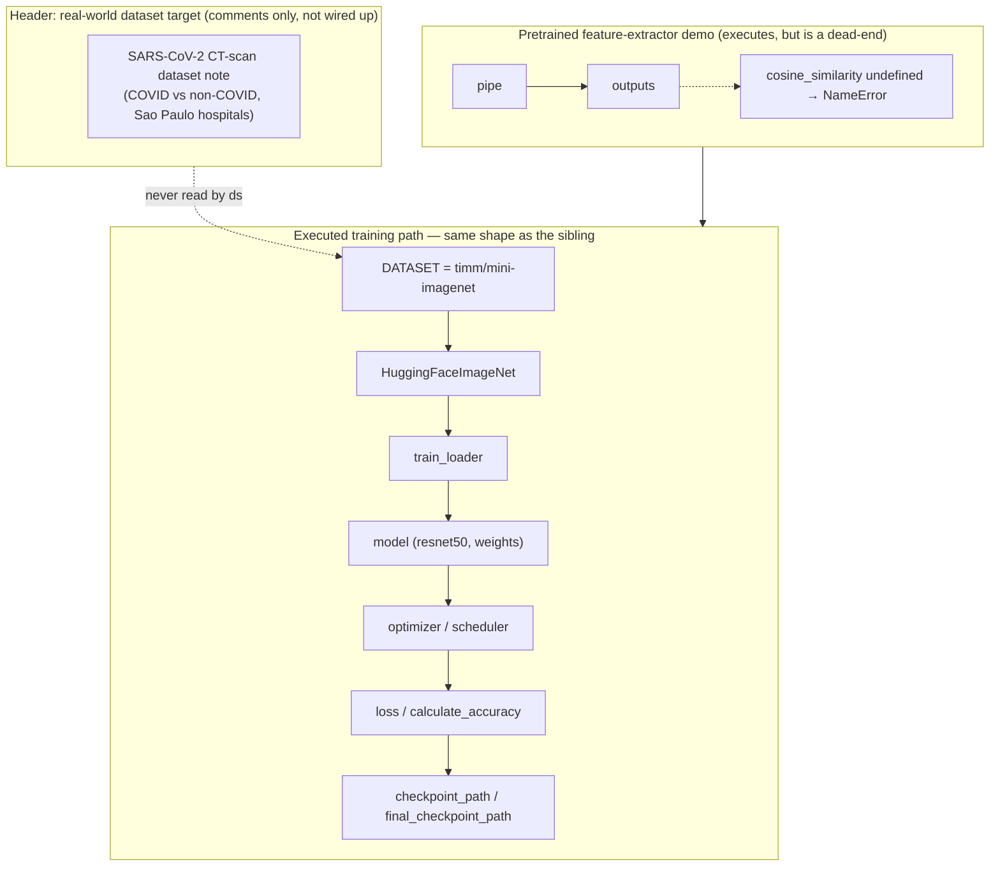

# The ICBINB real-world seed idea — the domain-shift variant

## Overview
`i_cant_believe_its_not_betterrealworld.py` is a bundled **seed-idea script** under `ai_scientist/ideas/` —
one candidate research idea the ideation/tree-search stages of AI-Scientist-v2 can hand to a coding agent
as a starting point, not shared framework machinery. It is a near-duplicate of a sibling script,
`i_cant_believe_its_not_better.py` (covered on its own concept page), and both are seeded for the
**ICBINB ("I Can't Believe It's Not Better")** workshop track, whose abstract asks why deep learning
"doesn't always deliver as expected in the real world" and explicitly names **healthcare** among the
domains where curated-benchmark performance breaks down under real deployment conditions
(`ai_scientist/ideas/i_cant_believe_its_not_better.md`, not part of this packet's subgraph). This
"realworld" variant is the one that leans into that theme: its header comments point at a real hospital
CT-scan dataset instead of a synthetic benchmark. What is genuinely different from the sibling is where
this page focuses; the generic ResNet-on-a-benchmark training loop underneath is the same shape as the
sibling's and is covered only briefly here.

> [!inferred]
> Nothing in this subgraph shows another module importing or invoking this file — it has no callers.
> That is consistent with `ideas/*.py` files being read as reference/example text by an LLM-driven
> ideation or coding agent rather than executed as a library module, but the subgraph cannot confirm
> *how* the pipeline consumes it.

## Diagram

## Design rationale (why it's built this way)
- **The header names a real deployment target, but the code below it doesn't use it.** The commented
  `## DATASET REFERENCE` block at the top of the file describes a real SARS-CoV-2 CT-scan classification
  task — 247 scans from real patients, `COVID`/`non-COVID` folders, a recommended `IMAGE_SIZE = 64` — and
  cites the source medRxiv paper. That is squarely the ICBINB theme: a real, small, messy clinical dataset
  instead of a clean academic one. But the only *executed* dataset-loading code in the file is the
  `## MINI-IMAGENET REFERENCE` block, which sets [`DATASET`](../catalog/ai_scientist/ideas/i_cant_believe_its_not_betterrealworld.md#DATASET)
  to `"timm/mini-imagenet"` and [`IMAGE_SIZE`](../catalog/ai_scientist/ideas/i_cant_believe_its_not_betterrealworld.md#IMAGE_SIZE)
  to `84` — not the `64` the header recommends for the CT-scan set. The file's *name* and its *header
  commentary* target a domain-shift/real-world dataset; its *wired-up code* still trains on a standard
  benchmark.
  > [!inferred]
  > Read together, this looks like a seed template: the header block is guidance for whichever agent
  > elaborates this idea into a real experiment (swap in the CT-scan loader, use `IMAGE_SIZE=64`, split
  > train/val/test), while the mini-imagenet block underneath is a working reference implementation of the
  > *loop structure* the agent can imitate. The two roles are not distinguished by any executable flag —
  > only by which block is commented out.
- **The pretrained-model demo hints at the same domain shift, but is disconnected from training.** The
  `## PRE-TRAINED MODELS REFERENCE` block builds a [`pipe`](../catalog/ai_scientist/ideas/i_cant_believe_its_not_betterrealworld.md#pipe)
  image-feature-extraction pipeline and reassigns it across three models in sequence — `google/vit-base-patch16-384`,
  `facebook/dinov2-base`, and `microsoft/rad-dino`, the last one commented "trained to encode chest
  X-rays" in the source. That comment is the one other real-world/medical-imaging tell in the file. But
  the block only computes an embedding [`outputs`](../catalog/ai_scientist/ideas/i_cant_believe_its_not_betterrealworld.md#outputs)
  for two demo cat images and stops — it never feeds into the `resnet50` classifier trained later, and it
  is not a helper function, just inline scratch code.

## Entry points
- [`HuggingFaceImageNet`](../catalog/ai_scientist/ideas/i_cant_believe_its_not_betterrealworld.md#HuggingFaceImageNet) —
  the dataset wrapper the script builds three of (train/val/test) once the module executes top to bottom;
  this is where whatever split [`train_dataset_hf`](../catalog/ai_scientist/ideas/i_cant_believe_its_not_betterrealworld.md#train_dataset_hf)/[`val_dataset_hf`](../catalog/ai_scientist/ideas/i_cant_believe_its_not_betterrealworld.md#val_dataset_hf)/[`test_dataset_hf`](../catalog/ai_scientist/ideas/i_cant_believe_its_not_betterrealworld.md#test_dataset_hf)
  loaded gets turned into a `torch.utils.data.Dataset` with the shared image transform applied lazily in
  `__getitem__`.
- [`model`](../catalog/ai_scientist/ideas/i_cant_believe_its_not_betterrealworld.md#model) — a `resnet50`
  built with [`weights`](../catalog/ai_scientist/ideas/i_cant_believe_its_not_betterrealworld.md#weights) set
  to `None`, i.e. trained from scratch, in contrast to the pretrained feature extractors used in the demo
  block above it.
- [`calculate_accuracy`](../catalog/ai_scientist/ideas/i_cant_believe_its_not_betterrealworld.md#calculate_accuracy) —
  the one real function definition in the file; every periodic train/val/test accuracy readout during
  training calls into it.
- [`pipe`](../catalog/ai_scientist/ideas/i_cant_believe_its_not_betterrealworld.md#pipe) — reached first, as
  soon as the module executes, before any dataset or training code; it is the entry point into the
  disconnected pretrained-model demo discussed above.

## Mechanism (step-by-step)
1. **Module-level execution starts with a reference demo, not training.** As soon as the file runs, it logs
   into Hugging Face, builds an image-feature-extraction [`pipe`](../catalog/ai_scientist/ideas/i_cant_believe_its_not_betterrealworld.md#pipe),
   downloads two demo images, and computes [`outputs`](../catalog/ai_scientist/ideas/i_cant_believe_its_not_betterrealworld.md#outputs)
   — the pipeline's embeddings for them. The next source line calls `cosine_similarity`, a name never
   imported anywhere in the file, so if this script is ever executed verbatim it fails here with a
   `NameError` before a single training example is seen. That strongly suggests this block is meant to be
   *read*, as example code showing how to use domain-relevant pretrained encoders (including the
   chest-X-ray-tuned RAD-DINO), rather than *run*.
2. **The dataset actually wired up is the benchmark, not the CT-scan set the header describes.**
   [`train_dataset`](../catalog/ai_scientist/ideas/i_cant_believe_its_not_betterrealworld.md#train_dataset)
   (and its val/test counterparts) wrap Hugging Face splits loaded via
   [`DATASET`](../catalog/ai_scientist/ideas/i_cant_believe_its_not_betterrealworld.md#DATASET) =
   `"timm/mini-imagenet"` in a [`HuggingFaceImageNet`](../catalog/ai_scientist/ideas/i_cant_believe_its_not_betterrealworld.md#HuggingFaceImageNet)
   Dataset, at [`IMAGE_SIZE`](../catalog/ai_scientist/ideas/i_cant_believe_its_not_betterrealworld.md#IMAGE_SIZE)
   `84` — not the `64` the header comment recommends for the SARS-CoV-2 CT-scan dataset it describes just
   above. The real-world target is named; the code that runs trains on the standard benchmark.
3. **Loaders, model, optimizer, and schedule are the same shape as the sibling module** — three
   `DataLoader`s feed a from-scratch [`model`](../catalog/ai_scientist/ideas/i_cant_believe_its_not_betterrealworld.md#model)
   (`resnet50`, `weights=None`), trained with an SGD+Nesterov [`optimizer`](../catalog/ai_scientist/ideas/i_cant_believe_its_not_betterrealworld.md#optimizer)
   under a warmup-then-cosine [`scheduler`](../catalog/ai_scientist/ideas/i_cant_believe_its_not_betterrealworld.md#scheduler);
   this generic-loop machinery is not this variant's distinguishing feature and is covered in depth on the
   sibling module's concept page.
4. **Training loop with periodic three-way evaluation.** Each step computes
   [`loss`](../catalog/ai_scientist/ideas/i_cant_believe_its_not_betterrealworld.md#loss) via label-smoothed
   cross-entropy and clips gradients; every `STEPS_TO_LOG` steps the script calls
   [`calculate_accuracy`](../catalog/ai_scientist/ideas/i_cant_believe_its_not_betterrealworld.md#calculate_accuracy)
   against a capped number of batches from all three loaders to get
   [`val_accuracy`](../catalog/ai_scientist/ideas/i_cant_believe_its_not_betterrealworld.md#val_accuracy),
   [`train_accuracy`](../catalog/ai_scientist/ideas/i_cant_believe_its_not_betterrealworld.md#train_accuracy),
   and [`test_accuracy`](../catalog/ai_scientist/ideas/i_cant_believe_its_not_betterrealworld.md#test_accuracy),
   appended to the [`metrics`](../catalog/ai_scientist/ideas/i_cant_believe_its_not_betterrealworld.md#metrics)
   dict and flushed to disk.
5. **Checkpointing keyed on validation accuracy improvement.** Whenever
   [`val_accuracy`](../catalog/ai_scientist/ideas/i_cant_believe_its_not_betterrealworld.md#val_accuracy) beats
   [`best_val_accuracy`](../catalog/ai_scientist/ideas/i_cant_believe_its_not_betterrealworld.md#best_val_accuracy)
   at one of those checkpoints, the script writes a
   [`checkpoint_path`](../catalog/ai_scientist/ideas/i_cant_believe_its_not_betterrealworld.md#checkpoint_path)
   with the accuracy baked into the filename; a
   [`final_checkpoint_path`](../catalog/ai_scientist/ideas/i_cant_believe_its_not_betterrealworld.md#final_checkpoint_path)
   is written unconditionally after the last epoch regardless of whether it improved on the best.

## Key data structures
- `metrics` — a plain dict of parallel lists (`epoch`, `step`, `loss`, `train_accuracy`, `val_accuracy`,
  `test_accuracy`) appended to on every logging step and dumped to `log_file` as a `.npy`; there is no
  structured logger, just a numpy pickle of this dict.
- `HuggingFaceImageNet` — the adapter between a Hugging Face `datasets.Dataset` split and
  `torch.utils.data.Dataset`; it defers the transform to `__getitem__` so the same wrapper class is reused
  for train/val/test with only the underlying split and (implicitly) the transform's `train`-vs-`eval`
  behavior differing.
- The checkpoint dict saved via `torch.save` bundles `epoch`, `step`, `model_state_dict`,
  `optimizer_state_dict`, `loss`, and `val_accuracy` together — enough to resume training or to audit which
  epoch/step produced a given accuracy.

## Dynamics (design intent)
No tests in the configured test paths reference this module's subgraph, so nothing below is
test-verified — it is read from source only. The script is a flat, single-pass, top-to-bottom module:
execution order *is* the file's line order, with no `if __name__ == "__main__"` guard, so importing this
file would itself trigger the Hugging Face login, the pretrained-model demo, dataset loading, and the full
training loop as side effects. Checkpoint-worthiness is evaluated only at the `STEPS_TO_LOG` cadence inside
an epoch, not continuously, so a within-epoch improvement between logging points is invisible to the
best-checkpoint logic until the next logging step happens to sample it.

## Edge cases
- **The demo block is a landmine, not dead code.** Because `cosine_similarity` is referenced right after
  [`outputs`](../catalog/ai_scientist/ideas/i_cant_believe_its_not_betterrealworld.md#outputs) is computed
  but never imported, running this file as a plain script crashes before touching mini-imagenet or the CT
  scan data — a strong signal this file is consumed as text/reference rather than executed as-is.
- **The header's real-world guidance is not enforced anywhere.** `IMAGE_SIZE = 64` and the three-way
  train/val/test split are described in the header comment for the SARS-CoV-2 dataset, but
  [`IMAGE_SIZE`](../catalog/ai_scientist/ideas/i_cant_believe_its_not_betterrealworld.md#IMAGE_SIZE) is `84`
  and [`DATASET_NAME`](../catalog/ai_scientist/ideas/i_cant_believe_its_not_betterrealworld.md#DATASET_NAME)
  is `"mini-imagenet"` in the code that actually runs — there is no code path that would fail loudly if an
  agent forgot to make that substitution.
- **`best_val_accuracy` checkpointing is sampled, not exhaustive.** Because it is only checked at the
  `STEPS_TO_LOG` cadence, the saved "best" checkpoint reflects the best *sampled* validation accuracy, not
  necessarily the true best achieved at any point in training.

## Open questions
- Whether the AI-Scientist-v2 pipeline ever executes `ideas/*.py` files directly (in which case the
  `cosine_similarity` `NameError` would be a real, unconditional crash) or only feeds them to an LLM as
  seed text — the subgraph shows no caller either way.
- Whether an agent elaborating this seed idea actually swaps in the SARS-CoV-2 CT-scan loader the header
  describes, or whether the checked-in state (mini-imagenet, unmodified) reflects an idea that was never
  carried through to a real experiment.
- The header's own dataset-name inconsistency — it opens by referencing "crop-pest-and-disease-detection"
  before describing the SARS-CoV-2 CT-scan dataset and its `sarscov2-ctscan-dataset` path — is likely
  copy/paste drift from a shared idea-seeding template, but this file alone can't confirm the source of the
  mismatch.

## See also
- [i_cant_believe_its_not_better.py — the standard-benchmark sibling](i_cant_believe_its_not_better.md)
- [AI-Scientist-v2 overview](../overview.md)
