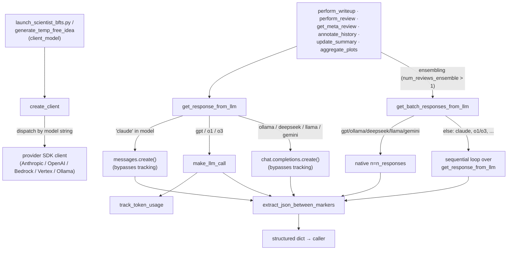

# The LLM wrapper — one interface, many model backends

## Overview
Every stage of the pipeline — idea generation, tree-search log summarization, writeup, citation
gathering, and LLM review — talks to a model through the same two functions:
[`get_response_from_llm`](../catalog/ai_scientist/llm.md#get_response_from_llm) (one completion) and
[`get_batch_responses_from_llm`](../catalog/ai_scientist/llm.md#get_batch_responses_from_llm) (N
completions, for ensembling). Neither function hides the provider behind a real abstraction layer —
both simply pattern-match on the `model` string and branch into whichever SDK call that provider
needs. [`create_client`](../catalog/ai_scientist/llm.md#create_client) does the same string-matching
once per pipeline stage to pick the SDK client object itself (Anthropic, OpenAI, Bedrock, Vertex,
Ollama…). The result is a single call surface that lets `launch_scientist_bfts.py` and every
`perform_*` module swap a model name in a config and get a different backend, without touching call
sites — at the cost of every provider quirk (message format, retryable exceptions, whether the API
supports sampling `n` completions) living as an `if`/`elif` chain inside `llm.py` itself.

## Diagram

## Design rationale (why it's built this way)
- **String dispatch instead of a provider interface.** Both
  [`create_client`](../catalog/ai_scientist/llm.md#create_client) and
  [`get_response_from_llm`](../catalog/ai_scientist/llm.md#get_response_from_llm) re-derive the provider
  from the same `model` string independently (`"claude" in model`, `model.startswith("ollama/")`,
  `"gpt" in model`, `"o1" in model or "o3" in model`, …). There is no shared enum or provider class; the
  two functions just happen to branch on the same substrings. This keeps adding a new backend to a
  one-line `elif` in each function, but it also means the two dispatch tables can drift — order and
  substring choice both matter, e.g. `"claude-"` must be checked with `startswith` in
  [`create_client`](../catalog/ai_scientist/llm.md#create_client) before the more permissive
  `"claude" in model` test would otherwise be needed for Bedrock/Vertex model names like
  `bedrock/anthropic.claude-3-5-sonnet-...`.
- **Claude gets a different message shape than everyone else.** Anthropic's Messages API wants
  `content` as a list of typed blocks (`{"type": "text", "text": ...}`) and a separate top-level `system`
  field, while every OpenAI-compatible provider (GPT, o1/o3, Ollama, DeepSeek, Llama, Gemini-via-OpenAI-
  endpoint) wants a flat `messages` list with a `{"role": "system", ...}` turn prepended.
  [`get_response_from_llm`](../catalog/ai_scientist/llm.md#get_response_from_llm) builds both shapes by
  hand rather than normalizing to one internal format, so `msg_history` itself has a different schema
  depending on which branch produced it — a history built by the Claude branch cannot be handed
  unmodified into a GPT call.
- **`make_llm_call` exists only to carry `@track_token_usage`.** Inside
  [`get_response_from_llm`](../catalog/ai_scientist/llm.md#get_response_from_llm), the `"gpt"` and
  `"o1"/"o3"` branches route through
  [`make_llm_call`](../catalog/ai_scientist/llm.md#make_llm_call) (itself decorated with
  [`track_token_usage`](../catalog/ai_scientist/utils/token_tracker.md#track_token_usage)), while the
  `"claude"` branch calls `client.messages.create(...)` directly. A commented-out line right after that
  call — `# response = make_llm_call(client, model, temperature, system_message=system_message,
  prompt=new_msg_history)` — shows the author tried routing Claude through the same tracked path and
  backed it out, presumably because `make_llm_call`'s `"gpt"`/`"o1"/"o3"`/`"ollama"` branches don't know
  how to build an Anthropic-shaped request. The practical effect (see Edge cases) is that Claude calls
  made via `get_response_from_llm` are invisible to
  [`token_tracker`](../catalog/ai_scientist/utils/token_tracker.md#token_tracker).
- **Retries are exception-driven, not application-driven.** Both
  [`get_response_from_llm`](../catalog/ai_scientist/llm.md#get_response_from_llm) and
  [`get_batch_responses_from_llm`](../catalog/ai_scientist/llm.md#get_batch_responses_from_llm) carry the
  same `backoff.on_exception(backoff.expo, (openai.RateLimitError, openai.APITimeoutError,
  openai.InternalServerError, anthropic.RateLimitError))` decorator, visible directly in their
  signatures. A whole tree-search run or writeup pass is unattended for hours, so a transient 429/5xx
  needs to resolve itself with exponential backoff rather than aborting a multi-hour experiment.

## Entry points
- [`create_client`](../catalog/ai_scientist/llm.md#create_client) — the provider-selection choke point,
  called once per pipeline stage before any completion is requested: from the top-level launch script
  ([`client_model`](../catalog/launch_scientist_bfts.md#client_model)) and from ideation
  ([`client_model`](../catalog/ai_scientist/perform_ideation_temp_free.md#client_model)). It returns
  `(client, model_name)`, where `model_name` may differ from the input (Bedrock/Vertex strip the
  `bedrock/`/`vertex_ai/` prefix before handing the bare model id to Anthropic's client).
- [`get_response_from_llm`](../catalog/ai_scientist/llm.md#get_response_from_llm) — the single-completion
  entry point used directly by
  [`perform_writeup`](../catalog/ai_scientist/perform_icbinb_writeup.md#perform_writeup) (ICBINB
  workshop track), [`perform_writeup`](../catalog/ai_scientist/perform_writeup.md#perform_writeup) (main
  track), [`generate_temp_free_idea`](../catalog/ai_scientist/perform_ideation_temp_free.md#generate_temp_free_idea),
  [`annotate_history`](../catalog/ai_scientist/treesearch/log_summarization.md#annotate_history),
  [`update_summary`](../catalog/ai_scientist/treesearch/log_summarization.md#update_summary),
  [`get_stage_summary`](../catalog/ai_scientist/treesearch/log_summarization.md#get_stage_summary),
  [`get_meta_review`](../catalog/ai_scientist/perform_llm_review.md#get_meta_review),
  [`get_citation_addition`](../catalog/ai_scientist/perform_icbinb_writeup.md#get_citation_addition) and
  its [main-track twin](../catalog/ai_scientist/perform_writeup.md#get_citation_addition), and
  [`aggregate_plots`](../catalog/ai_scientist/perform_plotting.md#aggregate_plots).
- [`get_batch_responses_from_llm`](../catalog/ai_scientist/llm.md#get_batch_responses_from_llm) — the
  ensembling entry point, reached from
  [`perform_review`](../catalog/ai_scientist/perform_llm_review.md#perform_review) only when
  `num_reviews_ensemble > 1`, to draw several independent reviews of the same paper before
  [`get_meta_review`](../catalog/ai_scientist/perform_llm_review.md#get_meta_review) reconciles them.
- [`extract_json_between_markers`](../catalog/ai_scientist/llm.md#extract_json_between_markers) — the
  response-parsing entry point every JSON-producing caller runs immediately after a completion comes
  back: [`annotate_history`](../catalog/ai_scientist/treesearch/log_summarization.md#annotate_history),
  [`update_summary`](../catalog/ai_scientist/treesearch/log_summarization.md#update_summary),
  [`get_stage_summary`](../catalog/ai_scientist/treesearch/log_summarization.md#get_stage_summary),
  [`get_meta_review`](../catalog/ai_scientist/perform_llm_review.md#get_meta_review), and both
  [`get_citation_addition`](../catalog/ai_scientist/perform_icbinb_writeup.md#get_citation_addition)
  variants.

## Mechanism (step-by-step)
1. **Pick the client once, before any prompt exists.**
   [`create_client`](../catalog/ai_scientist/llm.md#create_client) matches the `model` string against an
   ordered chain (`startswith("claude-")`, `startswith("bedrock")` + `"claude" in model`,
   `startswith("vertex_ai")` + `"claude" in model`, `startswith("ollama/")`, `"gpt" in model`, `"o1"`/`"o3"
   in model`, exact-match `deepseek-coder-v2-0724`, exact-match `deepcoder-14b`, exact-match
   `llama3.1-405b`, `"gemini" in model`) and instantiates the matching SDK client — `anthropic.Anthropic`,
   `anthropic.AnthropicBedrock`, `anthropic.AnthropicVertex`, or an `openai.OpenAI` client pointed at a
   different `base_url` for Ollama/DeepSeek/HuggingFace/OpenRouter/Gemini. Call sites capture this as
   [`client_model`](../catalog/launch_scientist_bfts.md#client_model) /
   [`client_model`](../catalog/ai_scientist/perform_ideation_temp_free.md#client_model) and thread both
   the client and the (possibly rewritten) model id into every later
   [`get_response_from_llm`](../catalog/ai_scientist/llm.md#get_response_from_llm) call for that stage.
2. **Re-dispatch on the same string inside `get_response_from_llm`.**
   [`get_response_from_llm`](../catalog/ai_scientist/llm.md#get_response_from_llm) does not receive a
   provider tag from step 1 — it re-tests `model` itself and builds a provider-shaped message list:
   Claude gets a `content`-block user turn plus a top-level `system` argument to `client.messages.create`;
   every OpenAI-compatible branch gets a flat `{"role": ..., "content": ...}` list. All branches cap
   generation length with the same module constant,
   [`MAX_NUM_TOKENS`](../catalog/ai_scientist/llm.md#MAX_NUM_TOKENS) (4096).
3. **GPT and o1/o3 detour through a tracked helper; Claude and the rest do not.** For `"gpt"` and
   `"o1"/"o3"` models, [`get_response_from_llm`](../catalog/ai_scientist/llm.md#get_response_from_llm)
   calls [`make_llm_call`](../catalog/ai_scientist/llm.md#make_llm_call), which is wrapped in
   [`track_token_usage`](../catalog/ai_scientist/utils/token_tracker.md#track_token_usage) so every such
   completion updates the global [`token_tracker`](../catalog/ai_scientist/utils/token_tracker.md#token_tracker)
   via [`add_tokens`](../catalog/ai_scientist/utils/token_tracker.md#TokenTracker.add_tokens) and
   [`add_interaction`](../catalog/ai_scientist/utils/token_tracker.md#TokenTracker.add_interaction). The
   Claude, Ollama, DeepSeek, Llama, and Gemini branches call their client's completion method directly and
   never pass through `make_llm_call`, so none of that usage is recorded.
4. **Ensembling picks native sampling where the API supports it, otherwise loops.**
   [`get_batch_responses_from_llm`](../catalog/ai_scientist/llm.md#get_batch_responses_from_llm) has its
   own branch set: for Ollama, GPT, DeepSeek, Llama, and Gemini models it passes `n=n_responses` directly
   to the provider's `chat.completions.create` and gets all samples in one round trip; for everything
   else (Claude, o1/o3, and any model that fell through) it instead loops `n_responses` times, calling
   [`get_response_from_llm`](../catalog/ai_scientist/llm.md#get_response_from_llm) once per sample — the
   Anthropic API has no `n` parameter, so ensembling Claude reviews costs `n` full round trips (each
   independently retried by its own `backoff` wrapper) instead of one.
5. **The batch function's own tracking decorator is set up for the wrong return shape.**
   [`get_batch_responses_from_llm`](../catalog/ai_scientist/llm.md#get_batch_responses_from_llm) is itself
   decorated with [`track_token_usage`](../catalog/ai_scientist/utils/token_tracker.md#track_token_usage),
   whose [`sync_wrapper`](../catalog/ai_scientist/utils/token_tracker.md#track_token_usage.sync_wrapper)
   unconditionally reads `result.model` and `result.created` off whatever the wrapped function returns.
   But [`get_batch_responses_from_llm`](../catalog/ai_scientist/llm.md#get_batch_responses_from_llm)
   returns a `(content, new_msg_history)` tuple, not a raw completion object — see Edge cases.
6. **Parse the JSON the prompt asked for, with two fallbacks.**
   [`extract_json_between_markers`](../catalog/ai_scientist/llm.md#extract_json_between_markers) first
   looks for a fenced `json` code block, falls back to any brace-delimited substring if no fence is
   found, and — if `json.loads` still fails — strips control characters (`\x00`–`\x1F`, `\x7F`) and
   retries once before giving up on that match and trying the next one; it returns `None` if nothing
   parses.
7. **Callers own their own retry-on-parse-failure logic, not `llm.py`.**
   [`update_summary`](../catalog/ai_scientist/treesearch/log_summarization.md#update_summary) re-invokes
   itself recursively (decrementing `max_retry`) when
   [`extract_json_between_markers`](../catalog/ai_scientist/llm.md#extract_json_between_markers) raises or
   returns something falsy, and
   [`annotate_history`](../catalog/ai_scientist/treesearch/log_summarization.md#annotate_history) wraps
   its own `get_response_from_llm` + `extract_json_between_markers` pair in a manual `while retry_count <
   max_retries` loop. This is a second, independent retry layer above the `backoff` decorator in step 3 —
   `backoff` handles transient API failures, these loops handle a model that responded but didn't produce
   parseable JSON.

## Key data structures
- **`msg_history`** — a `list[dict]` of alternating turns, threaded through every
  [`get_response_from_llm`](../catalog/ai_scientist/llm.md#get_response_from_llm) call so multi-round
  conversations (idea reflection, citation rounds) can continue a thread. Its shape depends on which
  provider branch produced it: Claude turns nest `content` as a list of typed blocks, OpenAI-compatible
  turns use a plain string `content`.
- **[`token_tracker`](../catalog/ai_scientist/utils/token_tracker.md#token_tracker)** — a module-level
  `TokenTracker` singleton keyed by model name, accumulating prompt/completion/reasoning/cached token
  counts via [`add_tokens`](../catalog/ai_scientist/utils/token_tracker.md#TokenTracker.add_tokens) and
  raw prompt/response/timestamp records via
  [`add_interaction`](../catalog/ai_scientist/utils/token_tracker.md#TokenTracker.add_interaction) — but
  only for calls that actually reach it (see Design rationale and Edge cases).
- **[`MAX_NUM_TOKENS`](../catalog/ai_scientist/llm.md#MAX_NUM_TOKENS)** — a single module constant (4096)
  that caps `max_tokens` across every provider branch in both
  [`get_response_from_llm`](../catalog/ai_scientist/llm.md#get_response_from_llm) and
  [`get_batch_responses_from_llm`](../catalog/ai_scientist/llm.md#get_batch_responses_from_llm); there is
  no per-model override even though providers differ widely in context/output limits.

## Dynamics (design intent)
[`track_token_usage`](../catalog/ai_scientist/utils/token_tracker.md#track_token_usage) picks between its
two inner closures,
[`async_wrapper`](../catalog/ai_scientist/utils/token_tracker.md#track_token_usage.async_wrapper) and
[`sync_wrapper`](../catalog/ai_scientist/utils/token_tracker.md#track_token_usage.sync_wrapper), based on
whether the wrapped function is a coroutine. Since both
[`make_llm_call`](../catalog/ai_scientist/llm.md#make_llm_call) and
[`get_batch_responses_from_llm`](../catalog/ai_scientist/llm.md#get_batch_responses_from_llm) are ordinary
`def`s, both always resolve to
[`sync_wrapper`](../catalog/ai_scientist/utils/token_tracker.md#track_token_usage.sync_wrapper) in this
codebase — the async path exists in the wrapper but nothing in the cited call graph invokes it.

> [!inferred]
> The `logging.info("args: ", args)` / `logging.info("kwargs: ", kwargs)` calls inside both wrappers pass
> two positional arguments to `logging.info`, which treats the second as a `%`-style format argument for
> the first — since `"args: "` has no `%s` placeholder, this looks like a debug-logging mistake rather
> than intentional formatting, though it only affects log output, not control flow.

## Edge cases
- **Ensembled ensembling is itself untracked in the way its decorator expects it to be.**
  [`get_batch_responses_from_llm`](../catalog/ai_scientist/llm.md#get_batch_responses_from_llm) returns
  `(content, new_msg_history)` — a two-element tuple — but the
  [`track_token_usage`](../catalog/ai_scientist/utils/token_tracker.md#track_token_usage) decorator
  wrapping it unconditionally executes `model = result.model` before checking anything about `result`'s
  shape. A tuple has no `.model` attribute.
  > [!inferred]
  > As written, this line would raise `AttributeError` the moment
  > [`get_batch_responses_from_llm`](../catalog/ai_scientist/llm.md#get_batch_responses_from_llm) is
  > called — I have not executed the code and the packet's Evidence section notes no tests in the
  > configured test paths reference this subgraph, so this is a static reading, not an observed crash.
- **Retryable-exception coverage is asymmetric across providers.** The `backoff` decorator on
  [`get_response_from_llm`](../catalog/ai_scientist/llm.md#get_response_from_llm) and
  [`get_batch_responses_from_llm`](../catalog/ai_scientist/llm.md#get_batch_responses_from_llm) retries
  `openai.RateLimitError`, `openai.APITimeoutError`, and `openai.InternalServerError`, but only
  `anthropic.RateLimitError` — an Anthropic timeout or 5xx is not caught by this decorator at all, even
  though Claude calls flow through the same two functions.
- **`create_client` raises, rather than falling back, on missing credentials or unknown models.** The
  `deepcoder-14b` branch raises `ValueError` immediately if `HUGGINGFACE_API_KEY` is unset, and the final
  `else` in [`create_client`](../catalog/ai_scientist/llm.md#create_client) raises `ValueError(f"Model
  {model} not supported.")` for anything that matched none of the preceding branches — a typo'd or
  not-yet-added model name fails at client-construction time, before any prompt is built.
- **Two independent `perform_writeup` / `get_citation_addition` implementations exist** — one under
  [`ai_scientist.perform_icbinb_writeup`](../catalog/ai_scientist/perform_icbinb_writeup.md#perform_writeup)
  (ICBINB workshop track, `page_limit=4`) and one under
  [`ai_scientist.perform_writeup`](../catalog/ai_scientist/perform_writeup.md#perform_writeup) (main
  track, `page_limit=8`) — both calling the same
  [`get_response_from_llm`](../catalog/ai_scientist/llm.md#get_response_from_llm) with the same default
  `small_model="gpt-4o-2024-05-13"` / `big_model="o1-2024-12-17"` pair, so this wrapper is the shared
  seam between two otherwise-separate writeup pipelines.

## Open questions
- Whether [`get_batch_responses_from_llm`](../catalog/ai_scientist/llm.md#get_batch_responses_from_llm)'s
  `@track_token_usage` decorator has ever been exercised at runtime without raising, or whether ensembled
  review (the only cited call site,
  [`perform_review`](../catalog/ai_scientist/perform_llm_review.md#perform_review) with
  `num_reviews_ensemble > 1`) is simply undertested — the packet's Evidence section lists no tests
  covering this subgraph.
- The commented-out `make_llm_call` line inside the Claude branch of
  [`get_response_from_llm`](../catalog/ai_scientist/llm.md#get_response_from_llm) suggests the author
  considered unifying tracking across providers; nothing in the cited subgraph explains why it was
  reverted rather than adapting `make_llm_call` to build the Claude message shape.

## See also
- [ai-scientist-v2 overview](../overview.md)
