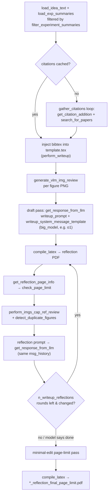

# Manuscript writeup — from tree-search results to a compiled paper

## Overview
This module is the last stage the automated research loop passes through before a human ever sees the
output: it takes whatever the tree search produced — an idea document, JSON experiment summaries, and a
folder of PNG plots — and turns them into a compiled workshop PDF, with no author in the loop. The single
entry point, [`perform_writeup`](../catalog/ai_scientist/perform_icbinb_writeup.md#perform_writeup), does
this in two qualitatively different passes: one big drafting call to a reasoning model
([`get_response_from_llm`](../catalog/ai_scientist/llm.md#get_response_from_llm) against the "big model",
e.g. `o1-2024-12-17`) that fills the LaTeX template from scratch, followed by a *reflection* loop that
repeatedly **compiles the actual PDF**, measures it (page/line counts, duplicate or unused figures), and
feeds that measurement back into the same model as a natural-language correction prompt. The key idea is
that the page-limit constraint is checked against compiled output, not against the model's own token
counting — LaTeX float placement and table wrapping make "how many pages will this take" something only
`pdflatex` can answer, so the loop treats the compiler as an oracle and the LLM as the thing being
corrected.

## Diagram


## Design rationale (why it's built this way)
- **The compiler is the ground truth for "does it fit."** [`check_page_limit`](../catalog/ai_scientist/perform_icbinb_writeup.md#check_page_limit)
  doesn't ask the LLM to estimate length — it locates the literal string "References" in the compiled PDF
  via [`detect_references_position_clean`](../catalog/ai_scientist/perform_icbinb_writeup.md#detect_references_position_clean),
  counts cleaned text lines up to that point with [`extract_page_line_counts`](../catalog/ai_scientist/perform_icbinb_writeup.md#extract_page_line_counts)
  (header/footer noise stripped by [`clean_lines`](../catalog/ai_scientist/perform_icbinb_writeup.md#clean_lines)),
  and compares that to how many lines the allotted `page_limit` pages can hold. This is a deterministic
  measurement wrapped in a natural-language sentence
  ([`get_reflection_page_info`](../catalog/ai_scientist/perform_icbinb_writeup.md#get_reflection_page_info))
  and re-injected as part of the reflection prompt — the loop trusts pdftotext's line count over anything
  the model says about its own draft.
- **Two different models for two different jobs.** Citation search and per-figure captioning are
  extraction/classification tasks and go to the cheaper `small_model` via
  [`create_client`](../catalog/ai_scientist/llm.md#create_client) (e.g. `gpt-4o-2024-05-13`); the manuscript
  draft and every reflection turn go to the `big_model` reasoning model (default `o1-2024-12-17`) through
  the *same* client and the *same* `msg_history`, so the model reflecting on page overage is the model that
  wrote the draft it's trimming.
- **Citation gathering is resumable and decoupled from the writing loop.** [`gather_citations`](../catalog/ai_scientist/perform_icbinb_writeup.md#gather_citations)'s
  own docstring states it exists "with ability to resume from previous progress" — its own loop persists
  `cached_citations.bib` / `citations_progress.json` after each round (each of which calls
  [`get_citation_addition`](../catalog/ai_scientist/perform_icbinb_writeup.md#get_citation_addition) for the
  LLM exchange, which itself only returns the addition and never touches disk), so a
  crashed or rate-limited run (Semantic Scholar access is behind
  [`search_for_papers`](../catalog/ai_scientist/tools/semantic_scholar.md#search_for_papers), which itself
  backs off via [`on_backoff`](../catalog/ai_scientist/tools/semantic_scholar.md#on_backoff)) doesn't have
  to restart citation collection from round 0.
- **Regex-extract-then-cleanup, not structured output.** Both the draft and every reflection response are
  parsed by matching a fenced ` ```latex ` block out of free text, then run through a small cleanup map
  (fixing stray `</end`/`</begin`, curly quotes, and escaping bare `%`) before being written to disk. This
  is a defensive layer against an LLM not perfectly honoring the fenced-code contract — since the very next
  step is [`compile_latex`](../catalog/ai_scientist/perform_icbinb_writeup.md#compile_latex), any drift here
  becomes an immediate, visible LaTeX compile failure rather than a silent corruption.
- **The reflection loop has two independent trim mechanisms per round**, and both call back into the same
  `msg_history[-1:]`-truncated conversation: one pass reflects on LaTeX/style/content correctness (chktex
  output, [`perform_imgs_cap_ref_review`](../catalog/ai_scientist/perform_vlm_review.md#perform_imgs_cap_ref_review),
  [`detect_duplicate_figures`](../catalog/ai_scientist/perform_vlm_review.md#detect_duplicate_figures), and
  the page-limit message), and a second pass specifically asks the model to move, merge, or drop figures
  using [`perform_imgs_cap_ref_review_selection`](../catalog/ai_scientist/perform_vlm_review.md#perform_imgs_cap_ref_review_selection).
  Splitting "is this correct" from "does this fit" into separate prompts keeps each reflection turn focused
  on one kind of edit instead of asking for both at once.

> [!inferred]
> Truncating `msg_history` to `msg_history[-1:]` between reflection turns (rather than keeping the whole
> history) looks like a deliberate context-length control, given how large the LaTeX body and VLM review
> JSON blobs get each round — but the source has no comment explaining the choice, so this reading is
> inferred from the code, not stated intent.

## Entry points
- [`perform_writeup`](../catalog/ai_scientist/perform_icbinb_writeup.md#perform_writeup) — the sole
  function the rest of the pipeline calls. It is invoked from the outer driver at
  [`attempt`](../catalog/launch_scientist_bfts.md#attempt) in `launch_scientist_bfts.py`, where a
  [`citations_text`](../catalog/launch_scientist_bfts.md#citations_text) value (already produced by a
  standalone `gather_citations` call at that call site) is passed in so this module can skip re-gathering
  citations if they're already available.
- [`parser`](../catalog/ai_scientist/perform_icbinb_writeup.md#parser) /
  [`args`](../catalog/ai_scientist/perform_icbinb_writeup.md#args) — the `if __name__ == "__main__"` CLI
  entry point, letting the writeup stage be run standalone against an existing project folder (`--folder`),
  independent of the tree-search driver, with the same `page_limit` / `--big-model` / `--writeup-reflections`
  knobs exposed as flags and validated against [`AVAILABLE_LLMS`](../catalog/ai_scientist/llm.md#AVAILABLE_LLMS).

## Mechanism (step-by-step)
1. **Load and filter what the tree search produced.** [`perform_writeup`](../catalog/ai_scientist/perform_icbinb_writeup.md#perform_writeup)
   first wipes any previous `latex/` folder, compiled PDF, and reflection PDFs for the project, then loads
   the idea text ([`load_idea_text`](../catalog/ai_scientist/perform_icbinb_writeup.md#load_idea_text)) and
   the three experiment-summary JSONs ([`load_exp_summaries`](../catalog/ai_scientist/perform_icbinb_writeup.md#load_exp_summaries)).
   [`filter_experiment_summaries`](../catalog/ai_scientist/perform_icbinb_writeup.md#filter_experiment_summaries)
   is called with `step_name="writeup"`, keeping only `overall_plan`, `analysis`, `metric`, `code`,
   `plot_analyses`, and `vlm_feedback_summary` from each node — the raw tree-search node record has more
   fields than the manuscript prompt needs, and this is where that JSON gets trimmed to size.
2. **Gather or reuse citations, then splice them into the template.** If no `citations_text` was passed in,
   `perform_writeup` first checks for a `cached_citations.bib` on disk, and only if that's missing calls
   [`gather_citations`](../catalog/ai_scientist/perform_icbinb_writeup.md#gather_citations), which loops up
   to `num_cite_rounds` times calling [`get_citation_addition`](../catalog/ai_scientist/perform_icbinb_writeup.md#get_citation_addition) —
   itself a two-turn exchange with [`get_response_from_llm`](../catalog/ai_scientist/llm.md#get_response_from_llm):
   one turn asks the model for a search query, [`search_for_papers`](../catalog/ai_scientist/tools/semantic_scholar.md#search_for_papers)
   hits the Semantic Scholar API, and a second turn asks the model to pick (or reject) among the results.
   Whatever text comes back is spliced directly into the `\begin{filecontents}{references.bib}` block of
   the copied `blank_icbinb_latex` template by a string replace on `\end{filecontents}`.
3. **Caption every figure before drafting.** For each PNG under the project's `figures/` folder,
   [`generate_vlm_img_review`](../catalog/ai_scientist/perform_vlm_review.md#generate_vlm_img_review) asks a
   vision-language model (via a *second*, separately created client,
   [`create_client`](../catalog/ai_scientist/vlm.md#create_client) imported under the local alias
   `create_vlm_client`) for an `Img_description` of each plot. These descriptions — not the raw images — are
   what gets threaded into the drafting prompt, so the drafting model never sees pixels directly, only the
   VLM's textual reading of each figure.
4. **Draft the full manuscript in one call.** The idea text, filtered summaries, the plot-aggregation script
   source, the list of available plot filenames, and the VLM figure descriptions are all folded into
   [`writeup_prompt`](../catalog/ai_scientist/perform_icbinb_writeup.md#writeup_prompt) and sent to the big
   model via [`get_response_from_llm`](../catalog/ai_scientist/llm.md#get_response_from_llm), under
   [`writeup_system_message_template`](../catalog/ai_scientist/perform_icbinb_writeup.md#writeup_system_message_template)
   formatted with `page_limit`. That system message is itself the workshop's editorial policy encoded as
   text — it names the ICBINB workshop framing, hard page/figure limits, and section-by-section writing
   tips — so the "editor" constraints live in a prompt string, not in code. The returned ` ```latex ``` `
   block replaces `template.tex` wholesale.
5. **Reflect against the compiled PDF, not the draft text.** For up to `n_writeup_reflections` rounds, the
   *current* `template.tex` is compiled via [`compile_latex`](../catalog/ai_scientist/perform_icbinb_writeup.md#compile_latex)
   into a numbered `<project>_reflectionN.pdf`, and only then is it inspected:
   [`perform_imgs_cap_ref_review`](../catalog/ai_scientist/perform_vlm_review.md#perform_imgs_cap_ref_review)
   VLM-reviews each figure/caption pair extracted from that compiled PDF,
   [`detect_duplicate_figures`](../catalog/ai_scientist/perform_vlm_review.md#detect_duplicate_figures) flags
   figures repeated between main text and appendix, and
   [`get_reflection_page_info`](../catalog/ai_scientist/perform_icbinb_writeup.md#get_reflection_page_info)
   turns the [`check_page_limit`](../catalog/ai_scientist/perform_icbinb_writeup.md#check_page_limit)
   measurement into the "DO NOT USE MORE THAN N PAGES" sentence injected into the reflection prompt
   alongside a `chktex` lint run. The model's revised LaTeX is diffed against the current text: unchanged
   or unparseable output breaks the loop early.
6. **A second, figure-focused reflection sub-round follows within the same iteration.** After the
   correctness reflection, `perform_writeup` recomputes `reflection_page_info` and calls
   [`perform_imgs_cap_ref_review_selection`](../catalog/ai_scientist/perform_vlm_review.md#perform_imgs_cap_ref_review_selection)
   (which additionally takes the page-limit text as context) to ask specifically whether figures should move
   to the appendix, be dropped, or be combined — and the model can end the whole reflection loop early by
   replying "I am done".
7. **A final, page-limit-only pass closes out the loop.** After all reflection rounds (or an early break),
   `perform_writeup` recomputes `reflection_page_info` one more time from the latest compiled PDF and sends
   a single "USE MINIMAL EDITS TO OPTIMIZE THE PAGE LIMIT USAGE" prompt, compiles the result to
   `<project>_reflection_final_page_limit.pdf`, and returns whether that file exists — that boolean, not any
   content check, is the function's success signal, mirrored by [`success`](../catalog/ai_scientist/perform_icbinb_writeup.md#success)
   at the CLI entry point.

## Key data structures
- **`reflection_page_info`** — a plain string, not a struct: the output of
  [`get_reflection_page_info`](../catalog/ai_scientist/perform_icbinb_writeup.md#get_reflection_page_info),
  it is the sole channel through which the deterministic page/line measurement from
  [`check_page_limit`](../catalog/ai_scientist/perform_icbinb_writeup.md#check_page_limit) reaches the LLM;
  everything the model knows about "how far over the limit am I" comes through this sentence.
- **The filtered experiment-summary dict** — produced per call by
  [`filter_experiment_summaries`](../catalog/ai_scientist/perform_icbinb_writeup.md#filter_experiment_summaries),
  keyed by `BASELINE_SUMMARY` / `RESEARCH_SUMMARY` / `ABLATION_SUMMARY`; the set of node keys retained
  differs by `step_name` (`"writeup"` keeps `code` and `plot_analyses` that `"citation_gathering"` drops),
  so the same raw summaries are projected differently depending on which downstream LLM call consumes them.
- **`msg_history`**, truncated to its last turn (`msg_history[-1:]`) between reflection calls to
  [`get_response_from_llm`](../catalog/ai_scientist/llm.md#get_response_from_llm) — this is what lets each
  reflection round see only the model's immediately preceding turn rather than the accumulating full
  transcript.
- **`cached_citations.bib` / `citations_progress.json`** on disk — the persisted state
  [`gather_citations`](../catalog/ai_scientist/perform_icbinb_writeup.md#gather_citations) reads on entry
  and rewrites after every successful or failed round, recording `completed_rounds` and a `status` string
  (`"in_progress"` / `"completed"` / `"error"`).

## Dynamics (design intent)
Everything here is sequential and blocking: one draft call, then up to `n_writeup_reflections` rounds each
doing compile → measure → VLM-review → reflect → (maybe) recompile, then one final compile. There is no
parallelism across reflection rounds because each round's prompt depends on measuring the *previous*
round's compiled PDF. The one place that behaves like a bounded retry loop is
[`gather_citations`](../catalog/ai_scientist/perform_icbinb_writeup.md#gather_citations)'s `for round_idx in
range(current_round, num_cite_rounds)`, which can be resumed across process restarts because progress is
flushed to disk after every round rather than only at the end.

## Edge cases
- **No papers found or nothing worth adding.** [`get_citation_addition`](../catalog/ai_scientist/perform_icbinb_writeup.md#get_citation_addition)
  returns `(None, False)` both when the search turns up nothing and when the model responds "Do not add
  any" — either way `gather_citations` just moves to the next round rather than treating it as failure.
- **Page-limit detection can fail silently into a fallback message.** If [`check_page_limit`](../catalog/ai_scientist/perform_icbinb_writeup.md#check_page_limit)
  can't compile the PDF or can't locate "References" (e.g. `detect_references_position_clean` returns
  `None`), [`get_reflection_page_info`](../catalog/ai_scientist/perform_icbinb_writeup.md#get_reflection_page_info)
  substitutes "Could not detect 'References' page" — reflection continues but without a real page-limit
  signal that round.
- **Two `create_client` calls, two different providers in play at once.** The text-model client
  ([`create_client`](../catalog/ai_scientist/llm.md#create_client) from `ai_scientist.llm`) and the VLM
  client ([`create_client`](../catalog/ai_scientist/vlm.md#create_client) from `ai_scientist.vlm`, aliased
  `create_vlm_client`) are separate objects that can point at different backends/models simultaneously;
  mixing them up would silently send image-review prompts to a text-only client or vice versa.
- **`no_writing=True` short-circuits everything.** `perform_writeup` will compile whatever `template.tex`
  already exists via [`compile_latex`](../catalog/ai_scientist/perform_icbinb_writeup.md#compile_latex) and
  return immediately, without any LLM calls — this is the PDF-only re-render path, not a writing mode.
- **Success is file existence, not content quality.** The function's return value is
  `osp.exists(reflection_pdf)` after the final pass — a PDF that compiled but reads poorly still reports
  success.

## Open questions
- The `blank_icbinb_latex/template.tex` scaffold (title/abstract/section skeleton, `\graphicspath`, ICLR
  style files) that gets copied on first run is read and written by `perform_writeup`, but none of its
  internal LaTeX structure appears as a symbol in this packet's subgraph, so its exact contents are outside
  what this page can cite.
- How many times the outer driver retries a failed `perform_writeup` call, and what it does with a `False`
  return, is controlled from `launch_scientist_bfts.py` beyond the `attempt` /
  [`citations_text`](../catalog/launch_scientist_bfts.md#citations_text) symbols visible here.
- This page's mechanism is one stage (manuscript drafting + page-limit reflection) *called by* the broader
  autonomous idea → tree-search → writeup → review loop, not the orchestration of that loop itself — so it
  is not tagged against the `end-to-end-discovery-pipeline` concept here; that tag more naturally belongs to
  whatever page documents the driver that sequences all four stages.

## See also
- [ai-scientist-v2 overview](../overview.md)
