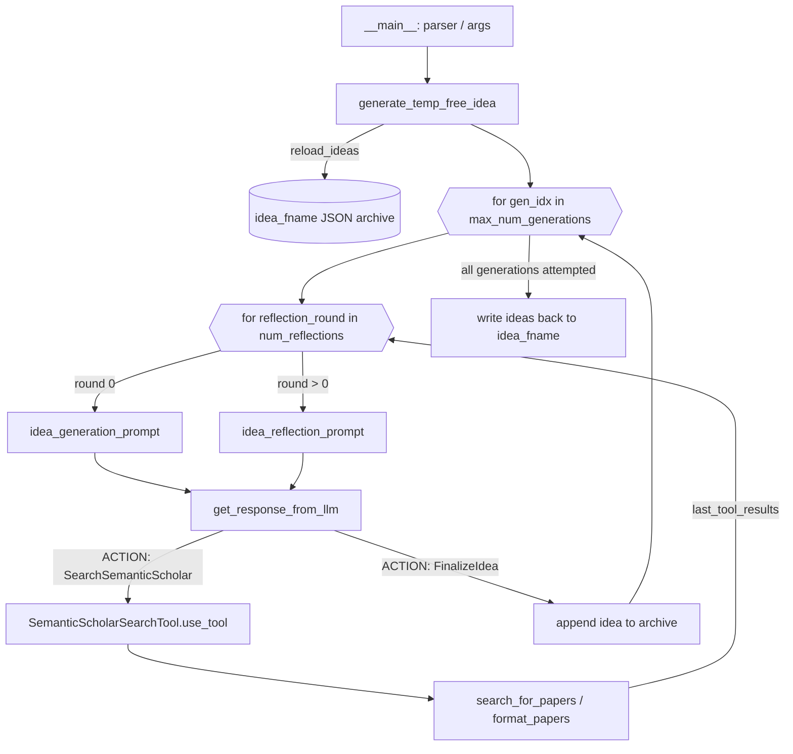

# Ideation — literature-grounded idea generation

<!-- connect:up:begin -->
> **Cross-repo concept:** part of [hypothesis-generation](../../../concepts/hypothesis-generation.md) across this wiki's repos.
<!-- connect:up:end -->
## Overview
This module is the front door of the whole autonomous pipeline: before any tree-search
experiment runs, [`generate_temp_free_idea`](../catalog/ai_scientist/perform_ideation_temp_free.md#generate_temp_free_idea)
drives a single LLM through a hand-rolled ReAct loop — draft a proposal, optionally search
Semantic Scholar for prior art, reflect, and repeat — until the model itself decides to
finalize an idea or the reflection budget runs out. There is no separate scoring model and
no fixed idea template; the "grant proposal" shape of an idea (hypothesis, related work,
experiments, risks) lives entirely inside one big [`system_prompt`](../catalog/ai_scientist/perform_ideation_temp_free.md#system_prompt)
string, and novelty-checking is delegated to a single pluggable tool,
[`SemanticScholarSearchTool`](../catalog/ai_scientist/tools/semantic_scholar.md#SemanticScholarSearchTool),
that the model calls on its own initiative rather than on a fixed schedule.

## Diagram

## Design rationale (why it's built this way)
The loop is a plain-text ReAct protocol, not a provider function-calling API: the model is
told in [`system_prompt`](../catalog/ai_scientist/perform_ideation_temp_free.md#system_prompt)
to answer with literal `ACTION:`/`ARGUMENTS:` blocks, which `generate_temp_free_idea` then
parses with regular expressions rather than a JSON-schema tool call.
> [!inferred] Reading `create_client`'s branching across Anthropic, OpenAI, Bedrock, Vertex,
> Ollama, DeepSeek and local HuggingFace endpoints, a hand-parsed text protocol is the one
> interface that works identically across all of them — the tradeoff is that it is fragile
> to any drift in how the model formats its reply (the code's own inner `try/except` around
> the regex parse exists precisely because this can fail).

`FinalizeIdea` is deliberately *not* a first-class tool: [`tools_dict`](../catalog/ai_scientist/perform_ideation_temp_free.md#tools_dict)
is built by filtering `tools` down to `isinstance(tool, BaseTool)` instances, and the
`FinalizeIdea` entry is a bare dict, so it is excluded from that dispatch table and handled
by its own `elif` branch inside `generate_temp_free_idea` instead of going through
[`BaseTool.use_tool`](../catalog/ai_scientist/tools/base_tool.md#BaseTool.use_tool). This
keeps the "stop and emit structured output" action structurally separate from actions that
return text back into the conversation.

There is no numeric scoring of ideas anywhere in this file. Quality control is entirely
the model's own judgment inside the reflection rounds — [`idea_reflection_prompt`](../catalog/ai_scientist/perform_ideation_temp_free.md#idea_reflection_prompt)
literally asks it to "carefully consider the quality, novelty, and feasibility" — plus a
soft nudge in `system_prompt` ("you should perform at least one literature search before
finalizing your idea") that is never enforced in code. Diversity across ideas is likewise
soft: the only anti-duplication mechanism is that every fresh
[`idea_generation_prompt`](../catalog/ai_scientist/perform_ideation_temp_free.md#idea_generation_prompt)
is formatted with the full text of everything archived so far (`prev_ideas_string`) and
told to differ from it — there is no embedding-based or code-level dedup.

On the name itself: the file and function are called `..._temp_free` /
[`generate_temp_free_idea`](../catalog/ai_scientist/perform_ideation_temp_free.md#generate_temp_free_idea),
but two different pieces of grounded evidence point in slightly different directions. The
CLI's own [`parser`](../catalog/ai_scientist/perform_ideation_temp_free.md#parser) is built
with `description="Generate AI scientist proposals - template free"` — the author's own
words say *template*-free, i.e. ideas aren't forced through a fixed few-shot example
template, only a loose JSON schema described in prose. Separately, `generate_temp_free_idea`
never passes a `temperature` argument through to [`get_response_from_llm`](../catalog/ai_scientist/llm.md#get_response_from_llm),
so every call silently takes that function's default (`temperature=0.7`) — the ideation
loop exposes no `--temperature` flag alongside `--model`/`--max-num-generations`/
`--workshop-file`/`--num-reflections`, unlike a "temperature-free" reading would suggest.
> [!inferred] The source never states which meaning `temp_free` is short for; both readings
> are consistent with what the code actually does, and it is plausible the name is meant to
> evoke both at once (no template, no exposed temperature knob).

## Entry points
- [`parser`](../catalog/ai_scientist/perform_ideation_temp_free.md#parser) / [`args`](../catalog/ai_scientist/perform_ideation_temp_free.md#args) — hit when the file is run as `__main__`; defines `--model` (constrained to [`AVAILABLE_LLMS`](../catalog/ai_scientist/llm.md#AVAILABLE_LLMS)), `--max-num-generations`, `--workshop-file`, and `--num-reflections`. This is the only in-repo caller of the ideation loop (per the README, its JSON output is later loaded by the separate tree-search launcher).
- [`generate_temp_free_idea`](../catalog/ai_scientist/perform_ideation_temp_free.md#generate_temp_free_idea) — the actual ideation loop, reached from `__main__` via the module-level [`ideas`](../catalog/ai_scientist/perform_ideation_temp_free.md#ideas) call site with `idea_fname`, `client`/[`client_model`](../catalog/ai_scientist/perform_ideation_temp_free.md#client_model) (from [`create_client`](../catalog/ai_scientist/llm.md#create_client)), and [`workshop_description`](../catalog/ai_scientist/perform_ideation_temp_free.md#workshop_description) (read from the file named by `--workshop-file`).

## Mechanism (step-by-step)
1. **Action vocabulary is fixed at import time, before any loop runs.** [`tools`](../catalog/ai_scientist/perform_ideation_temp_free.md#tools) is a two-entry list — the [`semantic_scholar_tool`](../catalog/ai_scientist/perform_ideation_temp_free.md#semantic_scholar_tool) instance of [`SemanticScholarSearchTool`](../catalog/ai_scientist/tools/semantic_scholar.md#SemanticScholarSearchTool) and a plain `FinalizeIdea` dict. [`tools_dict`](../catalog/ai_scientist/perform_ideation_temp_free.md#tools_dict), [`tool_descriptions`](../catalog/ai_scientist/perform_ideation_temp_free.md#tool_descriptions) and [`tool_names_str`](../catalog/ai_scientist/perform_ideation_temp_free.md#tool_names_str) are all derived from it and baked verbatim into [`system_prompt`](../catalog/ai_scientist/perform_ideation_temp_free.md#system_prompt), so the model only ever learns about exactly the actions this list defines.
2. **CLI bootstrap builds one workshop-scoped archive per run.** [`args`](../catalog/ai_scientist/perform_ideation_temp_free.md#args) selects the model, [`create_client`](../catalog/ai_scientist/llm.md#create_client) produces the matching `client`/[`client_model`](../catalog/ai_scientist/perform_ideation_temp_free.md#client_model), and [`workshop_description`](../catalog/ai_scientist/perform_ideation_temp_free.md#workshop_description) is read from the workshop file; [`idea_fname`](../catalog/ai_scientist/perform_ideation_temp_free.md#idea_fname) is derived by swapping that file's `.md` extension for `.json`, so the idea archive always lives next to the prompt that produced it.
3. **The archive is reloaded, not overwritten, by default.** [`generate_temp_free_idea`](../catalog/ai_scientist/perform_ideation_temp_free.md#generate_temp_free_idea)'s `reload_ideas=True` default means a re-run against the same `idea_fname` appends new ideas onto whatever was already finalized there rather than starting clean — the archive is a growing JSON list, not a single-shot artifact.
4. **Each of `max_num_generations` attempts runs its own bounded reflection loop.** Round 0 formats [`idea_generation_prompt`](../catalog/ai_scientist/perform_ideation_temp_free.md#idea_generation_prompt) with the workshop description and everything archived so far; every later round (up to `num_reflections`) instead formats [`idea_reflection_prompt`](../catalog/ai_scientist/perform_ideation_temp_free.md#idea_reflection_prompt), folding in whatever the last tool call returned. Both are sent through [`get_response_from_llm`](../catalog/ai_scientist/llm.md#get_response_from_llm) with the shared [`system_prompt`](../catalog/ai_scientist/perform_ideation_temp_free.md#system_prompt) and an accumulating `msg_history`, so within one idea attempt the model sees its own prior turns and tool results — but `generate_temp_free_idea` never passes a `temperature` argument through, so every call rides on that function's default rather than anything tunable from this file.
5. **The LLM call itself branches by backend, unevenly.** [`get_response_from_llm`](../catalog/ai_scientist/llm.md#get_response_from_llm) calls [`make_llm_call`](../catalog/ai_scientist/llm.md#make_llm_call) (decorated with [`track_token_usage`](../catalog/ai_scientist/utils/token_tracker.md#track_token_usage), whose [`sync_wrapper`](../catalog/ai_scientist/utils/token_tracker.md#track_token_usage.sync_wrapper)/[`async_wrapper`](../catalog/ai_scientist/utils/token_tracker.md#track_token_usage.async_wrapper) record every interaction into the module-level [`token_tracker`](../catalog/ai_scientist/utils/token_tracker.md#token_tracker) via [`add_tokens`](../catalog/ai_scientist/utils/token_tracker.md#TokenTracker.add_tokens)/[`add_interaction`](../catalog/ai_scientist/utils/token_tracker.md#TokenTracker.add_interaction)) only for the `gpt`/`o1`/`o3` branches; for Claude models it instead calls `client.messages.create` directly, capped by [`MAX_NUM_TOKENS`](../catalog/ai_scientist/llm.md#MAX_NUM_TOKENS).
6. **The reply is parsed as text, then dispatched.** `generate_temp_free_idea` regex-extracts an `ACTION`/`ARGUMENTS` pair from the response. If the action names an entry in [`tools_dict`](../catalog/ai_scientist/perform_ideation_temp_free.md#tools_dict), the parsed arguments are passed to that tool's [`use_tool`](../catalog/ai_scientist/tools/base_tool.md#BaseTool.use_tool) — for `SearchSemanticScholar` this virtually dispatches to [`SemanticScholarSearchTool.use_tool`](../catalog/ai_scientist/tools/semantic_scholar.md#SemanticScholarSearchTool.use_tool), which calls [`search_for_papers`](../catalog/ai_scientist/tools/semantic_scholar.md#SemanticScholarSearchTool.search_for_papers) (a live Semantic Scholar query, results sorted by citation count) and [`format_papers`](../catalog/ai_scientist/tools/semantic_scholar.md#SemanticScholarSearchTool.format_papers), and the resulting digest becomes `last_tool_results` fed into the *next* reflection round's prompt. This is the literature-grounding mechanism: novelty checking happens exactly when, and only when, the model chooses to invoke it.
7. **Finalization exits the reflection loop early and lands in the archive.** If the action is `FinalizeIdea` instead, `generate_temp_free_idea` parses the idea JSON described in [`system_prompt`](../catalog/ai_scientist/perform_ideation_temp_free.md#system_prompt) (Name/Title/Short Hypothesis/Related Work/Abstract/Experiments/Risk Factors and Limitations), appends its serialized form to the in-memory archive, and breaks out of the reflection loop — no further reflection rounds happen for that idea even if the budget isn't exhausted.
8. **Failures are contained per-attempt, not fatal to the run.** A regex/JSON parse failure inside one reflection round is caught, printed, and breaks only that idea's reflection loop (the attempt is abandoned without finalizing); a second, outer `try/except` around the whole per-idea body in [`generate_temp_free_idea`](../catalog/ai_scientist/perform_ideation_temp_free.md#generate_temp_free_idea) catches anything else and moves on to the next generation index, so one bad idea attempt never aborts the batch.
9. **The archive is only ever persisted once, at the end.** After all `max_num_generations` attempts, `generate_temp_free_idea` reserializes the accumulated archive back into dicts and writes it to [`idea_fname`](../catalog/ai_scientist/perform_ideation_temp_free.md#idea_fname); the `__main__` block captures the returned list as the module-level [`ideas`](../catalog/ai_scientist/perform_ideation_temp_free.md#ideas).

## Key data structures
- **`idea_str_archive`** (local to `generate_temp_free_idea`, cf. [`idea_fname`](../catalog/ai_scientist/perform_ideation_temp_free.md#idea_fname)) — a list of JSON-serialized idea strings, seeded from disk when `reload_ideas` is set, grown one entry per successfully finalized idea, and the sole source both for `prev_ideas_string` (the anti-duplication context fed into every fresh idea prompt) and for the final on-disk archive.
- **[`tools_dict`](../catalog/ai_scientist/perform_ideation_temp_free.md#tools_dict)** — `{tool.name: tool}` restricted to actual [`BaseTool`](../catalog/ai_scientist/tools/base_tool.md#BaseTool) instances; this is the dispatch table the parsed `ACTION` string is looked up against. `FinalizeIdea` is intentionally not in it.
- **`msg_history`** (threaded through [`get_response_from_llm`](../catalog/ai_scientist/llm.md#get_response_from_llm)) — reset to empty at the start of every idea attempt, then grown each reflection round; it is what lets the model "remember" its own earlier reasoning and tool output within one idea, distinct from `prev_ideas_string`, which is what carries information *across* different ideas.
- **The IDEA JSON schema embedded in [`system_prompt`](../catalog/ai_scientist/perform_ideation_temp_free.md#system_prompt)** — Name, Title, Short Hypothesis, Related Work, Abstract, Experiments, Risk Factors and Limitations; this shape, not a code-level dataclass, is the only schema an idea is checked against (by the model itself, when it writes the JSON).

## Dynamics (design intent)
The whole loop is strictly sequential: one generation attempt at a time
([`generate_temp_free_idea`](../catalog/ai_scientist/perform_ideation_temp_free.md#generate_temp_free_idea)'s
outer `for gen_idx in range(max_num_generations)`), one reflection round at a time within
it, one LLM call per round via [`get_response_from_llm`](../catalog/ai_scientist/llm.md#get_response_from_llm).
The `async_wrapper`/[`sync_wrapper`](../catalog/ai_scientist/utils/token_tracker.md#track_token_usage.sync_wrapper)
split inside [`track_token_usage`](../catalog/ai_scientist/utils/token_tracker.md#track_token_usage)
exists to mirror whichever underlying client call is async vs. sync — it is not evidence of
any concurrency in the ideation loop itself, which never launches parallel generations or
parallel reflection rounds.

## Edge cases
- No `S2_API_KEY` set: [`SemanticScholarSearchTool`](../catalog/ai_scientist/tools/semantic_scholar.md#SemanticScholarSearchTool) warns and proceeds with the public, stricter rate limit rather than failing (grounded at [`S2_API_KEY`](../catalog/ai_scientist/tools/semantic_scholar.md#SemanticScholarSearchTool.S2_API_KEY)).
- Semantic Scholar transient errors: [`search_for_papers`](../catalog/ai_scientist/tools/semantic_scholar.md#SemanticScholarSearchTool.search_for_papers) is wrapped with exponential backoff and an [`on_backoff`](../catalog/ai_scientist/tools/semantic_scholar.md#on_backoff) callback rather than surfacing the error to the model immediately.
- Zero search hits: [`use_tool`](../catalog/ai_scientist/tools/semantic_scholar.md#SemanticScholarSearchTool.use_tool) returns the plain string `"No papers found."` rather than raising, so the reflection loop always has *some* `last_tool_results` text to fold in.
- A reflection budget can be exhausted without ever seeing `FinalizeIdea`: nothing is appended to the archive for that `gen_idx`, so `max_num_generations` is an upper bound on *attempts*, not a guarantee of that many finalized ideas ([`generate_temp_free_idea`](../catalog/ai_scientist/perform_ideation_temp_free.md#generate_temp_free_idea)).
- Claude-backed runs never go through [`make_llm_call`](../catalog/ai_scientist/llm.md#make_llm_call) / [`track_token_usage`](../catalog/ai_scientist/utils/token_tracker.md#track_token_usage) — that call is present in [`get_response_from_llm`](../catalog/ai_scientist/llm.md#get_response_from_llm) only as a commented-out line, with `client.messages.create` used directly instead — so token accounting via [`token_tracker`](../catalog/ai_scientist/utils/token_tracker.md#token_tracker) is backend-dependent, not uniform across models.

## Open questions
- Whether `temp_free` is meant as "template-free" (the [`parser`](../catalog/ai_scientist/perform_ideation_temp_free.md#parser)'s own CLI description) or "temperature-free" (no `temperature` argument is ever passed to [`get_response_from_llm`](../catalog/ai_scientist/llm.md#get_response_from_llm) from this file) is not settled anywhere in the source itself.
- Whether the archived ideas are ranked, filtered, or scored before being handed to the downstream tree-search stage is outside this packet's subgraph — nothing in this file assigns a quality score to a finalized idea.
- Whether the Claude branch's bypass of `make_llm_call`/`track_token_usage` is intentional (e.g. the Anthropic SDK not fitting that decorator's `result.choices[0]` assumption) or a latent gap in cost tracking isn't stated anywhere in the source.

## See also
- The agentic tree-search experimentation stage that consumes the `idea_fname` JSON this module writes, and the manuscript-writeup stage downstream of it, are separate packets not covered here.
- [`BaseTool`](../catalog/ai_scientist/tools/base_tool.md#BaseTool) / [`SemanticScholarSearchTool`](../catalog/ai_scientist/tools/semantic_scholar.md#SemanticScholarSearchTool) — the pluggable tool interface this module's ReAct loop dispatches through; it is written generically enough to accept more tools than the single literature-search one currently registered in [`tools`](../catalog/ai_scientist/perform_ideation_temp_free.md#tools).
