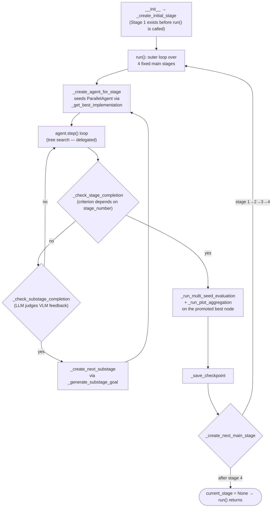

# AgentManager — the four-stage experiment orchestrator

<!-- connect:up:begin -->
> **Cross-repo concept:** part of [agentic-tree-search](../../../concepts/agentic-tree-search.md), [closed-loop-experiment-design](../../../concepts/closed-loop-experiment-design.md) across this wiki's repos.
<!-- connect:up:end -->
## Overview
`AgentManager` is the meta-controller that turns one open-ended tree search into a fixed, four-phase
research protocol: initial implementation → baseline (hyperparameter) tuning → creative research →
ablation studies. It does not itself search a tree of candidate implementations — that is delegated fresh,
per phase, to a `ParallelAgent` built by [`_create_agent_for_stage`](../catalog/ai_scientist/treesearch/agent_manager.md#AgentManager._create_agent_for_stage).
Its own job is narrower and entirely bookkeeping/decision-making: decide *when* a phase is done, pick the
single implementation from it worth carrying forward, and hand the next phase a fresh LLM-authored goal.
Everything is driven by one nested loop in [`run`](../catalog/ai_scientist/treesearch/agent_manager.md#AgentManager.run):
an outer loop over four fixed main stages, an inner loop over an open-ended, LLM-generated number of
sub-stages within each, and an innermost loop that keeps invoking the underlying tree search
([`step`](../catalog/ai_scientist/treesearch/parallel_agent.md#ParallelAgent.step)) until one of two
independent completion checks fires — a stage-number-specific *main-stage* check and a single LLM-judged
*sub-stage* check. Notably there is no enum or state-machine
class for "which of the four stages am I in" — stage identity lives in two plain `Stage` fields instead:
a string convention inside [`name`](../catalog/ai_scientist/treesearch/agent_manager.md#Stage.name) (which
the agent-seeding path parses) and the integer `stage_number` the completion checks branch on.

## Diagram

## Design rationale (why it's built this way)
- **Fixed main stages, open-ended sub-stages.** A [`Stage`](../catalog/ai_scientist/treesearch/agent_manager.md#Stage)
  is created either by [`_create_initial_stage`](../catalog/ai_scientist/treesearch/agent_manager.md#AgentManager._create_initial_stage),
  [`_create_next_substage`](../catalog/ai_scientist/treesearch/agent_manager.md#AgentManager._create_next_substage),
  or [`_create_next_main_stage`](../catalog/ai_scientist/treesearch/agent_manager.md#AgentManager._create_next_main_stage).
  Only the four *main*-stage transitions are hard-coded (`_create_next_main_stage` returns `None` once past
  stage 4); how many *sub*-stages happen inside a main stage is decided at runtime by an LLM
  ([`_generate_substage_goal`](../catalog/ai_scientist/treesearch/agent_manager.md#AgentManager._generate_substage_goal))
  reacting to [`_gather_stage_metrics`](../catalog/ai_scientist/treesearch/agent_manager.md#AgentManager._gather_stage_metrics).
  This reflects a real asymmetry in the paper's protocol: the four research *phases* are fixed by design,
  but how many refinement rounds each phase needs is inherently open (a phase might converge in one round
  or need several).
- **Stage 1 failing is fatal; stages 2–4 hitting the iteration cap is not.** Inside
  [`_check_stage_completion`](../catalog/ai_scientist/treesearch/agent_manager.md#AgentManager._check_stage_completion),
  the `stage.stage_number == 1` branch treats exhausting `max_iterations` without ever producing a
  [`good_nodes`](../catalog/ai_scientist/treesearch/journal.md#Journal.good_nodes) entry as unrecoverable —
  it sets [`current_stage`](../catalog/ai_scientist/treesearch/agent_manager.md#AgentManager.current_stage)
  to `None` directly, which unwinds `run`'s outer loop and ends the whole multi-hour experiment. Every
  later stage treats the same iteration cap as an ordinary, successful exit ("Reached max iterations").
  This makes sense once you notice everything downstream *requires* a working baseline to promote via
  [`_get_best_implementation`](../catalog/ai_scientist/treesearch/agent_manager.md#AgentManager._get_best_implementation) —
  stage 1 is the only stage where "nothing works yet" is possible at all.
- **A completion check that doubles as a steering signal.** For `stage.stage_number == 3`,
  `_check_stage_completion` doesn't just check whether the best node improved over the seed
  ([`get_best_node`](../catalog/ai_scientist/treesearch/journal.md#Journal.get_best_node),
  [`nodes`](../catalog/ai_scientist/treesearch/journal.md#Journal.nodes)) — once more than half of the
  stage's iterations are used, it also checks the winning node's measured runtime and, if the experiment
  finishes in under half the configured timeout, returns *not complete* with feedback demanding the agent
  scale up ("increasing epochs... larger model... bigger datasets"). The stopping criterion is doing double
  duty as a budget-utilization nudge, specific to the "creative research" phase where under-using the
  available compute would otherwise go unnoticed.
- **Promotion clears lineage on purpose.** `_get_best_implementation` calls
  [`get_best_node`](../catalog/ai_scientist/treesearch/journal.md#Journal.get_best_node), then
  `copy.deepcopy`s it and resets [`parent`](../catalog/ai_scientist/treesearch/journal.md#Node.parent) to
  `None` and `children` to an empty set before handing it to the next stage. The copied
  [`Node`](../catalog/ai_scientist/treesearch/journal.md#Node) becomes the seed/root of a brand-new
  [`Journal`](../catalog/ai_scientist/treesearch/journal.md#Journal) — keeping the old parent chain would
  let the new stage's tree-search bookkeeping mistake the previous stage's history for part of its own
  exploration tree.
- **Two LLM-driven "should we progress" paths exist, but only one is wired up.**
  [`_evaluate_stage_progression`](../catalog/ai_scientist/treesearch/agent_manager.md#AgentManager._evaluate_stage_progression)
  and [`_create_stage_analysis_prompt`](../catalog/ai_scientist/treesearch/agent_manager.md#AgentManager._create_stage_analysis_prompt)
  build a much richer, holistic "ready for next stage?" LLM prompt than anything `run` actually calls — in
  the current source neither is invoked from `run` or from any other cited symbol; `run` instead calls the
  leaner, stage-number-branching `_check_stage_completion`/`_check_substage_completion` pair described
  above.
  > [!inferred]
  > The most plausible reading is that `_evaluate_stage_progression`/`_create_stage_analysis_prompt` are a
  > left-over, more general first cut at stage-progression logic that was superseded by the explicit
  > per-`stage_number` checks — the source gives no comment confirming this, so treat it as an educated
  > guess rather than documented intent.

## Entry points
- [`perform_experiments_bfts`](../catalog/ai_scientist/treesearch/perform_experiments_bfts_with_agentmanager.md#perform_experiments_bfts) —
  the actual external entry point: it loads config and the research idea, constructs the `AgentManager`
  (which, by the time its constructor returns, has already created stage 1 via `_create_initial_stage`),
  and then calls [`run`](../catalog/ai_scientist/treesearch/agent_manager.md#AgentManager.run) with an
  `exec_callback`/`step_callback` pair. This is the only place in the subgraph that both builds an
  `AgentManager` and drives it.
- [`_create_initial_stage`](../catalog/ai_scientist/treesearch/agent_manager.md#AgentManager._create_initial_stage) —
  runs inside `__init__`, not inside `run`. It sets [`stages`](../catalog/ai_scientist/treesearch/agent_manager.md#AgentManager.stages)
  to a one-element list and [`current_stage`](../catalog/ai_scientist/treesearch/agent_manager.md#AgentManager.current_stage)
  to that first `Stage`, so control never reaches `run` without a stage already queued — there is no
  "empty" state `run` has to special-case.
- [`run`](../catalog/ai_scientist/treesearch/agent_manager.md#AgentManager.run) — where control spends
  virtually the entire experiment's wall-clock time once invoked; it does not return until either all four
  main stages complete or a failure path sets `current_stage` to `None`.

## Mechanism (step-by-step)
1. **Stage identity is a naming convention, not a type.** A [`Stage`](../catalog/ai_scientist/treesearch/agent_manager.md#Stage)
   dataclass holds `name`, `description`, `goals`, `max_iterations`, `num_drafts`, and
   [`stage_number`](../catalog/ai_scientist/treesearch/agent_manager.md#Stage.stage_number). The
   [`name`](../catalog/ai_scientist/treesearch/agent_manager.md#Stage.name) string encodes *both* levels at
   once, e.g. `"1_initial_implementation_1_preliminary"` (main-stage number, main-stage label, sub-stage
   number, sub-stage label); the agent-seeding and task-curation paths recover "which of the four stages is
   this" by parsing this string. The completion logic, by contrast, does *not* parse the name: `stage_number`
   is a single counter that increments across *every* stage and sub-stage ever created (never resets per main
   stage), and it is what `_check_stage_completion` actually branches on for stage-specific behavior.
2. **Each sub-stage gets its own fresh `ParallelAgent`, seeded from the previous main stage's winner.**
   [`_create_agent_for_stage`](../catalog/ai_scientist/treesearch/agent_manager.md#AgentManager._create_agent_for_stage)
   builds a per-stage config copy, then — depending on which main stage it's building for — calls
   `_get_best_implementation` on the *previous* main stage's last sub-stage name to obtain
   `best_stage1_node`/`best_stage2_node`/`best_stage3_node`, which it passes into the new `ParallelAgent`.
   This is the literal "promote the winner into the next stage" hand-off the orchestrator exists to do.
3. **The tree search itself is fully delegated.** Inside the innermost loop, `run` calls
   [`step`](../catalog/ai_scientist/treesearch/parallel_agent.md#ParallelAgent.step) once per iteration.
   `step` picks candidate nodes via
   [`_select_parallel_nodes`](../catalog/ai_scientist/treesearch/parallel_agent.md#ParallelAgent._select_parallel_nodes),
   serializes them with [`to_dict`](../catalog/ai_scientist/treesearch/journal.md#Node.to_dict), and fans
   them out to worker processes running the static
   [`_process_node_wrapper`](../catalog/ai_scientist/treesearch/parallel_agent.md#ParallelAgent._process_node_wrapper),
   which reconstructs a `MinimalAgent` and calls
   [`_draft`](../catalog/ai_scientist/treesearch/parallel_agent.md#MinimalAgent._draft),
   [`_improve`](../catalog/ai_scientist/treesearch/parallel_agent.md#MinimalAgent._improve), or
   [`_debug`](../catalog/ai_scientist/treesearch/parallel_agent.md#MinimalAgent._debug) as appropriate,
   executes the generated code via [`run`](../catalog/ai_scientist/treesearch/interpreter.md#Interpreter.run)
   (the Python interpreter sandbox, not `AgentManager.run`), and judges the result with
   [`parse_exec_result`](../catalog/ai_scientist/treesearch/parallel_agent.md#MinimalAgent.parse_exec_result).
   `AgentManager` never touches any of this directly — it only ever calls `step` and reads the resulting
   [`Journal`](../catalog/ai_scientist/treesearch/journal.md#Journal) back.
4. **Main-stage completion is a different rule per `stage_number`, checked first.**
   [`_check_stage_completion`](../catalog/ai_scientist/treesearch/agent_manager.md#AgentManager._check_stage_completion)
   is called after every `step`. Stage 1 completes the instant
   [`good_nodes`](../catalog/ai_scientist/treesearch/journal.md#Journal.good_nodes) is non-empty (any
   working implementation is enough). Stage 2 requires
   [`get_best_node`](../catalog/ai_scientist/treesearch/journal.md#Journal.get_best_node) to beat
   `journal.nodes[0]` (the seeded node) *and* an LLM
   [`query`](../catalog/ai_scientist/treesearch/backend/__init__.md#query) call, fed
   [`_parse_vlm_feedback`](../catalog/ai_scientist/treesearch/agent_manager.md#AgentManager._parse_vlm_feedback)
   plus which datasets were tested, to judge the plots stable and multi-dataset coverage sufficient. Stage
   3 requires the same improvement-over-seed check plus the runtime-scaling nudge described above. Stage 4
   has no LLM judgment at all — it is only ever ended by the shared max-iterations check earlier in the
   same method.
5. **Sub-stage completion is a single LLM judgment, and it regenerates the next sub-stage's goals.**
   If the main stage isn't complete,
   [`_check_substage_completion`](../catalog/ai_scientist/treesearch/agent_manager.md#AgentManager._check_substage_completion)
   asks an LLM whether the *current sub-stage's* goals are met, given
   `get_best_node` and `_parse_vlm_feedback`. If yes,
   [`_create_next_substage`](../catalog/ai_scientist/treesearch/agent_manager.md#AgentManager._create_next_substage)
   calls `_generate_substage_goal` — which itself gathers
   [`_gather_stage_metrics`](../catalog/ai_scientist/treesearch/agent_manager.md#AgentManager._gather_stage_metrics)
   (built from `nodes`, `good_nodes`,
   [`metric`](../catalog/ai_scientist/treesearch/journal.md#Node.metric), and
   [`value`](../catalog/ai_scientist/treesearch/utils/metric.md#MetricValue.value)) — to ask the LLM for a
   new, specific sub-stage name and goal string. A brand-new empty `Journal` is created for the new
   sub-stage and the innermost loop restarts against it.
6. **When a main stage completes, the winner gets a statistical replication pass before anything else
   happens.** Immediately after `_check_stage_completion` returns true for `stage_number in [1, 2, 3, 4]`,
   `run` calls `_get_best_implementation` on the *current* sub-stage, then
   [`_run_multi_seed_evaluation`](../catalog/ai_scientist/treesearch/parallel_agent.md#ParallelAgent._run_multi_seed_evaluation)
   (re-runs that exact implementation under several random seeds) followed by
   [`_run_plot_aggregation`](../catalog/ai_scientist/treesearch/parallel_agent.md#ParallelAgent._run_plot_aggregation)
   (combines the seed runs into one summary figure). Only after this does the sub-stage loop actually exit.
7. **Main-stage transition and checkpointing close out each main stage.** Once the sub-stage loop exits,
   `run` calls [`_save_checkpoint`](../catalog/ai_scientist/treesearch/agent_manager.md#AgentManager._save_checkpoint)
   (pickling `journals`, stage history, and config), then
   `_create_next_main_stage` — which returns `None` once past stage 4, at which point `current_stage` is
   set to `None` and `run` returns; otherwise the new main stage is appended to `stages` and becomes the
   next iteration's `current_stage`.

## Key data structures
- **[`Stage`](../catalog/ai_scientist/treesearch/agent_manager.md#Stage)** — one main-or-sub research phase.
  `name` carries "which of the four stages, and which sub-round" as a string decoded by convention (parsed
  to seed the next agent and curate the task description); `stage_number` is a separate monotonic global
  counter that the completion checks branch on for stage-specific behavior.
- **[`journals`](../catalog/ai_scientist/treesearch/agent_manager.md#AgentManager.journals)** — a
  `dict[str, Journal]` keyed by `Stage.name`. Every stage's and sub-stage's
  [`Journal`](../catalog/ai_scientist/treesearch/journal.md#Journal) is kept for the whole run's lifetime
  (nothing is ever deleted), which is what lets `_get_best_implementation` look up *any* earlier stage's
  results by name at any later point.
- **[`stages`](../catalog/ai_scientist/treesearch/agent_manager.md#AgentManager.stages)** — an append-only
  `list[Stage]` of every stage and sub-stage ever created, in creation order; `_create_agent_for_stage`
  filters it by `name` prefix (e.g. every stage whose name starts with `"2_"`) to find "the last sub-stage
  of main stage 2," since there is no separate index keyed by main-stage number.
- **[`Node`](../catalog/ai_scientist/treesearch/journal.md#Node)** — the atomic unit inside each `Journal`:
  [`code`](../catalog/ai_scientist/treesearch/journal.md#Node.code),
  [`id`](../catalog/ai_scientist/treesearch/journal.md#Node.id),
  [`metric`](../catalog/ai_scientist/treesearch/journal.md#Node.metric)/`value`, and a
  [`parent`](../catalog/ai_scientist/treesearch/journal.md#Node.parent) link that forms the search tree.
  [`to_dict`](../catalog/ai_scientist/treesearch/journal.md#Node.to_dict) exists specifically so nodes can
  cross the process boundary into worker processes and back.

## Dynamics (design intent)
`AgentManager` itself is strictly sequential — one main stage runs to completion before the next begins,
one sub-stage runs to completion before the next begins, and `run` blocks on each
[`step`](../catalog/ai_scientist/treesearch/parallel_agent.md#ParallelAgent.step) call in turn. All of the
actual parallelism lives one level down, inside whatever `ParallelAgent`
[`_create_agent_for_stage`](../catalog/ai_scientist/treesearch/agent_manager.md#AgentManager._create_agent_for_stage)
built for the current sub-stage: `step` fans work out to a process pool (via
[`_process_node_wrapper`](../catalog/ai_scientist/treesearch/parallel_agent.md#ParallelAgent._process_node_wrapper)),
with per-worker GPU assignment tracked by
[`gpu_manager`](../catalog/ai_scientist/treesearch/parallel_agent.md#ParallelAgent.gpu_manager). The
statistical-replication pass ([`_run_multi_seed_evaluation`](../catalog/ai_scientist/treesearch/parallel_agent.md#ParallelAgent._run_multi_seed_evaluation))
reuses that same worker-pool/GPU-manager machinery to run several seeds concurrently. `_create_agent_for_stage`'s
`ParallelAgent` is used as a context manager (`with ... as agent:`) in `run`, so whatever process-pool/GPU
teardown it performs happens deterministically at the end of every sub-stage, before the next one's
`ParallelAgent` is constructed.

## Edge cases
- **A stage-1 dead end is unrecoverable.** If stage 1 exhausts `max_iterations` without ever producing a
  [`good_nodes`](../catalog/ai_scientist/treesearch/journal.md#Journal.good_nodes) entry,
  `_check_stage_completion` sets [`current_stage`](../catalog/ai_scientist/treesearch/agent_manager.md#AgentManager.current_stage)
  to `None` — there is no retry, no lowered bar, no fallback; the entire experiment ends there.
- **Stage 4 never asks an LLM whether it's done.** Every other stage's completion check involves an LLM
  [`query`](../catalog/ai_scientist/treesearch/backend/__init__.md#query); stage 4's branch in
  `_check_stage_completion` is a no-op that simply lets the shared max-iterations check (checked earlier in
  the same function, against `nodes`) be the only way ablation studies ever end.
- **A likely stale-journal target when seeding across sub-stages.** In `run`, the block that seeds a new
  sub-stage from `stage_history` writes into
  `self.journals[self.current_stage.name].append(prev_best)` — but
  [`current_stage`](../catalog/ai_scientist/treesearch/agent_manager.md#AgentManager.current_stage) is only
  ever reassigned at *main*-stage transitions, never at sub-stage transitions (only the local
  `current_substage` variable advances there). For the first sub-stage of a main stage this is harmless
  (`current_stage` and `current_substage` name the same `Stage`), but for the second and later sub-stages
  within the same main stage, `self.current_stage.name` still names the *first* sub-stage of that main
  stage, not the one actually being processed.
  > [!inferred]
  > This reads as an unintentional mismatch rather than a deliberate design choice — nothing in the source
  > or its comments suggests the first sub-stage's journal is meant to keep receiving seed nodes on behalf
  > of later sub-stages — but it is a mechanical reading of `run`, not a runtime observation.
- **A fallback path whose return shape doesn't match its caller's unpacking.**
  [`_generate_substage_goal`](../catalog/ai_scientist/treesearch/agent_manager.md#AgentManager._generate_substage_goal)'s
  `except` branch returns a single formatted string, while its only caller,
  [`_create_next_substage`](../catalog/ai_scientist/treesearch/agent_manager.md#AgentManager._create_next_substage),
  always unpacks the result as `sub_stage_goal, sub_stage_name = self._generate_substage_goal(...)`.
  > [!inferred]
  > If the LLM call inside `_generate_substage_goal` ever fails, this reads as though it would raise a new,
  > unhandled unpacking exception rather than gracefully falling back — the source's own `try`/`except`
  > appears not to protect the caller from this.

## Open questions
- Whether the `current_stage`/`journals` seeding mismatch and the `_generate_substage_goal` fallback shape
  mismatch (both above) are known, latent bugs or are masked by some invariant not visible in this packet's
  subgraph (e.g. that `_generate_substage_goal`'s LLM call essentially never fails in practice).
- Whether `_evaluate_stage_progression` and `_create_stage_analysis_prompt` are dead code intentionally kept
  around (a hook for a future, more holistic progression check) or simply an unremoved earlier design —
  the source gives no signal either way.
- The exact main-stage name/label table and the stage-name parsing convention that decodes
  `Stage.name` back into (main-stage number, main-stage label, sub-stage number, sub-stage label) are
  implemented outside this packet's subgraph; the module catalog for `agent_manager.py` is the authority if
  the precise string format matters.

## See also
- [Agentic tree search (cross-repo concept)](../../../concepts/agentic-tree-search.md) — the paper-level
  description of this exact "experiment progress manager" mechanism (four stages, promote-the-best-node,
  replication runs).
- [Closed-loop experiment design (cross-repo concept)](../../../concepts/closed-loop-experiment-design.md) —
  the general pattern this orchestrator's per-sub-stage LLM evaluate → regenerate-goals cycle instantiates.
- [The AI Scientist-v2 (paper summary)](../../../sources/ai-scientist-v2.md)
- [ai-scientist-v2 overview](../overview.md)
