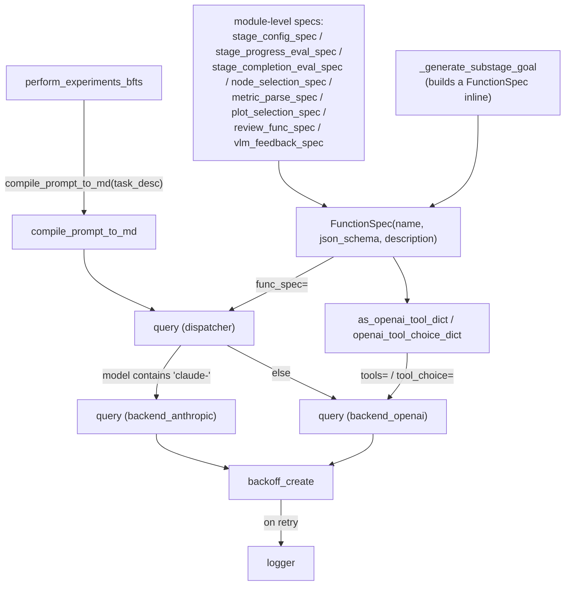

# Backend utils — structured LLM function-calling for tree search

## Overview
The agentic tree search behind The AI Scientist-v2 asks an LLM dozens of narrow questions per run — is
this stage complete, which node should be expanded next, what does this metric mean, which plot is best —
and the calling Python code needs a typed answer, not a paragraph it then has to parse. [`FunctionSpec`](../catalog/ai_scientist/treesearch/backend/utils.md#FunctionSpec)
is the contract that makes that possible: a small JSON-schema-backed description of exactly one function
the model is allowed to "call," so the response comes back as a dict shaped like the schema instead of
free text. [`compile_prompt_to_md`](../catalog/ai_scientist/treesearch/backend/utils.md#compile_prompt_to_md)
handles the opposite direction — tree-search prompts are usually built as nested Python dicts (so they can
be assembled programmatically, section by section) and need flattening into the Markdown the model actually
reads. Together these two mechanisms are the narrow waist between the search's control flow and the LLM:
everything upstream speaks Python data, everything crossing the wire is compiled Markdown going in and a
schema-shaped dict coming out.

## Diagram

## Design rationale (why it's built this way)
Tree-search decisions such as "is this stage complete" or "which node wins" must become program state — a
boolean, a name, a metric value — so leaving the model free to answer in prose and then regex-parsing the
reply would be fragile. [`FunctionSpec`](../catalog/ai_scientist/treesearch/backend/utils.md#FunctionSpec)
sidesteps that by pairing a `name`, a `json_schema`, and a `description`, and validating the schema itself
at construction time (before any LLM call happens) rather than waiting to find out it's malformed after
spending a request on it. The OpenAI path then turns that spec into the exact shape the OpenAI API expects
for forced function-calling — [`as_openai_tool_dict`](../catalog/ai_scientist/treesearch/backend/utils.md#FunctionSpec.as_openai_tool_dict)
for the tool declaration and [`openai_tool_choice_dict`](../catalog/ai_scientist/treesearch/backend/utils.md#FunctionSpec.openai_tool_choice_dict)
to force `tool_choice` onto that one function by [`name`](../catalog/ai_scientist/treesearch/backend/utils.md#FunctionSpec.name)
— so the model cannot opt to answer in free text instead of calling the function.

> [!inferred] The Anthropic backend's [`query`](../catalog/ai_scientist/treesearch/backend/backend_anthropic.md#query)
> raises `NotImplementedError` whenever a `func_spec` is supplied ("Anthropic does not support function
> calling for now" — read directly in that function's source). Taken together with the module-level specs
> only ever being routed through the dispatcher [`query`](../catalog/ai_scientist/treesearch/backend/__init__.md#query),
> this means the structured-extraction half of this mechanism is effectively OpenAI-only at this snapshot:
> Claude models can be used for the free-text `query` calls in this pipeline but not for any call site that
> passes a `func_spec`.

[`compile_prompt_to_md`](../catalog/ai_scientist/treesearch/backend/utils.md#compile_prompt_to_md) exists
because prompts in this codebase are commonly built as nested dicts of named sections rather than raw
strings — that lets a caller compose a prompt piecemeal (add a "Current Issues" section, add a "Recent
Changes" section) without string-concatenation bugs, then render the whole tree into Markdown headers whose
depth tracks nesting depth on the way out. The function wraps every branch in logging through [`logger`](../catalog/ai_scientist/treesearch/backend/utils.md#logger)
and the whole body in a try/except that logs the input's type and content before re-raising — the kind of
defensive instrumentation that accumulates around a function that recurses over a genuinely heterogeneous
input (`str`, `list`, `dict`, and multi-modal blocks all pass through the same call).

## Entry points
- [`perform_experiments_bfts`](../catalog/ai_scientist/treesearch/perform_experiments_bfts_with_agentmanager.md#perform_experiments_bfts) —
  the top-level entry to a whole tree-search run; before anything else happens it compiles the loaded task
  description with [`compile_prompt_to_md`](../catalog/ai_scientist/treesearch/backend/utils.md#compile_prompt_to_md)
  so the manager and every downstream agent gets a rendered task string rather than a raw dict.
- [`query`](../catalog/ai_scientist/treesearch/backend/__init__.md#query) — the single funnel every
  stage-progression, node-selection, metric-parsing, review, and VLM-feedback decision in the tree search
  calls through; it is where a caller's optional [`FunctionSpec`](../catalog/ai_scientist/treesearch/backend/utils.md#FunctionSpec)
  either gets honored or (for Anthropic models) rejected.
- [`_generate_substage_goal`](../catalog/ai_scientist/treesearch/agent_manager.md#AgentManager._generate_substage_goal) —
  a representative call site: control reaches it once a stage's progress metrics have been gathered, and it
  builds a one-off [`FunctionSpec`](../catalog/ai_scientist/treesearch/backend/utils.md#FunctionSpec) inline
  (rather than reusing a module-level constant) before calling [`query`](../catalog/ai_scientist/treesearch/backend/__init__.md#query)
  with it.

## Mechanism (step-by-step)
1. A call site obtains a [`FunctionSpec`](../catalog/ai_scientist/treesearch/backend/utils.md#FunctionSpec) —
   either one of the module-level constants built once at import time ([`stage_config_spec`](../catalog/ai_scientist/treesearch/agent_manager.md#stage_config_spec),
   [`stage_progress_eval_spec`](../catalog/ai_scientist/treesearch/agent_manager.md#stage_progress_eval_spec),
   [`stage_completion_eval_spec`](../catalog/ai_scientist/treesearch/agent_manager.md#stage_completion_eval_spec),
   [`node_selection_spec`](../catalog/ai_scientist/treesearch/journal.md#node_selection_spec),
   [`metric_parse_spec`](../catalog/ai_scientist/treesearch/parallel_agent.md#metric_parse_spec),
   [`plot_selection_spec`](../catalog/ai_scientist/treesearch/parallel_agent.md#plot_selection_spec),
   [`review_func_spec`](../catalog/ai_scientist/treesearch/parallel_agent.md#review_func_spec),
   [`vlm_feedback_spec`](../catalog/ai_scientist/treesearch/parallel_agent.md#vlm_feedback_spec)) — or a
   fresh one built inline, as [`_generate_substage_goal`](../catalog/ai_scientist/treesearch/agent_manager.md#AgentManager._generate_substage_goal)
   does for its own one-off "generate the next sub-stage goal" schema. Either way, constructing it means
   giving it a [`name`](../catalog/ai_scientist/treesearch/backend/utils.md#FunctionSpec.name), a
   JSON schema, and a description, and that construction eagerly validates the schema.
2. The prompt — frequently a nested dict of sections rather than a flat string — and the spec are handed to
   the dispatcher [`query`](../catalog/ai_scientist/treesearch/backend/__init__.md#query). It compiles any
   non-`None` system/user message through [`compile_prompt_to_md`](../catalog/ai_scientist/treesearch/backend/utils.md#compile_prompt_to_md)
   before either message ever reaches a model, so callers never have to pre-render Markdown themselves.
3. The dispatcher [`query`](../catalog/ai_scientist/treesearch/backend/__init__.md#query) picks a backend by
   whether the model string contains `"claude-"`, then forwards the compiled messages and the `func_spec`
   unchanged to either [`query`](../catalog/ai_scientist/treesearch/backend/backend_openai.md#query) or
   [`query`](../catalog/ai_scientist/treesearch/backend/backend_anthropic.md#query).
4. Inside the OpenAI backend's [`query`](../catalog/ai_scientist/treesearch/backend/backend_openai.md#query),
   a non-`None` `func_spec` is turned into `tools=[func_spec.`[`as_openai_tool_dict`](../catalog/ai_scientist/treesearch/backend/utils.md#FunctionSpec.as_openai_tool_dict)`]`
   and `tool_choice=func_spec.`[`openai_tool_choice_dict`](../catalog/ai_scientist/treesearch/backend/utils.md#FunctionSpec.openai_tool_choice_dict),
   which forces the completion call to invoke exactly that function by [`name`](../catalog/ai_scientist/treesearch/backend/utils.md#FunctionSpec.name)
   rather than answer in prose; the actual request is issued through [`backoff_create`](../catalog/ai_scientist/treesearch/backend/utils.md#backoff_create)
   so a transient failure is retried rather than propagated immediately.
5. Inside the Anthropic backend's [`query`](../catalog/ai_scientist/treesearch/backend/backend_anthropic.md#query),
   a non-`None` [`FunctionSpec`](../catalog/ai_scientist/treesearch/backend/utils.md#FunctionSpec) is not
   honored at all — the call raises before doing anything else — while a plain (spec-less) call still goes
   through [`backoff_create`](../catalog/ai_scientist/treesearch/backend/utils.md#backoff_create) the same
   way the OpenAI path does.
6. Failures surface through [`logger`](../catalog/ai_scientist/treesearch/backend/utils.md#logger) at two
   layers: [`backoff_create`](../catalog/ai_scientist/treesearch/backend/utils.md#backoff_create) logs each
   caught exception before retrying, and [`compile_prompt_to_md`](../catalog/ai_scientist/treesearch/backend/utils.md#compile_prompt_to_md)
   logs the offending input's type and content at every recursive branch before re-raising, so a malformed
   prompt structure is diagnosable from logs rather than only from a bare traceback.

## Key data structures
- [`FunctionSpec`](../catalog/ai_scientist/treesearch/backend/utils.md#FunctionSpec) — the structured-output
  contract: a [`name`](../catalog/ai_scientist/treesearch/backend/utils.md#FunctionSpec.name) that doubles as
  the forced tool-choice target, a `json_schema` describing the expected dict shape, and a `description`
  used as the function's docstring for the model. Two `@property` views —
  [`as_openai_tool_dict`](../catalog/ai_scientist/treesearch/backend/utils.md#FunctionSpec.as_openai_tool_dict)
  and [`openai_tool_choice_dict`](../catalog/ai_scientist/treesearch/backend/utils.md#FunctionSpec.openai_tool_choice_dict) —
  derive the OpenAI-API-shaped dicts from those three fields on demand rather than storing them redundantly.
- [`PromptType`](../catalog/ai_scientist/treesearch/backend/utils.md#PromptType) — the declared shape of an
  uncompiled prompt (`str | dict | list`), i.e. what a caller is allowed to hand to
  [`compile_prompt_to_md`](../catalog/ai_scientist/treesearch/backend/utils.md#compile_prompt_to_md) and to
  the dispatcher [`query`](../catalog/ai_scientist/treesearch/backend/__init__.md#query) before compilation.
- The eight module-level [`FunctionSpec`](../catalog/ai_scientist/treesearch/backend/utils.md#FunctionSpec)
  constants ([`stage_config_spec`](../catalog/ai_scientist/treesearch/agent_manager.md#stage_config_spec),
  [`stage_progress_eval_spec`](../catalog/ai_scientist/treesearch/agent_manager.md#stage_progress_eval_spec),
  [`stage_completion_eval_spec`](../catalog/ai_scientist/treesearch/agent_manager.md#stage_completion_eval_spec),
  [`node_selection_spec`](../catalog/ai_scientist/treesearch/journal.md#node_selection_spec),
  [`metric_parse_spec`](../catalog/ai_scientist/treesearch/parallel_agent.md#metric_parse_spec),
  [`plot_selection_spec`](../catalog/ai_scientist/treesearch/parallel_agent.md#plot_selection_spec),
  [`review_func_spec`](../catalog/ai_scientist/treesearch/parallel_agent.md#review_func_spec),
  [`vlm_feedback_spec`](../catalog/ai_scientist/treesearch/parallel_agent.md#vlm_feedback_spec)) amount to a
  fixed vocabulary of the structured decisions the tree search is willing to delegate to an LLM — one spec
  per decision kind, defined once next to the code that consumes its output rather than inline at every
  call site.

## Dynamics (design intent)
[`backoff_create`](../catalog/ai_scientist/treesearch/backend/utils.md#backoff_create) is decorated with
`backoff.on_predicate(wait_gen=backoff.expo, max_value=60, factor=1.5)` in its own source and catches a
caller-supplied `retry_exceptions` list, logging through [`logger`](../catalog/ai_scientist/treesearch/backend/utils.md#logger)
and returning `False` on a caught exception — `on_predicate` retries as long as the wrapped call keeps
returning a falsy value, so a caught exception becomes "retry with exponential backoff up to 60s between
attempts" rather than an immediate failure. [`compile_prompt_to_md`](../catalog/ai_scientist/treesearch/backend/utils.md#compile_prompt_to_md)
recurses once per nesting level of a dict prompt, incrementing its header-depth argument each time, so a
prompt built as section → subsection → sub-subsection comes out as `#`, `##`, `###` Markdown headers in the
same shape as the input dict.

> [!inferred] No test in the repo's configured test paths references this subgraph (per this packet's
> Evidence), so the retry/backoff behavior above is read directly from `backoff_create`'s decorator and body
> rather than confirmed by an observed test run.

## Edge cases
- [`compile_prompt_to_md`](../catalog/ai_scientist/treesearch/backend/utils.md#compile_prompt_to_md) returns
  an empty string for a `None` prompt or an empty list, rather than raising — callers can pass an absent
  system or user message straight through without a `None`-check of their own.
- When a list prompt's items are all dicts carrying a `"type"` key — the shape of multi-modal (e.g.
  image/text) message blocks — [`compile_prompt_to_md`](../catalog/ai_scientist/treesearch/backend/utils.md#compile_prompt_to_md)
  passes the list through unchanged instead of stringifying it; the same short-circuit exists for a single
  dict carrying `"type"`. This is the one branch where the function's declared `-> str` return type doesn't
  hold at runtime — it returns the original list/dict object.

  > [!inferred] The subgraph doesn't show a direct call edge from [`vlm_feedback_spec`](../catalog/ai_scientist/treesearch/parallel_agent.md#vlm_feedback_spec)
  > into [`compile_prompt_to_md`](../catalog/ai_scientist/treesearch/backend/utils.md#compile_prompt_to_md),
  > so the connection between this multi-modal passthrough branch and VLM-feedback call sites specifically
  > is a plausible reading of the source, not a cited fact.
- [`query`](../catalog/ai_scientist/treesearch/backend/backend_anthropic.md#query) (Anthropic backend) raises
  `NotImplementedError` as soon as it is given a non-`None` [`FunctionSpec`](../catalog/ai_scientist/treesearch/backend/utils.md#FunctionSpec) —
  routing any of the module-level specs, or [`_generate_substage_goal`](../catalog/ai_scientist/treesearch/agent_manager.md#AgentManager._generate_substage_goal)'s
  ad hoc one, to a Claude model via the dispatcher [`query`](../catalog/ai_scientist/treesearch/backend/__init__.md#query)
  would fail at this point rather than degrade to a free-text answer.
- [`FunctionSpec`](../catalog/ai_scientist/treesearch/backend/utils.md#FunctionSpec) validates its own
  `json_schema` at construction time — a malformed schema fails immediately when the spec object is built,
  not later when it's finally used in a [`query`](../catalog/ai_scientist/treesearch/backend/__init__.md#query)
  call, which is easy to miss if a spec is constructed far from where it's first exercised.

## Open questions
- The subgraph shows schema validation only at [`FunctionSpec`](../catalog/ai_scientist/treesearch/backend/utils.md#FunctionSpec)
  construction time (the schema itself is checked); whether the *returned* function-call arguments are ever
  validated against that schema before being handed back to the caller, or whether a mismatch would simply
  fail downstream when the caller reads an expected key, isn't settled by the cited symbols.
- Whether any caller can reach [`_generate_substage_goal`](../catalog/ai_scientist/treesearch/agent_manager.md#AgentManager._generate_substage_goal)
  (or any other `func_spec`-passing call) with a Claude model configured — which, per the edge case above,
  would raise in [`query`](../catalog/ai_scientist/treesearch/backend/backend_anthropic.md#query) — isn't
  resolved by this subgraph; it would require tracing where `cfg.agent.feedback.model` and similar config
  values are allowed to come from, which is outside this packet.

## See also
- `../overview.md` — where this backend sits in the overall tree-search pipeline.
- `agent_manager` and `parallel_agent` concept pages — the main callers that define most of the module-level
  `FunctionSpec` constants used here.
