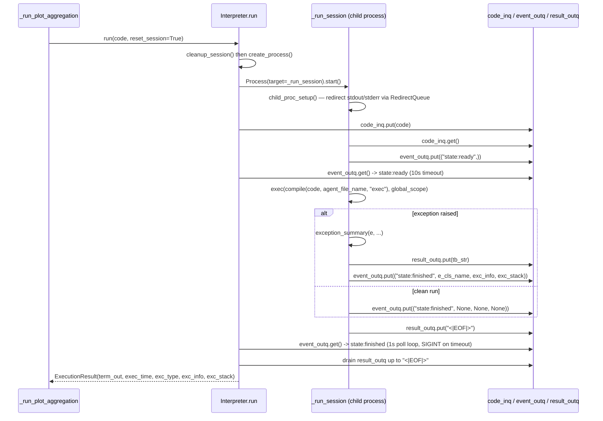

# Interpreter — running and capturing generated experiment code

## Overview
`Interpreter` is the sandbox the tree-search side of the pipeline uses to actually *run* an
LLM-written experiment draft: instead of `exec`ing untrusted code in the driver's own process, it
spawns a dedicated child `Process`, ships the code string across a `Queue`, and reconstructs
stdout/stderr and any exception from the queue traffic that comes back as an
[`ExecutionResult`](../catalog/ai_scientist/treesearch/interpreter.md#ExecutionResult). Every worker that
processes a tree-search node — [`_process_node_wrapper`](../catalog/ai_scientist/treesearch/parallel_agent.md#ParallelAgent._process_node_wrapper)
and [`_run_plot_aggregation`](../catalog/ai_scientist/treesearch/parallel_agent.md#ParallelAgent._run_plot_aggregation)
— owns one `Interpreter` and calls [`run`](../catalog/ai_scientist/treesearch/interpreter.md#Interpreter.run)
once per code draft. The process boundary, not any code-level sandboxing, is what lets a wildly
divergent or hanging LLM-generated script be killed outright without corrupting the search driver
that decides what to try next.

## Diagram

## Design rationale (why it's built this way)
- **A whole process per execution, not in-process `exec`.** [`run`](../catalog/ai_scientist/treesearch/interpreter.md#Interpreter.run)'s
  own docstring says it executes code "in a separate process." [`create_process`](../catalog/ai_scientist/treesearch/interpreter.md#Interpreter.create_process)
  spins up a fresh `multiprocessing.Process`, and [`cleanup_session`](../catalog/ai_scientist/treesearch/interpreter.md#Interpreter.cleanup_session)
  tears it down with `terminate()` first and a `kill()` fallback. A process boundary — not a
  restricted namespace — is the actual isolation mechanism: a generated script that hangs, corrupts
  global state, or dies via an uncaught OS signal only takes down that one child, never the
  orchestrator running the tree search.
- **Sessions are stateful by default, one-shot by choice.** Inside the child,
  [`_run_session`](../catalog/ai_scientist/treesearch/interpreter.md#Interpreter._run_session) allocates
  a single `global_scope` dict *before* entering its `while True` loop, then reuses it across every
  `code_inq` message the child ever receives. `reset_session=True` (the default `run` parameter) hides
  this by recreating the process — and thus a fresh `global_scope` — on every call, but a caller can
  pass `reset_session=False` to keep executing follow-up snippets against the same in-memory state,
  REPL-style, in the same process. `run` enforces the invariant with `assert self.process is not None`
  when `reset_session=False` — the session must already exist.
- **Three queues instead of pipes or temp files for IPC.** [`create_process`](../catalog/ai_scientist/treesearch/interpreter.md#Interpreter.create_process)'s
  comment spells out the split: [`code_inq`](../catalog/ai_scientist/treesearch/interpreter.md#Interpreter.code_inq)
  carries code in, [`result_outq`](../catalog/ai_scientist/treesearch/interpreter.md#Interpreter.result_outq)
  carries captured stdout/stderr out, and [`event_outq`](../catalog/ai_scientist/treesearch/interpreter.md#Interpreter.event_outq)
  carries lifecycle events (`state:ready`, `state:finished`) out — keeping "the child is alive and
  producing output" separate from "the child just changed phase" is what lets `run` poll for
  completion without misreading a burst of `print()` output as a state transition.
- **`print()` becomes a queue write, live.** [`child_proc_setup`](../catalog/ai_scientist/treesearch/interpreter.md#Interpreter.child_proc_setup)
  replaces `sys.stdout`/`sys.stderr` with a [`RedirectQueue`](../catalog/ai_scientist/treesearch/interpreter.md#RedirectQueue)
  wrapping `result_outq`. Because `RedirectQueue.write` pushes onto the queue immediately rather than
  buffering to a file, the parent can drain whatever the child printed even if the child gets
  interrupted or killed mid-run — partial output survives a timeout.
- **Escalating, not immediate, termination on timeout.** `run` first sends `SIGINT` to the child
  ([`timeout`](../catalog/ai_scientist/treesearch/interpreter.md#Interpreter.timeout) exceeded) rather
  than killing it outright, giving generated code a chance to raise (and have its own
  `except`/`finally` blocks run, or at least unwind cleanly) before a hard
  [`cleanup_session`](../catalog/ai_scientist/treesearch/interpreter.md#Interpreter.cleanup_session)
  kill lands a further 60 seconds later. A `KeyboardInterrupt` from that `SIGINT` is deliberately
  relabeled to `"TimeoutError"` in `_run_session` so the caller sees an unambiguous cause rather than a
  raw signal artifact.
- **Tracebacks are laundered before they leave the child.** [`exception_summary`](../catalog/ai_scientist/treesearch/interpreter.md#exception_summary)
  (formatted per [`format_tb_ipython`](../catalog/ai_scientist/treesearch/interpreter.md#Interpreter.format_tb_ipython))
  filters out frames whose filename contains `treesearch/` or `importlib`, and rewrites the absolute
  [`working_dir`](../catalog/ai_scientist/treesearch/interpreter.md#Interpreter.working_dir) +
  [`agent_file_name`](../catalog/ai_scientist/treesearch/interpreter.md#Interpreter.agent_file_name) path
  down to a bare filename. The generated code's traceback is meant to read as if it were a standalone
  script error, not as if it were exec'd from inside this harness's own machinery.

## Entry points
- [`_run_plot_aggregation`](../catalog/ai_scientist/treesearch/parallel_agent.md#ParallelAgent._run_plot_aggregation) —
  builds a plotting script that aggregates several seed-evaluation nodes, constructs a fresh
  `Interpreter`, and drives it directly: `process_interpreter.run(agg_plotting_code, True)` followed
  by `process_interpreter.cleanup_session()`. This is the clearest concrete example in the subgraph of
  how a tree-search worker owns and retires an `Interpreter` around a single piece of generated code.
- [`_process_node_wrapper`](../catalog/ai_scientist/treesearch/parallel_agent.md#ParallelAgent._process_node_wrapper) —
  the static per-node worker function each parallel search process runs; its subgraph edges show it
  calling both [`run`](../catalog/ai_scientist/treesearch/interpreter.md#Interpreter.run) and
  [`cleanup_session`](../catalog/ai_scientist/treesearch/interpreter.md#Interpreter.cleanup_session), i.e.
  it is the other place in the search loop where a node's candidate code is handed to an `Interpreter`
  and the resulting process is retired afterward.
- [`run`](../catalog/ai_scientist/treesearch/interpreter.md#Interpreter.run) — the single method every
  caller goes through; control reaches it once per code draft a worker wants executed, and it is what
  decides whether to recycle or replace the underlying child process before dispatching the code.

## Mechanism (step-by-step)
1. A tree-search worker builds an `Interpreter` and calls
   [`run`](../catalog/ai_scientist/treesearch/interpreter.md#Interpreter.run) with the code string to
   execute — concretely demonstrated by
   [`_run_plot_aggregation`](../catalog/ai_scientist/treesearch/parallel_agent.md#ParallelAgent._run_plot_aggregation),
   which calls `process_interpreter.run(agg_plotting_code, True)`.
2. Because `reset_session` defaults to `True`, `run` first retires any previous child via
   [`cleanup_session`](../catalog/ai_scientist/treesearch/interpreter.md#Interpreter.cleanup_session),
   then calls [`create_process`](../catalog/ai_scientist/treesearch/interpreter.md#Interpreter.create_process)
   to start a new one — each `run()` call gets a fresh interpreter process unless the caller opts into
   session continuity with `reset_session=False`.
3. `create_process` allocates the three-`Queue` IPC surface —
   [`code_inq`](../catalog/ai_scientist/treesearch/interpreter.md#Interpreter.code_inq),
   [`result_outq`](../catalog/ai_scientist/treesearch/interpreter.md#Interpreter.result_outq),
   [`event_outq`](../catalog/ai_scientist/treesearch/interpreter.md#Interpreter.event_outq) — and starts
   a `Process` targeting [`_run_session`](../catalog/ai_scientist/treesearch/interpreter.md#Interpreter._run_session).
4. In the child, `_run_session` first calls
   [`child_proc_setup`](../catalog/ai_scientist/treesearch/interpreter.md#Interpreter.child_proc_setup),
   which mutes warnings, applies [`env_vars`](../catalog/ai_scientist/treesearch/interpreter.md#Interpreter.env_vars),
   `chdir`s into [`working_dir`](../catalog/ai_scientist/treesearch/interpreter.md#Interpreter.working_dir),
   and swaps `sys.stdout`/`sys.stderr` for a
   [`RedirectQueue`](../catalog/ai_scientist/treesearch/interpreter.md#RedirectQueue) wrapping
   `result_outq` — every subsequent `print()` in the generated code becomes a queue message.
5. `_run_session` then loops: pull the next code string off `code_inq`, write it to
   [`agent_file_name`](../catalog/ai_scientist/treesearch/interpreter.md#Interpreter.agent_file_name) on
   disk so tracebacks can reference a real file, push `("state:ready",)` onto `event_outq`, and
   `exec(compile(code, agent_file_name, "exec"), global_scope)` — with `global_scope` created once,
   outside the loop, which is exactly what makes a `reset_session=False` session stateful across calls.
6. On an exception, `_run_session` calls
   [`exception_summary`](../catalog/ai_scientist/treesearch/interpreter.md#exception_summary) — honoring
   [`format_tb_ipython`](../catalog/ai_scientist/treesearch/interpreter.md#Interpreter.format_tb_ipython) —
   puts the formatted traceback text on `result_outq`, and puts a `("state:finished", e_cls_name,
   exc_info, exc_stack)` tuple on `event_outq`; a clean run instead pushes `("state:finished", None,
   None, None)`. Either branch finishes by putting the `"<|EOF|>"` sentinel on `result_outq`.
7. Back in the parent, `run` blocks up to 10 seconds on `event_outq` waiting for the `state:ready`
   handshake (raising `RuntimeError` if the child never signals it started), then polls `event_outq`
   every second for `state:finished`, using
   [`timeout`](../catalog/ai_scientist/treesearch/interpreter.md#Interpreter.timeout) to decide when to
   `SIGINT` the child and, if it is still running a further minute past that, falling back to
   [`cleanup_session`](../catalog/ai_scientist/treesearch/interpreter.md#Interpreter.cleanup_session) to
   force-kill it.
8. Once `state:finished` arrives (or the hard-kill path fires), `run` drains `result_outq` up to the
   `"<|EOF|>"` marker into an output list and returns the assembled
   [`ExecutionResult`](../catalog/ai_scientist/treesearch/interpreter.md#ExecutionResult) — `term_out`,
   `exec_time`, `exc_type`, `exc_info`, `exc_stack` — to the caller.

## Key data structures
- [`ExecutionResult`](../catalog/ai_scientist/treesearch/interpreter.md#ExecutionResult) — the dataclass
  (`DataClassJsonMixin`, so it serializes directly to JSON for logging) that carries everything a
  caller needs back from one `run()` call: captured output lines, wall-clock execution time, and, if
  the code raised, the exception's class name, structured info, and extracted stack frames.
- The three `Queue`s — [`code_inq`](../catalog/ai_scientist/treesearch/interpreter.md#Interpreter.code_inq),
  [`result_outq`](../catalog/ai_scientist/treesearch/interpreter.md#Interpreter.result_outq),
  [`event_outq`](../catalog/ai_scientist/treesearch/interpreter.md#Interpreter.event_outq) — are
  recreated by `create_process` every time a new child is spawned, so they are scoped to exactly one
  child process's lifetime.
- [`process`](../catalog/ai_scientist/treesearch/interpreter.md#Interpreter.process) — the live
  `multiprocessing.Process` handle, or `None` when no child is running; `run` and `cleanup_session`
  both branch on whether this is `None`.
- Construction-time configuration — [`working_dir`](../catalog/ai_scientist/treesearch/interpreter.md#Interpreter.working_dir),
  [`timeout`](../catalog/ai_scientist/treesearch/interpreter.md#Interpreter.timeout),
  [`agent_file_name`](../catalog/ai_scientist/treesearch/interpreter.md#Interpreter.agent_file_name),
  [`env_vars`](../catalog/ai_scientist/treesearch/interpreter.md#Interpreter.env_vars), and
  [`format_tb_ipython`](../catalog/ai_scientist/treesearch/interpreter.md#Interpreter.format_tb_ipython) —
  set once per `Interpreter` instance and threaded through to every child it spawns.

## Dynamics (design intent)
Each `Interpreter` instance drives at most one child process at a time — `run` and
[`cleanup_session`](../catalog/ai_scientist/treesearch/interpreter.md#Interpreter.cleanup_session) both
gate on [`process`](../catalog/ai_scientist/treesearch/interpreter.md#Interpreter.process) being `None`
or not, so parallelism across tree-search nodes comes from each worker owning its own `Interpreter` (as
seen in [`_run_plot_aggregation`](../catalog/ai_scientist/treesearch/parallel_agent.md#ParallelAgent._run_plot_aggregation)'s
`process_interpreter` and [`_process_node_wrapper`](../catalog/ai_scientist/treesearch/parallel_agent.md#ParallelAgent._process_node_wrapper)'s
per-process setup), not from one `Interpreter` juggling several children. The `state:ready` /
`state:finished` handshake on `event_outq` is a strict two-phase protocol: `run` will not consider a
child's timeout clock started until `state:ready` arrives, so slow interpreter/import startup in
[`child_proc_setup`](../catalog/ai_scientist/treesearch/interpreter.md#Interpreter.child_proc_setup)
never eats into the code's own execution budget.
[`_drain_queues`](../catalog/ai_scientist/treesearch/interpreter.md#Interpreter._drain_queues) exists
specifically to empty all three queues quickly during teardown so a terminated child's
still-in-flight messages can't block `cleanup_session`'s `join()` calls.

> [!inferred]
> No tests in the configured test paths reference this subgraph (per the packet's Evidence section),
> so the ordering guarantees above are read from the source's control flow, not verified by an
> executed test.

## Edge cases
- If the child never puts `state:ready` on `event_outq` within 10 seconds,
  [`run`](../catalog/ai_scientist/treesearch/interpreter.md#Interpreter.run) logs whatever is already
  in `result_outq` and raises `RuntimeError("REPL child process failed to start execution")`.
- If the child process dies while `run` is polling and no overtime interrupt has been sent yet, `run`
  treats that as an unexpected termination and raises `RuntimeError("REPL child process died
  unexpectedly")` rather than silently returning an empty result.
- On timeout, `run` re-sends `SIGINT` to the child on every ~1s poll iteration while it remains over the
  time budget; if the child is still alive a full minute past the budget, it forces a
  [`cleanup_session`](../catalog/ai_scientist/treesearch/interpreter.md#Interpreter.cleanup_session) and
  synthesizes a `"TimeoutError"` result directly — that result never passed through
  [`exception_summary`](../catalog/ai_scientist/treesearch/interpreter.md#exception_summary), so it has
  no real stack trace, only the `TimeoutError` label and the configured
  [`timeout`](../catalog/ai_scientist/treesearch/interpreter.md#Interpreter.timeout) as `exec_time`.
- A `KeyboardInterrupt` raised inside the child (from that same `SIGINT`) is caught by `_run_session`'s
  `except BaseException` and its class name is rewritten to `"TimeoutError"` before being put on
  `event_outq` — the caller never sees a raw `KeyboardInterrupt` as the reported exception type.
- Calling `run(code, reset_session=False)` before any prior `run(reset_session=True)` call trips the
  `assert self.process is not None` guard — a session can only be continued, never started, with
  `reset_session=False`.

## Open questions
- The packet's subgraph does not include a `Node` type or any `parse_exec_result`-style function, so
  how an [`ExecutionResult`](../catalog/ai_scientist/treesearch/interpreter.md#ExecutionResult) gets
  translated into a tree-search node's buggy/non-buggy classification is not visible here — that
  mapping must live in a module outside this packet (`_run_plot_aggregation`'s signature types its
  `node` parameter as `Node`, but `Node` itself has no entry in this subgraph).
- Whether the interpreter imposes any resource sandboxing beyond the process boundary and the
  `SIGINT`/kill timeout (e.g. filesystem or network restriction) is not shown by any symbol in this
  subgraph.

## See also
- [ParallelAgent's per-node worker and plot-aggregation flow](ai_scientist-treesearch-parallel_agent.md)
- [Journal / Node bookkeeping for tree-search results](ai_scientist-treesearch-journal.md)
- [ai-scientist-v2 overview](../overview.md)
