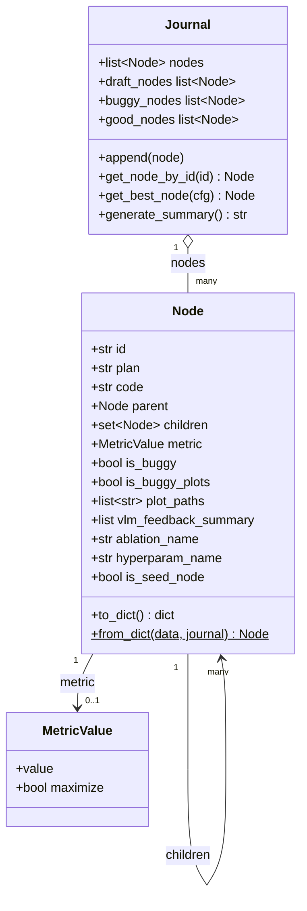
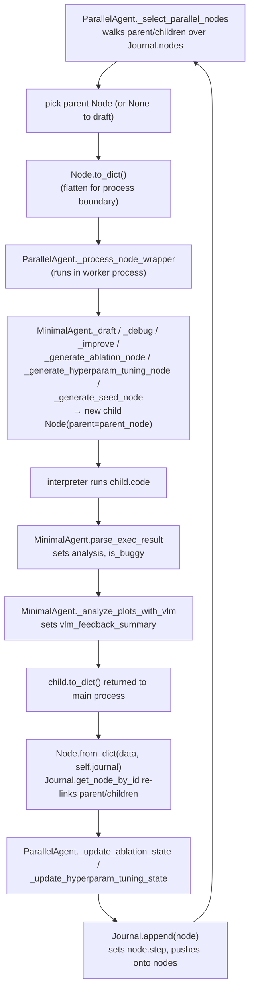

# Journal & Node — the experiment tree's data model

<!-- connect:up:begin -->
> **Cross-repo concept:** part of [agentic-tree-search](../../../concepts/agentic-tree-search.md), [closed-loop-experiment-design](../../../concepts/closed-loop-experiment-design.md) across this wiki's repos.
<!-- connect:up:end -->
## Overview
Every experiment attempt the automated research loop ever makes — a first draft, a bugfix, an
improvement, an ablation, a hyperparameter variant, a repeated seed — is represented by exactly one
[`Node`](../catalog/ai_scientist/treesearch/journal.md#Node), a
`@dataclass(eq=False)` the author describes as "a single node in the solution tree. Contains code,
execution results, and evaluation information." A
Journal is nothing more than a flat
[`nodes`](../catalog/ai_scientist/treesearch/journal.md#Journal.nodes) list plus some filtering
properties — **the tree topology is not a separate structure**; it lives entirely inside each `Node`'s own
[`parent`](../catalog/ai_scientist/treesearch/journal.md#Node.parent) and
[`children`](../catalog/ai_scientist/treesearch/journal.md#Node.children) back-references. This is the
shared data model that `ParallelAgent`'s tree search and `AgentManager`'s stage orchestration both read
and write; understanding it means understanding what "one step of tree search" actually produces and
consumes.

## Diagram

## Design rationale (why it's built this way)
- **The tree lives in the nodes, not in a separate structure.** Journal
  is documented simply as "a collection of nodes representing the solution tree" — it holds a flat list
  ([`nodes`](../catalog/ai_scientist/treesearch/journal.md#Journal.nodes)) and every "tree query"
  ([`draft_nodes`](../catalog/ai_scientist/treesearch/journal.md#Journal.draft_nodes),
  [`buggy_nodes`](../catalog/ai_scientist/treesearch/journal.md#Journal.buggy_nodes),
  [`good_nodes`](../catalog/ai_scientist/treesearch/journal.md#Journal.good_nodes)) is a filter comprehension
  over that list keyed on each node's own [`parent`](../catalog/ai_scientist/treesearch/journal.md#Node.parent)
  / [`is_buggy`](../catalog/ai_scientist/treesearch/journal.md#Node.is_buggy) fields — there is no index, no
  adjacency list, no separate tree object to keep in sync. Real tree walks (finding a subtree's root,
  finding all leaves) climb or descend the `parent`/`children` pointers directly, e.g.
  [`_get_leaves`](../catalog/ai_scientist/treesearch/parallel_agent.md#ParallelAgent._get_leaves) recurses
  over `children`, and [`_select_parallel_nodes`](../catalog/ai_scientist/treesearch/parallel_agent.md#ParallelAgent._select_parallel_nodes)
  climbs `while tree_root.parent:` to find a candidate's root.
- **`to_dict`/`from_dict` exist because a `Node` graph cannot cross a process boundary.** Tree search here
  is *parallel*: real experiments run in a multiprocessing worker pool, and a `Node` with a live `parent`
  object reference (and a parent whose `children` set references back) is exactly the kind of
  interlinked, non-trivially-picklable object graph you don't want to hand a subprocess. So every hand-off
  flattens to a plain dict via [`to_dict`](../catalog/ai_scientist/treesearch/journal.md#Node.to_dict) —
  which explicitly serializes `parent_id` as `self.parent.id` and `children` as a list of child ids rather
  than the objects themselves — and every reconstruction goes through
  [`from_dict`](../catalog/ai_scientist/treesearch/journal.md#Node.from_dict), which is deliberately
  *relationship-optional*: called with `journal=None` inside the worker (there is no journal there, only a
  bare parent node used for its `code`/`plan`/feedback text), and called with the real
  Journal back in the main process so
  [`get_node_by_id`](../catalog/ai_scientist/treesearch/journal.md#Journal.get_node_by_id) can find the
  parent by the id embedded in the dict and re-wire both sides of the link.
- **Two independent "bad" flags, not one.** A node's `is_buggy` covers code/execution correctness; a
  separate `is_buggy_plots` flag (asserted, not derived, in `good_nodes`'s filter) covers whether the
  generated plots were interpretable. [`good_nodes`](../catalog/ai_scientist/treesearch/journal.md#Journal.good_nodes)
  requires `is_buggy is False and is_buggy_plots is False` — a numerically correct run whose plots are junk
  still doesn't count as "good," which matters because downstream stage-transition logic
  ([`_get_best_implementation`](../catalog/ai_scientist/treesearch/agent_manager.md#AgentManager._get_best_implementation))
  only ever promotes a `good_nodes` candidate to the next stage.
- **Selecting the best node is an LLM call, with a numeric fallback.**
  [`get_best_node`](../catalog/ai_scientist/treesearch/journal.md#Journal.get_best_node) — "Return the best
  solution found so far" — doesn't just take `max` by [`metric`](../catalog/ai_scientist/treesearch/journal.md#Node.metric);
  when there's more than one [`good_nodes`](../catalog/ai_scientist/treesearch/journal.md#Journal.good_nodes)
  candidate it builds a prompt from each candidate's `metric`/`analysis`/`vlm_feedback_summary` and asks a
  model to choose, explicitly because a single validation number "may not be directly comparable across
  different objective functions or training details." Only on an LLM error, or when `use_val_metric_only`
  is set, does it fall back to `max(nodes, key=lambda n: n.metric)`, where ordering comes from
  [`MetricValue`](../catalog/ai_scientist/treesearch/utils/metric.md#MetricValue)'s
  [`value`](../catalog/ai_scientist/treesearch/utils/metric.md#MetricValue.value) /
  [`maximize`](../catalog/ai_scientist/treesearch/utils/metric.md#MetricValue.maximize) fields.
- **One dataclass, many "flavors," via tags rather than subclasses.** Ablation nodes
  ([`_generate_ablation_node`](../catalog/ai_scientist/treesearch/parallel_agent.md#MinimalAgent._generate_ablation_node)),
  hyperparameter-tuning nodes
  ([`_generate_hyperparam_tuning_node`](../catalog/ai_scientist/treesearch/parallel_agent.md#MinimalAgent._generate_hyperparam_tuning_node)),
  seed-replication nodes
  ([`_generate_seed_node`](../catalog/ai_scientist/treesearch/parallel_agent.md#MinimalAgent._generate_seed_node)),
  and seed-aggregation nodes
  ([`_generate_seed_eval_aggregation_node`](../catalog/ai_scientist/treesearch/parallel_agent.md#ParallelAgent._generate_seed_eval_aggregation_node))
  are all still plain `Node` instances distinguished only by which field got set
  (`ablation_name`, `hyperparam_name`, `is_seed_node`/`is_seed_agg_node`) — so every generic tree-walk,
  filter, and serialization path handles them uniformly with no type dispatch.

> [!inferred]
> `Node` overrides `__eq__`/`__hash__` to compare and hash by `id` alone (the class is declared
> `@dataclass(eq=False)` precisely so the auto-generated, field-by-field equality is replaced). This is
> what lets a `Node` live inside `children: set["Node"]` safely even though most of its other fields mutate
> after construction — a field-based `__hash__` would break as soon as, e.g., `analysis` or `metric` were
> set post-creation. This detail is part of `Node`'s own definition (cited above) rather than a separately
> listed subgraph symbol.

## Entry points
- [`Node`](../catalog/ai_scientist/treesearch/journal.md#Node) — the dataclass itself; every experiment
  attempt in the system, in every stage, is constructed as one of these before anything else happens to it.
- [`append`](../catalog/ai_scientist/treesearch/journal.md#Journal.append) — "Append a new node to
  the journal," and the only place a node's [`step`](../catalog/ai_scientist/treesearch/journal.md#Node.step)
  index is assigned (`node.step = len(self.nodes)`); control reaches it once per finished worker result, at
  the end of every [`step`](../catalog/ai_scientist/treesearch/parallel_agent.md#ParallelAgent.step)
  iteration.
- [`step`](../catalog/ai_scientist/treesearch/parallel_agent.md#ParallelAgent.step) — the
  per-generation driver of tree search; this is where nodes get selected, dispatched to workers, and their
  results folded back into the `Journal`. It is the practical entry point into almost everything else this
  page describes.
- [`_select_parallel_nodes`](../catalog/ai_scientist/treesearch/parallel_agent.md#ParallelAgent._select_parallel_nodes)
  — reached at the start of every `step`; this is where the tree's shape (via `parent`/`children`) actually
  gets consulted to decide what to draft, debug, or improve next.

## Mechanism (step-by-step)
1. **A node is born as a child of a decision, not a database write.** At the top of every generation,
   [`_select_parallel_nodes`](../catalog/ai_scientist/treesearch/parallel_agent.md#ParallelAgent._select_parallel_nodes)
   picks either `None` (draft a fresh root) or an existing candidate
   [`Node`](../catalog/ai_scientist/treesearch/journal.md#Node) to extend, mixing a random chance of
   resuming a debuggable, [`is_buggy`](../catalog/ai_scientist/treesearch/journal.md#Node.is_buggy) leaf with
   best-first exploitation via [`get_best_node`](../catalog/ai_scientist/treesearch/journal.md#Journal.get_best_node).
   Whichever it picks becomes the `parent_node` the next node will be built from.
2. **The parent is flattened to cross into a worker process.** Because real experiments run inside a
   multiprocessing pool, [`step`](../catalog/ai_scientist/treesearch/parallel_agent.md#ParallelAgent.step)
   calls [`to_dict`](../catalog/ai_scientist/treesearch/journal.md#Node.to_dict) on the selected parent
   (or passes `None`) before handing it to
   [`_process_node_wrapper`](../catalog/ai_scientist/treesearch/parallel_agent.md#ParallelAgent._process_node_wrapper),
   which runs in the worker. Inside the wrapper, the dict is turned back into a bare
   [`Node`](../catalog/ai_scientist/treesearch/journal.md#Node) via
   [`from_dict`](../catalog/ai_scientist/treesearch/journal.md#Node.from_dict) with no journal attached — the
   worker only needs the parent's `code`/`plan`/feedback text, not a live tree.
3. **A worker-side agent produces the actual child node.** Depending on the parent's state, the wrapper calls
   [`_draft`](../catalog/ai_scientist/treesearch/parallel_agent.md#MinimalAgent._draft) (no parent),
   [`_debug`](../catalog/ai_scientist/treesearch/parallel_agent.md#MinimalAgent._debug) (parent
   [`is_buggy`](../catalog/ai_scientist/treesearch/journal.md#Node.is_buggy)),
   [`_improve`](../catalog/ai_scientist/treesearch/parallel_agent.md#MinimalAgent._improve),
   [`_generate_ablation_node`](../catalog/ai_scientist/treesearch/parallel_agent.md#MinimalAgent._generate_ablation_node),
   or [`_generate_hyperparam_tuning_node`](../catalog/ai_scientist/treesearch/parallel_agent.md#MinimalAgent._generate_hyperparam_tuning_node)
   — every one of these returns a fresh [`Node`](../catalog/ai_scientist/treesearch/journal.md#Node) whose
   [`parent`](../catalog/ai_scientist/treesearch/journal.md#Node.parent) is set to the reconstructed parent
   object, linking the new attempt into the (locally reconstructed) tree.
4. **Execution and evaluation write results directly onto that new node's fields.** After the interpreter
   runs the child's [`code`](../catalog/ai_scientist/treesearch/journal.md#Node.code),
   [`parse_exec_result`](../catalog/ai_scientist/treesearch/parallel_agent.md#MinimalAgent.parse_exec_result)
   sets [`analysis`](../catalog/ai_scientist/treesearch/journal.md#Node.analysis) and
   [`is_buggy`](../catalog/ai_scientist/treesearch/journal.md#Node.is_buggy) from an LLM's read of the
   terminal output, and — if plots were produced —
   [`_analyze_plots_with_vlm`](../catalog/ai_scientist/treesearch/parallel_agent.md#MinimalAgent._analyze_plots_with_vlm)
   reads [`plot_paths`](../catalog/ai_scientist/treesearch/journal.md#Node.plot_paths) and fills
   [`vlm_feedback_summary`](../catalog/ai_scientist/treesearch/journal.md#Node.vlm_feedback_summary) with a
   vision-model critique, which the *next* [`_debug`](../catalog/ai_scientist/treesearch/parallel_agent.md#MinimalAgent._debug)
   or [`_improve`](../catalog/ai_scientist/treesearch/parallel_agent.md#MinimalAgent._improve) call on this
   node's future children will read straight back out of the parent — this is the closed loop: a node's own
   evaluation fields become the next node's prompt input.
5. **The finished node is flattened again and rejoins the real tree in the main process.** The wrapper's
   final [`to_dict`](../catalog/ai_scientist/treesearch/journal.md#Node.to_dict) call is returned as the
   worker's result; back in [`step`](../catalog/ai_scientist/treesearch/parallel_agent.md#ParallelAgent.step),
   [`from_dict`](../catalog/ai_scientist/treesearch/journal.md#Node.from_dict) is called this time *with*
   `self.journal`, so [`get_node_by_id`](../catalog/ai_scientist/treesearch/journal.md#Journal.get_node_by_id)
   looks up the real parent object by the `parent_id` embedded in the dict and wires up both
   [`parent`](../catalog/ai_scientist/treesearch/journal.md#Node.parent) on the child and
   [`children`](../catalog/ai_scientist/treesearch/journal.md#Node.children) on the parent — this is the one
   moment the two process-local copies of "the same node" are reconciled into one shared tree.
6. **Stage-specific bookkeeping runs before the node is durably recorded.**
   [`_update_hyperparam_tuning_state`](../catalog/ai_scientist/treesearch/parallel_agent.md#ParallelAgent._update_hyperparam_tuning_state)
   and [`_update_ablation_state`](../catalog/ai_scientist/treesearch/parallel_agent.md#ParallelAgent._update_ablation_state)
   inspect the freshly-relinked node's `is_buggy` and its `hyperparam_name`/`ablation_name` tag to mark that
   idea as tried/completed, then
   [`append`](../catalog/ai_scientist/treesearch/journal.md#Journal.append) assigns the node's
   [`step`](../catalog/ai_scientist/treesearch/journal.md#Node.step) index and pushes it onto
   [`nodes`](../catalog/ai_scientist/treesearch/journal.md#Journal.nodes) — only at this point does
   the node become visible to [`draft_nodes`](../catalog/ai_scientist/treesearch/journal.md#Journal.draft_nodes)/
   [`buggy_nodes`](../catalog/ai_scientist/treesearch/journal.md#Journal.buggy_nodes)/
   [`good_nodes`](../catalog/ai_scientist/treesearch/journal.md#Journal.good_nodes) and thus eligible to be
   selected as a parent on the *next* call to `_select_parallel_nodes`, closing the search loop.
7. **Repeated-seed evaluation branches off the same mechanism instead of replacing it.**
   [`_run_multi_seed_evaluation`](../catalog/ai_scientist/treesearch/parallel_agent.md#ParallelAgent._run_multi_seed_evaluation)
   re-submits the *same* parent's [`code`](../catalog/ai_scientist/treesearch/journal.md#Node.code) (with a
   seed prefix) through
   [`_process_node_wrapper`](../catalog/ai_scientist/treesearch/parallel_agent.md#ParallelAgent._process_node_wrapper)
   several times via [`_generate_seed_node`](../catalog/ai_scientist/treesearch/parallel_agent.md#MinimalAgent._generate_seed_node),
   then [`_run_plot_aggregation`](../catalog/ai_scientist/treesearch/parallel_agent.md#ParallelAgent._run_plot_aggregation)
   folds the resulting seed nodes into one more
   [`_generate_seed_eval_aggregation_node`](../catalog/ai_scientist/treesearch/parallel_agent.md#ParallelAgent._generate_seed_eval_aggregation_node)
   built from [`_aggregate_seed_eval_results`](../catalog/ai_scientist/treesearch/parallel_agent.md#ParallelAgent._aggregate_seed_eval_results)
   — statistical robustness is bolted on as more tree branches, not a different data path.
8. **The `Journal` is read-only fuel for everything downstream of tree search.** Once a stage finishes,
   [`_gather_stage_metrics`](../catalog/ai_scientist/treesearch/agent_manager.md#AgentManager._gather_stage_metrics),
   [`_analyze_progress`](../catalog/ai_scientist/treesearch/agent_manager.md#AgentManager._analyze_progress),
   [`_identify_issues`](../catalog/ai_scientist/treesearch/agent_manager.md#AgentManager._identify_issues),
   and [`_parse_vlm_feedback`](../catalog/ai_scientist/treesearch/agent_manager.md#AgentManager._parse_vlm_feedback)
   all summarize the same [`nodes`](../catalog/ai_scientist/treesearch/journal.md#Journal.nodes) for
   the next stage's context, [`_get_best_implementation`](../catalog/ai_scientist/treesearch/agent_manager.md#AgentManager._get_best_implementation)
   deep-copies the [`get_best_node`](../catalog/ai_scientist/treesearch/journal.md#Journal.get_best_node)
   result (resetting `parent`/`children` so it can seed the *next* stage's journal cleanly), and
   [`cfg_to_tree_struct`](../catalog/ai_scientist/treesearch/utils/tree_export.md#cfg_to_tree_struct) walks
   the nodes to render the tree visualization a human or the writeup stage consumes.

## Key data structures
- **`Node`'s field groups** — code/plan ([`plan`](../catalog/ai_scientist/treesearch/journal.md#Node.plan),
  [`code`](../catalog/ai_scientist/treesearch/journal.md#Node.code),
  [`plot_code`](../catalog/ai_scientist/treesearch/journal.md#Node.plot_code)); tree links
  ([`id`](../catalog/ai_scientist/treesearch/journal.md#Node.id),
  [`parent`](../catalog/ai_scientist/treesearch/journal.md#Node.parent),
  [`children`](../catalog/ai_scientist/treesearch/journal.md#Node.children)); evaluation
  ([`analysis`](../catalog/ai_scientist/treesearch/journal.md#Node.analysis),
  [`metric`](../catalog/ai_scientist/treesearch/journal.md#Node.metric),
  [`is_buggy`](../catalog/ai_scientist/treesearch/journal.md#Node.is_buggy)); plotting/VLM feedback
  ([`plot_paths`](../catalog/ai_scientist/treesearch/journal.md#Node.plot_paths),
  [`vlm_feedback_summary`](../catalog/ai_scientist/treesearch/journal.md#Node.vlm_feedback_summary)); and
  specialization tags (`ablation_name`, `hyperparam_name`, `is_seed_node`) that mark which mechanism
  produced the node without changing its type.
- **[`MetricValue`](../catalog/ai_scientist/treesearch/utils/metric.md#MetricValue)** — the comparable
  wrapper around a `Node`'s score; its [`value`](../catalog/ai_scientist/treesearch/utils/metric.md#MetricValue.value)
  can be a single number or a multi-dataset dict, and [`maximize`](../catalog/ai_scientist/treesearch/utils/metric.md#MetricValue.maximize)
  records the direction so `Node`s can be compared ("not which is larger", per the author's docstring, "but
  which value is better").
- **`Journal.nodes`** — the single flat list of every
  [`Node`](../catalog/ai_scientist/treesearch/journal.md#Node) ever appended; [`draft_nodes`](../catalog/ai_scientist/treesearch/journal.md#Journal.draft_nodes)/
  [`buggy_nodes`](../catalog/ai_scientist/treesearch/journal.md#Journal.buggy_nodes)/
  [`good_nodes`](../catalog/ai_scientist/treesearch/journal.md#Journal.good_nodes) are computed views over
  it, not maintained incrementally.
- **`InteractiveSession.append`** ([`append`](../catalog/ai_scientist/treesearch/journal.md#InteractiveSession.append))
  — a sibling, simpler container (also just a `nodes` list) used for the Jupyter-notebook-style
  interaction path rather than tree search proper; it shares `Node` as its unit but has no `parent`/`children`
  topology to maintain.
- **On-disk form** — [`dumps_json`](../catalog/ai_scientist/treesearch/utils/serialize.md#dumps_json) /
  [`loads_json`](../catalog/ai_scientist/treesearch/utils/serialize.md#loads_json) and
  [`reconstruct_journal`](../catalog/ai_scientist/treesearch/log_summarization.md#reconstruct_journal) do a
  whole-`Journal` version of the same trick as the per-node round trip: `dumps_json` strips every `parent`/
  `children` reference into a flat `node2parent` id map before calling
  [`to_dict`](../catalog/ai_scientist/treesearch/journal.md#Node.to_dict), and `loads_json`/`reconstruct_journal`
  rebuild the object graph from that map afterward.

## Dynamics (design intent)
Node/child creation itself happens **inside worker processes**, in parallel; only the merge back into the
canonical Journal is single-threaded, done
sequentially in [`step`](../catalog/ai_scientist/treesearch/parallel_agent.md#ParallelAgent.step)'s
`for i, future in enumerate(futures)` loop after all futures are submitted — so there is no locking around
[`append`](../catalog/ai_scientist/treesearch/journal.md#Journal.append) or the `parent.children.add`
mutation inside [`from_dict`](../catalog/ai_scientist/treesearch/journal.md#Node.from_dict): it's all one
thread by construction, not because of synchronization primitives.

> [!inferred]
> `step`'s per-future loop wraps each `future.result(timeout=self.timeout)` in its own `try/except
> TimeoutError`, so one worker timing out does not abort the whole generation — it only means that
> particular candidate silently never becomes a `Node` in the `Journal` this round. This behavior is
> visible in `ParallelAgent.step`'s source but the timeout/retry policy itself isn't represented by a
> subgraph symbol beyond `step` (cited above).

## Edge cases
- **A never-evaluated node is invisible to both `good_nodes` and `buggy_nodes`.** [`is_buggy`](../catalog/ai_scientist/treesearch/journal.md#Node.is_buggy)
  defaults to `None` until [`parse_exec_result`](../catalog/ai_scientist/treesearch/parallel_agent.md#MinimalAgent.parse_exec_result)
  sets it. [`buggy_nodes`](../catalog/ai_scientist/treesearch/journal.md#Journal.buggy_nodes) filters on
  truthy `is_buggy` (so `None` is excluded), and [`good_nodes`](../catalog/ai_scientist/treesearch/journal.md#Journal.good_nodes)
  filters on `is_buggy is False` (so `None` is *also* excluded) — a node mid-evaluation belongs to neither
  bucket.
- **A single timed-out worker quietly drops that generation's candidate**, per the `Dynamics` note above —
  there is no re-queue, only a logged error, inside [`step`](../catalog/ai_scientist/treesearch/parallel_agent.md#ParallelAgent.step).
- **Plots can sink an otherwise-successful node.** Because `good_nodes` requires *both*
  [`is_buggy`](../catalog/ai_scientist/treesearch/journal.md#Node.is_buggy) `is False` and `is_buggy_plots
  is False`, a numerically valid experiment whose visualizations the VLM ([`_analyze_plots_with_vlm`](../catalog/ai_scientist/treesearch/parallel_agent.md#MinimalAgent._analyze_plots_with_vlm))
  flags as broken never becomes a candidate for [`get_best_node`](../catalog/ai_scientist/treesearch/journal.md#Journal.get_best_node).
- **Ties and single-candidate shortcuts in `get_best_node`.** With exactly one
  [`good_nodes`](../catalog/ai_scientist/treesearch/journal.md#Journal.good_nodes) entry,
  [`get_best_node`](../catalog/ai_scientist/treesearch/journal.md#Journal.get_best_node) returns it directly
  without ever invoking the LLM comparison — the LLM-as-judge path only fires with genuine competing
  candidates.

## Open questions
- `Node` exposes several derived, read-only properties (e.g. a debug-vs-improve-vs-draft classification and
  a consecutive-debug-attempt depth counter, both computed by walking `parent`) that are not listed as
  separate symbols in this packet's Subgraph, so this page does not cite or describe them individually —
  see the source at [`Node`](../catalog/ai_scientist/treesearch/journal.md#Node)'s definition for the full
  set.
- `Node.from_dict` (cited above) also handles a legacy metric format via `WorstMetricValue`, which is
  referenced in the calls/refs of [`_process_node_wrapper`](../catalog/ai_scientist/treesearch/parallel_agent.md#ParallelAgent._process_node_wrapper)
  but has no dedicated entry in this packet's Subgraph, so its exact comparison semantics for a "worst
  possible" buggy-node metric are outside this page's grounding.
- The exact retry/backoff policy for a worker that raises inside
  [`_process_node_wrapper`](../catalog/ai_scientist/treesearch/parallel_agent.md#ParallelAgent._process_node_wrapper)
  (as opposed to timing out) isn't settled by anything in this subgraph.

## See also
- [Agentic tree search](../../../concepts/agentic-tree-search.md) — the cross-repo concept this data model
  implements.
- [Closed-loop experiment design](../../../concepts/closed-loop-experiment-design.md) — the feedback path
  (`analysis`/`vlm_feedback_summary` read back into the next `_debug`/`_improve` prompt) this page traces
  through `Node`'s fields.
- [The AI Scientist-v2 — paper summary](../../../sources/ai-scientist-v2.md)
