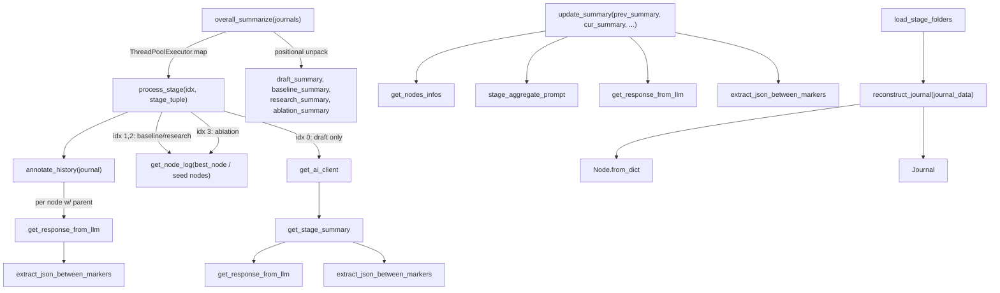

# Log Summarization — Folding Tree-Search History into Stage and Run-Level Narratives

## Overview
`log_summarization.py` is not where AI-Scientist-v2 shrinks a single node's raw
stdout/traceback — by the time a `Node` reaches this module it already carries
only *already-judged* fields (`plan`, `analysis`, a `metric`), so whatever
distillation of raw execution output happens, happens upstream of this file.
This module's job is one level higher in the hierarchy: it folds many
per-node judgments into a per-stage digest, and many per-stage digests into
one whole-run narrative, so a run with dozens of
[`Journal`](../catalog/ai_scientist/treesearch/journal.md#Journal) nodes spread
across the four canonical stages (draft/baseline/research/ablation) still
collapses to something a manuscript-writing LLM (or a human) can read in one
pass. The key idea is a **two-tier rolling compression**: node-level plan
merging via [`annotate_history`](../catalog/ai_scientist/treesearch/log_summarization.md#annotate_history),
then stage-level narrative or raw-metric extraction via
[`get_stage_summary`](../catalog/ai_scientist/treesearch/log_summarization.md#get_stage_summary)/[`get_node_log`](../catalog/ai_scientist/treesearch/log_summarization.md#get_node_log),
then whole-run aggregation via
[`update_summary`](../catalog/ai_scientist/treesearch/log_summarization.md#update_summary)
— each tier consuming only the previous tier's *output*, never the full
underlying history again.

> [!inferred]
> The truncation/compression of a node's raw `_term_out`/`exc_stack` fields
> (visible on `Node` in `journal.py`) is not implemented in this file at all;
> this packet's subgraph contains no symbol for it, so it must happen
> elsewhere in the tree-search agent before a node's `analysis` field is set.

## Diagram

## Design rationale (why it's built this way)
The module leans on a **rolling summary** shape rather than re-summarizing
everything every time: [`update_summary`](../catalog/ai_scientist/treesearch/log_summarization.md#update_summary)'s
signature takes `prev_summary` (the accumulated narrative so far) plus only
the *current* stage's fresh material, not the full node history of every
prior stage — so the prompt size tracks one stage's worth of nodes plus one
prior summary, not the whole run's raw node count. The
[`stage_aggregate_prompt`](../catalog/ai_scientist/treesearch/log_summarization.md#stage_aggregate_prompt)
text itself states the constraint this design is protecting: "Preserve
valuable insights from the summary of all previous experiment stages... if
something does not appear in the logs or summaries, do not invent it" — the
rolling shape only works if the model is explicitly forbidden from treating
its own gaps as license to hallucinate.

A second, sharper decision lives inside
[`process_stage`](../catalog/ai_scientist/treesearch/log_summarization.md#overall_summarize.process_stage):
only the draft stage (`idx == 0`) goes through the LLM-narrative path
([`get_ai_client`](../catalog/ai_scientist/treesearch/backend/__init__.md#get_ai_client)
→ [`get_stage_summary`](../catalog/ai_scientist/treesearch/log_summarization.md#get_stage_summary)).
The baseline/research stages (`idx` 1, 2) and the ablation stage (`idx == 3`)
instead return raw [`get_node_log`](../catalog/ai_scientist/treesearch/log_summarization.md#get_node_log)
dictionaries for the best node, its seed variants, and the ablation-flagged
leaf nodes — no LLM call at all for those branches.

> [!inferred]
> The code doesn't state *why* the split is this way, but it lines up with
> what each stage is *for*: baseline/research/ablation stages exist to
> compare specific quantitative variants, where the exact numbers must reach
> the manuscript unaltered; the draft stage is exploratory brainstorming,
> where a narrative digest (what was tried, why, what stood out) is more
> useful than a raw dump of many small experiments.

The two retry idioms in this file are also inconsistent in a way worth
flagging rather than explaining away: `annotate_history`'s inner loop uses an
explicit `while retry_count < max_retries` (constant stack), while
[`update_summary`](../catalog/ai_scientist/treesearch/log_summarization.md#update_summary)
retries by calling *itself* recursively with `max_retry - 1` (one stack frame
per retry). Both are bounded (3 vs. 5 attempts), so neither is dangerous, but
they are two different answers to the same "an LLM call plus JSON extraction
can transiently fail" problem inside one file.

Finally, every summarization path in this module funnels through
[`get_response_from_llm`](../catalog/ai_scientist/llm.md#get_response_from_llm),
whose own `@backoff.on_exception` decorator (visible on its signature)
absorbs rate-limit/timeout errors *before* this module's own retry loops ever
see them, and whose non-Claude branches (per its `calls/refs`) dispatch to
[`make_llm_call`](../catalog/ai_scientist/llm.md#make_llm_call), which is
itself wrapped by [`track_token_usage`](../catalog/ai_scientist/utils/token_tracker.md#track_token_usage)
(choosing between [`async_wrapper`](../catalog/ai_scientist/utils/token_tracker.md#track_token_usage.async_wrapper)
and [`sync_wrapper`](../catalog/ai_scientist/utils/token_tracker.md#track_token_usage.sync_wrapper)
depending on whether the underlying call is a coroutine), bounding every
response to [`MAX_NUM_TOKENS`](../catalog/ai_scientist/llm.md#MAX_NUM_TOKENS)
and metering it for cost/usage tracking. So every plan merge, stage summary,
and rolling aggregate in this file is automatically token-metered and
backoff-retried underneath its own application-level retries.

## Entry points
- [`overall_summarize`](../catalog/ai_scientist/treesearch/log_summarization.md#overall_summarize) — the
  top-level driver. Takes `journals`, a list of `(stage_name, journal)`
  pairs, and fans them out one call per stage to
  [`process_stage`](../catalog/ai_scientist/treesearch/log_summarization.md#overall_summarize.process_stage)
  through a `ThreadPoolExecutor`; this is where control lands once a run's
  four canonical journals are ready to be reduced to summaries.
- [`update_summary`](../catalog/ai_scientist/treesearch/log_summarization.md#update_summary) — the
  rolling cross-stage aggregator. It is not called anywhere else in this
  file (its only in-subgraph caller is itself, via the retry path), so
  control must reach it from a driver outside this packet that walks stages
  in order and threads `prev_summary` forward stage by stage.
- [`annotate_history`](../catalog/ai_scientist/treesearch/log_summarization.md#annotate_history) — invoked
  once at the top of every [`process_stage`](../catalog/ai_scientist/treesearch/log_summarization.md#overall_summarize.process_stage)
  call, before any stage- or run-level summary is computed, so every
  downstream summarizer sees nodes whose `overall_plan` has already been
  backfilled.
- [`get_stage_summary`](../catalog/ai_scientist/treesearch/log_summarization.md#get_stage_summary) —
  reached only for the draft stage (`idx == 0`) inside
  [`process_stage`](../catalog/ai_scientist/treesearch/log_summarization.md#overall_summarize.process_stage),
  after [`get_ai_client`](../catalog/ai_scientist/treesearch/backend/__init__.md#get_ai_client)
  resolves the configured model into a client.
- [`load_stage_folders`](../catalog/ai_scientist/treesearch/log_summarization.md#load_stage_folders) and
  [`reconstruct_journal`](../catalog/ai_scientist/treesearch/log_summarization.md#reconstruct_journal) —
  the module's own `if __name__ == "__main__":` demo entry: an offline
  reprocessing path that rebuilds `Journal`/`Node` objects from
  previously-saved `journal.json` files on disk and re-runs
  [`overall_summarize`](../catalog/ai_scientist/treesearch/log_summarization.md#overall_summarize)
  over them.

## Mechanism (step-by-step)
1. [`overall_summarize`](../catalog/ai_scientist/treesearch/log_summarization.md#overall_summarize)
   receives the run's four `(stage_name, journal)` pairs and hands each one
   to [`process_stage`](../catalog/ai_scientist/treesearch/log_summarization.md#overall_summarize.process_stage)
   concurrently via a `ThreadPoolExecutor`, so the four stages are
   summarized in parallel rather than one after another.
2. Regardless of which stage it is, `process_stage`'s first action is always
   [`annotate_history`](../catalog/ai_scientist/treesearch/log_summarization.md#annotate_history):
   for every node with a [`parent`](../catalog/ai_scientist/treesearch/journal.md#Node.parent) it
   asks the LLM (via [`get_response_from_llm`](../catalog/ai_scientist/llm.md#get_response_from_llm),
   parsed with [`extract_json_between_markers`](../catalog/ai_scientist/llm.md#extract_json_between_markers))
   to merge the parent's `overall_plan` with the node's own plan into an
   updated `overall_plan`; root nodes (no parent) just inherit their own
   plan directly, with no LLM call at all — the cheap default for the one
   case where there is nothing upstream to merge.
3. For the baseline and research stages (`idx` 1 and 2), `process_stage`
   skips LLM summarization entirely: it looks at the best node's
   [`children`](../catalog/ai_scientist/treesearch/journal.md#Node.children) to find
   multi-seed variants and an aggregation node, and returns
   [`get_node_log`](../catalog/ai_scientist/treesearch/log_summarization.md#get_node_log)
   dumps of each — the exact code, plan, and metric of the winning
   configuration, verbatim, not an LLM paraphrase of it.
4. For the ablation stage (`idx == 3`), `process_stage` filters the
   journal's leaf nodes down to those carrying an `ablation_name` and
   returns [`get_node_log`](../catalog/ai_scientist/treesearch/log_summarization.md#get_node_log)
   for each — again a structured extraction, not a summary, of every
   ablation variant.
5. Only for the draft stage (`idx == 0`) does `process_stage` call
   [`get_ai_client`](../catalog/ai_scientist/treesearch/backend/__init__.md#get_ai_client)
   and then [`get_stage_summary`](../catalog/ai_scientist/treesearch/log_summarization.md#get_stage_summary),
   which builds a comparison prompt from the stage's good leaf nodes,
   round-trips it through [`get_response_from_llm`](../catalog/ai_scientist/llm.md#get_response_from_llm),
   and pulls the structured verdict back out with
   [`extract_json_between_markers`](../catalog/ai_scientist/llm.md#extract_json_between_markers).
6. Back in [`overall_summarize`](../catalog/ai_scientist/treesearch/log_summarization.md#overall_summarize),
   `ThreadPoolExecutor.map` preserves input order, so the four results are
   unpacked *positionally* into `draft_summary, baseline_summary,
   research_summary, ablation_summary` — the caller's ordering of `journals`
   is load-bearing, since nothing in
   [`overall_summarize`](../catalog/ai_scientist/treesearch/log_summarization.md#overall_summarize)
   checks that position 0 really is the draft stage.
7. [`update_summary`](../catalog/ai_scientist/treesearch/log_summarization.md#update_summary)
   performs the cross-stage compounding step: it re-flattens the current
   stage's good leaf nodes via
   [`get_nodes_infos`](../catalog/ai_scientist/treesearch/log_summarization.md#get_nodes_infos),
   formats [`stage_aggregate_prompt`](../catalog/ai_scientist/treesearch/log_summarization.md#stage_aggregate_prompt)
   with the previous cumulative summary and the new stage's own summary,
   and calls [`get_response_from_llm`](../catalog/ai_scientist/llm.md#get_response_from_llm)
   /[`extract_json_between_markers`](../catalog/ai_scientist/llm.md#extract_json_between_markers),
   retrying itself recursively up to `max_retry` times on any exception
   (including a failed JSON extraction).
8. The module's own demo path (`__main__`) shows the offline mirror of this
   pipeline: [`load_stage_folders`](../catalog/ai_scientist/treesearch/log_summarization.md#load_stage_folders)
   finds `stage_*` directories under [`example_path`](../catalog/ai_scientist/treesearch/log_summarization.md#example_path)
   into [`stage_folders`](../catalog/ai_scientist/treesearch/log_summarization.md#stage_folders); for each
   [`folder`](../catalog/ai_scientist/treesearch/log_summarization.md#folder) at position
   [`index`](../catalog/ai_scientist/treesearch/log_summarization.md#index) it derives
   [`stage_name`](../catalog/ai_scientist/treesearch/log_summarization.md#stage_name), loads
   [`journal_data`](../catalog/ai_scientist/treesearch/log_summarization.md#journal_data) from a `journal.json`
   [`file`](../catalog/ai_scientist/treesearch/log_summarization.md#file), and calls
   [`reconstruct_journal`](../catalog/ai_scientist/treesearch/log_summarization.md#reconstruct_journal)
   to rebuild a [`Journal`](../catalog/ai_scientist/treesearch/journal.md#Journal) of
   [`Node`](../catalog/ai_scientist/treesearch/journal.md#Node) objects via
   [`from_dict`](../catalog/ai_scientist/treesearch/journal.md#Node.from_dict), restoring parent/child
   links from a `node2parent` map keyed by each node's
   [`id`](../catalog/ai_scientist/treesearch/journal.md#Node.id). The resulting
   [`journals`](../catalog/ai_scientist/treesearch/log_summarization.md#journals) list is fed back through
   [`overall_summarize`](../catalog/ai_scientist/treesearch/log_summarization.md#overall_summarize),
   and the four summaries are written to
   [`draft_summary_path`](../catalog/ai_scientist/treesearch/log_summarization.md#draft_summary_path),
   [`baseline_summary_path`](../catalog/ai_scientist/treesearch/log_summarization.md#baseline_summary_path),
   [`research_summary_path`](../catalog/ai_scientist/treesearch/log_summarization.md#research_summary_path),
   and [`ablation_summary_path`](../catalog/ai_scientist/treesearch/log_summarization.md#ablation_summary_path)
   (all built from a hardcoded [`log_dir`](../catalog/ai_scientist/treesearch/log_summarization.md#log_dir)),
   dumping [`ablation_summary`](../catalog/ai_scientist/treesearch/log_summarization.md#ablation_summary)
   through an open file bound to
   [`ablation_file`](../catalog/ai_scientist/treesearch/log_summarization.md#ablation_file).

## Key data structures
- [`Journal`](../catalog/ai_scientist/treesearch/journal.md#Journal) / its
  [`nodes`](../catalog/ai_scientist/treesearch/journal.md#Journal.nodes) list — the tree-search
  history this whole module reduces. Every summarizer here filters this list
  down (good/leaf/ablation-named) before doing anything else with it.
- [`Node`](../catalog/ai_scientist/treesearch/journal.md#Node) — carries the per-node state this
  module reads: `plan`/`overall_plan` (raw and LLM-merged plan text),
  `analysis` (already-judged findings), a `metric`, and the tree links
  [`parent`](../catalog/ai_scientist/treesearch/journal.md#Node.parent)/[`children`](../catalog/ai_scientist/treesearch/journal.md#Node.children)
  used both for lineage-aware plan merging and for locating seed/aggregation
  variants. Its `doc`: *"A single node in the solution tree. Contains code,
  execution results, and evaluation information."*
- [`MetricValue`](../catalog/ai_scientist/treesearch/utils/metric.md#MetricValue) /
  [`WorstMetricValue`](../catalog/ai_scientist/treesearch/utils/metric.md#WorstMetricValue) — the
  scientific-result payload (`value`, `maximize`,
  `name`, `description`) that both [`get_nodes_infos`](../catalog/ai_scientist/treesearch/log_summarization.md#get_nodes_infos)
  embeds as prompt text and [`get_node_log`](../catalog/ai_scientist/treesearch/log_summarization.md#get_node_log)
  passes through untouched into the raw stage results.
- The `summary_json` dicts returned by
  [`get_stage_summary`](../catalog/ai_scientist/treesearch/log_summarization.md#get_stage_summary)/[`update_summary`](../catalog/ai_scientist/treesearch/log_summarization.md#update_summary)
  — a schema declared only in prompt text (fields like
  `Experiment_description`, `Significance`, `Key_numerical_results`), not a
  Python class; nothing in this module validates that the LLM actually
  produced those keys beyond
  [`extract_json_between_markers`](../catalog/ai_scientist/llm.md#extract_json_between_markers)
  successfully parsing *some* JSON object out of the response.

## Dynamics (design intent)
[`overall_summarize`](../catalog/ai_scientist/treesearch/log_summarization.md#overall_summarize)
processes the four stages concurrently with a thread pool rather than a
process pool — consistent with the work being dominated by network-bound LLM
calls rather than CPU-bound computation — but that also means up to four
concurrent [`get_response_from_llm`](../catalog/ai_scientist/llm.md#get_response_from_llm)
calls can be in flight against the same model backend at once, which is what
that function's own backoff-on-rate-limit decorator exists to absorb.
Within a single stage, [`annotate_history`](../catalog/ai_scientist/treesearch/log_summarization.md#annotate_history)
is a plain sequential `for` loop over
[`nodes`](../catalog/ai_scientist/treesearch/journal.md#Journal.nodes) — node history is annotated one
node at a time even though stages themselves run in parallel with each
other.

## Edge cases
- [`annotate_history`](../catalog/ai_scientist/treesearch/log_summarization.md#annotate_history)'s
  `cfg` parameter defaults to `None`, but the function unconditionally does
  `cfg.agent.get(...)` for any node that has a
  [`parent`](../catalog/ai_scientist/treesearch/journal.md#Node.parent) — calling it without a real
  `cfg` on a journal that has any non-root node will raise, not silently fall
  back.
- [`overall_summarize`](../catalog/ai_scientist/treesearch/log_summarization.md#overall_summarize)'s
  final unpack, `draft_summary, baseline_summary, research_summary,
  ablation_summary = results`, assumes exactly four `journals` entries in
  exactly that stage order; a differently-sized or differently-ordered
  `journals` list will either raise a `ValueError` on unpacking or silently
  mislabel which summary is which.
- [`update_summary`](../catalog/ai_scientist/treesearch/log_summarization.md#update_summary)
  asserts that [`extract_json_between_markers`](../catalog/ai_scientist/llm.md#extract_json_between_markers)
  returned a truthy value immediately after calling it; a `None` return (no
  parseable JSON in the LLM output) is treated as an exception and folds
  into the same retry path as a network error, up to `max_retry` times
  before it re-raises.
- [`get_node_log`](../catalog/ai_scientist/treesearch/log_summarization.md#get_node_log)'s
  path-shortening for `exp_results_dir` only trims the path if the literal
  substring `"experiment_results"` is found in it; if it isn't, the full,
  untrimmed local filesystem path is kept as-is in the logged/summarized
  output.
- The `__main__` demo's
  [`reconstruct_journal`](../catalog/ai_scientist/treesearch/log_summarization.md#reconstruct_journal)
  and [`load_stage_folders`](../catalog/ai_scientist/treesearch/log_summarization.md#load_stage_folders)
  are local closures scoped to the demo block and operate against a
  hardcoded [`example_path`](../catalog/ai_scientist/treesearch/log_summarization.md#example_path)
  (`"logs/247-run"`) — they are not the code path a live tree-search run
  uses to build its `Journal` in memory; they exist for reprocessing a
  completed run's saved `journal.json` files after the fact.

## Open questions
- Nothing in this packet's subgraph calls
  [`update_summary`](../catalog/ai_scientist/treesearch/log_summarization.md#update_summary)
  except its own retry path — the actual driver that walks stages in order
  and threads `prev_summary` forward (presumably a manuscript/writeup
  orchestrator elsewhere in the repo) is outside this subgraph and can't be
  confirmed from this file alone.
- The prompt-template symbols that actually shape what the LLM is asked to
  do for stage narratives and per-node plan merges (the `get_summarizer_prompt`
  helper `get_stage_summary` calls, and `overall_plan_summarizer_prompt`
  used by `annotate_history`) are not in this packet's subgraph even though
  they are load-bearing for steps 2 and 5 above — their exact prompt text
  could not be cited here.
- `process_stage`'s baseline/research branch calls a `get_best_node` method
  on the journal to find the winning node before pulling its
  [`children`](../catalog/ai_scientist/treesearch/journal.md#Node.children); that selection method
  itself is not in this packet's subgraph, so how "best" is defined
  (presumably via `MetricValue` comparison) can't be traced from this file.

## See also
This is the first concept page synthesized for the `ai-scientist-v2` wiki, so
there are no sibling concept pages yet to cross-link. For symbol-level
detail on the types this page relies on, see the module catalogs for
`ai_scientist/treesearch/journal.py`, `ai_scientist/treesearch/utils/metric.py`,
`ai_scientist/llm.py`, `ai_scientist/treesearch/backend/__init__.py`, and
`ai_scientist/utils/token_tracker.py`.
