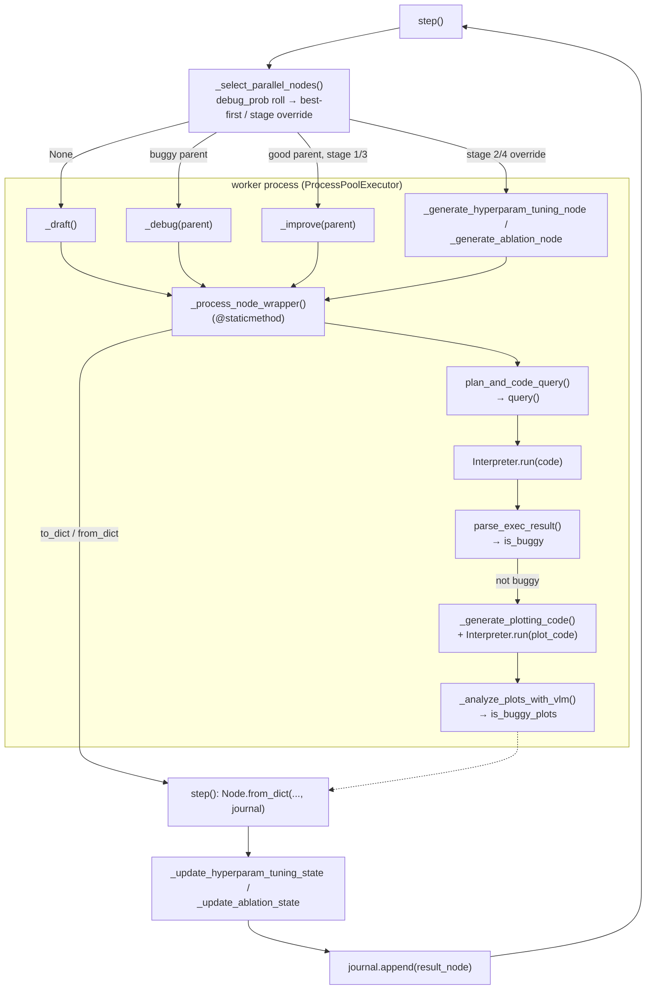

# ParallelAgent — the agentic tree-search engine

<!-- connect:up:begin -->
> **Cross-repo concept:** part of [agentic-tree-search](../../../concepts/agentic-tree-search.md), [closed-loop-experiment-design](../../../concepts/closed-loop-experiment-design.md) across this wiki's repos.
<!-- connect:up:end -->
## Overview
`ParallelAgent` is the engine that turns "write an experiment script" into a *tree search*: every call to
[`step`](../catalog/ai_scientist/treesearch/parallel_agent.md#ParallelAgent.step) picks up to `num_workers`
existing tree nodes to expand, ships each one to an isolated worker process that drafts, improves, or
debugs a candidate script, executes it for real, and then has an LLM judge whether it worked and a VLM judge
whether its plots make sense — before folding the verdict back into the tree so the *next* call to `step`
sees an updated ranking to pick from. The key idea is that "did this experiment succeed" is never assumed
from the exit code alone: a script can run clean and still be marked buggy because its plots are empty or
misleading. The second key idea is process-level parallelism — several branches of the tree advance per
iteration, each in its own OS process with its own GPU pin, so search width is bounded by worker count, not
by how fast one LLM call returns.

## Diagram

## Design rationale (why it's built this way)
- **Node generation happens *inside* a worker process, run via a `@staticmethod`.** The author's own docstring
  on [`_process_node_wrapper`](../catalog/ai_scientist/treesearch/parallel_agent.md#ParallelAgent._process_node_wrapper)
  is blunt about why: "Wrapper function that creates a fresh environment for each process." Making it a
  `staticmethod` is what lets `ProcessPoolExecutor` pickle and ship it to a subprocess at all — an *instance*
  method bound to the live `ParallelAgent` (which owns the executor itself, plus the
  [`gpu_manager`](../catalog/ai_scientist/treesearch/parallel_agent.md#ParallelAgent.gpu_manager)) would be
  unpicklable. Inside the worker, a throwaway `MinimalAgent` is reconstructed from plain data — this is also
  why `MinimalAgent` (holding [`cfg`](../catalog/ai_scientist/treesearch/parallel_agent.md#MinimalAgent.cfg))
  duplicates a whole `plan_and_code_query` implementation
  ([`plan_and_code_query`](../catalog/ai_scientist/treesearch/parallel_agent.md#MinimalAgent.plan_and_code_query))
  rather than sharing it via inheritance from `ParallelAgent`'s own
  ([`plan_and_code_query`](../catalog/ai_scientist/treesearch/parallel_agent.md#ParallelAgent.plan_and_code_query))
  — the two classes never share a base, because `MinimalAgent` must be constructible from nothing but
  serializable arguments on the far side of a process boundary.
  > [!inferred] The source never states the picklability rationale explicitly; it's the direct consequence of
  > `ParallelAgent` holding non-picklable state (`ProcessPoolExecutor`, `GPUManager`) that a worker must never
  > receive, while `MinimalAgent` is always freshly built from `task_desc`/`cfg`/strings inside the worker.
- **Node selection deliberately mixes a random debug gate with best-first search**, per the docstring on
  [`_select_parallel_nodes`](../catalog/ai_scientist/treesearch/parallel_agent.md#ParallelAgent._select_parallel_nodes):
  "Select N nodes to process in parallel, balancing between tree exploration and exploitation." A uniform
  draw against the configured debug probability decides, per slot, whether to pick a buggy branch to repair
  or to hand [`get_best_node`](../catalog/ai_scientist/treesearch/journal.md#Journal.get_best_node) (an
  LLM-judged pick among [`good_nodes`](../catalog/ai_scientist/treesearch/journal.md#Journal.good_nodes)) the
  next expansion. Debugging and improving compete for the same worker slots every iteration rather than being
  separate phases, so a tree that keeps failing automatically spends more of its budget repairing instead of
  branching further.
- **Idea generation for hyperparameter and ablation stages happens in the *main* process, before dispatch —
  not inside the worker.** The docstring comment inline in
  [`_select_parallel_nodes`](../catalog/ai_scientist/treesearch/parallel_agent.md#ParallelAgent._select_parallel_nodes)
  explains: "For Stage 2 and 4, we generate nodes in the main process and send them to worker processes. This
  is to make sure we don't run duplicate ideas in parallel." If idea generation happened inside each worker
  independently, two concurrently-running workers could both decide to tune the same hyperparameter; doing it
  serially in [`step`](../catalog/ai_scientist/treesearch/parallel_agent.md#ParallelAgent.step) via
  [`_generate_hyperparam_tuning_idea`](../catalog/ai_scientist/treesearch/parallel_agent.md#ParallelAgent._generate_hyperparam_tuning_idea)
  / [`_generate_ablation_idea`](../catalog/ai_scientist/treesearch/parallel_agent.md#ParallelAgent._generate_ablation_idea)
  lets each call see what the previous call already claimed.
- **A script that runs without error can still be marked buggy — by a *second*, independent judge.**
  [`parse_exec_result`](../catalog/ai_scientist/treesearch/parallel_agent.md#MinimalAgent.parse_exec_result)
  sets [`is_buggy`](../catalog/ai_scientist/treesearch/journal.md#Node.is_buggy) from an LLM reading the
  execution trace, but [`_analyze_plots_with_vlm`](../catalog/ai_scientist/treesearch/parallel_agent.md#MinimalAgent._analyze_plots_with_vlm)
  independently sets `is_buggy_plots` from a *vision*-language model looking at the generated figures — code
  that "succeeds" with an empty or nonsensical plot is still filtered out of
  [`good_nodes`](../catalog/ai_scientist/treesearch/journal.md#Journal.good_nodes). Correctness of the code
  and quality of the reported result are treated as two separate, independently-fallible checks.
- **Memory is a compressed LLM summary, not the raw journal.** [`step`](../catalog/ai_scientist/treesearch/parallel_agent.md#ParallelAgent.step)
  calls [`generate_summary`](../catalog/ai_scientist/treesearch/journal.md#Journal.generate_summary) — whose
  docstring says it generates "a summary of the research progress using LLM, including both successes and
  failures" — once per `step()` call and threads that single string into every worker's draft/improve/debug
  prompt that iteration, instead of replaying the full node history into every LLM call.

## Entry points
- [`step`](../catalog/ai_scientist/treesearch/parallel_agent.md#ParallelAgent.step) — the per-iteration entry
  point; called repeatedly in a loop by [`run`](../catalog/ai_scientist/treesearch/agent_manager.md#AgentManager.run)
  (`AgentManager`) until that stage's completion check passes. Everything else in this page happens inside,
  or as a direct consequence of, one `step()` call.
- [`_process_node_wrapper`](../catalog/ai_scientist/treesearch/parallel_agent.md#ParallelAgent._process_node_wrapper) —
  the actual unit of work submitted to the process pool; control reaches it once per selected node, once per
  `step()` call, running inside a freshly spawned worker process rather than the main process.
- [`run`](../catalog/ai_scientist/treesearch/agent_manager.md#AgentManager.run) (`AgentManager`) — the caller
  one level up: it owns the multi-stage loop (draft/hyperparameter/agenda/ablation stages) and re-invokes
  `step()` until a stage's own stopping criterion fires, then hands the best node to replication.
- [`_run_multi_seed_evaluation`](../catalog/ai_scientist/treesearch/parallel_agent.md#ParallelAgent._run_multi_seed_evaluation)
  and [`_run_plot_aggregation`](../catalog/ai_scientist/treesearch/parallel_agent.md#ParallelAgent._run_plot_aggregation) —
  reached once per stage, *not* once per `step()` iteration: after a stage's best node is picked, these re-run
  its code under several random seeds and aggregate the resulting statistics into one summary node, sitting
  outside the normal draft/improve/debug cycle.

## Mechanism (step-by-step)
1. **Pick what to expand.** [`step`](../catalog/ai_scientist/treesearch/parallel_agent.md#ParallelAgent.step)
   opens by calling [`_select_parallel_nodes`](../catalog/ai_scientist/treesearch/parallel_agent.md#ParallelAgent._select_parallel_nodes),
   which fills a list of up to `num_workers` slots: `None` (start a fresh draft) while
   [`draft_nodes`](../catalog/ai_scientist/treesearch/journal.md#Journal.draft_nodes) is below the configured
   minimum, then a random gate that can route a slot to a buggy branch, otherwise
   [`get_best_node`](../catalog/ai_scientist/treesearch/journal.md#Journal.get_best_node) over
   [`good_nodes`](../catalog/ai_scientist/treesearch/journal.md#Journal.good_nodes) — with stage 2/4 overriding
   all of that to always target the fixed baseline node passed in at construction.
2. **For stage 2/4, generate the idea before dispatch, not inside the worker.** Still inside `step`, if the
   selected node is non-buggy and the stage name starts with `"2_"` or `"4_"`,
   [`_generate_hyperparam_tuning_idea`](../catalog/ai_scientist/treesearch/parallel_agent.md#ParallelAgent._generate_hyperparam_tuning_idea)
   or [`_generate_ablation_idea`](../catalog/ai_scientist/treesearch/parallel_agent.md#ParallelAgent._generate_ablation_idea)
   is called synchronously in the main process, and its name is immediately recorded so the *next* node in the
   same batch won't propose the same idea.
3. **Serialize and dispatch to a worker process.** Each selected `Node` (or `None`) is turned into a plain dict
   via [`to_dict`](../catalog/ai_scientist/treesearch/journal.md#Node.to_dict) and submitted to the process
   pool as an argument to [`_process_node_wrapper`](../catalog/ai_scientist/treesearch/parallel_agent.md#ParallelAgent._process_node_wrapper) —
   a plain dict rather than the live `Node` object, because it has to cross a process boundary and a `Node`
   holding back-references to its parent/journal is not something you want two processes mutating at once.
4. **Dispatch table: draft, improve, debug, or a specialized node kind.** Inside the worker,
   [`_process_node_wrapper`](../catalog/ai_scientist/treesearch/parallel_agent.md#ParallelAgent._process_node_wrapper)
   rebuilds the parent from the dict and branches: no parent →
   [`_draft`](../catalog/ai_scientist/treesearch/parallel_agent.md#MinimalAgent._draft); buggy parent →
   [`_debug`](../catalog/ai_scientist/treesearch/parallel_agent.md#MinimalAgent._debug); a pending hyperparameter
   idea → [`_generate_hyperparam_tuning_node`](../catalog/ai_scientist/treesearch/parallel_agent.md#MinimalAgent._generate_hyperparam_tuning_node);
   a pending ablation idea → [`_generate_ablation_node`](../catalog/ai_scientist/treesearch/parallel_agent.md#MinimalAgent._generate_ablation_node);
   a seed-evaluation request → [`_generate_seed_node`](../catalog/ai_scientist/treesearch/parallel_agent.md#MinimalAgent._generate_seed_node)
   (same code, new seed); otherwise a good parent falls through to
   [`_improve`](../catalog/ai_scientist/treesearch/parallel_agent.md#MinimalAgent._improve). This is the whole
   branching structure of the tree in one `if`/`elif` chain.
5. **One LLM call produces both the plan and the code.** Whichever branch fired,
   [`plan_and_code_query`](../catalog/ai_scientist/treesearch/parallel_agent.md#MinimalAgent.plan_and_code_query)
   sends its prompt through [`query`](../catalog/ai_scientist/treesearch/backend/__init__.md#query) and then
   splits the single completion into a natural-language plan and a code block, retrying the same call (up to
   `retries` times) purely because the split failed to find a fenced code block — not because the code itself
   was wrong.
6. **Execute for real, then let an LLM read the trace.** The generated
   [`code`](../catalog/ai_scientist/treesearch/journal.md#Node.code) is executed via
   [`run`](../catalog/ai_scientist/treesearch/interpreter.md#Interpreter.run) (`Interpreter`), and the result is
   absorbed into the node via [`absorb_exec_result`](../catalog/ai_scientist/treesearch/journal.md#Node.absorb_exec_result)
   before [`parse_exec_result`](../catalog/ai_scientist/treesearch/parallel_agent.md#MinimalAgent.parse_exec_result)
   sends the execution output to an LLM specifically to set
   [`is_buggy`](../catalog/ai_scientist/treesearch/journal.md#Node.is_buggy) — a bug is not just "raised an
   exception," it is whatever this judgment call decides.
7. **If it ran clean, metrics extraction is itself a second and third LLM call** (generate code to parse the
   saved `.npy` results, run that code, then parse *its* output into a
   [`MetricValue`](../catalog/ai_scientist/treesearch/utils/metric.md#MetricValue) via the `value` field): the
   [`value`](../catalog/ai_scientist/treesearch/utils/metric.md#MetricValue.value) that later gets compared by
   `get_best_node` was never computed by the experiment script itself, only by a downstream LLM reading its
   printed output.
8. **Plots are generated, executed, and then critiqued by a VLM — a second, independent buggy signal.**
   [`_generate_plotting_code`](../catalog/ai_scientist/treesearch/parallel_agent.md#MinimalAgent._generate_plotting_code)
   produces a plotting script (retried up to 3 times if it errors), the resulting
   [`plot_paths`](../catalog/ai_scientist/treesearch/journal.md#Node.plot_paths) are handed to
   [`_analyze_plots_with_vlm`](../catalog/ai_scientist/treesearch/parallel_agent.md#MinimalAgent._analyze_plots_with_vlm),
   which sets `is_buggy_plots` and a feedback summary, and in turn calls
   [`_determine_datasets_successfully_tested`](../catalog/ai_scientist/treesearch/parallel_agent.md#MinimalAgent._determine_datasets_successfully_tested)
   to decide which datasets the run actually demonstrated results for.
9. **The result crosses back to the main process and rejoins the tree.** `step()` turns the worker's returned
   dict back into a live node with [`from_dict`](../catalog/ai_scientist/treesearch/journal.md#Node.from_dict)
   — passing the live [`journal`](../catalog/ai_scientist/treesearch/parallel_agent.md#ParallelAgent.journal) so
   parent/child pointers are restored — then calls
   [`_update_hyperparam_tuning_state`](../catalog/ai_scientist/treesearch/parallel_agent.md#ParallelAgent._update_hyperparam_tuning_state)
   / [`_update_ablation_state`](../catalog/ai_scientist/treesearch/parallel_agent.md#ParallelAgent._update_ablation_state)
   (tracking which ideas have already been tried) before
   [`Journal`](../catalog/ai_scientist/treesearch/journal.md#Journal)'s
   [`append`](../catalog/ai_scientist/treesearch/journal.md#Journal.append) makes the node visible to
   the *next* call's [`_select_parallel_nodes`](../catalog/ai_scientist/treesearch/parallel_agent.md#ParallelAgent._select_parallel_nodes) —
   this is the loop-closing step: everything the LLM/VLM judges decided this iteration becomes the ranking
   input for the next one.
10. **At stage completion, a separate replication pass runs outside the per-iteration loop.**
    [`_run_multi_seed_evaluation`](../catalog/ai_scientist/treesearch/parallel_agent.md#ParallelAgent._run_multi_seed_evaluation)
    (docstring: "Run multiple seeds of the same node to get statistical metrics") re-dispatches the stage's
    winning code through the same worker pool with different seeds, then
    [`_run_plot_aggregation`](../catalog/ai_scientist/treesearch/parallel_agent.md#ParallelAgent._run_plot_aggregation)
    generates aggregate plots across those replicates via
    [`_aggregate_seed_eval_results`](../catalog/ai_scientist/treesearch/parallel_agent.md#ParallelAgent._aggregate_seed_eval_results)
    and wraps the result in a dedicated
    [`_generate_seed_eval_aggregation_node`](../catalog/ai_scientist/treesearch/parallel_agent.md#ParallelAgent._generate_seed_eval_aggregation_node) —
    a node that represents no new experiment, only a combined summary figure.

## Key data structures
- [`Node`](../catalog/ai_scientist/treesearch/journal.md#Node) — one tree vertex: its
  [`code`](../catalog/ai_scientist/treesearch/journal.md#Node.code), its
  [`parent`](../catalog/ai_scientist/treesearch/journal.md#Node.parent) pointer, its
  [`id`](../catalog/ai_scientist/treesearch/journal.md#Node.id), its
  [`metric`](../catalog/ai_scientist/treesearch/journal.md#Node.metric), its
  [`is_buggy`](../catalog/ai_scientist/treesearch/journal.md#Node.is_buggy) flag, its
  [`plot_code`](../catalog/ai_scientist/treesearch/journal.md#Node.plot_code) and
  [`plot_paths`](../catalog/ai_scientist/treesearch/journal.md#Node.plot_paths). It crosses process boundaries
  only as a dict, via [`to_dict`](../catalog/ai_scientist/treesearch/journal.md#Node.to_dict) /
  [`from_dict`](../catalog/ai_scientist/treesearch/journal.md#Node.from_dict).
- [`Journal`](../catalog/ai_scientist/treesearch/journal.md#Journal) — the whole tree, held as a flat
  [`nodes`](../catalog/ai_scientist/treesearch/journal.md#Journal.nodes) list with parent pointers doing the
  actual tree-shaping. Its [`draft_nodes`](../catalog/ai_scientist/treesearch/journal.md#Journal.draft_nodes),
  [`good_nodes`](../catalog/ai_scientist/treesearch/journal.md#Journal.good_nodes), and
  [`buggy_nodes`](../catalog/ai_scientist/treesearch/journal.md#Journal.buggy_nodes) properties are what
  `_select_parallel_nodes` partitions the tree by, and
  [`get_best_node`](../catalog/ai_scientist/treesearch/journal.md#Journal.get_best_node) is the LLM-judged
  ranking over `good_nodes`.
- [`MetricValue`](../catalog/ai_scientist/treesearch/utils/metric.md#MetricValue) — the comparable wrapper
  around a node's [`value`](../catalog/ai_scientist/treesearch/utils/metric.md#MetricValue.value); this is
  what makes `get_best_node`'s ranking well-defined across nodes that may have wildly different metric shapes
  (single scalar vs. a dict of per-dataset metrics).
- [`cfg`](../catalog/ai_scientist/treesearch/parallel_agent.md#ParallelAgent.cfg) /
  [`agent`](../catalog/ai_scientist/treesearch/utils/config.md#Config.agent) — the `Config.agent` block holds
  the search knobs `_select_parallel_nodes` reads (draft count, debug probability, max debug depth) plus the
  per-role model/temperature settings (`code`, `feedback`, `vlm_feedback`) that decide which LLM does drafting
  versus which does VLM plot review; [`workspace_dir`](../catalog/ai_scientist/treesearch/utils/config.md#Config.workspace_dir)
  is what each worker namespaces its process-specific directory under.
- [`gpu_manager`](../catalog/ai_scientist/treesearch/parallel_agent.md#ParallelAgent.gpu_manager) — tracks
  which GPU index is on loan to which worker process id string, so two concurrently-running workers never get
  pinned to the same device.

## Dynamics (design intent)
`step()` submits every selected node to the pool with `executor.submit` and then collects results by iterating
the returned futures list in submission order, calling `future.result(timeout=self.timeout)` on each — so a
slow node's future is waited on before a faster node's result (submitted later in the same batch) is even
inspected, even though the underlying work already finished out of order in the pool. Each worker gets its own
process-specific workspace directory and its own `CUDA_VISIBLE_DEVICES` (set from the
[`gpu_manager`](../catalog/ai_scientist/treesearch/parallel_agent.md#ParallelAgent.gpu_manager)-assigned id, or
disabled entirely if none is available), so code execution across nodes in the same batch cannot interfere with
each other's GPU state or working files. Inside the interpreter, execution itself is further isolated one level
down: [`run`](../catalog/ai_scientist/treesearch/interpreter.md#Interpreter.run) hands code to a *child* process
over a queue and blocks on [`event_outq`](../catalog/ai_scientist/treesearch/interpreter.md#Interpreter.event_outq)
for a `state:ready` / `state:finished` handshake, and
[`cleanup_session`](../catalog/ai_scientist/treesearch/interpreter.md#Interpreter.cleanup_session) terminates
that child (escalating to `kill()` if it won't terminate gracefully) before the next piece of code reuses the
session — so a single worker process runs a *sequence* of throwaway child processes, one per `Interpreter.run`
call (experiment code, then metrics-parsing code, then plotting code), rather than one long-lived interpreter.

## Edge cases
- **A future timeout silently drops the node.** Inside [`step`](../catalog/ai_scientist/treesearch/parallel_agent.md#ParallelAgent.step),
  if `future.result(timeout=self.timeout)` times out, the error is logged and execution moves on — the compute
  already spent in that worker is simply lost, with no retry and no node added to the journal for that slot.
- **Plotting retries regenerate the plotting *code*, not just the plot.** If the generated plotting script
  raises, the worker calls [`_generate_plotting_code`](../catalog/ai_scientist/treesearch/parallel_agent.md#MinimalAgent._generate_plotting_code)
  again from scratch (up to 3 times) rather than patching the failing script, so a persistently-failing plot
  can burn several extra LLM calls before the worker gives up and returns the node with no plots (which then
  skips VLM analysis entirely, since [`_analyze_plots_with_vlm`](../catalog/ai_scientist/treesearch/parallel_agent.md#MinimalAgent._analyze_plots_with_vlm)
  returns immediately when [`plot_paths`](../catalog/ai_scientist/treesearch/journal.md#Node.plot_paths) is
  empty).
- **Seed-evaluation nodes reuse the parent's downstream code wholesale.** [`_process_node_wrapper`](../catalog/ai_scientist/treesearch/parallel_agent.md#ParallelAgent._process_node_wrapper)'s
  `seed_eval` path takes [`_generate_seed_node`](../catalog/ai_scientist/treesearch/parallel_agent.md#MinimalAgent._generate_seed_node)'s
  copy of the parent's [`code`](../catalog/ai_scientist/treesearch/journal.md#Node.code) and also reuses the
  parent's plotting and metrics-parsing code unchanged — the assumption is that only the random seed differs,
  so nothing downstream of execution needs to be regenerated by an LLM.
- **The stage-2/4 idea generated in the main process assumes exactly one non-`None` selected node per call
  needs one.** [`step`](../catalog/ai_scientist/treesearch/parallel_agent.md#ParallelAgent.step) checks
  `node_data["is_buggy"] is False` per node before calling
  [`_generate_hyperparam_tuning_idea`](../catalog/ai_scientist/treesearch/parallel_agent.md#ParallelAgent._generate_hyperparam_tuning_idea)
  / [`_generate_ablation_idea`](../catalog/ai_scientist/treesearch/parallel_agent.md#ParallelAgent._generate_ablation_idea) —
  a batch with several good nodes selected in the same round generates a fresh idea for *each* of them serially
  in the main process before any dispatch happens, which is what prevents duplicates but also means idea
  generation for that stage is not itself parallelized.

## Open questions
- [`_select_parallel_nodes`](../catalog/ai_scientist/treesearch/parallel_agent.md#ParallelAgent._select_parallel_nodes)
  filters "viable trees" using a per-root leaf-buggy check and picks debuggable candidates using a leaf check
  and a debug-depth cap; the helpers behind those checks (a leaf-enumeration helper and the node's own leaf/
  debug-depth attributes) are not part of this packet's subgraph, so their exact tree-walk semantics aren't
  citable here — see `ai_scientist/treesearch/parallel_agent.py` and `journal.py` directly for those.
- Looking a node up by id when restoring parent/child relationships in
  [`from_dict`](../catalog/ai_scientist/treesearch/journal.md#Node.from_dict) relies on a `Journal` id-lookup
  helper that is likewise outside this packet's subgraph.
- The packet's Evidence section notes no tests in the configured test paths reference this subgraph, so the
  dynamics above (future-ordering, timeout handling, retry counts) are grounded in source reading only, not in
  any test that exercises them.

## See also
- [Journal — the solution tree and its node dataclass](ai_scientist-treesearch-journal.md)
- [Interpreter — sandboxed code execution](ai_scientist-treesearch-interpreter.md)
- [AgentManager — the multi-stage loop that drives ParallelAgent.step](ai_scientist-treesearch-agent_manager.md)
- [Agentic tree search (paper-side concept)](../../../concepts/agentic-tree-search.md)
- [ai-scientist-v2 overview](../overview.md)
