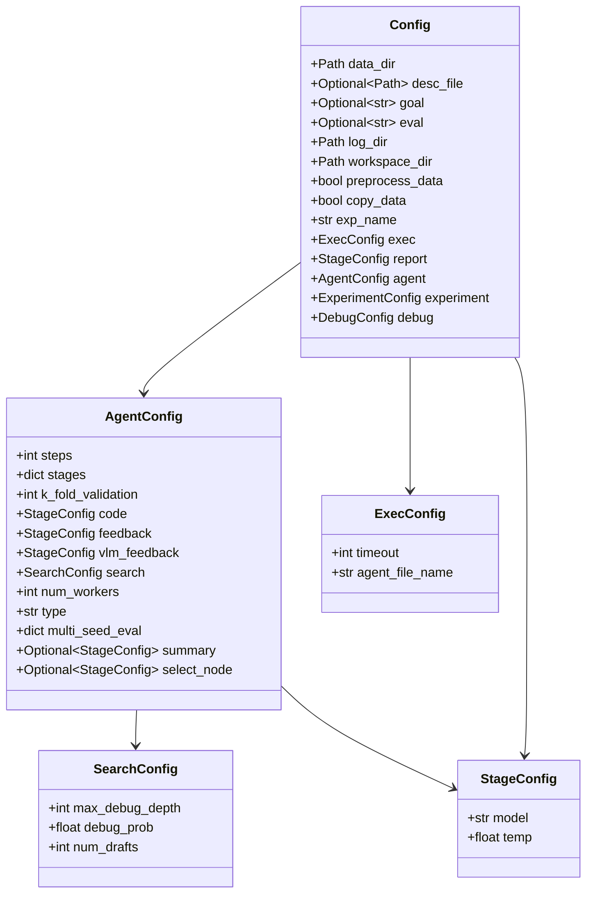

# Tree-search configuration — the knobs behind Table 3

## Overview
Every dial that shapes an AI-Scientist-v2 run — how many nodes to draft per stage, how
often to retry a buggy node instead of drafting a new one, how deep a debug chain may
go, how long one node's code is allowed to execute — is declared, but not *set*, by a
small hierarchy of `@dataclass` types rooted at [`Config`](../catalog/ai_scientist/treesearch/utils/config.md#Config)
and [`AgentConfig`](../catalog/ai_scientist/treesearch/utils/config.md#AgentConfig).
The dataclasses exist purely as a typed schema; the file's own module comment states
plainly: "these dataclasses are just for type hinting, the actual config is in
config.yaml." The real numbers a run gets live in the repo's `bfts_config.yaml`, which
[`load_cfg`](../catalog/ai_scientist/treesearch/utils/config.md#load_cfg) loads and
[`prep_cfg`](../catalog/ai_scientist/treesearch/utils/config.md#prep_cfg) then
finalizes (path resolution, experiment naming, a couple of hand-written invariants) —
there is no separate hyperparameter-search or Hydra layer here, just OmegaConf loading
a YAML file against a dataclass-shaped schema.

## Diagram

`Config` and `AgentConfig` are the two symbols this packet actually indexes; `SearchConfig`,
`ExecConfig` and `StageConfig` are drawn straight from the same file (they appear as field
types in `Config`'s and `AgentConfig`'s own bodies) but aren't independently cited symbols
in this packet's subgraph — see Open questions.

## Design rationale (why it's built this way)
The schema is deliberately split into two roles that don't overlap. [`Config`](../catalog/ai_scientist/treesearch/utils/config.md#Config)
and its nested dataclasses carry *only* type information — OmegaConf's structured-config
feature turns the dataclass definitions into a schema (`OmegaConf.structured(Config)`)
that the loaded YAML is merged against inside [`prep_cfg`](../catalog/ai_scientist/treesearch/utils/config.md#prep_cfg),
giving default-filling and basic type-checking for free without hand-writing a JSON
schema or a pydantic model. Everything that can't be expressed as "missing → use this
default" is instead a hand-written `raise ValueError` in `prep_cfg`'s own body: it
requires [`data_dir`](../catalog/ai_scientist/treesearch/utils/config.md#Config.data_dir)
to be set, requires that either [`desc_file`](../catalog/ai_scientist/treesearch/utils/config.md#Config.desc_file)
or [`goal`](../catalog/ai_scientist/treesearch/utils/config.md#Config.goal) is provided,
and (after the OmegaConf merge) requires `cfg.agent.type` to be one of `"parallel"` or
`"sequential"` — grounded via the [`agent`](../catalog/ai_scientist/treesearch/utils/config.md#Config.agent)
field. This is a "structured schema for shape, imperative code for business rules" split,
not a single declarative validator.

`prep_cfg` also doubles as a run-namer: it derives `exp_name` from `coolname.generate_slug(3)`
when the user didn't set one, and prefixes it with the next free integer index (via
[`_get_next_logindex`](../catalog/ai_scientist/treesearch/utils/config.md#_get_next_logindex)
scanned over both [`log_dir`](../catalog/ai_scientist/treesearch/utils/config.md#Config.log_dir)
and [`workspace_dir`](../catalog/ai_scientist/treesearch/utils/config.md#Config.workspace_dir))
before resolving both directories to absolute, per-run paths — so concurrent runs against
the same top-level `logs/`/`workspaces/` roots don't collide.

> [!inferred] The repo ships exactly one YAML file, `bfts_config.yaml` (repo root), which
> I read directly (not a citable symbol in this packet). Comparing its committed defaults
> against the numbers the task brief attributes to the paper's Table 3:
> - `search.max_debug_depth: 3` — **matches** the paper's reported max debug depth of 3.
> - `exec.timeout: 3600` (seconds) — **matches** the paper's reported 1-hour per-node cap.
> - `search.debug_prob: 0.5` — **does not match** the paper's reported debug probability
>   of 1.0; the shipped default debugs a buggy leaf only half the time instead of always.
> - `agent.stages.stage1_max_iters: 20`, `stage2_max_iters: 12`, `stage3_max_iters: 12`,
>   `stage4_max_iters: 18` — **partially matches**: stages 2 and 3 agree with "12 nodes,"
>   but stage 1 is 20 (not 21) and stage 4 is 18 (not 12).
> I can't tell, from this packet or a repo search, whether the paper's numbers came from
> a different commit/branch, a per-experiment override, or simply drifted from the code
> after publication — `ai_scientist/treesearch/bfts_utils.py`'s config-editing helper
> (outside this subgraph) only rewrites `desc_file`/`workspace_dir`/`data_dir`/`log_dir`
> per idea, not the numeric hyperparameters, so the shipped YAML's numbers are what a
> default run actually uses.

## Entry points
- [`load_cfg`](../catalog/ai_scientist/treesearch/utils/config.md#load_cfg) — the sole
  public function that turns a YAML path into a validated `Config`; it is the very first
  call [`perform_experiments_bfts`](../catalog/ai_scientist/treesearch/perform_experiments_bfts_with_agentmanager.md#perform_experiments_bfts)
  makes, before any task description, workspace, or agent exists.
- [`prep_cfg`](../catalog/ai_scientist/treesearch/utils/config.md#prep_cfg) — reached
  internally from `load_cfg`, and is where path resolution, experiment naming, and the
  hand-written validation described above actually happen.
- [`load_task_desc`](../catalog/ai_scientist/treesearch/utils/config.md#load_task_desc) —
  reached from `perform_experiments_bfts` right after `load_cfg` returns, to turn
  `cfg.desc_file`/`cfg.goal`/`cfg.eval` into the natural-language task text handed to the
  agent.
- [`prep_agent_workspace`](../catalog/ai_scientist/treesearch/utils/config.md#prep_agent_workspace) —
  also reached from `perform_experiments_bfts`, immediately after config prep, to stage
  the task's input data into the run's workspace before any tree-search node executes.

## Mechanism (step-by-step)
1. [`perform_experiments_bfts`](../catalog/ai_scientist/treesearch/perform_experiments_bfts_with_agentmanager.md#perform_experiments_bfts)
   is the outer driver: its first statement is `cfg = load_cfg(config_path)`, followed
   immediately by `task_desc = load_task_desc(cfg)` and, inside a `Status(...)` context,
   `prep_agent_workspace(cfg)` — config loading, task-description assembly, and workspace
   staging all happen before an `AgentManager` is even constructed. See
   [`load_cfg`](../catalog/ai_scientist/treesearch/utils/config.md#load_cfg),
   [`load_task_desc`](../catalog/ai_scientist/treesearch/utils/config.md#load_task_desc),
   [`prep_agent_workspace`](../catalog/ai_scientist/treesearch/utils/config.md#prep_agent_workspace).

2. [`load_cfg`](../catalog/ai_scientist/treesearch/utils/config.md#load_cfg) itself is a
   two-line wrapper — parse the YAML, then hand the raw result to
   [`prep_cfg`](../catalog/ai_scientist/treesearch/utils/config.md#prep_cfg) — so all the
   real logic (validation, path/name finalization) lives in `prep_cfg`, not in the loader.

3. [`prep_cfg`](../catalog/ai_scientist/treesearch/utils/config.md#prep_cfg) runs its
   precondition checks first (raising if
   [`data_dir`](../catalog/ai_scientist/treesearch/utils/config.md#Config.data_dir) is
   unset, or if neither [`desc_file`](../catalog/ai_scientist/treesearch/utils/config.md#Config.desc_file)
   nor [`goal`](../catalog/ai_scientist/treesearch/utils/config.md#Config.goal) is given),
   then resolves `data_dir`/`desc_file` to absolute paths, computes a collision-free
   [`exp_name`](../catalog/ai_scientist/treesearch/utils/config.md#Config.exp_name) using
   [`_get_next_logindex`](../catalog/ai_scientist/treesearch/utils/config.md#_get_next_logindex)
   over both [`log_dir`](../catalog/ai_scientist/treesearch/utils/config.md#Config.log_dir)
   and [`workspace_dir`](../catalog/ai_scientist/treesearch/utils/config.md#Config.workspace_dir),
   and only *then* merges the raw config against an `OmegaConf.structured` schema built
   from [`Config`](../catalog/ai_scientist/treesearch/utils/config.md#Config) and checks
   that the merged [`agent`](../catalog/ai_scientist/treesearch/utils/config.md#Config.agent)`.type`
   is one of the two accepted literals — validation is interleaved with mutation, not a
   separate up-front pass.

4. [`prep_agent_workspace`](../catalog/ai_scientist/treesearch/utils/config.md#prep_agent_workspace)
   creates `input`/`working` subdirectories under
   [`workspace_dir`](../catalog/ai_scientist/treesearch/utils/config.md#Config.workspace_dir),
   then copies (or symlinks) [`data_dir`](../catalog/ai_scientist/treesearch/utils/config.md#Config.data_dir)
   into `workspace_dir/input` via [`copytree`](../catalog/ai_scientist/treesearch/utils/__init__.md#copytree)
   — whether it copies or symlinks is controlled directly by
   [`copy_data`](../catalog/ai_scientist/treesearch/utils/config.md#Config.copy_data)
   (`use_symlinks=not cfg.copy_data`) — and runs
   [`preproc_data`](../catalog/ai_scientist/treesearch/utils/__init__.md#preproc_data)
   (which calls [`extract_archives`](../catalog/ai_scientist/treesearch/utils/__init__.md#extract_archives)
   then [`clean_up_dataset`](../catalog/ai_scientist/treesearch/utils/__init__.md#clean_up_dataset))
   only when [`preprocess_data`](../catalog/ai_scientist/treesearch/utils/config.md#Config.preprocess_data)
   is set.

5. [`load_task_desc`](../catalog/ai_scientist/treesearch/utils/config.md#load_task_desc)
   picks between two mutually-exclusive sources for the task prompt: if
   [`desc_file`](../catalog/ai_scientist/treesearch/utils/config.md#Config.desc_file) is
   set it reads that file verbatim (warning via [`logger`](../catalog/ai_scientist/treesearch/utils/config.md#logger)
   if [`goal`](../catalog/ai_scientist/treesearch/utils/config.md#Config.goal) or
   [`eval`](../catalog/ai_scientist/treesearch/utils/config.md#Config.eval) were *also*
   set, since they'll be silently ignored); otherwise it requires `goal` and assembles a
   `{"Task goal": ..., "Task evaluation": ...}` dict from `goal`/`eval` directly.

6. Once `cfg` exists, its [`agent`](../catalog/ai_scientist/treesearch/utils/config.md#Config.agent)
   field (an [`AgentConfig`](../catalog/ai_scientist/treesearch/utils/config.md#AgentConfig))
   is what the tree-search loop actually reads on every iteration: `ParallelAgent` copies
   `cfg.agent.num_workers` into its own [`num_workers`](../catalog/ai_scientist/treesearch/parallel_agent.md#ParallelAgent.num_workers)
   attribute at construction time, and [`_select_parallel_nodes`](../catalog/ai_scientist/treesearch/parallel_agent.md#ParallelAgent._select_parallel_nodes)
   reads `self.cfg.agent.search` on every call to decide whether to draft a fresh root,
   pick a debuggable buggy leaf, or improve a good node — the config object is read live
   each step, not snapshotted once.

## Key data structures
- [`Config`](../catalog/ai_scientist/treesearch/utils/config.md#Config) — the top-level,
  `Hashable` dataclass: task identity (`data_dir`, `desc_file`, `goal`, `eval`), run
  bookkeeping (`log_dir`, `workspace_dir`, `exp_name`), workspace-prep flags
  ([`preprocess_data`](../catalog/ai_scientist/treesearch/utils/config.md#Config.preprocess_data),
  [`copy_data`](../catalog/ai_scientist/treesearch/utils/config.md#Config.copy_data)), and
  the [`agent`](../catalog/ai_scientist/treesearch/utils/config.md#Config.agent) sub-config
  that drives everything downstream of workspace prep.
- [`AgentConfig`](../catalog/ai_scientist/treesearch/utils/config.md#AgentConfig) — the
  agent/search-facing half: per-stage iteration counts (`stages`, a plain `dict[str,int]`),
  the overall `steps` fallback, `k_fold_validation`, three distinct LLM sub-configs for
  code/feedback/vlm-feedback, a `search` sub-config, `num_workers`, the `type` literal
  (`"parallel"`/`"sequential"`, enforced by [`prep_cfg`](../catalog/ai_scientist/treesearch/utils/config.md#prep_cfg)),
  and `multi_seed_eval` (read by `ParallelAgent.`[`_run_multi_seed_evaluation`](../catalog/ai_scientist/treesearch/parallel_agent.md#ParallelAgent._run_multi_seed_evaluation)
  as `self.cfg.agent.multi_seed_eval.num_seeds`).

> [!inferred] `AgentConfig`'s `stages`/`search` sub-fields point at plain `dict`s and a
> `SearchConfig`/`StageConfig` type respectively (visible in the source file at
> `ai_scientist/treesearch/utils/config.py`), but neither `SearchConfig` nor `StageConfig`
> nor `ExecConfig`/`ExperimentConfig`/`DebugConfig`/`ThinkingConfig` are cited symbols in
> this packet's subgraph, so their own field-level behavior isn't independently grounded
> here beyond what's visible as type annotations inside `Config`'s and `AgentConfig`'s own
> bodies.

## Dynamics (design intent)
[`_select_parallel_nodes`](../catalog/ai_scientist/treesearch/parallel_agent.md#ParallelAgent._select_parallel_nodes)'s
own docstring states the intended split most directly: "For Stage 2 and 4, we generate
nodes in the main process and send them to worker processes... For Stage 1 and 3, we
generate nodes in worker processes" — i.e. the same `AgentConfig` is consulted from two
different process-placement regimes depending on which stage is running, not treated
uniformly across stages. [`_run_multi_seed_evaluation`](../catalog/ai_scientist/treesearch/parallel_agent.md#ParallelAgent._run_multi_seed_evaluation)'s
docstring ("Run multiple seeds of the same node to get statistical metrics") documents
why `multi_seed_eval` exists as a knob at all: it's not a debugging aid, it's how the
pipeline gets statistical robustness for a single promising node. No tests in this
packet's Evidence section exercise this subgraph, so nothing about actual scheduling
order/timing beyond what these docstrings state can be claimed here.

## Edge cases
- [`load_cfg`](../catalog/ai_scientist/treesearch/utils/config.md#load_cfg)'s default
  parameter value is `Path(__file__).parent / "config.yaml"`, i.e.
  `ai_scientist/treesearch/utils/config.yaml`.
  > [!inferred] I searched this checkout and found no such file — the only shipped YAML
  > is `bfts_config.yaml` at the repo root, always passed explicitly by callers. The
  > default therefore looks unreachable/dead in practice rather than a real fallback.
- [`load_task_desc`](../catalog/ai_scientist/treesearch/utils/config.md#load_task_desc)
  silently prefers [`desc_file`](../catalog/ai_scientist/treesearch/utils/config.md#Config.desc_file)
  over [`goal`](../catalog/ai_scientist/treesearch/utils/config.md#Config.goal)/[`eval`](../catalog/ai_scientist/treesearch/utils/config.md#Config.eval) —
  a caller who sets all three only gets a `.warning(...)` call on the module's
  [`logger`](../catalog/ai_scientist/treesearch/utils/config.md#logger), not an error, so
  a stale `goal`/`eval` left in a config alongside a `desc_file` is silently dropped
  rather than surfaced as a conflict.
- [`_get_next_logindex`](../catalog/ai_scientist/treesearch/utils/config.md#_get_next_logindex)
  derives the next run index by `int(p.name.split("-")[0])` over every entry in the
  directory and swallows `ValueError` for anything that doesn't parse — a directory
  entry with an unrelated name (or an index-free `exp_name`) is invisible to the
  collision-avoidance scheme, not an error.
- [`prep_agent_workspace`](../catalog/ai_scientist/treesearch/utils/config.md#prep_agent_workspace)'s
  data staging depends entirely on [`copy_data`](../catalog/ai_scientist/treesearch/utils/config.md#Config.copy_data):
  when false, [`copytree`](../catalog/ai_scientist/treesearch/utils/__init__.md#copytree)
  symlinks rather than copies, so in-place mutation of the workspace's `input/` directory
  by a generated experiment would touch the original `data_dir` unless `copy_data` is set.

## Open questions
- `SearchConfig` (`max_debug_depth`, `debug_prob`, `num_drafts`) and `StageConfig`
  (`model`, `temp`, `thinking`, `betas`, `max_tokens`) are the dataclasses that most
  directly hold the Table-3-relevant knobs, but neither is a symbol in this packet's
  subgraph — a packet that includes them directly would let a future page ground the
  debug-probability/model-temperature discussion more tightly than the `> [!inferred]`
  treatment above.
- Whether `OmegaConf.merge(cfg_schema, cfg)` inside [`prep_cfg`](../catalog/ai_scientist/treesearch/utils/config.md#prep_cfg)
  raises immediately or only on first access if a required (no-default) field is absent
  from the YAML isn't settled by anything in this subgraph or its Evidence section.
- The exact reason the shipped `bfts_config.yaml` defaults (`debug_prob: 0.5`,
  `stage1_max_iters: 20`, `stage4_max_iters: 18`) differ from the paper's reported
  Table 3 numbers (debug probability 1.0, 21/12/12/12 nodes) is not resolvable from this
  subgraph — see the `> [!inferred]` note under Design rationale.

## See also
- `ai_scientist-treesearch-parallel_agent.md` — the `ParallelAgent` tree-search loop that
  reads `AgentConfig.search`/`.stages`/`.num_workers`/`.multi_seed_eval` on every step.
- `ai_scientist-treesearch-agent_manager.md` — the manager `perform_experiments_bfts`
  constructs immediately after config prep and workspace staging.
- `launch_scientist_bfts.md` — the CLI entry point that supplies the `bfts_config.yaml`
  path this config hierarchy loads.
