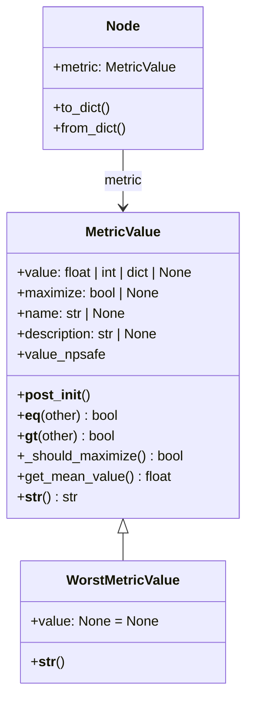

# MetricValue — direction-aware, comparable experiment scores

## Overview
Every idea the automated research loop tries produces LLM-generated experiment code, and that code is free
to report accuracy, loss, F1, or several metrics across several datasets — with no guarantee about whether
higher or lower is better. The best-first tree search that drives the pipeline still needs to answer one
question uniformly for every node's [`metric`](../catalog/ai_scientist/treesearch/journal.md#Node.metric)
field, gathered across a run by [`get_metric_history`](../catalog/ai_scientist/treesearch/journal.md#Journal.get_metric_history):
*is this experiment better than that one?* [`MetricValue`](../catalog/ai_scientist/treesearch/utils/metric.md#MetricValue)
is the wrapper that makes that question answerable: it normalizes whatever numeric shape a metric arrives
in, remembers (or infers) which direction is "better," and — via `functools.total_ordering` — exposes that
as ordinary Python comparison operators so the rest of the pipeline can just write `best = max(nodes,
key=...)` instead of re-deriving direction logic at every call site. A companion sentinel,
[`WorstMetricValue`](../catalog/ai_scientist/treesearch/utils/metric.md#WorstMetricValue), gives buggy or
crashed nodes a value that always loses a comparison, so the search doesn't need a separate "is this node
valid" branch everywhere it ranks nodes.

## Diagram

## Design rationale (why it's built this way)
- **A single scalar wins comparisons, but the stored value can be almost anything.** The class docstring on
  [`MetricValue`](../catalog/ai_scientist/treesearch/utils/metric.md#MetricValue) spells out the shape it
  accepts: a plain number, an old-style `{name: value}` dict, or a new nested
  `{"metric_names": [{"metric_name", "lower_is_better", "data": [...]}]}` structure that can carry several
  named metrics over several datasets at once — because a research idea's eval code might report
  `val_accuracy` for one dataset and `val_loss` for another, and the search still needs one ranking. Rather
  than compare structures field-by-field, everything funnels through
  [`get_mean_value`](../catalog/ai_scientist/treesearch/utils/metric.md#MetricValue.get_mean_value) to
  collapse to a single float before `>` is ever evaluated.
- **Direction is data, not a global assumption.** [`_should_maximize`](../catalog/ai_scientist/treesearch/utils/metric.md#MetricValue._should_maximize)
  reads `lower_is_better` out of the *value itself* for the new nested format (so a loss metric and an
  accuracy metric compare correctly without any caller having to know which is which), and only falls back
  to the instance-level [`maximize`](../catalog/ai_scientist/treesearch/utils/metric.md#MetricValue.maximize)
  field for the flat/legacy shape. This is a deliberate loosening from the older sibling class's
  [`__gt__`](../catalog/ai_scientist/treesearch/utils/metric.md#MetricValue_old.__gt__), whose
  `assert type(self) is type(other) and (self.maximize == other.maximize)` required both sides of a
  comparison to already agree on direction — brittle once a single journal can hold nodes from ideas with
  different metrics.
- **`@total_ordering` turns one method into a full ordering.** [`MetricValue`](../catalog/ai_scientist/treesearch/utils/metric.md#MetricValue)
  only defines [`__eq__`](../catalog/ai_scientist/treesearch/utils/metric.md#MetricValue.__eq__) and
  [`__gt__`](../catalog/ai_scientist/treesearch/utils/metric.md#MetricValue.__gt__); the decorator derives
  `<`, `<=`, and `>=` from those two. That is what lets tree-search and reporting code treat `MetricValue`
  instances like plain numbers for ranking purposes, without every call site re-implementing "higher or
  lower is better."
- **A sentinel subclass instead of a nullable-comparison special case.** [`WorstMetricValue`](../catalog/ai_scientist/treesearch/utils/metric.md#WorstMetricValue)
  is "an invalid metric value, e.g. when the agent creates a buggy solution. Always compares worse than any
  valid metric value" (its own docstring) — implemented simply by fixing `value: None = None` and inheriting
  every method. Because [`__gt__`](../catalog/ai_scientist/treesearch/utils/metric.md#MetricValue.__gt__)
  already special-cases `value is None` before it ever reaches the `assert type(self) is type(other)` line,
  a `WorstMetricValue` can be compared against a normal `MetricValue` without tripping that assert — the
  None-checks short-circuit first in both directions.
- **`value_npsafe` exists so display never crashes on missing data.** [`value_npsafe`](../catalog/ai_scientist/treesearch/utils/metric.md#MetricValue.value_npsafe)
  substitutes `float("nan")` for `None` at every level of the nested structure, which is what lets
  [`__str__`](../catalog/ai_scientist/treesearch/utils/metric.md#MetricValue.__str__) format a value with
  `:.4f` without a `None`-formatting `TypeError` even when an experiment produced a partial result.

## Entry points
- [`metric`](../catalog/ai_scientist/treesearch/journal.md#Node.metric) — the `Node` field that attaches a
  `MetricValue` to every node in the search tree; this is where control first meets the type, since every
  node created by the tree search (successful or buggy) carries one.
- [`_process_node_wrapper`](../catalog/ai_scientist/treesearch/parallel_agent.md#ParallelAgent._process_node_wrapper) —
  the per-process worker that runs one idea's generated code in isolation; it is where a fresh
  `MetricValue`/`WorstMetricValue` first gets constructed for a node, since each worker process evaluates
  independently and reports its metric back to the parent process.
- [`from_dict`](../catalog/ai_scientist/treesearch/journal.md#Node.from_dict) — reconstructs a `Node`
  (and its `MetricValue`, or a `WorstMetricValue` if the node is marked buggy) when a journal is
  deserialized, e.g. after crossing a process boundary or reloading a saved run.
- [`get_metric_history`](../catalog/ai_scientist/treesearch/journal.md#Journal.get_metric_history) —
  "Return a list of all metric values in the journal" (author docstring); the entry point reporting and
  progress-analysis code uses to look at every node's score at once.

## Mechanism (step-by-step)
1. **Normalize whatever the generated eval code produced.** [`__post_init__`](../catalog/ai_scientist/treesearch/utils/metric.md#MetricValue.__post_init__)
   runs immediately after construction and coerces `value` into a canonical, all-float shape: for the new
   nested format it walks every `metric_names[*].data[*]` entry and casts `final_value`/`best_value` to
   `float` (leaving `None` alone); for the flat dict format it casts every value; for a single number it
   asserts the value is numeric and casts to `float`. This is what guarantees every later comparison and
   `:.4f` format string has a real float (or `None`) to work with, regardless of what shape the LLM-authored
   code happened to hand back.
2. **Resolve which direction is "better" for this particular value.** [`_should_maximize`](../catalog/ai_scientist/treesearch/utils/metric.md#MetricValue._should_maximize)
   is the single place direction gets decided: for the new nested format it reads `lower_is_better` off the
   *first* entry in `metric_names` (with a `try/except` fallback if the structure is malformed); for
   anything else it just returns the instance's own [`maximize`](../catalog/ai_scientist/treesearch/utils/metric.md#MetricValue.maximize)
   flag. Docstring: "Determine if we should maximize based on the metric format."
3. **Collapse to one number.** [`get_mean_value`](../catalog/ai_scientist/treesearch/utils/metric.md#MetricValue.get_mean_value)
   — "Get the mean value across all metrics and datasets" — averages the `final_value`s across every
   dataset/metric in the new format, averages a flat dict's values in the old format, or returns the scalar
   directly. Both sides of a comparison are reduced through this same method, so a multi-dataset,
   multi-metric report and a single float are always compared on equal footing.
4. **Compare with direction applied.** [`__gt__`](../catalog/ai_scientist/treesearch/utils/metric.md#MetricValue.__gt__)
   first handles the `None`-value cases (`self.value is None` → `False`; `other.value is None` → `True`,
   which is exactly how a `WorstMetricValue` always loses), then asserts the two operands are the same
   concrete type, calls [`get_mean_value`](../catalog/ai_scientist/treesearch/utils/metric.md#MetricValue.get_mean_value)
   on each side, and — if they differ — flips the raw `>` comparison when [`_should_maximize`](../catalog/ai_scientist/treesearch/utils/metric.md#MetricValue._should_maximize)
   says lower is better. Because the class carries `@total_ordering`, this one method (plus `__eq__`) is
   enough for Python to synthesize `<`, `<=`, and `>=`, so best-node selection elsewhere in the pipeline can
   use plain comparison/`max()` semantics on `MetricValue` instances.
5. **Equality is format-aware, and unusually strict about the other operand.** [`__eq__`](../catalog/ai_scientist/treesearch/utils/metric.md#MetricValue.__eq__) —
   "Compare equality of metric values" — treats two `None` values as equal, one-`None`-one-not as unequal,
   compares whole dicts when both sides use the same (old or new) format, treats mixed formats as unequal,
   and otherwise compares raw scalars. Notably it `raise NotImplementedError` if `other` is not a
   `MetricValue` at all, rather than returning Python's `NotImplemented` sentinel (see Edge cases).
6. **Buggy or crashed runs get a value that always loses.** [`WorstMetricValue`](../catalog/ai_scientist/treesearch/utils/metric.md#WorstMetricValue)
   fixes `value: None = None` and otherwise inherits `MetricValue` wholesale (its
   [`__str__`](../catalog/ai_scientist/treesearch/utils/metric.md#WorstMetricValue.__str__) just calls
   `super().__str__()`). [`from_dict`](../catalog/ai_scientist/treesearch/journal.md#Node.from_dict)
   constructs one when reconstructing a node whose `data.get("is_buggy")` is true and no structured metric
   dict was serialized, so a node that failed keeps comparing worse than every valid node without any
   special-casing at the comparison site itself.
7. **The wrapped value travels with the node across the whole pipeline.** [`to_dict`](../catalog/ai_scientist/treesearch/journal.md#Node.to_dict)
   serializes `metric.value`, `metric.maximize`, `metric.name`, and `metric.description` into the node's
   dict form (guarding with `hasattr` since the metric may be a bare `MetricValue` without those attributes
   set), and [`from_dict`](../catalog/ai_scientist/treesearch/journal.md#Node.from_dict) rebuilds a
   `MetricValue` from that dict — this round trip is what lets a `MetricValue` created inside one worker
   process by [`_process_node_wrapper`](../catalog/ai_scientist/treesearch/parallel_agent.md#ParallelAgent._process_node_wrapper)
   survive being handed back to the parent process, where [`get_metric_history`](../catalog/ai_scientist/treesearch/journal.md#Journal.get_metric_history)
   can later collect it alongside every other node's metric.
8. **Downstream consumers read the value directly rather than comparing.** Reporting and visualization code
   doesn't call `__gt__` at all — it reads the already-resolved fields: [`_gather_stage_metrics`](../catalog/ai_scientist/treesearch/agent_manager.md#AgentManager._gather_stage_metrics)
   and [`_analyze_progress`](../catalog/ai_scientist/treesearch/agent_manager.md#AgentManager._analyze_progress)
   pull `best_node.metric.value`/`.name`/`.maximize` for stage summaries and recent-change tracking;
   [`cfg_to_tree_struct`](../catalog/ai_scientist/treesearch/utils/tree_export.md#cfg_to_tree_struct) reads
   `n.metric.value`/`.maximize`/`.name` per node to build the tree-visualization payload (wrapping legacy
   scalar metrics into the new `metric_names` shape on the fly so the renderer only has to handle one
   format); and [`append_rec`](../catalog/ai_scientist/treesearch/perform_experiments_bfts_with_agentmanager.md#journal_to_rich_tree.append_rec)
   prints `node.metric.value:.3f` next to each node in the live search-tree display, flagging the best one.

## Key data structures
- **`value`** — the normalized payload; a float/int, a flat `{name: float}` dict (legacy), or the nested
  `{"metric_names": [...]}` structure (current). `None` means "no valid result" and is the value
  [`WorstMetricValue`](../catalog/ai_scientist/treesearch/utils/metric.md#WorstMetricValue) fixes permanently.
- **`maximize`** — instance-level direction flag, authoritative only when the nested `metric_names` format
  isn't in play (that format instead carries `lower_is_better` per metric).
- **`name` / `description`** — display metadata threaded through
  [`__str__`](../catalog/ai_scientist/treesearch/utils/metric.md#MetricValue.__str__) and the serialized
  form via [`to_dict`](../catalog/ai_scientist/treesearch/journal.md#Node.to_dict); not used in comparisons.
- **[`metric`](../catalog/ai_scientist/treesearch/journal.md#Node.metric)** — the one `MetricValue` per
  search-tree node; this is the field every consumer in the Mechanism section above ultimately reads or
  compares.

## Dynamics (design intent)
> [!inferred]
> No tests in the repo's configured test paths exercise this subgraph, so the ordering/equality semantics
> above are read from source and docstrings only, not verified against test behavior.

## Edge cases
- **`__eq__` raises instead of deferring.** [`__eq__`](../catalog/ai_scientist/treesearch/utils/metric.md#MetricValue.__eq__)
  raises a bare `NotImplementedError` when `other` isn't a `MetricValue`, rather than returning Python's
  `NotImplemented` sentinel (the normal protocol, which lets Python fall back to the other operand's
  `__eq__` or a default `False`). A comparison like `metric_value == some_other_object` will therefore raise
  instead of quietly returning `False` — worth knowing before putting a `MetricValue` in a set, a dict key
  position, or an `in` check against a mixed-type collection.
- **The `assert type(self) is type(other)` in [`__gt__`](../catalog/ai_scientist/treesearch/utils/metric.md#MetricValue.__gt__)
  only matters when both sides already have a non-`None` value.** Since it's reached only after the `None`
  guards, a [`WorstMetricValue`](../catalog/ai_scientist/treesearch/utils/metric.md#WorstMetricValue)
  (always `value=None`) never hits it when compared against a regular `MetricValue` — but two ordinary
  same-class instances of genuinely different concrete types would still trip the assert if ever compared,
  since the check is on exact type, not `isinstance`.
- **`_should_maximize`'s nested-format read can silently fall through.** If `metric_names[0]` is missing
  `lower_is_better` or the list is empty, [`_should_maximize`](../catalog/ai_scientist/treesearch/utils/metric.md#MetricValue._should_maximize)
  catches the exception, prints an error, and falls through to `return bool(self.maximize)` at the bottom of
  the same branch — a partially malformed nested value degrades to the flat-format direction logic rather
  than raising.

> [!inferred]
> An older, simpler sibling class in the same file — with its own
> [`__gt__`](../catalog/ai_scientist/treesearch/utils/metric.md#MetricValue_old.__gt__),
> [`__eq__`](../catalog/ai_scientist/treesearch/utils/metric.md#MetricValue_old.__eq__),
> [`is_worst`](../catalog/ai_scientist/treesearch/utils/metric.md#MetricValue_old.is_worst) property, and
> [`get_dataset_value`](../catalog/ai_scientist/treesearch/utils/metric.md#MetricValue_old.get_dataset_value) —
> supports only the flat-dict/scalar shape and requires matching `maximize` flags on both sides of a
> comparison. Nothing in this packet's subgraph calls any of its members, which suggests the current
> pipeline has moved on to `MetricValue` plus the `WorstMetricValue` sentinel, but this packet's subgraph
> doesn't cover the whole repository, so treat that as suggestive rather than conclusive.

## Open questions
- The nested `metric_names`/`data` schema (multi-dataset, multi-metric reporting) is documented only in the
  [`MetricValue`](../catalog/ai_scientist/treesearch/utils/metric.md#MetricValue) class docstring and
  `__post_init__`/`__str__`/`get_mean_value` handling of it; nothing in this subgraph shows *where* an eval
  script is instructed to produce that particular shape, so the producing side of the contract is outside
  this packet.
- Whether the older sibling class (see the `[!inferred]` note above) is fully dead code or still reachable
  from a call site outside this subgraph is not settled here.

## See also
- [Node / Journal — the search-tree data model](journal.md)
- [ParallelAgent — parallel worker processes running the tree search](parallel_agent.md)
- [AgentManager — multi-stage orchestration and progress reporting](agent_manager.md)
- [ai-scientist-v2 overview](../overview.md)
