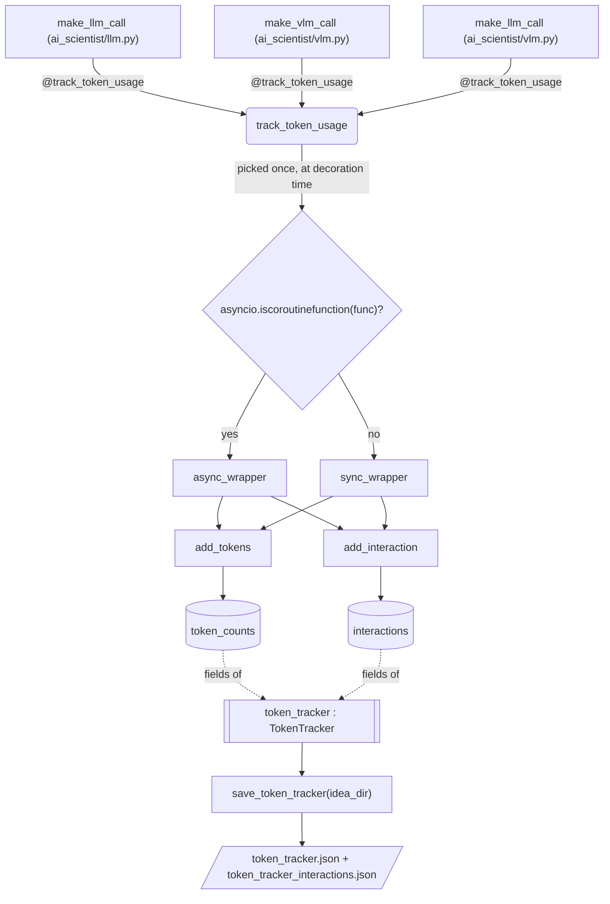

# Token tracker — usage and cost accounting across the pipeline

A single process-wide accumulator that every LLM/VLM call site is decorated into, so token
counts, USD cost, and full interaction transcripts pile up across an entire run — ideation,
every tree-search node, and writeup review alike — without any caller having to pass a
tracker around explicitly.

## Overview

[`TokenTracker`](../catalog/ai_scientist/utils/token_tracker.md#TokenTracker) is a small
stateful class instantiated exactly once at import time into a module-level global,
[`token_tracker`](../catalog/ai_scientist/utils/token_tracker.md#token_tracker). Instrumentation
is wired in declaratively: the
[`track_token_usage`](../catalog/ai_scientist/utils/token_tracker.md#track_token_usage) decorator
is applied to every model-call function
([`make_llm_call`](../catalog/ai_scientist/llm.md#make_llm_call) in `ai_scientist/llm.py`, plus
[`make_vlm_call`](../catalog/ai_scientist/vlm.md#make_vlm_call) and
[`make_llm_call`](../catalog/ai_scientist/vlm.md#make_llm_call) in `ai_scientist/vlm.py`), so
none of those call sites do any bookkeeping themselves — the wrapper reaches into the raw
response object after the call completes and records it into the shared singleton. Given how
many independent model calls one BFTS tree-search run issues (Table 3's ~15-hour runs walk
dozens of tree nodes, each spawning its own ideation/debug/writeup LLM calls), this tracker is
the only place a cumulative cost or per-model breakdown for the whole run exists.

## Diagram

## Design rationale (why it's built this way)

- **One shared global instead of dependency-injected instances.** `token_tracker` is created
  once at module load and every wrapper closes over that same name rather than receiving a
  tracker argument. For a single-process pipeline this is the cheapest way to get a run-wide
  total: nothing upstream (ideation, tree search, writeup) needs to know a tracker exists or
  thread one through call signatures — the decorator is the only integration point
  ([`track_token_usage`](../catalog/ai_scientist/utils/token_tracker.md#track_token_usage),
  [`token_tracker`](../catalog/ai_scientist/utils/token_tracker.md#token_tracker)).
- **Sync/async chosen once, at decoration time, not per call.**
  [`track_token_usage`](../catalog/ai_scientist/utils/token_tracker.md#track_token_usage) tests
  `asyncio.iscoroutinefunction(func)` when it wraps the target function and returns either
  [`async_wrapper`](../catalog/ai_scientist/utils/token_tracker.md#track_token_usage.async_wrapper)
  or [`sync_wrapper`](../catalog/ai_scientist/utils/token_tracker.md#track_token_usage.sync_wrapper)
  — a fixed choice baked in when the module imports, not a runtime branch. The two wrappers
  duplicate almost the entire accounting body (parameter check, field extraction, the two
  `token_tracker` calls) rather than sharing one implementation with an `await` toggle.
  > [!inferred] This duplication reads as the simplest way to support both a synchronous
  > (`ai_scientist/llm.py`) and an async-capable call path under one decorator name, at the cost
  > of the two bodies drifting independently if one is ever changed without the other.
- **Trusts the provider's own accounting; never re-tokenizes.** The class docstring on
  [`TokenTracker`](../catalog/ai_scientist/utils/token_tracker.md#TokenTracker) states the
  design directly: *"We assume we get these from the LLM response, and we don't count the
  tokens by ourselves."* Both wrappers pull `prompt_tokens`/`completion_tokens`/
  `reasoning_tokens`/`cached_tokens` straight out of the API response's `usage` object and hand
  them to [`add_tokens`](../catalog/ai_scientist/utils/token_tracker.md#TokenTracker.add_tokens)
  — there is no local tokenizer pass to cross-check or fall back on.
- **Coverage gap between supported models and priced models.**
  [`AVAILABLE_LLMS`](../catalog/ai_scientist/llm.md#AVAILABLE_LLMS) lists Claude, GPT, DeepSeek,
  Llama, and Bedrock-hosted model strings — a broad, multi-provider set. The pricing table
  inside [`TokenTracker`](../catalog/ai_scientist/utils/token_tracker.md#TokenTracker)'s
  constructor only has entries for a handful of specific OpenAI GPT-4o/o1/o3-mini version
  strings.
  > [!inferred] Any model in `AVAILABLE_LLMS` outside that OpenAI pricing table (every Claude,
  > DeepSeek, Llama, and Bedrock entry) accumulates token counts normally but prices out at
  > $0.0 with a logged warning rather than an error — the cost figure silently understates
  > true spend for non-OpenAI runs. This is read from the pricing dict's contents, which are
  > outside this packet's subgraph, so it isn't asserted as a cited fact.

## Entry points

- [`make_llm_call`](../catalog/ai_scientist/llm.md#make_llm_call) — the standard text-completion
  path in `ai_scientist/llm.py`, decorated with
  [`track_token_usage`](../catalog/ai_scientist/utils/token_tracker.md#track_token_usage); this is
  where most ideation, tree-search, and writeup LLM calls land.
- [`make_vlm_call`](../catalog/ai_scientist/vlm.md#make_vlm_call) — the vision-language call path
  in `ai_scientist/vlm.py`, hit whenever the pipeline needs a model to look at generated figures
  (e.g. plot review), also wrapped by
  [`track_token_usage`](../catalog/ai_scientist/utils/token_tracker.md#track_token_usage).
- [`make_llm_call`](../catalog/ai_scientist/vlm.md#make_llm_call) — a second, separate text-call
  path defined alongside `make_vlm_call` in `ai_scientist/vlm.py`, decorated the same way.
- [`save_token_tracker`](../catalog/launch_scientist_bfts.md#save_token_tracker) — control reaches
  this once the top-level BFTS launcher decides to checkpoint or finish a run; it is the only
  place the accumulated [`token_tracker`](../catalog/ai_scientist/utils/token_tracker.md#token_tracker)
  singleton gets flushed to disk.

## Mechanism (step-by-step)

1. At import time, every model-call function that needs metering is decorated with
   [`track_token_usage`](../catalog/ai_scientist/utils/token_tracker.md#track_token_usage) — the
   decorator inspects the target function once and picks
   [`async_wrapper`](../catalog/ai_scientist/utils/token_tracker.md#track_token_usage.async_wrapper)
   for coroutine functions or
   [`sync_wrapper`](../catalog/ai_scientist/utils/token_tracker.md#track_token_usage.sync_wrapper)
   otherwise, so [`make_llm_call`](../catalog/ai_scientist/llm.md#make_llm_call),
   [`make_vlm_call`](../catalog/ai_scientist/vlm.md#make_vlm_call), and
   [`make_llm_call`](../catalog/ai_scientist/vlm.md#make_llm_call) each end up calling through
   exactly one of the two wrappers for their entire lifetime.
2. Whichever wrapper runs first enforces the calling convention: it reads `prompt` and
   `system_message` out of `kwargs` and raises `ValueError` if both are absent, before the
   underlying call is even made — both
   [`async_wrapper`](../catalog/ai_scientist/utils/token_tracker.md#track_token_usage.async_wrapper)
   and [`sync_wrapper`](../catalog/ai_scientist/utils/token_tracker.md#track_token_usage.sync_wrapper)
   contain this identical guard.
3. The wrapper then invokes the wrapped function and reads `model`, `created` (timestamp), and
   `usage` straight off the returned response object — this only works because the pipeline's
   call sites return OpenAI-shaped completion objects; a response missing `usage` (or one whose
   `usage` has no `completion_tokens_details`) is simply skipped, with no counts recorded and no
   error surfaced, inside the same
   [`async_wrapper`](../catalog/ai_scientist/utils/token_tracker.md#track_token_usage.async_wrapper) /
   [`sync_wrapper`](../catalog/ai_scientist/utils/token_tracker.md#track_token_usage.sync_wrapper)
   bodies.
4. When usage data is present, the wrapper calls
   [`add_tokens`](../catalog/ai_scientist/utils/token_tracker.md#TokenTracker.add_tokens) with the
   prompt/completion/reasoning/cached counts and
   [`add_interaction`](../catalog/ai_scientist/utils/token_tracker.md#TokenTracker.add_interaction)
   with the full system message, prompt, response text, and timestamp — both write into the
   same shared [`token_tracker`](../catalog/ai_scientist/utils/token_tracker.md#token_tracker)
   instance, so a text call and a VLM call from completely different modules land in one place.
5. Inside the tracker,
   [`add_tokens`](../catalog/ai_scientist/utils/token_tracker.md#TokenTracker.add_tokens) adds
   onto the per-model buckets in
   [`token_counts`](../catalog/ai_scientist/utils/token_tracker.md#TokenTracker.token_counts),
   while [`add_interaction`](../catalog/ai_scientist/utils/token_tracker.md#TokenTracker.add_interaction)
   appends a full record onto the per-model list in
   [`interactions`](../catalog/ai_scientist/utils/token_tracker.md#TokenTracker.interactions) — an
   append-only transcript grows alongside the aggregate counts for the life of the process.
6. [`save_token_tracker`](../catalog/launch_scientist_bfts.md#save_token_tracker) is the exit
   ramp: it reads the process-wide
   [`token_tracker`](../catalog/ai_scientist/utils/token_tracker.md#token_tracker) singleton and
   writes it out as two JSON files under the run's `idea_dir`, giving each experiment directory
   its own snapshot of what that run cost and said.

## Key data structures

- [`TokenTracker`](../catalog/ai_scientist/utils/token_tracker.md#TokenTracker) — the class; one
  instance backs the entire process.
- [`token_tracker`](../catalog/ai_scientist/utils/token_tracker.md#token_tracker) — the module-level
  singleton every wrapper and [`save_token_tracker`](../catalog/launch_scientist_bfts.md#save_token_tracker)
  reads and writes.
- [`token_counts`](../catalog/ai_scientist/utils/token_tracker.md#TokenTracker.token_counts) — a
  `defaultdict` keyed by model name, holding running `prompt`/`completion`/`reasoning`/`cached`
  integer totals; `reasoning` tokens are included inside `completion`, `cached` tokens inside
  `prompt` (per the class's own docstring).
- [`interactions`](../catalog/ai_scientist/utils/token_tracker.md#TokenTracker.interactions) — a
  `defaultdict` keyed by model name, holding a list of raw interaction dicts (system message,
  prompt, response text, timestamp) — a full transcript, not just counts.

## Dynamics (design intent)

> [!inferred] Neither
> [`async_wrapper`](../catalog/ai_scientist/utils/token_tracker.md#track_token_usage.async_wrapper)
> nor [`sync_wrapper`](../catalog/ai_scientist/utils/token_tracker.md#track_token_usage.sync_wrapper)
> takes any lock around the
> [`add_tokens`](../catalog/ai_scientist/utils/token_tracker.md#TokenTracker.add_tokens) /
> [`add_interaction`](../catalog/ai_scientist/utils/token_tracker.md#TokenTracker.add_interaction)
> writes. If tree-search experiments ever issue concurrent async model calls against the same
> event loop, their updates to the shared `defaultdict`s in
> [`token_counts`](../catalog/ai_scientist/utils/token_tracker.md#TokenTracker.token_counts) and
> [`interactions`](../catalog/ai_scientist/utils/token_tracker.md#TokenTracker.interactions)
> would interleave with no explicit ordering guarantee — this is a reading of the source, not
> something exercised by a test in this repo (see Evidence: none reference this subgraph).

## Edge cases

- Calling a decorated function without `prompt` or `system_message` in `kwargs` raises
  `ValueError` before the underlying model call happens — enforced identically in
  [`async_wrapper`](../catalog/ai_scientist/utils/token_tracker.md#track_token_usage.async_wrapper)
  and [`sync_wrapper`](../catalog/ai_scientist/utils/token_tracker.md#track_token_usage.sync_wrapper).
- A response with no `usage`, or `usage.completion_tokens_details is None`, causes the call's
  result to still be returned normally but contributes zero rows to
  [`add_tokens`](../catalog/ai_scientist/utils/token_tracker.md#TokenTracker.add_tokens) /
  [`add_interaction`](../catalog/ai_scientist/utils/token_tracker.md#TokenTracker.add_interaction)
  — a caller has no signal that accounting was skipped for that call.
- A model present in [`AVAILABLE_LLMS`](../catalog/ai_scientist/llm.md#AVAILABLE_LLMS) but absent
  from the pricing table used at cost-calculation time logs a warning and reports zero cost for
  that model rather than failing — see the Design rationale coverage-gap note above.

## Open questions

- The tracker's constructor also builds a per-model USD pricing table and the class exposes
  cost-calculation, summary, and reset behavior in `ai_scientist/utils/token_tracker.py` beyond
  [`add_tokens`](../catalog/ai_scientist/utils/token_tracker.md#TokenTracker.add_tokens) and
  [`add_interaction`](../catalog/ai_scientist/utils/token_tracker.md#TokenTracker.add_interaction)
  — none of those additional methods are in this packet's subgraph, so they aren't cited or
  named individually here; a future packet covering `ai_scientist/llm.py` cost reporting or
  `launch_scientist_bfts.py`'s use of the summary output would be the place to document them.
- It's unresolved from this subgraph whether a non-OpenAI response shape (e.g. an Anthropic
  client response, given [`AVAILABLE_LLMS`](../catalog/ai_scientist/llm.md#AVAILABLE_LLMS) lists
  several Claude and Bedrock model strings) actually carries a `usage.completion_tokens_details`
  attribute at all, or whether accessing it on such a response would raise `AttributeError`
  rather than being skipped gracefully — the guard only checks `hasattr(result, "usage")`, not
  `hasattr(result.usage, "completion_tokens_details")`.

## See also
- [`ai_scientist/llm.py` catalog](../catalog/ai_scientist/llm.md) — the text-completion dispatch
  that `make_llm_call` sits inside, gated by `AVAILABLE_LLMS`.
- [`ai_scientist/vlm.py` catalog](../catalog/ai_scientist/vlm.md) — the vision-call counterpart
  wrapped by the same decorator.
- [`launch_scientist_bfts.py` catalog](../catalog/launch_scientist_bfts.md) — the top-level
  launcher that owns `save_token_tracker` and therefore the tracker's on-disk lifecycle.
