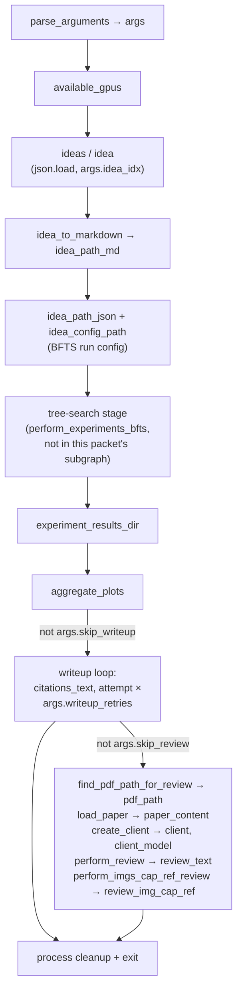

# launch_scientist_bfts.py — the end-to-end pipeline entry point

<!-- connect:up:begin -->
> **Cross-repo concept:** part of [end-to-end-discovery-pipeline](../../../concepts/end-to-end-discovery-pipeline.md) across this wiki's repos.
<!-- connect:up:end -->
## Overview
`launch_scientist_bfts.py` is the single script an operator (or a batch-launcher spawning many parallel
processes) runs to take **one pre-generated idea** all the way to a **reviewed PDF**: it parses CLI flags,
materializes the idea into the tree-search agent's task description, hands off to the best-first
tree-search (BFTS) experiment stage as an opaque subprocess-like call, aggregates the resulting plots,
drives a bounded-retry writeup stage, and finally runs an LLM+VLM review pass over the produced paper — all
in one linear, top-to-bottom `if __name__ == "__main__":` block with no branching back. It is the literal
runtime realization of "idea in, reviewed paper out": every other module in this repo (ideation, the
tree-search agent, the writeup/citation machinery, the reviewers) is a stage this script calls in sequence
and waits on.

## Diagram

## Design rationale (why it's built this way)
- **One idea, one process, one directory.** The script never loops over ideas — it always indexes a single
  entry out of the loaded [`ideas`](../catalog/launch_scientist_bfts.md#ideas) list via `args.idea_idx`, and
  every artifact for the run lands under a single timestamped
  [`idea_dir`](../catalog/launch_scientist_bfts.md#idea_dir). The CLI's own `--attempt_id` help text (read
  from [`args`](../catalog/launch_scientist_bfts.md#args), produced by
  [`parse_arguments`](../catalog/launch_scientist_bfts.md#parse_arguments)) is explicit that this exists "to
  distinguish same idea in different attempts in parallel runs" — parallelism across ideas/attempts is
  achieved by an external launcher starting many OS processes of this same script with different
  `--idea_idx`/`--attempt_id`, not by any concurrency inside the script itself.
- **The tree-search stage is invoked, not inlined.** Everything about *how* the BFTS agent explores the
  experiment tree lives behind a config path: the script builds
  [`idea_config_path`](../catalog/launch_scientist_bfts.md#idea_config_path) and passes it to a single
  opaque call. That call (`perform_experiments_bfts`, in
  `ai_scientist/treesearch/perform_experiments_bfts_with_agentmanager.py`) is outside this packet's
  subgraph, so it is not cited here — see Open questions.
  > [!inferred]
  > Reading that module directly (not part of this packet) shows `perform_experiments_bfts` loads the copied
  > config, builds an `AgentManager`, and drives it through the run; `AgentManager` in turn constructs a
  > `ParallelAgent` per stage. That is the "agentic tree-search" machinery the paper describes, but it is a
  > separate subsystem this script only launches and waits on — the launcher's own mechanism is orchestration,
  > not search.
- **The review call is intentionally run at its cheapest setting.** [`perform_review`](../catalog/ai_scientist/perform_llm_review.md#perform_review)
  supports an ensemble of multiple reviewer samples reconciled by
  [`get_meta_review`](../catalog/ai_scientist/perform_llm_review.md#get_meta_review), and a multi-round
  self-reflection loop — but `launch_scientist_bfts.py` calls it as
  [`review_text`](../catalog/launch_scientist_bfts.md#review_text) `= perform_review(paper_content,
  client_model, client)` with every optional argument left at its default
  (`num_reviews_ensemble=1`, `num_reflections=1`). Concretely that means the ensembling branch
  (`num_reviews_ensemble > 1`) and the reflection loop (`range(num_reflections - 1)` is empty when
  `num_reflections=1`) never execute for this call site: the script gets one single-shot LLM review, not the
  heavier ensemble+reflection review the function is capable of.
- **The default reviewer persona is deliberately skeptical.** `perform_review`'s default
  `reviewer_system_prompt` is [`reviewer_system_prompt_neg`](../catalog/ai_scientist/perform_llm_review.md#reviewer_system_prompt_neg),
  whose text (read from source) appends *"If a paper is bad or you are unsure, give it bad scores and
  reject it."* to the base reviewer persona — a harsher instruction than the sibling
  `reviewer_system_prompt_pos`/`reviewer_system_prompt_base` variants defined in the same module. Since
  `launch_scientist_bfts.py` never overrides `reviewer_system_prompt`, every paper this pipeline produces is
  graded, by design, with a bias toward rejection under uncertainty — a guard against the pipeline
  rubber-stamping its own output.
- **Writeup gets bounded retries; review does not.** The writeup stage loops up to `args.writeup_retries`
  times ([`attempt`](../catalog/launch_scientist_bfts.md#attempt) `in range(args.writeup_retries)`), breaking
  early on success, because LaTeX/compile failures are common and cheap to retry. The review stage that
  follows has no such retry: it runs [`perform_review`](../catalog/ai_scientist/perform_llm_review.md#perform_review)
  and [`perform_imgs_cap_ref_review`](../catalog/ai_scientist/perform_vlm_review.md#perform_imgs_cap_ref_review)
  exactly once each.

## Entry points
- [`parse_arguments`](../catalog/launch_scientist_bfts.md#parse_arguments) — the script's only CLI surface,
  called first inside `if __name__ == "__main__":`. Every downstream branch (writeup type, which models to
  use, whether to skip writeup/review, how many writeup retries) is gated by the
  [`args`](../catalog/launch_scientist_bfts.md#args) namespace it returns.
- [`ideas`](../catalog/launch_scientist_bfts.md#ideas) / [`idea`](../catalog/launch_scientist_bfts.md#idea) —
  control reaches the rest of the pipeline only after the idea JSON named by `args.load_ideas` is loaded and
  indexed by `args.idea_idx`; everything from here on operates on this one idea dict.
- [`idea_config_path`](../catalog/launch_scientist_bfts.md#idea_config_path) — the hand-off point into the
  tree-search subsystem: once the per-run BFTS config is written, control passes to the (uncited,
  out-of-subgraph) tree-search stage and the script blocks until it returns.
- [`citations_text`](../catalog/launch_scientist_bfts.md#citations_text) /
  [`attempt`](../catalog/launch_scientist_bfts.md#attempt) — reached only if `args.skip_writeup` is false;
  this is where control enters the bounded writeup-retry loop.
- [`client_model`](../catalog/launch_scientist_bfts.md#client_model) /
  [`pdf_path`](../catalog/launch_scientist_bfts.md#pdf_path) — reached only if both `args.skip_review` and
  `args.skip_writeup` are false; this is where control enters the final LLM/VLM review stage.

## Mechanism (step-by-step)
1. **Parse arguments and probe hardware.** [`parse_arguments`](../catalog/launch_scientist_bfts.md#parse_arguments)
   builds an `argparse.Namespace` covering everything the rest of the run needs: which ideas file to load,
   which idea index, the writeup format (`normal` 8-page vs. `icbinb` 4-page), model choices for plot
   aggregation/writeup/citations/review, and `skip_writeup`/`skip_review` escape hatches. Immediately after,
   [`available_gpus`](../catalog/launch_scientist_bfts.md#available_gpus) is computed and printed — a
   readiness check before any expensive work starts.
2. **Load and select the idea, then materialize it.** The idea file is read into
   [`ideas`](../catalog/launch_scientist_bfts.md#ideas) and indexed into
   [`idea`](../catalog/launch_scientist_bfts.md#idea) via `args.idea_idx`. A fresh, timestamped
   [`idea_dir`](../catalog/launch_scientist_bfts.md#idea_dir) is created (`experiments/<date>_<Name>_attempt_<id>`),
   and [`idea_to_markdown`](../catalog/ai_scientist/treesearch/bfts_utils.md#idea_to_markdown) — whose own
   docstring says it "Convert[s] a dictionary into a markdown file" — renders the idea dict into
   `idea_path_md` for the agent to read. If `--load_code` is set, [`code_path`](../catalog/launch_scientist_bfts.md#code_path)
   points at a same-named `.py` file next to the ideas JSON and its contents become
   [`code`](../catalog/launch_scientist_bfts.md#code); if `--add_dataset_ref` is set, a hardcoded
   `hf_dataset_reference.py` becomes [`dataset_ref_code`](../catalog/launch_scientist_bfts.md#dataset_ref_code).
   Both are concatenated into [`added_code`](../catalog/launch_scientist_bfts.md#added_code) and, if present,
   stitched into the idea dict as `"Code"` before it is persisted to
   [`idea_path_json`](../catalog/launch_scientist_bfts.md#idea_path_json) — this is the artifact the agent's
   BFTS config will point at.
3. **Build the run config and hand off to the tree-search stage.** [`idea_config_path`](../catalog/launch_scientist_bfts.md#idea_config_path)
   is produced by copying `bfts_config.yaml` and rewriting its `desc_file`/`workspace_dir`/`data_dir`/`log_dir`
   to point at this run's `idea_dir` (this rewrite itself is outside the subgraph — see Open questions). The
   script then calls the tree-search stage with that path and blocks until it returns; this is the "agentic
   experiment loop" described elsewhere in this wiki, but from this script's point of view it is a single
   synchronous call with no return value inspected beyond side effects on disk.
4. **Collect results and aggregate plots.** After the tree search returns, the script checks whether
   [`experiment_results_dir`](../catalog/launch_scientist_bfts.md#experiment_results_dir)
   (`idea_dir/logs/0-run/experiment_results`) exists and, if so, copies it up to `idea_dir/experiment_results`.
   `aggregate_plots` (uncited — not in this packet's subgraph) is then run against `idea_dir` using
   `args.model_agg_plots`, after which the copied `experiment_results` directory is deleted again — it exists
   only transiently so the plot-aggregation step can see it at a stable, predictable path. Token usage is
   checkpointed to disk at this point (and again after writeup) via `save_token_tracker`, also uncited.
5. **Bounded-retry writeup.** Gated on `not args.skip_writeup`, citations are gathered once into
   [`citations_text`](../catalog/launch_scientist_bfts.md#citations_text) (`gather_citations`, uncited), then
   the script loops [`attempt`](../catalog/launch_scientist_bfts.md#attempt) `in range(args.writeup_retries)`,
   calling one of two uncited writeup functions selected by `args.writeup_type` (`perform_writeup` for the
   8-page "normal" form, `perform_icbinb_writeup` for the 4-page "I Can't Believe It's Not Better" form), and
   breaks on the first success. If every attempt fails, the script logs the failure and continues rather than
   aborting — the pipeline is designed to still attempt a review even without a paper it could reliably
   produce.
6. **Locate and load the produced paper.** Gated on `not args.skip_review and not args.skip_writeup`,
   [`find_pdf_path_for_review`](../catalog/launch_scientist_bfts.md#find_pdf_path_for_review) picks which PDF
   in `idea_dir` to review: among files whose name contains `"reflection"`, it prefers one whose name also
   contains `"final"`, otherwise the highest-numbered `reflection_<N>` file, otherwise the first reflection
   PDF found. The result becomes [`pdf_path`](../catalog/launch_scientist_bfts.md#pdf_path); if it exists,
   [`load_paper`](../catalog/ai_scientist/perform_llm_review.md#load_paper) extracts its text (falling back
   through `pymupdf4llm` → `pymupdf` → `pypdf` if a stage produces too little text) into
   [`paper_content`](../catalog/launch_scientist_bfts.md#paper_content), and
   [`create_client`](../catalog/ai_scientist/llm.md#create_client) resolves `args.model_review` to a concrete
   API client, giving [`client`](../catalog/launch_scientist_bfts.md#client) and
   [`client_model`](../catalog/launch_scientist_bfts.md#client_model).
7. **Run the text review.** [`review_text`](../catalog/launch_scientist_bfts.md#review_text) `=`
   [`perform_review`](../catalog/ai_scientist/perform_llm_review.md#perform_review)`(paper_content,
   client_model, client)` — called with defaults, so it takes the single-shot path: one few-shot example from
   [`get_review_fewshot_examples`](../catalog/ai_scientist/perform_llm_review.md#get_review_fewshot_examples)
   is prepended to the [`neurips_form`](../catalog/ai_scientist/perform_llm_review.md#neurips_form) rubric,
   one call to [`get_response_from_llm`](../catalog/ai_scientist/llm.md#get_response_from_llm) (itself backed
   by [`make_llm_call`](../catalog/ai_scientist/llm.md#make_llm_call) and bounded by
   [`MAX_NUM_TOKENS`](../catalog/ai_scientist/llm.md#MAX_NUM_TOKENS)) produces the raw text, and
   [`extract_json_between_markers`](../catalog/ai_scientist/llm.md#extract_json_between_markers) pulls the
   structured review (Originality/Quality/Clarity/.../Decision fields) out of it under the
   [`reviewer_system_prompt_neg`](../catalog/ai_scientist/perform_llm_review.md#reviewer_system_prompt_neg)
   persona.
8. **Run the figure-caption cross-check.** [`review_img_cap_ref`](../catalog/launch_scientist_bfts.md#review_img_cap_ref)
   `=` [`perform_imgs_cap_ref_review`](../catalog/ai_scientist/perform_vlm_review.md#perform_imgs_cap_ref_review)`(client,
   client_model, pdf_path)` — this independently reloads the paper via
   [`load_paper`](../catalog/ai_scientist/perform_llm_review.md#load_paper), pulls out an abstract with
   [`extract_abstract`](../catalog/ai_scientist/perform_vlm_review.md#extract_abstract), and finds
   figure/caption image pairs with [`extract_figure_screenshots`](../catalog/ai_scientist/perform_vlm_review.md#extract_figure_screenshots)
   (using its nested [`is_subfigure_caption`](../catalog/ai_scientist/perform_vlm_review.md#extract_figure_screenshots.is_subfigure_caption)
   helper to avoid matching sub-panel labels like `(a)`). For each figure,
   [`generate_vlm_img_cap_ref_review`](../catalog/ai_scientist/perform_vlm_review.md#generate_vlm_img_cap_ref_review)
   formats [`img_cap_ref_review_prompt`](../catalog/ai_scientist/perform_vlm_review.md#img_cap_ref_review_prompt)
   with the abstract and caption, calls [`get_response_from_vlm`](../catalog/ai_scientist/vlm.md#get_response_from_vlm)
   (base64-encoding each image via [`encode_image_to_base64`](../catalog/ai_scientist/vlm.md#encode_image_to_base64)
   and dispatching through [`make_vlm_call`](../catalog/ai_scientist/vlm.md#make_vlm_call), checking the model
   against [`AVAILABLE_VLMS`](../catalog/ai_scientist/vlm.md#AVAILABLE_VLMS)), and parses the result with the
   `ai_scientist.vlm` copy of [`extract_json_between_markers`](../catalog/ai_scientist/vlm.md#extract_json_between_markers).
   Both review artifacts are then written to `idea_dir` as `review_text.txt` and `review_img_cap_ref.json`.

## Key data structures
- **`args` (`argparse.Namespace`)** — the single source of configuration truth for the whole run; every
  stage below reads from it directly rather than being passed an explicit config object.
- **`idea` / the idea dict** — loaded once from the ideas JSON, optionally mutated in place (a `"Code"` key
  added) before being persisted to `idea_path_json`; this is the payload the tree-search agent, the writeup
  stage, and (transitively) the review stage all operate on.
- **`idea_dir`** — the one directory (`experiments/<date>_<Name>_attempt_<attempt_id>`) that every artifact
  from every stage — idea markdown, BFTS config, experiment results, plots, LaTeX/PDF, token-tracker
  snapshots, review text and image-caption review JSON — is written under.
- **`review_text` / `review_img_cap_ref`** — the two independent review artifacts (structured-JSON text
  review vs. per-figure caption/reference VLM review) persisted as the pipeline's final output alongside the
  paper itself.

## Dynamics (design intent)
There is no concurrency inside this script: it is a strictly sequential list of blocking calls, each of
which must return before the next begins (tree search, then plot aggregation, then the writeup retry loop,
then the two review calls). The only "loop" is the writeup retry (`attempt` in
`range(args.writeup_retries)`), which is a bounded early-exit-on-success retry, not an experiment loop.
Parallelism across ideas or attempts is achieved externally — an operator or batch launcher starts multiple
OS processes of this same script, distinguished from each other by `--idea_idx`/`--attempt_id` (per the
`args`-carried CLI help text) — not by anything this file does internally.

## Edge cases
- **`find_pdf_path_for_review` can raise `UnboundLocalError`.** [`find_pdf_path_for_review`](../catalog/launch_scientist_bfts.md#find_pdf_path_for_review)
  only assigns its local `pdf_path` inside the `if reflection_pdfs:` branch, then unconditionally
  `return`s it. If `idea_dir` contains PDFs but none of their filenames contain `"reflection"`,
  `reflection_pdfs` is empty and the function returns an unassigned name, raising `UnboundLocalError` rather
  than a clean "no PDF found" signal.
- **Silent fallbacks on missing optional files.** If `--load_code` is set but the derived
  [`code_path`](../catalog/launch_scientist_bfts.md#code_path) doesn't exist, or if `--add_dataset_ref` is
  set but `hf_dataset_reference.py` isn't present in the working directory, the script only prints a warning
  and leaves [`code`](../catalog/launch_scientist_bfts.md#code)/[`dataset_ref_code`](../catalog/launch_scientist_bfts.md#dataset_ref_code)
  as `None` — the run proceeds without the extra context rather than failing.
- **Writeup failure doesn't stop the review stage from being attempted.** If all `args.writeup_retries`
  writeup attempts fail, the script only prints a message; it still falls through to the review-stage gate
  below, which will then fail its own `os.path.exists(pdf_path)` check (or hit the `find_pdf_path_for_review`
  issue above) rather than being skipped explicitly for this reason.
  > [!inferred]
  > The final cleanup block (killing psutil-enumerated child processes, then sweeping *all* processes whose
  > command line contains substrings like `"python"`, `"torch"`, `"mp"`, `"bfts"`, or `"experiment"`) has no
  > symbol in this packet's subgraph, so it isn't cited above, but it is visible directly in the script's
  > source: it is a very broad kill-by-keyword sweep that could terminate unrelated processes on a
  > multi-tenant machine, not just this run's own children.

## Open questions
- `perform_experiments_bfts`, `edit_bfts_config_file`, `aggregate_plots`, `save_token_tracker`,
  `gather_citations`, `perform_writeup`, and `perform_icbinb_writeup` are called directly by this script but
  are not in this packet's Subgraph, so their internals aren't cited here — they are covered (or should be)
  by their own concept pages once those modules are ingested.
- Whether `AgentManager`/`ParallelAgent` (confirmed by reading `ai_scientist/treesearch/perform_experiments_bfts_with_agentmanager.py`
  and `ai_scientist/treesearch/agent_manager.py` outside this packet) constitute the full tree-search
  mechanism, or whether there is additional orchestration this script's config alone doesn't reveal, is
  better answered by whatever concept page covers `agent_manager.py`/`parallel_agent.py` directly.

## See also
- The tree-search internals this script hands off to (`ai_scientist/treesearch/agent_manager.py`,
  `ai_scientist/treesearch/parallel_agent.py`) are out of this packet's subgraph; look for their own concept
  pages under this repo's `concepts/` directory once ingested.
- [end-to-end discovery pipeline (paper-side concept)](../../../concepts/end-to-end-discovery-pipeline.md)
