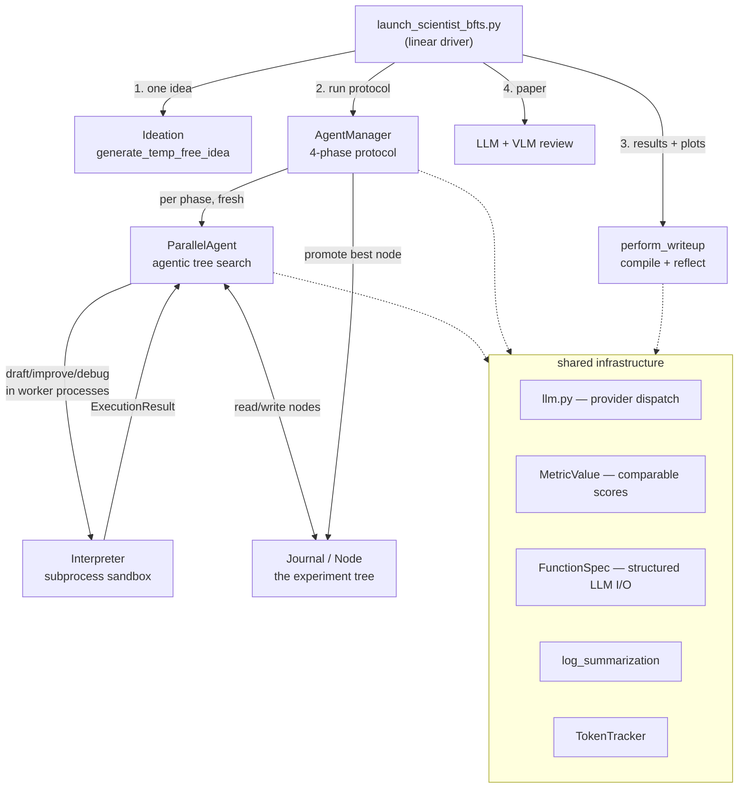
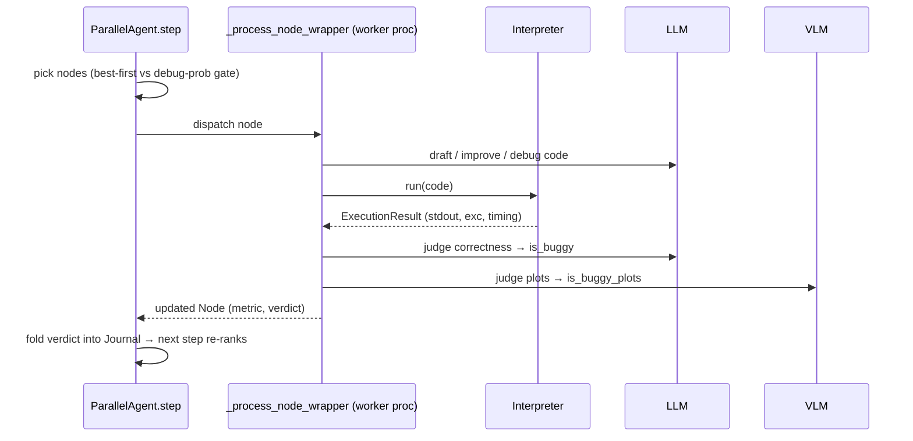

# ai-scientist-v2 — what it is and how it fits together

> Grounded code wiki for [SakanaAI/AI-Scientist-v2](https://github.com/SakanaAI/AI-Scientist-v2), pinned @ `96bd516`.
> This is the *implementation* companion to the paper summary in
> [`../../sources/ai-scientist-v2.md`](../../sources/ai-scientist-v2.md) and the paper-side concept pages
> [`agentic-tree-search`](../../concepts/agentic-tree-search.md) and
> [`end-to-end-discovery-pipeline`](../../concepts/end-to-end-discovery-pipeline.md). Read those for *what the
> system claims and why it matters*; read this for *how the code actually does it*.

## In one paragraph
AI-Scientist-v2 is Sakana AI's fully-autonomous empirical-ML research pipeline: it takes a research topic and
produces a compiled, reviewed workshop paper with no human in the content-generation loop. The runtime spine is
one linear script, [`launch_scientist_bfts.py`](concepts/launch_scientist_bfts.md), that chains four stages —
**ideate → tree-search experiments → write up → review** — each stage an LLM-driven module the script calls and
blocks on. The load-bearing idea is **agentic tree search**: instead of v1's linear chain of edits, experimentation
is a *tree* of full experiment attempts (each a [`Node`](concepts/ai_scientist-treesearch-journal.md)), expanded in
parallel worker processes, where "did this experiment succeed" is judged not by exit code but by an **LLM verdict on
the results and an independent VLM verdict on the plots**. A meta-controller,
[`AgentManager`](concepts/ai_scientist-treesearch-agent_manager.md), wraps that raw search in a fixed four-phase
research protocol (initial implementation → hyperparameter tuning → research → ablations), promoting the single best
node from each phase to seed the next. Everything else — a provider-agnostic [LLM wrapper](concepts/ai_scientist-llm.md),
a subprocess [interpreter](concepts/ai_scientist-treesearch-interpreter.md), a direction-aware
[metric comparator](concepts/ai_scientist-treesearch-utils-metric.md), [log summarization](concepts/ai_scientist-treesearch-log_summarization.md),
and a compile-and-measure [manuscript writeup](concepts/ai_scientist-perform_icbinb_writeup.md) — is infrastructure
in service of that loop.

## Core architecture

The tree-search step end-to-end (the innermost loop):

## Main concepts

### Agentic tree search (the engine)
[`ParallelAgent`](concepts/ai_scientist-treesearch-parallel_agent.md) is the mechanism the paper names "agentic tree
search." Each `step()` picks up to `num_workers` nodes to expand — with a fixed probability it expands a buggy node
(debugging), otherwise it runs a best-first search over non-buggy nodes ranked by an LLM judge — ships each to an
isolated worker process that drafts/improves/debugs a script, executes it for real, and has an LLM judge correctness
and a VLM independently judge the plots. A clean exit is *not* success: a script that runs but produces empty or
misleading plots is marked buggy. See [`ParallelAgent`](concepts/ai_scientist-treesearch-parallel_agent.md).

### The four-phase protocol (the meta-controller)
[`AgentManager`](concepts/ai_scientist-treesearch-agent_manager.md) turns one open-ended search into a fixed research
protocol: initial implementation → hyperparameter tuning → research agenda → ablations. Each phase gets a *fresh*
`ParallelAgent`; the manager decides when a phase is done (a stage-number-branched completion check), promotes the
single best node forward, and generates the next phase's LLM-authored goal. Notably there is no state-machine enum —
stage identity is a string naming convention. See [`AgentManager`](concepts/ai_scientist-treesearch-agent_manager.md).

### The experiment tree data model
[`Node` and `Journal`](concepts/ai_scientist-treesearch-journal.md) are the shared state both the search and the
manager read and write. A `Node` is one experiment attempt (code, plan, execution result, metric, buggy/non-buggy
status, VLM feedback); a `Journal` is a flat node list — the tree topology lives in each node's own `parent`/`children`
back-references, and nodes cross the worker-process boundary flattened via `to_dict`/`from_dict`. See
[`Journal & Node`](concepts/ai_scientist-treesearch-journal.md).

### Ideation — the front door
[`generate_temp_free_idea`](concepts/ai_scientist-perform_ideation_temp_free.md) drives a hand-rolled ReAct loop:
draft a grant-proposal-shaped idea, optionally query Semantic Scholar for prior art (a novelty check the model calls
on its own initiative), reflect, repeat — until the model finalizes an idea or the reflection budget runs out. There
is no separate scoring model. This is an instance of [`hypothesis-generation`](../../concepts/hypothesis-generation.md).
See [ideation](concepts/ai_scientist-perform_ideation_temp_free.md).

### Manuscript writeup — the compiler as oracle
[`perform_writeup`](concepts/ai_scientist-perform_icbinb_writeup.md) drafts the whole LaTeX manuscript in one call to
a reasoning model (o1), then runs a reflection loop that **compiles the actual PDF each round** and measures it
(page/line counts, duplicate/unused figures), feeding the measurement back as a correction prompt — treating
`pdflatex` as the page-limit oracle rather than the model's own token counting. See
[writeup](concepts/ai_scientist-perform_icbinb_writeup.md).

### Code execution sandbox
[`Interpreter`](concepts/ai_scientist-treesearch-interpreter.md) runs each LLM-written draft in a dedicated child
process (three-queue IPC, escalating SIGINT→kill timeout), returning an `ExecutionResult`. The process boundary — not
code-level sandboxing — is what lets a divergent or hanging script be killed without corrupting the search driver.
See [interpreter](concepts/ai_scientist-treesearch-interpreter.md).

### Comparable scores across heterogeneous metrics
[`MetricValue`](concepts/ai_scientist-treesearch-utils-metric.md) wraps whatever the LLM-generated code reports
(accuracy, loss, F1, multi-dataset dicts), remembers or infers the "better" direction, and exposes ordinary Python
comparison operators (via `total_ordering`) so the search can `max(nodes, key=...)`; a `WorstMetricValue` sentinel
makes buggy nodes always lose. See [metric](concepts/ai_scientist-treesearch-utils-metric.md).

### Shared LLM/VLM infrastructure
A single call surface — [`get_response_from_llm`](concepts/ai_scientist-llm.md) with string-based provider dispatch
(Anthropic/OpenAI/Bedrock/Vertex/Ollama), backoff retries — is used by every stage; structured answers use
[`FunctionSpec`](concepts/ai_scientist-treesearch-backend-utils.md) (JSON-schema-forced function calls);
[`log_summarization`](concepts/ai_scientist-treesearch-log_summarization.md) rolls per-node judgments up into a
per-run narrative small enough to feed the writeup; [`TokenTracker`](concepts/ai_scientist-utils-token_tracker.md) is
a global that accounts token usage across the many calls a run makes; and
[the tree-search config](concepts/ai_scientist-treesearch-utils-config.md) is a typed dataclass schema over the real
`bfts_config.yaml` knobs.

### Bundled example seed ideas
The repo ships example "seed idea" scripts under `ai_scientist/ideas/` — an image-classification training script for
the ICBINB workshop topic ([standard-benchmark variant](concepts/ai_scientist-ideas-i_cant_believe_its_not_better.md)
and a [real-world/medical-imaging variant](concepts/ai_scientist-ideas-i_cant_believe_its_not_betterrealworld.md)).
These are demo starting points, not framework infrastructure — useful for seeing what a Stage-1 starter looks like.

## How a run flows
`launch_scientist_bfts.py` → materialize one idea (from [ideation](concepts/ai_scientist-perform_ideation_temp_free.md))
into the tree-search task description → [`AgentManager.run`](concepts/ai_scientist-treesearch-agent_manager.md) drives
the four phases, each delegating to [`ParallelAgent`](concepts/ai_scientist-treesearch-parallel_agent.md) whose workers
execute drafts via the [`Interpreter`](concepts/ai_scientist-treesearch-interpreter.md) and score them into the
[`Journal`](concepts/ai_scientist-treesearch-journal.md) → best nodes' plots are aggregated →
[`perform_writeup`](concepts/ai_scientist-perform_icbinb_writeup.md) compiles the paper → an LLM+VLM review pass runs
→ the driver kills child processes and exits.

## Map of the wiki
- *"How does the tree search actually pick and expand experiments?"* →
  [`ParallelAgent`](concepts/ai_scientist-treesearch-parallel_agent.md).
- *"What are the four stages and how does one end?"* → [`AgentManager`](concepts/ai_scientist-treesearch-agent_manager.md).
- *"What is a node / how is the tree stored?"* → [`Journal & Node`](concepts/ai_scientist-treesearch-journal.md).
- *"Where do ideas come from?"* → [ideation](concepts/ai_scientist-perform_ideation_temp_free.md).
- *"How is the paper written and kept under the page limit?"* → [writeup](concepts/ai_scientist-perform_icbinb_writeup.md).
- *"How is generated code run safely?"* → [interpreter](concepts/ai_scientist-treesearch-interpreter.md).
- *"How are different metrics compared?"* → [metric](concepts/ai_scientist-treesearch-utils-metric.md).
- *"Which model/provider is called, and how?"* → [llm](concepts/ai_scientist-llm.md) ·
  structured I/O: [backend-utils](concepts/ai_scientist-treesearch-backend-utils.md).
- *"What are the run knobs (Table 3)?"* → [config](concepts/ai_scientist-treesearch-utils-config.md).
- *Exhaustive per-module symbol index* → [`catalog/`](catalog/) (generated) · concept table → [`index.md`](index.md).

## See also
- Paper summary: [`../../sources/ai-scientist-v2.md`](../../sources/ai-scientist-v2.md)
- Paper-side concepts: [`agentic-tree-search`](../../concepts/agentic-tree-search.md) ·
  [`end-to-end-discovery-pipeline`](../../concepts/end-to-end-discovery-pipeline.md)
- Contrast — the frozen-metric ratchet: [`autoresearch`](../autoresearch/overview.md) and
  [`../../topics/autoresearch.md`](../../topics/autoresearch.md).
