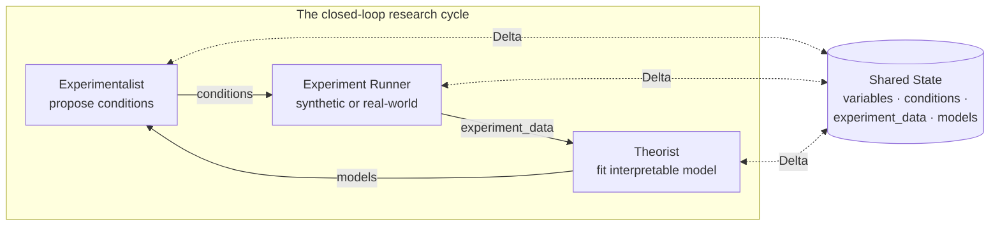
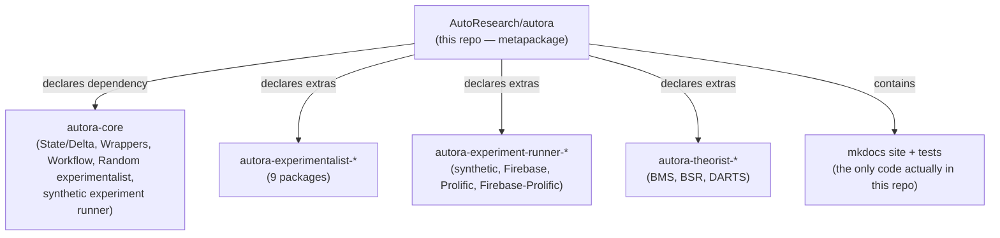

# autora — what it is and how it fits together

## In one paragraph
AutoRA (**Auto**mated **R**esearch **A**ssistant) automates the closed loop of empirical science:
an **experimentalist** proposes the next experimental condition worth running, an **experiment
runner** executes it — against a synthetic ground-truth model or against a real human participant on
Prolific/Mechanical Turk — and a **theorist** fits an interpretable model to all data collected so far,
whose predictions feed back into the next experimentalist call. `AutoResearch/autora` itself is a
**namespace metapackage**: it ships almost no implementation of its own. It is a `pyproject.toml` that
pins together roughly twenty separately-published, separately-hosted sibling packages
(`autora-core`, `autora-experimentalist-*`, `autora-theorist-*`, `autora-experiment-runner-*`, …) behind
one `pip install autora`, plus the project's documentation site and one integration test. This makes it
the scope-broadening silo in this wiki: a genuine closed loop, but over *physical/behavioral*
experiments rather than the in-silico training runs, code edits, or simulated benchmarks the other
ingested repos iterate on.

## Why this silo has no concept pages
`wikify prepare autora` indexed the repo, found **16 symbols across 3 modules**, and derived an agenda
of **0 concepts** — correctly: every symbol in this repo is either an `mkdocs` documentation-site
generation helper (`mkdocs/generate_code_reference.py`, `mkdocs/hooks.py`) or the repo's single test,
[`test_core_imports`](catalog/tests/test_core_imports.md#test_core_imports). None of it implements the
experimentalist/experiment-runner/theorist cycle described below — that logic lives entirely in the
sibling packages, each in its own GitHub repo, none of which is vendored or submoduled here. So this
silo has **zero `concepts/` pages** (there is nothing centrality-worthy to ground a mechanism page in)
and its entire synthesis is five [doc-concepts](#map-of-the-wiki) pages extracted from the project's own
README and documentation, describing the architecture the metapackage's dependency graph *declares*
rather than code it *contains*. The one real piece of grounding this repo offers —
[`test_core_imports`](catalog/tests/test_core_imports.md#test_core_imports) — is still useful: it is the
executable definition of which sub-namespaces ship by default (`autora.experiment_runner.synthetic`,
`autora.experimentalist`, `autora.utils`, `autora.variable`, `autora.workflow`), i.e. enough to run the
loop against a synthetic (in-silico) experiment out of the box, while every named theorist
(BMS/BSR/DARTS), every non-default experimentalist, and every real-world (human-in-the-loop) experiment
runner is an opt-in extra declared in `pyproject.toml` but implemented in a different repo entirely.

## Core architecture

Every arrow into/out of the shared `State` is a **Delta** — an immutable, functional update, never an
in-place mutation (see [state-and-delta-data-model](doc-concepts/state-and-delta-data-model.md)). The
three roles never call each other directly; they only agree on the shape of this one object, which is
what lets any package in one role family be swapped for any other without touching the rest of the loop.

## Main concepts
- **The closed-loop research cycle** — the experimentalist → experiment-runner → theorist alternation
  itself, and why it is a *physical/behavioral* loop rather than an in-silico one.
  See [closed-loop-research-cycle](doc-concepts/closed-loop-research-cycle.md).
- **The State/Delta data model** — the immutable, functionally-updated object (`variables`,
  `conditions`, `experiment_data`, `models`) all three roles read and write, which is what makes them
  independently pluggable. See [state-and-delta-data-model](doc-concepts/state-and-delta-data-model.md).
- **The experimentalist family** — ten pluggable condition-selection strategies (Random, Novelty,
  Uncertainty, Model Disagreement, Falsification, Mixture, Nearest Value, Leverage, Inequality,
  Bandit Random), each its own package.
  See [experimentalist-component-family](doc-concepts/experimentalist-component-family.md).
- **The experiment-runner family** — the synthetic/real-world split, and the
  experimentation-manager + recruitment-manager composition (Firebase + Prolific) that runs an actual
  human-behavioral experiment. See
  [experiment-runner-component-family](doc-concepts/experiment-runner-component-family.md).
- **The theorist family** — BMS, BSR (symbolic regression) and DARTS (gradient-based neural
  architecture search repurposed as model discovery).
  See [theorist-component-family](doc-concepts/theorist-component-family.md).
- **The metapackage boundary** — what actually ships in `AutoResearch/autora` vs. what is declared as a
  dependency but implemented elsewhere (this section, above).

## How a request flows
One iteration, per the README's worked `sin(x)` discovery example: `s = experimentalist(s,
num_samples=10, ...)` picks new conditions and writes them to `state.conditions` → `s =
experiment_runner(s, ...)` executes those conditions (synthetically, or via a real participant) and
writes observations to `state.experiment_data` → `s = theorist(s)` fits a model to all
`experiment_data` so far and writes it to `state.models`, which the *next* `experimentalist(s, ...)`
call reads to decide what to try next. Repeat until a budget (cycles, participants, or compute) is
exhausted.

## Map of the wiki
| Question | Read |
|---|---|
| What is the overall loop and why is it "closed-loop empirical" science? | [closed-loop-research-cycle](doc-concepts/closed-loop-research-cycle.md) |
| How do the three roles share data without depending on each other? | [state-and-delta-data-model](doc-concepts/state-and-delta-data-model.md) |
| What experimentalists exist and what exploration principle does each use? | [experimentalist-component-family](doc-concepts/experimentalist-component-family.md) |
| How does a synthetic run differ from a real human-behavioral run? | [experiment-runner-component-family](doc-concepts/experiment-runner-component-family.md) |
| What model-discovery techniques are available and how do they differ? | [theorist-component-family](doc-concepts/theorist-component-family.md) |
| What code actually lives in *this* repo? | [`catalog/`](catalog/) — 3 modules, 16 symbols, all mkdocs helpers + one test |

The cross-wiki comparison of AutoRA's physical/behavioral closed loop against the other silos' in-silico
loops is written up in [`concepts/closed-loop-experiment-design.md`](../../concepts/closed-loop-experiment-design.md).
