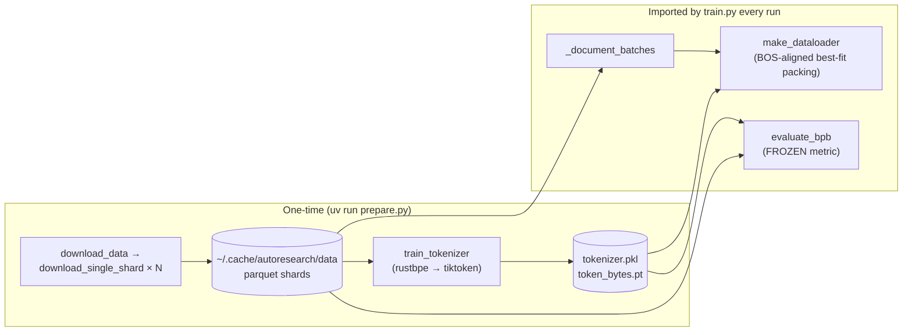

# prepare.py — the frozen substrate (data, tokenizer, ground-truth metric)

## Overview
`prepare.py` is the **read-only half** of the autoresearch harness: the fixed constants, the one-time data
download, the BPE tokenizer training, and — most importantly — the runtime utilities the mutable
`train.py` imports (the dataloader and the evaluation metric). Its whole reason to exist as a separate,
*forbidden-to-edit* file is scientific control. If the agent could touch the data pipeline or the scoring
function, "lower [`val_bpb`](../catalog/train.md#val_bpb)" would stop meaning "a better model" and start
meaning "an easier test." By freezing [`evaluate_bpb`](../catalog/prepare.md#evaluate_bpb), the validation
shard, [`MAX_SEQ_LEN`](../catalog/prepare.md#MAX_SEQ_LEN), and the 5-minute time budget (`TIME_BUDGET`)
here, the harness pins the experimental conditions so that thousands of autonomous experiments remain
comparable to each other and to the baseline.

## Diagram

## Design rationale (why it's built this way)
- **A pinned validation shard.** [`VAL_SHARD`](../catalog/prepare.md#VAL_SHARD) is fixed to the last shard
  ([`MAX_SHARD`](../catalog/prepare.md#MAX_SHARD)) and [`_document_batches`](../catalog/prepare.md#_document_batches)
  excludes it from the training split. Train/val never overlap, and *which* documents are validation never
  drifts between experiments — a prerequisite for comparing runs a week apart.
- **Bits-per-byte instead of loss.** [`evaluate_bpb`](../catalog/prepare.md#evaluate_bpb) converts summed
  per-token cross-entropy (in nats) to bits per *UTF-8 byte* using a precomputed `token_bytes` table
  ([`get_token_bytes`](../catalog/prepare.md#get_token_bytes)). Special tokens (byte length 0) are masked
  out of both the numerator and denominator. This makes the score invariant to vocabulary choices, so an
  agent that swaps the tokenizer or changes [`VOCAB_SIZE`](../catalog/prepare.md#VOCAB_SIZE) is compared on
  equal footing. It is fixed at [`MAX_SEQ_LEN`](../catalog/prepare.md#MAX_SEQ_LEN) and a fixed
  [`EVAL_TOKENS`](../catalog/prepare.md#EVAL_TOKENS) budget so eval cost is constant.
- **100%-utilization packing, no padding.** [`make_dataloader`](../catalog/prepare.md#make_dataloader) uses
  a best-fit bin-packing strategy: every row starts with a BOS token, the largest document that fits the
  remaining space is placed, and when nothing fits the shortest document is cropped to fill exactly. The
  result is zero padding — every token in every batch is a real supervised target, which matters when the
  compute budget is only five minutes.
- **The tokenizer is trained, not shipped.** [`train_tokenizer`](../catalog/prepare.md#train_tokenizer)
  trains a `rustbpe` BPE over a text stream and repackages the merges into a `tiktoken` encoding
  (the `Tokenizer.enc` wrapper) with a GPT-4-style [`SPLIT_PATTERN`](../catalog/prepare.md#SPLIT_PATTERN)
  and reserved [`SPECIAL_TOKENS`](../catalog/prepare.md#SPECIAL_TOKENS). It is a one-time step so the same
  vocabulary underlies every experiment.

## Entry points
- [`download_data`](../catalog/prepare.md#download_data) — CLI entry (via the `__main__`
  [`parser`](../catalog/prepare.md#parser) / [`args`](../catalog/prepare.md#args)); parallel-downloads
  training shards plus the pinned val shard from [`BASE_URL`](../catalog/prepare.md#BASE_URL) into
  [`DATA_DIR`](../catalog/prepare.md#DATA_DIR), each via [`download_single_shard`](../catalog/prepare.md#download_single_shard).
- [`make_dataloader`](../catalog/prepare.md#make_dataloader) and
  [`evaluate_bpb`](../catalog/prepare.md#evaluate_bpb) — the two functions `train.py` imports at runtime;
  the first feeds training, the second produces the score.

## Mechanism (step-by-step)
1. **Download.** [`download_data`](../catalog/prepare.md#download_data) computes the shard id set (train
   ids plus [`VAL_SHARD`](../catalog/prepare.md#VAL_SHARD)), skips shards already on disk, and fetches the
   rest through a process `Pool` of [`download_single_shard`](../catalog/prepare.md#download_single_shard)
   workers. Each worker writes to a `.tmp` path and atomically renames on success, with exponential-backoff
   retries — so an interrupted download never leaves a corrupt shard in [`DATA_DIR`](../catalog/prepare.md#DATA_DIR).
2. **Train the tokenizer.** [`train_tokenizer`](../catalog/prepare.md#train_tokenizer) streams training
   documents through a `rustbpe` trainer to [`VOCAB_SIZE`](../catalog/prepare.md#VOCAB_SIZE) using
   [`SPLIT_PATTERN`](../catalog/prepare.md#SPLIT_PATTERN), builds a `tiktoken` encoding from the merges,
   pickles it, and precomputes the per-token UTF-8 byte-length table used by the metric. It refuses to run
   with fewer than 2 shards (needs ≥1 train + 1 val) via [`list_parquet_files`](../catalog/prepare.md#list_parquet_files).
3. **Serve batches at runtime.** [`_document_batches`](../catalog/prepare.md#_document_batches) is an
   infinite iterator over parquet row groups for the chosen split (excluding
   [`VAL_FILENAME`](../catalog/prepare.md#VAL_FILENAME) for train), incrementing an epoch counter each pass.
   [`make_dataloader`](../catalog/prepare.md#make_dataloader) wraps it: its inner
   [`refill_buffer`](../catalog/prepare.md#make_dataloader.refill_buffer) keeps a buffer of BOS-prepended
   token lists topped up, then best-fit-packs rows, copies through a pinned CPU buffer to a preallocated
   GPU buffer, and yields `(inputs, targets, epoch)`.
4. **Score.** [`evaluate_bpb`](../catalog/prepare.md#evaluate_bpb) runs a fixed number of val steps
   (`EVAL_TOKENS / (batch·seq)`), sums masked per-token nats and target byte counts, and returns
   `nats / (ln2 · bytes)` — the single frozen number [`train.py`](train.md) reports as
   [`val_bpb`](../catalog/train.md#val_bpb).

## Key data structures
- **Constants block** — [`MAX_SEQ_LEN`](../catalog/prepare.md#MAX_SEQ_LEN), `TIME_BUDGET`,
  [`EVAL_TOKENS`](../catalog/prepare.md#EVAL_TOKENS),
  [`VOCAB_SIZE`](../catalog/prepare.md#VOCAB_SIZE): the fixed experimental conditions, all imported (not
  redefined) by `train.py` so the two files can never disagree.
- **`Tokenizer`** — a thin wrapper over the `tiktoken` encoding; its `get_vocab_size` is what `train.py`
  reads to size the embedding tables.
- **Cache layout** — everything lands under [`CACHE_DIR`](../catalog/prepare.md#CACHE_DIR)
  (`~/.cache/autoresearch/`): data in [`DATA_DIR`](../catalog/prepare.md#DATA_DIR), tokenizer artifacts in
  [`TOKENIZER_DIR`](../catalog/prepare.md#TOKENIZER_DIR).

## Dynamics (design intent)
Download is parallel across a process pool but idempotent (existing shards are skipped, temp-file + rename
guarantees atomicity), so re-running `prepare.py` is safe and cheap. The runtime dataloader is an infinite
generator with double-buffering (pinned CPU → non-blocking GPU copy), keeping the GPU fed without the
training loop ever blocking on tokenization.

## Edge cases
- **Too few shards.** [`train_tokenizer`](../catalog/prepare.md#train_tokenizer) exits if fewer than 2
  parquet files exist — you cannot form a train/val split.
- **Document cropping.** When no buffered document fits the remaining row space,
  [`make_dataloader`](../catalog/prepare.md#make_dataloader) crops the shortest one; this is the only place
  a document boundary is broken, chosen to guarantee 100% token utilization.
- **The `num_shards` knob** ([`num_shards`](../catalog/prepare.md#num_shards)) only affects *download*
  breadth for testing; `-1` fetches all up to [`MAX_SHARD`](../catalog/prepare.md#MAX_SHARD). The val shard
  is always pinned regardless.

## Open questions
- None material — this file is small and self-contained; the authority for the exact metric arithmetic is
  [`evaluate_bpb`](../catalog/prepare.md#evaluate_bpb) itself.

## See also
- [train.py — the experiment substrate](train.md)
- [autoresearch overview](../overview.md)
