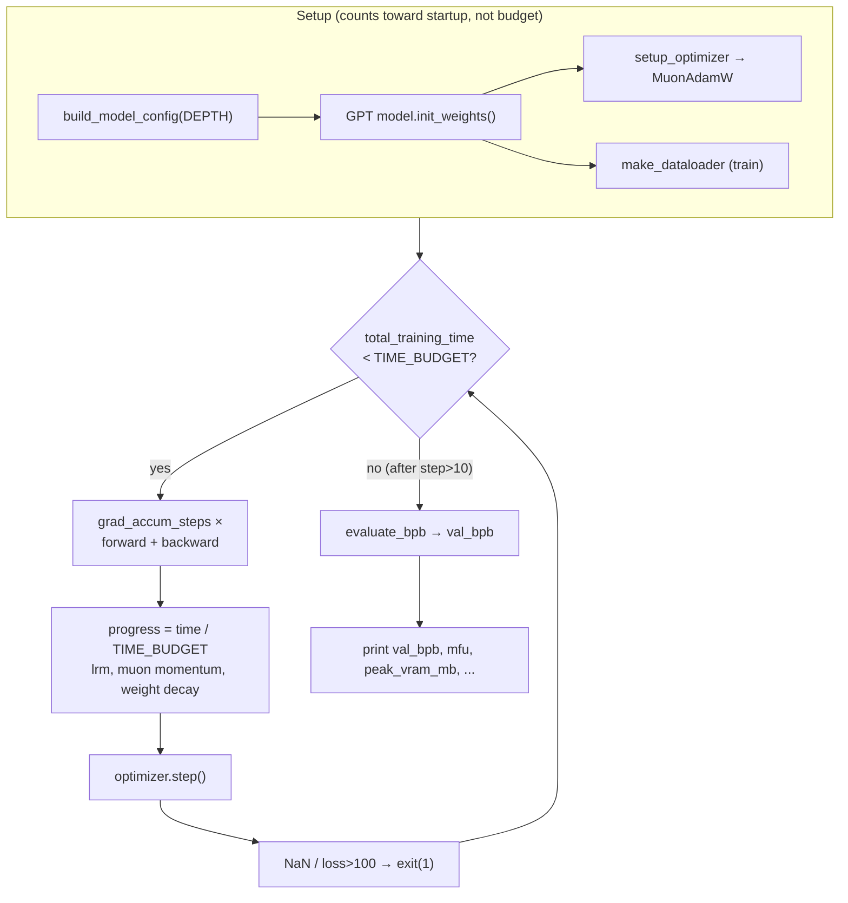

# train.py — the experiment substrate (model, optimizer, fixed-budget loop)

## Overview
`train.py` is the **single file the AI research agent is allowed to edit** — the entire GPT model, the
`MuonAdamW` optimizer, and a wall-clock-bounded training loop packed into one script so every diff is
reviewable and every experiment is self-contained. The design turns model training into a *fair
benchmark*: training always runs for a **fixed 5-minute compute budget** ([`TIME_BUDGET`](../catalog/prepare.md#TIME_BUDGET),
imported from the frozen `prepare.py`), and the only score that matters is validation bits-per-byte
([`val_bpb`](../catalog/train.md#val_bpb)), which the agent cannot influence except by producing a better
model. Because the budget is time, not steps or tokens, *any* change the agent makes — bigger model,
different optimizer, new attention pattern — is automatically priced in terms of the throughput it costs.
That is the whole trick that makes autonomous, overnight architecture search meaningful: the agent
optimizes a single scalar under a fixed clock, and the harness guarantees the comparison is honest.

## Diagram

## Design rationale (why it's built this way)
- **Time budget, not step budget.** The loop accumulates only *steady-state* wall time into
  [`total_training_time`](../catalog/train.md#total_training_time) and stops when it crosses
  [`TIME_BUDGET`](../catalog/prepare.md#TIME_BUDGET). Crucially it *excludes the first 10 steps* (`if step > 10`)
  so `torch.compile` warm-up and one-off allocation don't steal from the budget. This is what lets the
  agent trade model size against speed freely: a change that halves throughput simply gets half as many
  optimizer steps, and `val_bpb` reflects the net effect.
- **`progress` drives the time-sensitive schedules.** The learning-rate multiplier
  ([`get_lr_multiplier`](../catalog/train.md#get_lr_multiplier)) and the weight-decay decay are functions of
  [`progress`](../catalog/train.md#progress) = time / budget, *not* of a step count. Because the number of
  steps is unknown in advance (it depends on the agent's throughput), a step-indexed schedule couldn't
  warm down to zero on time; a time-indexed one always lands its warmdown exactly at the buzzer. (Muon
  momentum is the exception — it warms up over the first ~300 *steps*, since a fixed-length warmup at the
  start is well-defined regardless of total step count.)
- **`val_bpb` is vocab-size-independent by construction.** Bits-per-byte normalizes cross-entropy by the
  UTF-8 byte length of each target token, so an agent that changes `VOCAB_SIZE` or the tokenizer can still
  be compared fairly — a page that a naive per-token loss would reward for simply having a coarser
  vocabulary. The metric lives in the frozen `prepare.py` ([`evaluate_bpb`](../catalog/prepare.md#evaluate_bpb))
  precisely so the agent cannot game it.
- **Fused, compiled optimizer steps with 0-D CPU tensors.** `adamw_step_fused` and `muon_step_fused` are
  `@torch.compile(fullgraph=True)`; hyperparameters are passed as 0-dimensional CPU tensors that are
  `fill_()`-ed each step. This avoids recompilation when the scheduler changes the LR every step — a
  subtle but load-bearing choice, since recompilation mid-run would blow the time budget.

> [!inferred]
> The `polar_express_coeffs` / Newton-Schulz orthogonalization inside `muon_step_fused` and the
> `NorMuon`-style variance reduction are optimizer internals not exported in this packet's subgraph; see
> the source (`train.py:297-353`) for the exact math. They implement Muon's "orthogonalize the momentum
> before the update" idea for 2-D matrix parameters.

## Entry points
- [`build_model_config`](../catalog/train.md#build_model_config) — the first thing the loop needs. Given
  `DEPTH`, it derives model width (`depth * ASPECT_RATIO`, rounded up to a multiple of
  [`HEAD_DIM`](../catalog/train.md#HEAD_DIM)) and head count, then returns a `GPTConfig`. This is the main
  knob the agent turns: nearly every capacity/throughput tradeoff flows from `DEPTH`.
- The module-level setup block builds the model into [`config`](../catalog/train.md#config), counts
  parameters via [`num_scaling_params`](../catalog/train.md#GPT.num_scaling_params), estimates
  per-token FLOPs via [`estimate_flops`](../catalog/train.md#GPT.estimate_flops) (used only for the MFU
  readout), and prefetches the first batch from [`train_loader`](../catalog/train.md#train_loader).

## Mechanism (step-by-step)
1. **Configure and materialize the model.** [`build_model_config`](../catalog/train.md#build_model_config)
   turns the scalar `DEPTH` into a full `GPTConfig`; the model is built on the `meta` device then moved to
   CUDA and initialized by [`init_weights`](../catalog/train.md#GPT.init_weights). Initialization is
   deliberately non-standard: the output head [`transformer`](../catalog/train.md#GPT.transformer) matrices
   `c_proj`/`lm_head` start at (near-)zero so each residual branch begins as an identity, and token
   embeddings are cast to bf16 — decisions that stabilize the very short run where there is no time to
   recover from a bad init.
2. **Attention forward pass.** [`forward`](../catalog/train.md#CausalSelfAttention.forward) projects the
   input through [`c_q`](../catalog/train.md#CausalSelfAttention.c_q),
   [`c_k`](../catalog/train.md#CausalSelfAttention.c_k), [`c_v`](../catalog/train.md#CausalSelfAttention.c_v),
   optionally mixes a **value embedding** through an input-dependent gate
   ([`ve_gate`](../catalog/train.md#CausalSelfAttention.ve_gate), a ResFormer-style value residual present
   only on alternating layers), applies rotary embeddings, QK-norms via [`norm`](../catalog/train.md#norm),
   and calls the FlashAttention-3 kernel [`fa3`](../catalog/train.md#fa3) with a per-layer sliding
   `window_size`. Grouped-query attention is supported via
   [`n_kv_head`](../catalog/train.md#CausalSelfAttention.n_kv_head) ≤ [`n_head`](../catalog/train.md#CausalSelfAttention.n_head),
   with per-head width [`head_dim`](../catalog/train.md#CausalSelfAttention.head_dim).
3. **Gradient accumulation to a fixed token budget.** [`tokens_per_fwdbwd`](../catalog/train.md#tokens_per_fwdbwd)
   = `DEVICE_BATCH_SIZE × MAX_SEQ_LEN`, and [`grad_accum_steps`](../catalog/train.md#grad_accum_steps)
   = [`TOTAL_BATCH_SIZE`](../catalog/train.md#TOTAL_BATCH_SIZE) / that, so the *effective* optimizer batch
   is held at ~524K tokens regardless of how the agent sets the per-device batch. Each optimizer step runs
   that many micro-forwards/backwards, pulling batches from [`train_loader`](../catalog/train.md#train_loader).
4. **Time-indexed schedules, then the optimizer step.** [`progress`](../catalog/train.md#progress) is
   recomputed each iteration; [`get_lr_multiplier`](../catalog/train.md#get_lr_multiplier) produces the LR
   multiplier [`lrm`](../catalog/train.md#lrm) (flat, then linear warmdown to `FINAL_LR_FRAC` over the last
   `WARMDOWN_RATIO` of the budget), Muon momentum and weight decay are updated in place, then
   `optimizer.step()` runs the fused Muon/AdamW update and grads are zeroed.
5. **Fast-fail guard.** [`train_loss_f`](../catalog/train.md#train_loss_f) is checked every step; a NaN or a
   loss above 100 prints `FAIL` and `exit(1)`. In an autonomous loop this is essential — a diverging
   experiment aborts in seconds and is logged as a crash instead of burning the whole budget.
6. **Budget check and final eval.** After `step > 10`, wall time is accumulated into
   [`total_training_time`](../catalog/train.md#total_training_time) and the loop breaks once it reaches
   [`TIME_BUDGET`](../catalog/prepare.md#TIME_BUDGET). Then the model is switched to eval and scored by
   [`evaluate_bpb`](../catalog/prepare.md#evaluate_bpb), yielding [`val_bpb`](../catalog/train.md#val_bpb) —
   the number the agent's keep/discard decision hinges on.

## Key data structures
- **`GPTConfig`** — the full architecture in one dataclass, produced by
  [`build_model_config`](../catalog/train.md#build_model_config) from `DEPTH`. Sliding-window pattern
  (`WINDOW_PATTERN`, e.g. `"SSSL"`) and GQA head counts live here.
- **`MuonAdamW` param groups** — parameters are routed by role: 2-D transformer matrices to Muon, and
  embeddings/unembedding/scalars to AdamW, each with its own LR. LRs are scaled by `1/√(d_model/768)` so a
  width change doesn't require re-tuning by hand.
- **The metric readouts** — [`mfu`](../catalog/train.md#mfu) / [`steady_state_mfu`](../catalog/train.md#steady_state_mfu)
  (utilization), [`peak_vram_mb`](../catalog/train.md#peak_vram_mb) (the soft VRAM constraint the agent
  must respect), [`total_tokens`](../catalog/train.md#total_tokens), and the smoothed training loss
  ([`debiased_smooth_loss`](../catalog/train.md#debiased_smooth_loss), an EMA with bias correction via
  [`ema_beta`](../catalog/train.md#ema_beta)) are printed for the human/agent log but do not affect the
  score.

## Dynamics (design intent)
The loop is single-GPU and synchronous — `torch.cuda.synchronize()` brackets each step so
[`dt`](../catalog/train.md#dt) and thus [`mfu`](../catalog/train.md#mfu) /
[`tok_per_sec`](../catalog/train.md#tok_per_sec) measure real wall time. Python's cyclic GC is frozen and
disabled after step 0 (then run manually every 5000 steps) because a mid-step GC pause of ~500 ms would
corrupt the throughput accounting the whole budget mechanism depends on.

## Edge cases
- **Warmup exclusion.** Nothing before step 11 counts toward the budget or steady-state MFU
  ([`steady_state_mfu`](../catalog/train.md#steady_state_mfu) uses `step - 10`), so `torch.compile`
  latency is invisible to the score.
- **Divergence.** The NaN / loss>100 guard aborts hard; there is no gradient clipping fallback — a bad
  hyperparameter is *meant* to fail fast and be reverted by the agent.
- **VRAM is soft.** [`peak_vram_mb`](../catalog/train.md#peak_vram_mb) is only reported, not enforced; the
  `program.md` policy tells the agent not to let it "blow up," but the script itself will happily OOM
  (logged as a crash).

## Open questions
- The exact Muon update math (`polar_express_coeffs`, NorMuon variance reduction, cautious weight decay)
  is outside this packet's subgraph; the source is the authority for reproducing it.

## See also
- [prepare.py — frozen data, tokenizer, and the ground-truth metric](prepare.md)
- [autoresearch overview](../overview.md)
