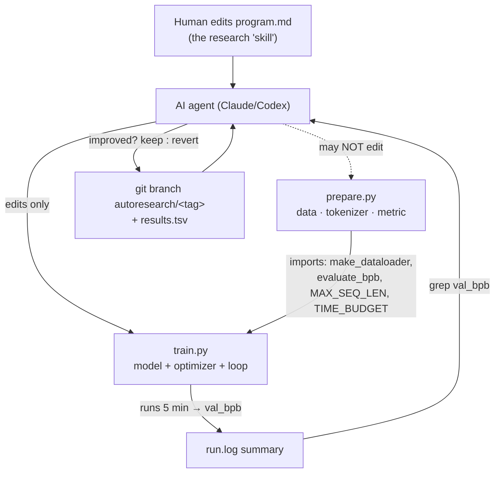

# autoresearch — what it is and how it fits together

## In one paragraph
`autoresearch` (by Andrej Karpathy) is a minimal harness for letting an AI agent do **autonomous LLM
research overnight**: it modifies a training script, trains for a fixed 5-minute budget, checks whether the
result improved, keeps or discards the change, and repeats — unattended — until a human stops it. The
codebase is deliberately three files. [`train.py`](concepts/train.md) is the **only file the agent edits**:
the full GPT model, a combined Muon+AdamW optimizer, and a wall-clock-bounded training loop.
[`prepare.py`](concepts/prepare.md) is the **frozen substrate** the agent may not touch: fixed constants,
one-time data download and tokenizer training, and — critically — the runtime dataloader and the
ground-truth metric. `program.md` is the **agent's instruction set** (the "research org code"), edited by
the *human*, not the agent. The central design idea is a *fair, fixed-clock benchmark*: the agent optimizes
a single vocabulary-independent scalar, validation bits-per-byte (`val_bpb`), under a fixed time budget, and
the frozen half of the harness guarantees that "better score" always means "better model."

## Core architecture

The autonomy loop (from `program.md`): edit `train.py` → `git commit` → run 5 min → read `val_bpb` → if
lower, advance the branch; if equal/worse, `git reset` back → log to `results.tsv` → repeat forever.

## Main concepts

### The two-file split: mutable vs. frozen
Everything the agent is allowed to change lives in [`train.py`](concepts/train.md); everything that defines
the *experimental conditions* is quarantined in the read-only [`prepare.py`](concepts/prepare.md). This
separation is the scientific control that makes an unattended search trustworthy — the agent cannot lower
its score by making the test easier, only by making the model better.

### Fixed time budget, not step budget
Training runs for exactly `TIME_BUDGET` seconds of *steady-state* wall clock (the first 10 steps are
excluded so `torch.compile` warm-up isn't charged). Because the budget is time, every change is
automatically priced by its throughput cost, and all runs are directly comparable. See
[train.py](concepts/train.md) → "Design rationale".

### `val_bpb` as the single objective
The score is bits-per-byte, computed by the frozen [`evaluate_bpb`](concepts/prepare.md) against a pinned
validation shard. Normalizing cross-entropy by UTF-8 byte length makes it invariant to tokenizer/vocab
changes, so architectural and tokenization changes compete fairly. See [prepare.py](concepts/prepare.md).

### Time-indexed schedules
The learning-rate multiplier and weight decay are functions of `progress = time / budget`, not of a step
count — the only way to land a warmdown exactly at the buzzer when the step count is unknown in advance.
(Muon momentum is the exception, warming up over the first ~300 steps.) See
[train.py](concepts/train.md) → "Mechanism".

### Fair, reproducible data pipeline
[`prepare.py`](concepts/prepare.md) downloads shards idempotently, trains a BPE tokenizer once, and serves
BOS-aligned, best-fit-packed batches at 100% token utilization with a pinned train/val split. See
[prepare.py](concepts/prepare.md) → "Design rationale".

### Fast-fail autonomy
A NaN or exploding-loss guard aborts a bad experiment in seconds (`exit(1)`), so the agent logs a crash and
moves on instead of burning the budget — essential for an unattended loop that runs ~100 experiments per
night. See [train.py](concepts/train.md) → "Edge cases".

## How a request flows
A single experiment: the agent hacks a knob in [`train.py`](concepts/train.md) (often `DEPTH`, the LR
group, the attention window pattern, or the optimizer) → the setup block builds the `GPTConfig`, model, and
`MuonAdamW` optimizer and prefetches a batch from the frozen
[`make_dataloader`](concepts/prepare.md) → the loop runs gradient-accumulated steps under time-indexed
schedules until `TIME_BUDGET` → [`evaluate_bpb`](concepts/prepare.md) scores the model → the summary prints
`val_bpb`, which the agent greps and uses for its keep/discard decision.

## Map of the wiki
- *"What can the agent change, and how does a run actually work?"* → [concepts/train.md](concepts/train.md)
- *"What's frozen, and why can't the agent game the metric?"* → [concepts/prepare.md](concepts/prepare.md)
- *"What is `<symbol>` exactly (signature, source line, callers)?"* → the per-module catalogs under
  [`catalog/`](catalog/) (`catalog/train.md`, `catalog/prepare.md`).
- *"What's the concept table for this repo?"* → [index.md](index.md).
- The autonomous-loop policy itself (branch tagging, `results.tsv`, keep/revert rules, "never stop") lives
  in the repo's `program.md`, surfaced under [doc-concepts/](doc-concepts/).
