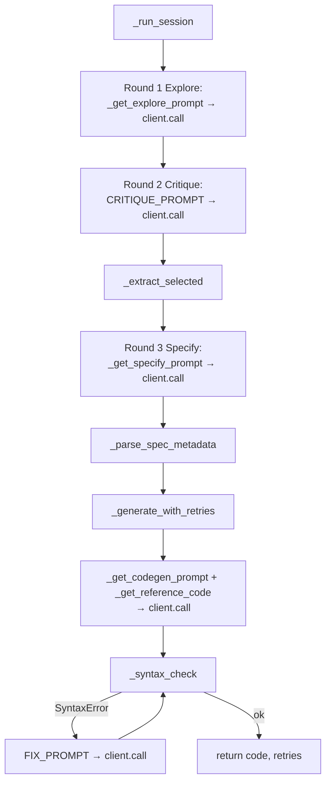
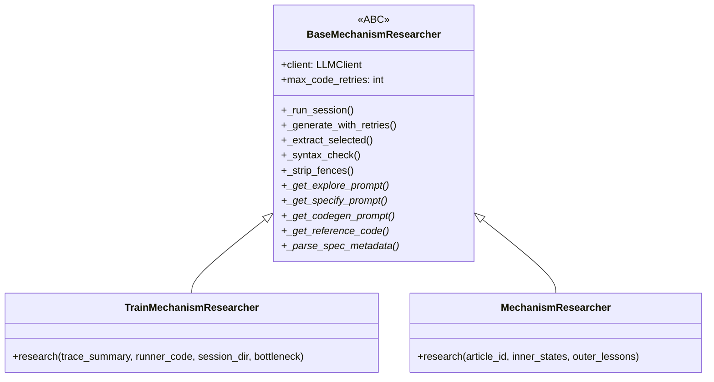

# core.base_mechanism_research — the shared Level 2 Explore→Critique→Specify→Generate protocol

<!-- connect:up:begin -->
> **Cross-repo concept:** part of [mechanism-level-self-improvement](../../../concepts/mechanism-level-self-improvement.md), [research-development-loop](../../../concepts/research-development-loop.md) across this wiki's repos.
<!-- connect:up:end -->
## Overview
[`BaseMechanismResearcher`](../catalog/core/base_mechanism_research.md#BaseMechanismResearcher) is Level 2's
domain-agnostic skeleton: the paper's "4-round structured LLM dialogue" — Explore, Critique, Specify,
Generate — is implemented exactly once here, as
[`_run_session`](../catalog/core/base_mechanism_research.md#BaseMechanismResearcher._run_session), and
reused by both the training domain's
[`TrainMechanismResearcher`](../catalog/domains/train_opt/mechanism_research.md#TrainMechanismResearcher) and
the article-revision domain's
[`MechanismResearcher`](../catalog/domains/article_opt/mechanism_research.md#MechanismResearcher) through
subclassing. The base
class owns *how the dialogue proceeds and how generated code gets checked*; subclasses own only *what the
prompts say and what "reference code" means for their domain*. That split is enforced by Python's `abstractmethod`
machinery, not by convention — an incomplete subclass literally cannot be instantiated.

## Diagram

## Design rationale (why it's built this way)
The class docstring is explicit about the division of labor: "Subclasses supply domain-specific prompts and
spec-parsing via abstract methods. The 4-round session loop (Explore, Critique, Specify,
Generate-with-retries) is handled here." Five methods are marked `@abstractmethod` —
[`_get_explore_prompt`](../catalog/core/base_mechanism_research.md#BaseMechanismResearcher._get_explore_prompt),
[`_get_specify_prompt`](../catalog/core/base_mechanism_research.md#BaseMechanismResearcher._get_specify_prompt),
[`_get_codegen_prompt`](../catalog/core/base_mechanism_research.md#BaseMechanismResearcher._get_codegen_prompt),
[`_get_reference_code`](../catalog/core/base_mechanism_research.md#BaseMechanismResearcher._get_reference_code),
and
[`_parse_spec_metadata`](../catalog/core/base_mechanism_research.md#BaseMechanismResearcher._parse_spec_metadata) —
and [`_run_session`](../catalog/core/base_mechanism_research.md#BaseMechanismResearcher._run_session) calls
every one of them by name. This is a template-method design: the *order and shape* of the dialogue (four
rounds, syntax-checked code, bounded retries) is a fixed invariant across domains, while *what a
"mechanism" is* — a new pipeline stage for article revision, a runner.py patch for training — is entirely
subclass-defined.

[`_generate_with_retries`](../catalog/core/base_mechanism_research.md#BaseMechanismResearcher._generate_with_retries)'s
retry loop only checks for **syntax** validity via
[`_syntax_check`](../catalog/core/base_mechanism_research.md#BaseMechanismResearcher._syntax_check) (a
`compile(code, "<generated>", "exec")` call) — not import-time or runtime correctness. That's a narrower
guarantee than "the code works": it only rules out malformed Python, feeding the syntax error back through
`FIX_PROMPT` for up to `max_code_retries` attempts before raising. The paper's stronger claim — that
generated mechanisms are validated by *dynamically importing* them before activation, with an
activate-or-revert decision — is not implemented in this base class.

> [!inferred] Because only `_syntax_check` gates the retry loop here, the paper's import-validation and
> activate-or-revert logic must live downstream, in the domain-specific `apply()`/injection code (not in
> this packet's Subgraph) — this page can ground the code-*generation* half of Level 2 but not the
> activation-or-revert half.

[`_extract_selected`](../catalog/core/base_mechanism_research.md#BaseMechanismResearcher._extract_selected)
is a deliberately crude parser: it scans the critique text line-by-line for one starting with `**selected**`
and falls back to the last 800 characters of the exploration text if no such line exists. That fallback
means Round 3 (Specify) always receives *something* even if the LLM's critique output didn't follow the
expected format exactly — a cheap robustness measure rather than a strict contract enforced on the LLM.

## Entry points
- [`research`](../catalog/domains/article_opt/mechanism_research.md#MechanismResearcher.research) and
  [`research`](../catalog/domains/train_opt/mechanism_research.md#TrainMechanismResearcher.research) — the
  two concrete subclasses' public entry points; each is reached once per Level 2 session (every 2 outer
  cycles, per the paper) and internally drives `_run_session`/`_generate_with_retries` on `self`.
- [`_run_session`](../catalog/core/base_mechanism_research.md#BaseMechanismResearcher._run_session) — the
  shared 4-round protocol itself; both subclasses' `research()` implementations funnel into logic shaped
  like this method (directly, or by inlining the same round sequence — see Open questions).
- `BaseMechanismResearcher.__init__` — constructs the shared
  [`client`](../catalog/core/base_mechanism_research.md#BaseMechanismResearcher.client) (an
  [`LLMClient`](../catalog/core/llm_client.md#LLMClient) instance) and
  [`max_code_retries`](../catalog/core/base_mechanism_research.md#BaseMechanismResearcher.max_code_retries)
  that every subsequent round call reuses; reached whenever a
  [`TrainMechanismResearcher`](../catalog/domains/train_opt/mechanism_research.md#TrainMechanismResearcher)
  or [`MechanismResearcher`](../catalog/domains/article_opt/mechanism_research.md#MechanismResearcher) is
  constructed.

## Mechanism (step-by-step)
1. **Round 1 — Explore.** [`_run_session`](../catalog/core/base_mechanism_research.md#BaseMechanismResearcher._run_session)
   calls the subclass's
   [`_get_explore_prompt`](../catalog/core/base_mechanism_research.md#BaseMechanismResearcher._get_explore_prompt)
   (abstract here; implemented per-domain) to get a `(prompt, system)` pair, then issues it on `client` via
   [`call`](../catalog/core/llm_client.md#LLMClient.call) with `max_tokens=4000` and writes the raw response
   to `01_exploration.md` in the session directory.
2. **Round 2 — Critique.** The exploration text is wrapped in the shared
   [`CRITIQUE_PROMPT`](../catalog/core/base_mechanism_research.md#CRITIQUE_PROMPT) template and sent with the
   shared [`CRITIQUE_SYSTEM`](../catalog/core/base_mechanism_research.md#CRITIQUE_SYSTEM) persona ("a
   rigorous critic... find failure modes and implementation traps") via another
   [`call`](../catalog/core/llm_client.md#LLMClient.call) on `client` — this round's prompt is identical
   across both domains, unlike Explore/Specify/Codegen which are subclass-supplied.
3. [`_extract_selected`](../catalog/core/base_mechanism_research.md#BaseMechanismResearcher._extract_selected)
   pulls the chosen hypothesis out of the critique text (or falls back to the exploration tail), producing
   the `selected_hypothesis` string that Round 3 is built around.
4. **Round 3 — Specify.** The subclass's
   [`_get_specify_prompt`](../catalog/core/base_mechanism_research.md#BaseMechanismResearcher._get_specify_prompt)
   turns `selected_hypothesis` plus the critique into a `(prompt, system)` pair; another `client.call`
   produces the spec text, which the subclass's
   [`_parse_spec_metadata`](../catalog/core/base_mechanism_research.md#BaseMechanismResearcher._parse_spec_metadata)
   then parses into a domain-specific metadata tuple (e.g. `(inject_after, stage_name)` for the article
   domain per its docstring).
5. **Round 4 — Generate with retries.** The subclass's
   [`_get_reference_code`](../catalog/core/base_mechanism_research.md#BaseMechanismResearcher._get_reference_code)
   supplies a style reference, and
   [`_generate_with_retries`](../catalog/core/base_mechanism_research.md#BaseMechanismResearcher._generate_with_retries)
   drives the subclass's
   [`_get_codegen_prompt`](../catalog/core/base_mechanism_research.md#BaseMechanismResearcher._get_codegen_prompt)
   through another [`call`](../catalog/core/llm_client.md#LLMClient.call) on `client` with the shared
   [`CODEGEN_SYSTEM`](../catalog/core/base_mechanism_research.md#CODEGEN_SYSTEM) persona, then
   [`_strip_fences`](../catalog/core/base_mechanism_research.md#BaseMechanismResearcher._strip_fences)
   removes any markdown fencing the LLM added despite being told not to.
6. Each generated attempt is written to `04_code_attempt_N.py` and passed through
   [`_syntax_check`](../catalog/core/base_mechanism_research.md#BaseMechanismResearcher._syntax_check); a
   `None` result (valid syntax) returns immediately, while a `SyntaxError` string is fed back through the
   shared [`FIX_PROMPT`](../catalog/core/base_mechanism_research.md#FIX_PROMPT) template (truncated error +
   truncated code) for another `client.call`, up to
   [`max_code_retries`](../catalog/core/base_mechanism_research.md#BaseMechanismResearcher.max_code_retries)
   times before raising `RuntimeError` on the final attempt.
7. Two concrete subclasses instantiate this template today:
   [`TrainMechanismResearcher`](../catalog/domains/train_opt/mechanism_research.md#TrainMechanismResearcher)
   (whose docstring: "Produces a code patch that modifies runner.py, applying it in-place and validating
   that the modified file still imports correctly" — a stronger check than this base class performs) and
   [`MechanismResearcher`](../catalog/domains/article_opt/mechanism_research.md#MechanismResearcher) (whose
   docstring: "Runs one Level-2 research session: produces + validates a new pipeline stage"). Each overrides
   all five abstract methods with domain-specific prompt text and reference-code lookup, and each also
   overrides `_generate_with_retries` itself with a slightly different signature (dropping the
   `codegen_kwargs` dict in favor of named/optional arguments) — see Open questions.

## Key data structures
- [`BaseMechanismResearcher`](../catalog/core/base_mechanism_research.md#BaseMechanismResearcher) — holds
  [`client`](../catalog/core/base_mechanism_research.md#BaseMechanismResearcher.client) (one
  [`LLMClient`](../catalog/core/llm_client.md#LLMClient) instance, constructed once and reused for every
  round) and [`max_code_retries`](../catalog/core/base_mechanism_research.md#BaseMechanismResearcher.max_code_retries).
- The four shared prompt/system-prompt string constants —
  [`CRITIQUE_PROMPT`](../catalog/core/base_mechanism_research.md#CRITIQUE_PROMPT),
  [`CRITIQUE_SYSTEM`](../catalog/core/base_mechanism_research.md#CRITIQUE_SYSTEM),
  [`CODEGEN_SYSTEM`](../catalog/core/base_mechanism_research.md#CODEGEN_SYSTEM), and
  [`FIX_PROMPT`](../catalog/core/base_mechanism_research.md#FIX_PROMPT) — versus the per-domain
  [`EXPLORE_PROMPT`](../catalog/domains/article_opt/mechanism_research.md#EXPLORE_PROMPT) /
  [`EXPLORE_SYSTEM`](../catalog/domains/article_opt/mechanism_research.md#EXPLORE_SYSTEM) /
  [`SPECIFY_PROMPT`](../catalog/domains/article_opt/mechanism_research.md#SPECIFY_PROMPT) /
  [`SPECIFY_SYSTEM`](../catalog/domains/article_opt/mechanism_research.md#SPECIFY_SYSTEM) /
  [`CODEGEN_PROMPT`](../catalog/domains/article_opt/mechanism_research.md#CODEGEN_PROMPT) pairs each domain
  defines separately (train_opt's own copies live at the equivalent
  [`EXPLORE_PROMPT`](../catalog/domains/train_opt/mechanism_research.md#EXPLORE_PROMPT) /
  [`SPECIFY_PROMPT`](../catalog/domains/train_opt/mechanism_research.md#SPECIFY_PROMPT) /
  [`CODEGEN_PROMPT`](../catalog/domains/train_opt/mechanism_research.md#CODEGEN_PROMPT) symbols) — Critique
  and code-fixing are the only rounds the paper's two domains phrase identically.
- The test-only subclasses
  [`_ConcreteResearcher`](../catalog/tests/test_mechanism_research.md#_ConcreteResearcher) and
  [`_Incomplete`](../catalog/tests/test_mechanism_research.md#TestBaseMechanismResearcherAbstract.test_missing_abstract_method_raises._Incomplete)
  exist purely to exercise the ABC contract (see Dynamics).

## Dynamics (design intent)
[`test_cannot_instantiate_directly`](../catalog/tests/test_mechanism_research.md#TestBaseMechanismResearcherAbstract.test_cannot_instantiate_directly)
asserts `BaseMechanismResearcher()` raises `TypeError` — Python's ABC machinery, not a runtime check in this
module, enforces that the five abstract methods must be implemented before a subclass is usable.
[`_ConcreteResearcher`](../catalog/tests/test_mechanism_research.md#_ConcreteResearcher) implements all five
with trivial stub bodies purely to prove a *fully* implemented subclass can be constructed, while `_Incomplete`
(defined inline inside its own test) implements only one of the five and is used to show a partial subclass
still cannot be instantiated. The syntax-check retry loop's unit tests
([`_syntax_check`](../catalog/core/base_mechanism_research.md#BaseMechanismResearcher._syntax_check) tests in
the Evidence table) exercise valid code, valid single expressions, invalid syntax, and empty-string input
directly against `compile()`, but nothing in this Subgraph exercises `_generate_with_retries`'s full
call-retry-recheck loop end-to-end (that would require mocking the LLM client across multiple calls).

## Edge cases
- [`_strip_fences`](../catalog/core/base_mechanism_research.md#BaseMechanismResearcher._strip_fences) only
  strips a fence if it's the *first* line (opening) and, independently, if the *last* line is exactly a bare
  closing triple-backtick fence with nothing else on it — a fence with a trailing language tag on the
  closing line, or fencing only on one side, is handled asymmetrically (tests for this exact behavior are
  listed in the Evidence table, e.g. "only opening fence removed").
- [`_extract_selected`](../catalog/core/base_mechanism_research.md#BaseMechanismResearcher._extract_selected)'s
  match is case-insensitive on `**selected**` but requires it at the *start* of a stripped line — a model
  that writes "The **Selected** hypothesis is..." mid-sentence falls through to the exploration-tail
  fallback instead.
- On the final retry attempt, if `_syntax_check` still returns an error, `_generate_with_retries` writes the
  failing code and error to disk *and then raises* `RuntimeError` — callers must be prepared for the whole
  session to abort on persistent syntax failure rather than silently falling back to no mechanism.

## Open questions
- This packet's Subgraph shows two *different* `_generate_with_retries` overrides — one on
  [`MechanismResearcher`](../catalog/domains/article_opt/mechanism_research.md#MechanismResearcher) (cite:
  [`_generate_with_retries`](../catalog/domains/article_opt/mechanism_research.md#MechanismResearcher._generate_with_retries)),
  one on
  [`TrainMechanismResearcher`](../catalog/domains/train_opt/mechanism_research.md#TrainMechanismResearcher)
  (cite: [`_generate_with_retries`](../catalog/domains/train_opt/mechanism_research.md#TrainMechanismResearcher._generate_with_retries)) —
  with signatures that don't match the base class's `codegen_kwargs`-dict parameter — whether these
  fully override the base implementation or whether `_run_session`'s call to the base
  `_generate_with_retries` is actually reached in practice for these subclasses isn't resolvable from this
  packet alone; see the `domains-*-mechanism_research` pages for that.
- The paper's dynamic-import validation and activate-or-revert step (the mechanism that makes a failed
  `sklearn` import silently revert to the prior mechanism, per the paper's Table 3 discussion) is not present
  in this base class — only syntax-level validation is. That logic must live in domain-specific `apply()`/
  injection code outside this packet's Subgraph.

## See also
- [core-llm_client](core-llm_client.md) — the `LLMClient`/`call` primitive every round in this protocol goes
  through.
- [core-inner_loop](core-inner_loop.md) and [core-state](core-state.md) — Level 1's controller and state,
  which the generated mechanisms are ultimately validated against (downstream of this packet).
- [domains-train_opt-mechanism_research](domains-train_opt-mechanism_research.md) and
  [domains-article_opt-mechanism_research](domains-article_opt-mechanism_research.md) — the two concrete
  subclasses that supply this template's domain-specific prompts and reference code.
- [domains-train_opt-outer](domains-train_opt-outer.md) and
  [domains-article_opt-outer](domains-article_opt-outer.md) — the Level 1.5 outer loops that decide when to
  invoke a Level 2 research session.
- [../../../sources/bilevel-autoresearch.md](../../../sources/bilevel-autoresearch.md) — "Level 2 —
  mechanism research and code injection" describes the 4-round dialogue this class implements, and
  "Mechanism-level self-improvement: the paper's broader claim" frames why *this specific* logic (not Level
  1.5's parameter tuning) is what the paper calls mechanism-level rather than artifact-level self-improvement.
  The same page's comparison to Darwin Gödel Machine is also directly relevant here: unlike DGM, this
  protocol's own four-round structure is fixed and human-authored — nothing in this Subgraph shows Level 2
  ever rewriting `_run_session` or any other part of itself.
