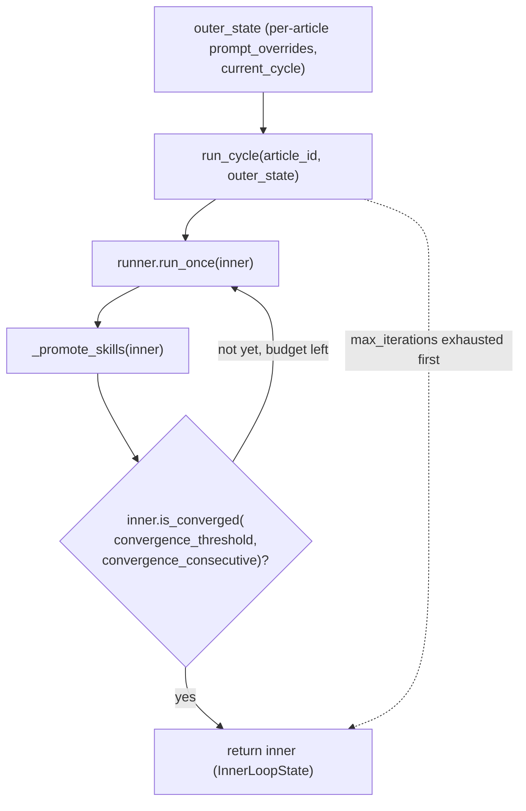

# core.inner_loop — the unmodified Level 1 propose/train/evaluate/keep-discard loop

<!-- connect:up:begin -->
> **Cross-repo concept:** part of [closed-loop-experiment-design](../../../concepts/closed-loop-experiment-design.md) across this wiki's repos.
<!-- connect:up:end -->
## Overview
[`InnerLoopController`](../catalog/core/inner_loop.md#InnerLoopController) is Level 1 in the paper's three
levels — the part of the system that is *never* rewritten by the outer loop. Its
[`run_cycle`](../catalog/core/inner_loop.md#InnerLoopController.run_cycle) method is a thin, fixed
orchestration loop: call the runner once, check for convergence, repeat until either the article scores well
for several runs in a row or a hard iteration budget runs out. Everything domain-specific — what a
"proposal" is, how it's scored — lives inside whatever `runner` object is injected; this controller only
ever calls `runner.run_once` and reads back a score. That indirection is exactly what lets Level 1.5 and
Level 2 change *how proposals are generated* (by swapping or reconfiguring the runner) without this
controller's own loop logic ever needing to change.

## Diagram

## Design rationale (why it's built this way)
[`InnerLoopController`](../catalog/core/inner_loop.md#InnerLoopController)'s own docstring frames it as
managing "one full inner cycle (up to `max_iterations` runs on one article)," with the runner passed in as a
plain constructor argument rather than constructed internally — the controller has no idea whether it's
driving the article-revision domain or the training domain, only that its `runner` exposes `run_once`. That
is the seam the paper's bilevel structure depends on: Level 1.5 tunes parameters *of* the runner (freeze
lists, guidance strings) and Level 2 can even swap in a runner whose proposal logic is entirely new
generated code, and in neither case does `run_cycle`'s convergence-checking loop need to change.

[`_promote_skills`](../catalog/core/inner_loop.md#InnerLoopController._promote_skills) runs after *every*
single run inside the loop, not just at cycle end — its docstring is "Promote high-confidence lessons to
stage skills for injection," and it re-derives the skill text from scratch each call by grouping
[`inner_lessons`](../catalog/core/state.md#InnerLoopState.inner_lessons) by stage and re-sorting by
[`confidence`](../catalog/core/state.md#InnerLesson.confidence). Doing this incrementally after each run
(rather than once at the end) means a lesson learned on run 2 can influence the prompt context for run 3
within the *same* cycle, not just future cycles.

> [!inferred] The `else` clause on the `for...else` in `run_cycle` (logging "Budget exhausted") only fires
> when the loop completes all `max_iterations` without ever `break`ing — a standard Python idiom for
> distinguishing "converged early" from "ran out of budget," visible directly in the loop's control flow.

## Entry points
- [`run_cycle`](../catalog/core/inner_loop.md#InnerLoopController.run_cycle) — the only way an outer
  controller drives a Level 1 cycle; called once per article per outer iteration by
  [`run`](../catalog/domains/article_opt/outer.md#OuterLoopController.run) (Level 1.5's outer loop) and
  directly by CLI commands debugging the inner loop in isolation.
- [`cmd_inner`](../catalog/domains/article_opt/cli.md#cmd_inner) — CLI entry point that builds a controller
  and calls `run_cycle` once, for debugging a single article without any outer-loop machinery.
- [`cmd_run`](../catalog/domains/article_opt/cli.md#cmd_run) — the full-experiment CLI entry point; it builds
  the `InnerLoopController` once (with `convergence_threshold=8`, `convergence_consecutive=3`) and hands it
  to the outer loop's [`run`](../catalog/domains/article_opt/outer.md#OuterLoopController.run), which then
  calls `run_cycle` repeatedly.
- [`cmd_mechresearch`](../catalog/domains/article_opt/cli.md#cmd_mechresearch) — builds one or more
  controllers to run baseline cycles before Level 2's mechanism researcher starts, and (via
  [`validate`](../catalog/domains/article_opt/mechanism_research.md#MechanismResearcher.validate)) builds
  another controller afterward to run the cycle again with the newly generated mechanism injected into the
  runner.

## Mechanism (step-by-step)
1. [`run_cycle`](../catalog/core/inner_loop.md#InnerLoopController.run_cycle) first asks the outer state for
   a fresh [`InnerLoopState`](../catalog/core/state.md#InnerLoopState), then pushes
   [`prompt_overrides`](../catalog/core/state.md#OuterLoopState.prompt_overrides) and the outer
   [`current_cycle`](../catalog/core/state.md#OuterLoopState.current_cycle) number directly onto the runner
   object as attributes — the runner reads its Level 1.5 guidance this way rather than through any parameter
   passed to `run_once`.
2. The loop then calls `self.runner.run_once(inner)` up to
   [`max_iterations`](../catalog/core/inner_loop.md#InnerLoopController.max_iterations) times (default 20),
   each iteration producing a `RunResult` that the runner itself records into `inner.run_trace`.
3. After every single run, [`_promote_skills`](../catalog/core/inner_loop.md#InnerLoopController._promote_skills)
   scans [`inner_lessons`](../catalog/core/state.md#InnerLoopState.inner_lessons), keeps only those with
   [`confidence`](../catalog/core/state.md#InnerLesson.confidence) at or above
   [`skill_confidence_min`](../catalog/core/inner_loop.md#InnerLoopController.skill_confidence_min) (default
   0.85), groups them by [`stage`](../catalog/core/state.md#InnerLesson.stage), and writes a rendered
   guidance block into `inner`'s skill dict via
   [`update_skill`](../catalog/core/state.md#InnerLoopState.update_skill).
4. The loop checks [`is_converged`](../catalog/core/state.md#InnerLoopState.is_converged) against this
   controller's own [`convergence_threshold`](../catalog/core/inner_loop.md#InnerLoopController.convergence_threshold)
   and [`convergence_consecutive`](../catalog/core/inner_loop.md#InnerLoopController.convergence_consecutive)
   (defaults 8 and 3) after every run; on the first `True`, the `for` loop `break`s and `run_cycle` returns
   immediately, skipping any remaining budget.
5. If the loop exhausts `max_iterations` without ever converging, the `for...else` clause fires instead,
   logging the final [`peak_score`](../catalog/core/state.md#InnerLoopState.peak_score) reached — either way
   the completed (but not yet reset) `InnerLoopState` is returned to the caller.
6. Callers past this point — [`run`](../catalog/domains/article_opt/outer.md#OuterLoopController.run) for a
   normal outer cycle, or [`cmd_inner`](../catalog/domains/article_opt/cli.md#cmd_inner) /
   [`cmd_mechresearch`](../catalog/domains/article_opt/cli.md#cmd_mechresearch) for standalone/Level-2 use —
   read [`run_trace`](../catalog/core/state.md#InnerLoopState.run_trace),
   [`peak_score`](../catalog/core/state.md#InnerLoopState.peak_score), and
   [`is_converged`](../catalog/core/state.md#InnerLoopState.is_converged) off the returned state; none of
   that reporting logic lives inside `run_cycle` itself.
7. [`validate`](../catalog/domains/article_opt/mechanism_research.md#MechanismResearcher.validate) — Level
   2's post-generation check — builds a brand-new `InnerLoopController` around the *same* runner object after
   a new mechanism has been injected into it, then calls `run_cycle` exactly the same way a normal outer
   cycle would; convergence-checking code has no special path for "a freshly generated mechanism is
   currently active."

## Key data structures
- [`InnerLoopController`](../catalog/core/inner_loop.md#InnerLoopController) — holds
  [`runner`](../catalog/core/inner_loop.md#InnerLoopController.runner) plus the four tunable budgets/
  thresholds (`max_iterations`, `convergence_threshold`, `convergence_consecutive`, `skill_confidence_min`)
  as plain constructor-set attributes; nothing here is domain-specific.
- [`InnerLoopState`](../catalog/core/state.md#InnerLoopState) — the return value of `run_cycle`; see
  [core-state](core-state.md) for its full shape (`run_trace`, `inner_lessons`, `inner_skills`, etc.).

## Dynamics (design intent)
Three tests in this packet's Subgraph pin down the exact stop condition:
[`test_converges_early_stops_calling_runner`](../catalog/tests/test_inner_loop.md#TestRunCycleCallCount.test_converges_early_stops_calling_runner)
runs a mock scoring 9 every time with `convergence_consecutive=3` and asserts the runner is called exactly 3
times (not 20) and `peak_score() == 9`;
[`test_budget_exhausted_when_never_converges`](../catalog/tests/test_inner_loop.md#TestRunCycleCallCount.test_budget_exhausted_when_never_converges)
runs a mock scoring 5 every time with `max_iterations=4` and asserts exactly 4 calls and
`not is_converged()`;
[`test_run_once_called_expected_times_with_consecutive_2`](../catalog/tests/test_inner_loop.md#TestRunCycleCallCount.test_run_once_called_expected_times_with_consecutive_2)
confirms lowering `convergence_consecutive` to 2 stops the loop after 2 high-score runs instead of 3.
[`test_can_instantiate_with_mock_runner`](../catalog/tests/test_inner_loop.md#TestInnerLoopControllerInstantiation.test_can_instantiate_with_mock_runner)
and
[`test_custom_parameters_stored`](../catalog/tests/test_inner_loop.md#TestInnerLoopControllerInstantiation.test_custom_parameters_stored)
confirm the constructor's defaults (20 / 8 / 3) and that custom values are stored verbatim on the instance,
not just accepted and dropped.

## Edge cases
- A run that individually clears `convergence_threshold` but isn't followed by enough *consecutive* clearing
  runs does **not** stop the loop early — `is_converged` requires the *last* `convergence_consecutive` runs
  in `run_trace` to all clear the bar, so a single high score surrounded by lower ones just logs "watching
  for stability..." and continues.
- `run_cycle` mutates the injected `runner` object's `prompt_overrides` and `outer_cycle` attributes as a
  side effect on every call — reusing the same runner instance across multiple `InnerLoopController`s (as
  [`validate`](../catalog/domains/article_opt/mechanism_research.md#MechanismResearcher.validate) does)
  means those attributes reflect whichever controller called `run_cycle` most recently.

## Open questions
- The actual proposal logic that `runner.run_once` executes — how a candidate revision or hyperparameter
  change is generated and scored — is entirely outside this packet's Subgraph (it lives in the domain
  runners); this page can describe only the fixed convergence-loop shell around it.
- Nothing in this Subgraph shows *why* `skill_confidence_min` defaults to 0.85 specifically, beyond the
  parameter's name and the tests confirming it's stored as given.

## See also
- [core-state](core-state.md) — the `InnerLoopState`/`OuterLoopState` types this controller reads and
  writes.
- [core-base_mechanism_research](core-base_mechanism_research.md) — Level 2's researcher, whose `validate`
  step builds a fresh controller around an injected mechanism the same way a normal cycle does.
- [domains-article_opt-runner](domains-article_opt-runner.md) and
  [domains-train_opt-runner](domains-train_opt-runner.md) — the concrete `runner.run_once` implementations
  this controller drives.
- [domains-article_opt-outer](domains-article_opt-outer.md) and
  [domains-train_opt-outer](domains-train_opt-outer.md) — Level 1.5's outer loops, the normal callers of
  `run_cycle`.
- [../../../sources/bilevel-autoresearch.md](../../../sources/bilevel-autoresearch.md) — "Level 1 — inner
  autoresearch loop" describes exactly this controller's unmodified propose→train→evaluate→keep/discard
  cycle.
- [../../autoresearch/overview.md](../../autoresearch/overview.md) — Karpathy's original `autoresearch`
  ratchet; the paper is explicit that Level 1 here is "exactly this wiki's `autoresearch` benchmark," and
  this controller's convergence loop is the same edit→train→keep/discard idea generalized to a
  multi-run-per-cycle budget instead of a single accept/reject step.
