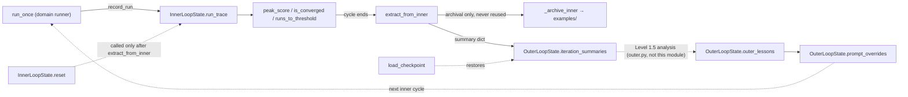

# core.state — inner/outer state and the inner→outer information boundary

<!-- connect:up:begin -->
> **Cross-repo concept:** part of [closed-loop-experiment-design](../../../concepts/closed-loop-experiment-design.md) across this wiki's repos.
<!-- connect:up:end -->
## Overview
`core/state.py` holds the two state objects that make the bilevel architecture legible in code:
[`InnerLoopState`](../catalog/core/state.md#InnerLoopState), scoped to one inner cycle and wiped at every
outer-iteration boundary, and `OuterLoopState` (whose fields and methods are cited throughout this page),
which persists across the whole run and is "what the outer loop is actually optimizing." The module's real
job isn't just
storage — it's drawing a hard line between what the outer loop is allowed to see. That line is
[`extract_from_inner`](../catalog/core/state.md#OuterLoopState.extract_from_inner), which the module's own
docstring calls "the ONLY sanctioned path for inner → outer information flow," and which deliberately
returns process statistics (scores, convergence, retry counts) while never returning the article text
itself. Everything downstream — Level 1.5's parameter adjustments, Level 2's mechanism research — reasons
over this extracted summary, never over the raw artifact.

## Diagram

## Design rationale (why it's built this way)
The split exists because the paper's bilevel structure needs a state object per level, and the inner one
must be throwaway. [`InnerLoopState`](../catalog/core/state.md#InnerLoopState)'s docstring is explicit about
which flows are *forbidden* across the outer-iteration boundary: `article_working_copy` must not carry over,
`inner_lessons`/`inner_skills` must not be injected into the next cycle, and `run_trace` "is extracted by the
outer loop BEFORE reset, then discarded." That ordering constraint — extract, *then* reset, never the
reverse — is what makes [`reset`](../catalog/core/state.md#InnerLoopState.reset)'s own docstring read "Call
AFTER outer loop has extracted what it needs via `convergence_trace()`, `stage_failure_pattern()`, etc."

`extract_from_inner`'s design is the more interesting decision: it doesn't return the whole
`InnerLoopState`, it returns a hand-picked dict of *derived statistics* —
[`convergence_trace`](../catalog/core/state.md#InnerLoopState.convergence_trace),
[`stage_failure_pattern`](../catalog/core/state.md#InnerLoopState.stage_failure_pattern),
[`evaluator_dimension_pattern`](../catalog/core/state.md#InnerLoopState.evaluator_dimension_pattern),
[`lesson_quality_stats`](../catalog/core/state.md#InnerLoopState.lesson_quality_stats), and the raw
[`retry_log`](../catalog/core/state.md#InnerLoopState.retry_log) — with the docstring's own comment that
"Content (article text) is archived but never returned in this dict." That's a structural enforcement of the
paper's Level 1.5/Level 2 boundary: the outer levels are meant to reason about *why the search behaved as it
did*, not to read or rewrite the artifact directly — the artifact only ever moves through
[`record_run`](../catalog/core/state.md#InnerLoopState.record_run)'s
[`article_version`](../catalog/core/state.md#RunResult.article_version) inside the inner scope.

> [!inferred] Archival ([`_archive_inner`](../catalog/core/state.md#OuterLoopState._archive_inner), which
> writes the best article and full trace to `examples/`) looks at first glance like it violates the
> "content never crosses" rule, but it writes to disk for human inspection — it is not part of the returned
> summary dict and nothing in this subgraph reads it back in.

## Entry points
- [`cmd_run`](../catalog/domains/article_opt/cli.md#cmd_run) — the full dual-layer experiment CLI. It
  constructs an `OuterLoopState` and, if `--resume` is passed, calls
  [`load_checkpoint`](../catalog/core/state.md#OuterLoopState.load_checkpoint) to restore `current_cycle`,
  `prompt_overrides`, and prior lessons before continuing.
- [`cmd_inner`](../catalog/domains/article_opt/cli.md#cmd_inner) — runs only the inner loop, for debugging a
  single article; it prints `run_trace` length, `peak_score`, `is_converged`, `runs_to_threshold`, and
  `inner_lessons` count straight off the returned `InnerLoopState`.
- [`cmd_mechresearch`](../catalog/domains/article_opt/cli.md#cmd_mechresearch) — the Level 2 entry point. It
  builds one or more baseline `InnerLoopState` instances (via repeated inner cycles) purely to give the
  mechanism researcher trace data to look at before it writes any new code.

## Mechanism (step-by-step)
1. Each article cycle starts from a fresh [`InnerLoopState`](../catalog/core/state.md#InnerLoopState) built
   from immutable original text (constructed one level up, in the inner loop controller) — every field the
   docstring forbids from leaking (article copy, lessons, skills, trace) is reset to empty on construction.
2. Every inner iteration reports back through
   [`record_run`](../catalog/core/state.md#InnerLoopState.record_run): it appends the
   [`RunResult`](../catalog/core/state.md#RunResult) to `run_trace` and advances
   `article_working_copy` to that run's `article_version` — the only place the working draft changes.
   [`run_once`](../catalog/domains/article_opt/runner.md#InnerRunner.run_once) is the caller that builds the
   `RunResult` (with its `overall` score and per-stage `scores`) and hands it to `record_run`.
3. Convergence and progress are pure reads over `run_trace`:
   [`is_converged`](../catalog/core/state.md#InnerLoopState.is_converged) checks whether the last
   `consecutive` runs all cleared `threshold`,
   [`peak_score`](../catalog/core/state.md#InnerLoopState.peak_score) is the max `overall` seen, and
   [`runs_to_threshold`](../catalog/core/state.md#InnerLoopState.runs_to_threshold) returns the first
   `run_number` that cleared it (or `None`).
4. At the end of a cycle, before any reset, the outer loop calls
   [`extract_from_inner`](../catalog/core/state.md#OuterLoopState.extract_from_inner), which assembles the
   sanctioned summary dict — `total_inner_runs`, `peak_score`, `runs_to_threshold_8`,
   [`is_converged`](../catalog/core/state.md#InnerLoopState.is_converged)'s result,
   [`convergence_trace`](../catalog/core/state.md#InnerLoopState.convergence_trace),
   [`stage_failure_pattern`](../catalog/core/state.md#InnerLoopState.stage_failure_pattern),
   [`evaluator_dimension_pattern`](../catalog/core/state.md#InnerLoopState.evaluator_dimension_pattern),
   [`lesson_quality_stats`](../catalog/core/state.md#InnerLoopState.lesson_quality_stats), and the raw
   [`retry_log`](../catalog/core/state.md#InnerLoopState.retry_log) — and appends it to
   [`iteration_summaries`](../catalog/core/state.md#OuterLoopState.iteration_summaries).
5. `extract_from_inner` also calls
   [`_archive_inner`](../catalog/core/state.md#OuterLoopState._archive_inner), which finds the
   best-`overall` [`RunResult`](../catalog/core/state.md#RunResult) and writes its
   [`article_version`](../catalog/core/state.md#RunResult.article_version) plus the full trace (via each
   result's [`to_dict`](../catalog/core/state.md#RunResult.to_dict)) into an `examples/` directory keyed by
   [`current_cycle`](../catalog/core/state.md#OuterLoopState.current_cycle) — a human-facing archival copy,
   not something re-read by the mechanisms in this subgraph.
6. Only after extraction does the caller invoke
   [`reset`](../catalog/core/state.md#InnerLoopState.reset) on the `InnerLoopState`, restoring
   `article_working_copy` to the original text and clearing `inner_lessons`/`inner_skills`/`run_trace`/
   `retry_log` for the next article in the same outer cycle.
7. `OuterLoopState` itself survives across cycles through
   [`current_cycle`](../catalog/core/state.md#OuterLoopState.current_cycle),
   [`prompt_overrides`](../catalog/core/state.md#OuterLoopState.prompt_overrides),
   [`strategy_history`](../catalog/core/state.md#OuterLoopState.strategy_history), and
   [`outer_lessons`](../catalog/core/state.md#OuterLoopState.outer_lessons) (a list of
   [`OuterLesson`](../catalog/core/state.md#OuterLesson) records, each carrying `lesson_type`,
   `strategy_used`, `summary`, `reuse_rule`, and `confidence`).
   [`load_checkpoint`](../catalog/core/state.md#OuterLoopState.load_checkpoint) reconstitutes all of these
   (including rebuilding each `OuterLesson`) from a JSON file, which is what lets `cmd_run --resume` pick up
   an interrupted multi-cycle experiment.
8. Two CLI paths read this state directly for narrower purposes:
   [`cmd_inner`](../catalog/domains/article_opt/cli.md#cmd_inner) runs one inner cycle standalone and prints
   `run_trace`/`peak_score`/`is_converged`/`runs_to_threshold`/`inner_lessons` straight from the returned
   state, while [`cmd_mechresearch`](../catalog/domains/article_opt/cli.md#cmd_mechresearch) builds several
   baseline `InnerLoopState`s (reporting their `overall` scores and `peak_score`) purely so that Level 2's
   [`validate`](../catalog/domains/article_opt/mechanism_research.md#MechanismResearcher.validate) step has
   trace data to compare a newly injected mechanism's `run_trace`/`peak_score`/`is_converged`/
   `inner_lessons` against once it runs.

## Key data structures
- [`RunResult`](../catalog/core/state.md#RunResult) — one inner iteration's outcome: `run_number`,
  per-stage [`scores`](../catalog/core/state.md#RunResult.scores) (a list of
  [`StageScore`](../catalog/core/state.md#StageScore), each with `stage`, `score`, `feedback`, `retried`),
  the rolled-up `overall`, and the full `article_version` text — the only place a draft's content is
  actually stored.
- [`InnerLesson`](../catalog/core/state.md#InnerLesson) — a fine-grained, inner-scope lesson (`lesson_type`,
  `stage`, `summary`, `reuse_rule`, `confidence`, `run_number`) that never survives a `reset`.
- [`OuterLesson`](../catalog/core/state.md#OuterLesson) — the persistent counterpart: `outer_cycle`,
  `lesson_type`, `strategy_used`, `summary`, `reuse_rule`, `confidence`, and `stage_affected`; these are what
  `load_checkpoint` restores across process restarts.
- [`InnerLoopState`](../catalog/core/state.md#InnerLoopState) / `OuterLoopState` —
  the two scopes described above; [`base_dir`](../catalog/core/state.md#OuterLoopState.base_dir) and
  [`_examples_dir`](../catalog/core/state.md#OuterLoopState._examples_dir) anchor where checkpoints and
  archives land on disk.

## Dynamics (design intent)
`test_record_run` (tests/test_state.py:25) and `test_initial_state` (tests/test_state.py:19) — both in this
packet's subgraph as [`test_record_run`](../catalog/tests/test_state.md#TestInnerLoopState.test_record_run)
and [`test_initial_state`](../catalog/tests/test_state.md#TestInnerLoopState.test_initial_state) — assert
that a fresh `InnerLoopState` starts with empty `run_trace`/`inner_lessons`, and that recording a run both
appends to `run_trace` and updates `article_working_copy` to the new version, exactly matching
`record_run`'s two-line body. The forbidden-flow comment in `InnerLoopState`'s own docstring is the
authoritative statement of intended ordering (extract before reset); nothing in this subgraph enforces that
ordering at runtime — it is a caller contract, not a guard in `state.py` itself.

## Edge cases
- `runs_to_threshold` returns `None`, not a sentinel run number, when the threshold was never reached — the
  outer summary dict stores this as `runs_to_threshold_8` and callers must check for `None`/`or "never"`
  rather than treating a returned int as always-present.
- `is_converged` returns `False` outright whenever `len(run_trace) < consecutive`, so a cycle that ends by
  hitting `max_iterations` before enough consecutive high scores accumulate is reported as not converged even
  if its last run individually cleared the threshold.
- `strategy_used` defaults to `""` on both `RunResult` and is only populated when the outer loop's
  `_last_strategy()` (not in this subgraph) passes a non-empty value into `extract_from_inner`.

## Open questions
- The Subgraph doesn't include the Level 1.5 analysis step that consumes `iteration_summaries`/
  `outer_lessons` to decide freeze/unfreeze or guidance text (that lives in `domains/*/outer.py`'s
  `_analyze`/`_apply_config_changes`, outside this packet) — this page can show *what* crosses the boundary
  but not how Level 1.5 acts on it.
- `add_outer_lesson`, `add_strategy_result`, `save_checkpoint`, `is_outer_converged`, and
  `build_outer_context` are all real methods on `OuterLoopState` (seen while reading `core/state.py`) but are
  not in this packet's Subgraph, so they aren't cited or described in the Mechanism section above.

## See also
- [core-inner_loop](core-inner_loop.md) — the controller that drives `InnerLoopState` through repeated
  `run_once` calls until `is_converged` or budget exhaustion.
- [core-base_mechanism_research](core-base_mechanism_research.md) — Level 2's researcher consumes
  `InnerLoopState`/`run_trace` (via `validate`) the same way this page describes.
- [domains-article_opt-outer](domains-article_opt-outer.md) and
  [domains-train_opt-outer](domains-train_opt-outer.md) — the callers that actually invoke
  `extract_from_inner` and act on `outer_lessons`/`prompt_overrides`.
- [domains-article_opt-runner](domains-article_opt-runner.md) — supplies the `run_once` that produces every
  `RunResult` this page describes.
- [../../../sources/bilevel-autoresearch.md](../../../sources/bilevel-autoresearch.md) — the paper this state
  boundary implements; see especially "Level 1.5 vs. Level 2" for why the outer levels only ever see
  extracted process signals, never the article artifact.
- [../../autoresearch/overview.md](../../autoresearch/overview.md) — Karpathy's `autoresearch`, whose
  keep/discard ratchet is exactly what `run_trace` + `is_converged`/`peak_score` reproduce at Level 1.
