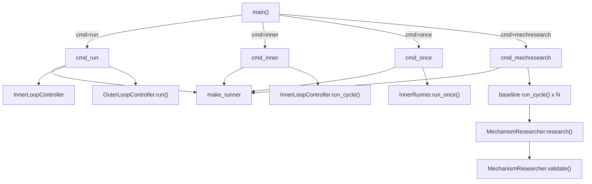

# article_opt CLI

<!-- connect:up:begin -->
> **Cross-repo concept:** part of [mechanism-level-self-improvement](../../../concepts/mechanism-level-self-improvement.md) across this wiki's repos.
<!-- connect:up:end -->
## Overview
`domains/article_opt/cli.py` is the argparse entry point that assembles the domain-agnostic `core.`
framework with article_opt's Level-1 pipeline into four runnable experiments: a full three-level run, an
inner-loop-only debug run, a single-pass smoke test, and a standalone Level-2 mechanism-research session.
Its job is pure wiring — build an [`InnerRunner`](../catalog/domains/article_opt/runner.md#InnerRunner),
wrap it in an [`InnerLoopController`](../catalog/core/inner_loop.md#InnerLoopController), and (for the two
commands that need an outer loop) hand both to an
[`OuterLoopController`](../catalog/domains/article_opt/outer.md#OuterLoopController.run) or a
[`MechanismResearcher`](../catalog/domains/article_opt/mechanism_research.md#MechanismResearcher.research) —
none of the propose/evaluate/generate logic itself lives here.

## Diagram

## Design rationale (why it's built this way)
The CLI hard-codes **two independent provider slots** — `--provider`/`--model` for the inner loop and
`--outer-provider`/`--outer-model` for the outer loop — resolved separately in every command that touches
both layers ([`cmd_run`](../catalog/domains/article_opt/cli.md#cmd_run),
[`cmd_mechresearch`](../catalog/domains/article_opt/cli.md#cmd_mechresearch)). Concretely, `cmd_run` defaults
`inner_provider` to `"minimax"` and `outer_provider` to `"deepseek"` unless overridden.

> [!inferred] This is a real divergence from the paper's own headline setup, not just a CLI convenience: the
> paper's central claim (§3.1) is that both the inner and outer loop run the *same* model (DeepSeek
> `deepseek-chat`), specifically so the ~5x gain can't be attributed to a stronger meta-level model. This
> demo domain's CLI defaults to two *different* providers (MiniMax inner, DeepSeek outer) — consistent with
> `domains/article_opt` being the lighter, no-GPU demo domain rather than the paper's controlled
> `domains/train_opt` ablation, where matching providers presumably matters for the reported results.

Each provider is validated independently and fails fast: `cmd_run` and `cmd_mechresearch` both look up the
provider in [`PROVIDERS`](../catalog/core/llm_client.md#PROVIDERS.PROVIDERS), `sys.exit` if the provider name
is unknown, then `sys.exit` again if the corresponding API-key environment variable is unset — the outer key
check happens before any inner-loop work starts, so a missing outer-loop credential doesn't waste a baseline
run before failing.

## Entry points
- [`cmd_run`](../catalog/domains/article_opt/cli.md#cmd_run) — the full three-level experiment. Loads the
  requested [`load_articles`](../catalog/domains/article_opt/cli.md#load_articles), builds an
  [`OuterLoopState`](../catalog/core/state.md#OuterLoopState), optionally resumes via
  [`load_checkpoint`](../catalog/core/state.md#OuterLoopState.load_checkpoint), then hands a freshly built
  [`InnerLoopController`](../catalog/core/inner_loop.md#InnerLoopController) and an `OuterAnalyzer` to
  [`OuterLoopController.run`](../catalog/domains/article_opt/outer.md#OuterLoopController.run) for
  `--max-outer` cycles.
- [`cmd_inner`](../catalog/domains/article_opt/cli.md#cmd_inner) — Level-1-only debug entry: one article, one
  [`begin_cycle`](../catalog/core/state.md#OuterLoopState.begin_cycle), one
  [`run_cycle`](../catalog/core/inner_loop.md#InnerLoopController.run_cycle), then prints
  [`peak_score`](../catalog/core/state.md#InnerLoopState.peak_score),
  [`is_converged`](../catalog/core/state.md#InnerLoopState.is_converged),
  [`runs_to_threshold`](../catalog/core/state.md#InnerLoopState.runs_to_threshold), and
  [`inner_lessons`](../catalog/core/state.md#InnerLoopState.inner_lessons) counts straight to stdout — no
  outer state is ever read back.
- [`cmd_once`](../catalog/domains/article_opt/cli.md#cmd_once) — smoke test: calls
  [`run_once`](../catalog/domains/article_opt/runner.md#InnerRunner.run_once) directly on a bare
  [`InnerLoopState`](../catalog/core/state.md#InnerLoopState), bypassing
  `InnerLoopController` entirely, so there's no convergence loop — exactly one pipeline pass.
- [`cmd_mechresearch`](../catalog/domains/article_opt/cli.md#cmd_mechresearch) — the Level-2 driver: the only
  command that reaches [`research`](../catalog/domains/article_opt/mechanism_research.md#MechanismResearcher.research)
  and [`validate`](../catalog/domains/article_opt/mechanism_research.md#MechanismResearcher.validate).

## Mechanism (step-by-step)
1. [`main`](../catalog/domains/article_opt/cli.md#main) parses the shared provider flags plus a subcommand,
   then dispatches directly to one of the four `cmd_*` functions — there is no shared pre/post-processing
   beyond argument parsing.
2. Every runnable command first calls [`make_runner`](../catalog/domains/article_opt/cli.md#make_runner),
   which resolves the inner provider's info from [`PROVIDERS`](../catalog/core/llm_client.md#PROVIDERS.PROVIDERS),
   validates the API key, calls [`configure`](../catalog/core/llm_client.md#configure) to set the
   module-level LLM client globals that the pipeline stages' [`call_llm`](../catalog/core/llm_client.md#call_llm)
   reads, and returns a fresh [`InnerRunner`](../catalog/domains/article_opt/runner.md#InnerRunner).
3. In [`cmd_run`](../catalog/domains/article_opt/cli.md#cmd_run), once the runner and
   [`InnerLoopController`](../catalog/core/inner_loop.md#InnerLoopController) exist, an `OuterAnalyzer` and
   [`OuterLoopController`](../catalog/domains/article_opt/outer.md#OuterLoopController.run) are constructed
   around the *same* `outer_state`, so `outer_ctrl.run()` is the only call that actually executes cycles;
   `cmd_run` itself only prints the returned summary dict.
4. In [`cmd_mechresearch`](../catalog/domains/article_opt/cli.md#cmd_mechresearch), before any research
   happens, the CLI builds `args.baseline_cycles` (default 2) rounds of trace data: for each baseline cycle it
   constructs a **brand-new** [`OuterLoopState`](../catalog/core/state.md#OuterLoopState) and
   `InnerLoopController`, then calls [`run_cycle`](../catalog/core/inner_loop.md#InnerLoopController.run_cycle)
   once and appends the resulting [`InnerLoopState`](../catalog/core/state.md#InnerLoopState) to a list —
   this list of independent inner traces (not a persistent outer state) is what
   [`research`](../catalog/domains/article_opt/mechanism_research.md#MechanismResearcher.research) reads via
   its `_build_trace_summary` call.
5. `cmd_mechresearch` then hardcodes `outer_lessons: list[dict] = []` before calling
   [`research`](../catalog/domains/article_opt/mechanism_research.md#MechanismResearcher.research) — the
   "prior outer lessons" input that the Explore round's prompt reserves space for is always empty on this
   code path, since nothing in this file ever populates or persists a cross-session lesson list for Level 2.
6. Unless `--skip-validate` is passed, `cmd_mechresearch` builds a **second, independent**
   [`InnerRunner`](../catalog/domains/article_opt/runner.md#InnerRunner) via `make_runner` (`val_runner`) and
   passes it to [`validate`](../catalog/domains/article_opt/mechanism_research.md#MechanismResearcher.validate),
   so the newly generated stage runs against a clean copy of the baseline pipeline rather than one of the
   runners already mutated by baseline cycles.

## Key data structures
`ARTICLE_FILES` maps the three known article IDs (`article1`, `article15`, `article2`) to filenames under
`ARTICLES_DIR`; [`load_articles`](../catalog/domains/article_opt/cli.md#load_articles) reads the requested
subset into a `dict[str, str]`. `BASE_DIR` and `REFERENCE_DOC` are path constants computed once at import
time relative to the file's own location, so the CLI works regardless of the caller's current working
directory. The `.env`-file loader at the top of the module runs before any other import and uses
`os.environ.setdefault`, so real environment variables always win over `.env` values.

## Dynamics (design intent)
The CLI is single-threaded and synchronous end-to-end — each `cmd_*` function blocks until its underlying
loop (`run_cycle`, `run_once`, `OuterLoopController.run`, or the Level-2 research+validate pair) returns.
Provider/API-key validation happens per command invocation, not once at import time. In both `cmd_run` and
`cmd_mechresearch` the outer provider/key is resolved and validated *first* — its `PROVIDERS` lookup and
env-var check run before the `make_runner` call that resolves the inner provider — so `--outer-provider`
errors surface before any inner-loop work (including `cmd_mechresearch`'s possibly-slow baseline cycles) is
done.

## Edge cases
- `cmd_mechresearch --baseline-cycles 0` skips the baseline-building loop entirely and instead passes
  [`research`](../catalog/domains/article_opt/mechanism_research.md#MechanismResearcher.research) a single
  freshly constructed [`InnerLoopState`](../catalog/core/state.md#InnerLoopState) with an empty
  [`run_trace`](../catalog/core/state.md#InnerLoopState.run_trace) — the researcher still runs, just with
  "No cycles recorded yet" in its trace summary.
- Because each baseline cycle in `cmd_mechresearch` gets its own fresh `OuterLoopState`, any
  `OuterLoopState`-level bookkeeping (`prompt_overrides`, `outer_lessons`) that `cmd_run`'s persistent outer
  state would normally carry forward across cycles is discarded between baseline cycles here.
- `val_runner.outer_cycle = 99` is used purely as a filesystem-namespace sentinel so validation artifacts
  don't collide with baseline-cycle artifact directories on disk.

## Open questions
Why do baseline cycles in `cmd_mechresearch` rebuild `OuterLoopState` from scratch each iteration instead of
reusing one persistent state the way `cmd_run` does? And is the hardcoded empty `outer_lessons` list in
`cmd_mechresearch` a known, accepted limitation of this lighter demo domain, or a piece of wiring that was
simply never finished — nothing in this file (or in the packets covering `mechanism_research.py`) shows a
path that would populate it from a prior `OuterLoopController` run.

## See also
- [domains-article_opt-mechanism_research.md](domains-article_opt-mechanism_research.md) — what
  `cmd_mechresearch` actually drives.
- [domains-article_opt-outer.md](domains-article_opt-outer.md) — what `cmd_run` drives via
  `OuterLoopController`.
- [domains-article_opt-runner.md](domains-article_opt-runner.md) — the `InnerRunner` every command builds
  through `make_runner`.
- [domains-article_opt-pipeline-base.md](domains-article_opt-pipeline-base.md) — the stage interface the
  runner executes.
- [domains-train_opt-runner.md](domains-train_opt-runner.md) — the analogous Level-1 entry point in the
  paper's headline GPT-pretraining domain.
- [../../../sources/bilevel-autoresearch.md](../../../sources/bilevel-autoresearch.md) — paper framing; note
  the provider-mixing behavior above is specific to this lighter demo domain, not the paper's own ablations.
