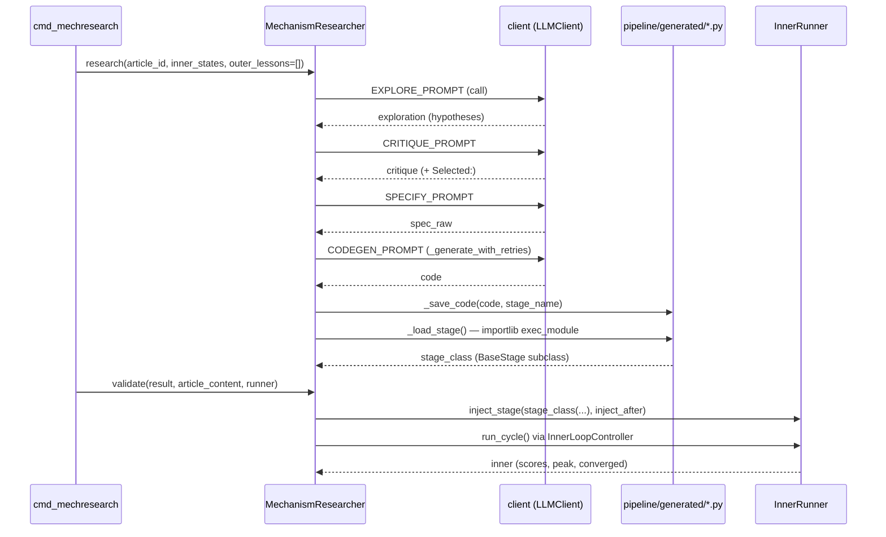

# article_opt mechanism research (Level 2)

<!-- connect:up:begin -->
> **Cross-repo concept:** part of [hypothesis-generation](../../../concepts/hypothesis-generation.md), [mechanism-level-self-improvement](../../../concepts/mechanism-level-self-improvement.md) across this wiki's repos.
<!-- connect:up:end -->
## Overview
`domains/article_opt/mechanism_research.py` is this domain's Level-2 implementation: the outer LLM treats
"what pipeline stage would break the inner loop's plateau?" as a research question, runs a four-round
Explore→Critique→Specify→Generate dialogue against DeepSeek, writes a complete Python file implementing
[`BaseStage`](../catalog/domains/article_opt/pipeline/base.md#BaseStage), dynamically imports it, and — via a
separate `validate()` call — runs a real inner cycle with the new stage spliced into the pipeline. Where
Level 1.5 ([outer.md](domains-article_opt-outer.md)) only ever emits text (prompt-override strings), this
module is the one place in `article_opt` that emits and executes **new code**.

## Diagram

## Design rationale (why it's built this way)
`MechanismResearcher` subclasses the shared `BaseMechanismResearcher` Level-2 protocol both domains
implement (its members appear in this packet as
[`client`](../catalog/core/base_mechanism_research.md#BaseMechanismResearcher.client),
[`_syntax_check`](../catalog/core/base_mechanism_research.md#BaseMechanismResearcher._syntax_check),
[`_strip_fences`](../catalog/core/base_mechanism_research.md#BaseMechanismResearcher._strip_fences), and
[`max_code_retries`](../catalog/core/base_mechanism_research.md#BaseMechanismResearcher.max_code_retries)),
and does supply all of its abstract hooks
(`_get_explore_prompt`, `_get_specify_prompt`, `_get_codegen_prompt`, `_get_reference_code`) plus its own
[`_generate_with_retries`](../catalog/domains/article_opt/mechanism_research.md#MechanismResearcher._generate_with_retries).

> [!inferred] Despite implementing every abstract hook the base class's `_run_session` template method
> expects, [`research`](../catalog/domains/article_opt/mechanism_research.md#MechanismResearcher.research)
> does **not** call `_run_session` — it re-implements the same four-round loop directly inline, calling
> [`call`](../catalog/core/llm_client.md#LLMClient.call) on
> [`client`](../catalog/core/base_mechanism_research.md#BaseMechanismResearcher.client) itself at each round
> and writing its own `01_exploration.md` … `06_summary.json` artifact files. It also fully overrides
> [`_generate_with_retries`](../catalog/domains/article_opt/mechanism_research.md#MechanismResearcher._generate_with_retries)
> with a simpler signature (no `codegen_kwargs`) rather than delegating to the base class's version at
> `core/base_mechanism_research.py:242`. The abstract methods this class implements appear to exist only to
> satisfy `BaseMechanismResearcher`'s ABC contract (and are exercised by the base class's own unit tests
> against a stub subclass) — the actual runtime path duplicates rather than reuses the shared template.

The generated code is validated by two independent gates before it ever touches a real inner cycle: a
static [`_syntax_check`](../catalog/core/base_mechanism_research.md#BaseMechanismResearcher._syntax_check)
(`compile(code, "<generated>", "exec")`) inside the retry loop, and then a dynamic
[`_load_stage`](../catalog/domains/article_opt/mechanism_research.md#MechanismResearcher._load_stage) import
via `importlib.util` that actually executes the module at load time. The load path logs an explicit warning
— *"About to execute generated code... Review the file before running in production"* — acknowledging that
passing the syntax check says nothing about what the generated module does when imported.

## Entry points
- [`research`](../catalog/domains/article_opt/mechanism_research.md#MechanismResearcher.research) — the
  4-round session entry point, called once per `cmd_mechresearch` invocation with the accumulated baseline
  [`InnerLoopState`](../catalog/core/state.md#InnerLoopState) list and an (always-empty, on this domain's
  only caller) outer-lessons list.
- [`validate`](../catalog/domains/article_opt/mechanism_research.md#MechanismResearcher.validate) — called
  after `research` returns, with a caller-supplied [`InnerRunner`](../catalog/domains/article_opt/runner.md#InnerRunner)
  into which the generated stage is spliced before a real
  [`run_cycle`](../catalog/core/inner_loop.md#InnerLoopController.run_cycle) executes it.
- [`_generate_with_retries`](../catalog/domains/article_opt/mechanism_research.md#MechanismResearcher._generate_with_retries) —
  reached from inside `research` for the code-generation-with-error-feedback sub-loop; also the point where
  a `RuntimeError` is raised (and the whole session aborts) if the code still fails to compile after
  `max_code_retries` fix attempts.

## Mechanism (step-by-step)
1. **Explore** — `research` builds a trace summary via
   [`_build_trace_summary`](../catalog/domains/article_opt/mechanism_research.md#MechanismResearcher._build_trace_summary)
   (per-cycle overall scores, dimension-A scores, peak, lesson counts) and a lessons summary, then calls
   [`client.call`](../catalog/core/llm_client.md#LLMClient.call) with `EXPLORE_PROMPT`, which explicitly frames
   dimension A ("Argumentative Rigor") as *structurally* stuck and asks for 4–6 cross-domain mechanism
   hypotheses, each tagged with a pipeline mapping and an implementation-complexity estimate.
2. **Critique** — the raw exploration text is fed back through `CRITIQUE_PROMPT`, which asks the LLM to name
   a failure mode, an implementation trap, and evidence from the trace for each hypothesis, ending with a
   `**Selected**: [n]` line; [`research`](../catalog/domains/article_opt/mechanism_research.md#MechanismResearcher.research)
   then scans the critique text line-by-line for that literal `**Selected**` marker and falls back to the
   exploration's last 600 characters if no line matches — a plain string match, not a structured field.
3. **Specify** — the selected hypothesis plus the critique's tail is sent through `SPECIFY_PROMPT`, which asks
   for a concrete stage name, an `inject after` target stage, the context keys read/written, and numbered
   pseudocode; `research` then regex-scans the spec text for known stage names and a `stage name:`/
   `stage_name:` line to recover the
   [`inject_after`](../catalog/domains/article_opt/mechanism_research.md#MechanismResult.inject_after) and
   [`stage_name`](../catalog/domains/article_opt/mechanism_research.md#MechanismResult.stage_name) fields of
   the eventual [`MechanismResult`](../catalog/domains/article_opt/mechanism_research.md#MechanismResult),
   defaulting to `"improvement_hypotheses"` and `f"generated_stage_{session_id}"` if the LLM's formatting
   doesn't match exactly.
4. **Generate + validate-by-import** —
   [`_generate_with_retries`](../catalog/domains/article_opt/mechanism_research.md#MechanismResearcher._generate_with_retries)
   sends the spec plus a reference stage (the real `improvement_hypotheses.py` source, read from disk as a
   style example) through `CODEGEN_PROMPT`, which spells out the exact `BaseStage` subclass contract the
   generated file must satisfy; on a syntax error it re-prompts with `FIX_PROMPT` containing the error and the
   broken code, up to `max_code_retries` times, and raises `RuntimeError` if the final attempt still doesn't
   compile.
5. **Save + dynamic import** — the compiling code is written under `pipeline/generated/` by
   [`_save_code`](../catalog/domains/article_opt/mechanism_research.md#MechanismResearcher._save_code) (which
   defensively checks the resolved path stays inside that directory before writing) and then imported by
   [`_load_stage`](../catalog/domains/article_opt/mechanism_research.md#MechanismResearcher._load_stage) via
   `importlib.util.spec_from_file_location` + `exec_module`; the loader then scans `dir(module)` for a
   `BaseStage` subclass that isn't `BaseStage` itself and returns that class — any exception during
   `exec_module` is caught and re-raised as a `RuntimeError` with the traceback attached, so a broken-but-
   syntactically-valid module still surfaces as a session failure rather than propagating a bare import error.
6. **Validate** —
   [`validate`](../catalog/domains/article_opt/mechanism_research.md#MechanismResearcher.validate) instantiates
   the loaded class (`result.stage_class(model=runner.model)`) and calls
   [`inject_stage`](../catalog/domains/article_opt/runner.md#InnerRunner.inject_stage) on the caller's runner,
   then drives one real [`InnerLoopController`](../catalog/core/inner_loop.md#InnerLoopController)
   [`run_cycle`](../catalog/core/inner_loop.md#InnerLoopController.run_cycle) and reports peak score,
   runs-to-7/8, convergence, and lesson count — a direct A/B measurement of the new stage's effect on the same
   article.

## Key data structures
[`MechanismResult`](../catalog/domains/article_opt/mechanism_research.md#MechanismResult) (referenced via its
`session_id`, `article_id`, `inject_after`, and `stage_name` fields cited above) carries everything the session
produced — hypothesis text, domain source, spec, generated code, the loaded class object itself (`stage_class`,
explicitly `Any` because it isn't serializable), and a `validation` dict filled in after the fact by
`validate()`. `session_dir` artifacts (`01_exploration.md` … `07_validation.json`) give each research session a
complete, replayable paper trail on disk independent of the returned Python object.

## Dynamics (design intent)
Everything in `research`/`validate` is a single synchronous call chain — one LLM round completes before the
next round's prompt is built, and the generated module's `exec_module` runs synchronously on the calling
thread with no sandboxing beyond the syntax check and the path-containment check in `_save_code`. There is no
timeout around `_load_stage`'s `exec_module` call: if the generated module has top-level code that hangs or
has side effects, nothing here bounds it.

## Edge cases
- If the critique text never contains a literal `**Selected**` line (the LLM drifts from the requested
  format), `_extract_selected` silently falls back to the last 600 characters of the *exploration* text
  rather than the critique — the "selected" hypothesis handed to Specify may then be an arbitrary tail of
  unrelated exploration prose.
- `_parse_spec_metadata`'s stage-name extraction only accepts a *space-free* token after `stage name:` (a
  value containing a space is rejected outright and the default `generated_stage_<session_id>` is kept), then
  strips everything except `[a-zA-Z0-9_]` from it — so a hyphenated name like `tabu-search-manager` becomes
  the filename stem `tabusearchmanager`, no longer reading as the LLM's chosen name.
- A generated module that compiles and imports cleanly but defines *no* `BaseStage` subclass (e.g. only
  helper functions) makes `_load_stage` raise `RuntimeError("No BaseStage subclass found...")` — a distinct
  failure mode from a syntax or runtime-exec error, surfacing only at import time, not at the syntax-check
  stage.
- Per the CLI page, `outer_lessons` is always `[]` on the only code path that calls `research` in this repo,
  so the "no outer lessons yet" branch of `_build_lessons_summary` is effectively the only branch ever
  exercised in practice here.

## Open questions
No revert-to-prior-mechanism path is visible anywhere in this file or in
[`InnerRunner.inject_stage`](../catalog/domains/article_opt/runner.md#InnerRunner.inject_stage) — injection is
described in the runner's own docstring as "permanent for this runner instance." The paper's general
description of Level 2 says a failed dynamic import restores a pre-patch backup and the old mechanism keeps
running; in this domain, a `_load_stage` failure instead raises and (unless the caller catches it) aborts the
whole `cmd_mechresearch` invocation. Whether an activate-or-revert wrapper exists in the sibling
`domains/train_opt` implementation, or whether this lighter demo domain simply omits it as out of scope for a
no-GPU illustration, isn't visible from this packet's subgraph.

## See also
- [domains-article_opt-cli.md](domains-article_opt-cli.md) — the only caller of `research`/`validate` in this
  domain.
- [domains-article_opt-outer.md](domains-article_opt-outer.md) — Level 1.5, the parameter-only counterpart
  this module is explicitly *not*: Level 1.5 never writes code, this module never touches `prompt_overrides`.
- [domains-article_opt-runner.md](domains-article_opt-runner.md) — `inject_stage`, the splice point this
  module's `validate()` calls into.
- [domains-article_opt-pipeline-base.md](domains-article_opt-pipeline-base.md) — the `BaseStage` contract the
  generated code must satisfy.
- [domains-train_opt-mechanism_research.md](domains-train_opt-mechanism_research.md) — the paper's headline
  Level-2 implementation, generating training mechanisms (Tabu Search, bandit proposers, orthogonal
  exploration) instead of pipeline stages.
- [core-base_mechanism_research.md](core-base_mechanism_research.md) — the shared abstract protocol this
  class implements but, per the design-rationale note above, appears not to actually route through at
  runtime.
- [../../../sources/bilevel-autoresearch.md](../../../sources/bilevel-autoresearch.md) — paper framing for
  Level 2 and mechanism-level self-improvement; the article_opt domain is the lighter demo, not the paper's
  own reported ablation.
