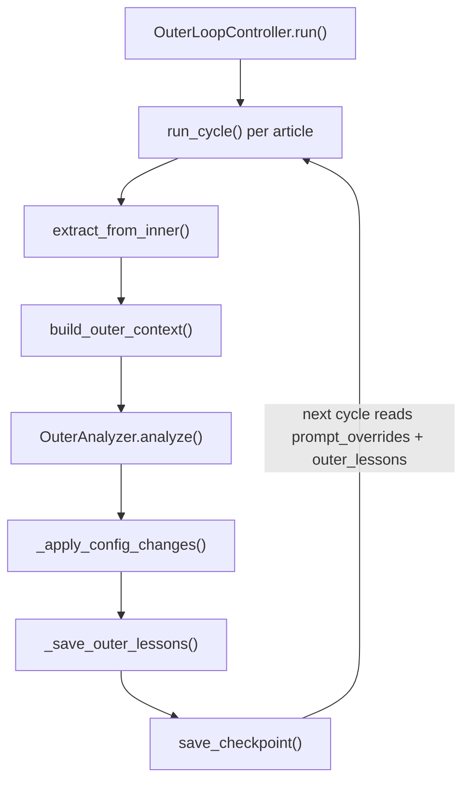

# article_opt outer loop (Level 1.5)

<!-- connect:up:begin -->
> **Cross-repo concept:** part of [closed-loop-experiment-design](../../../concepts/closed-loop-experiment-design.md) across this wiki's repos.
<!-- connect:up:end -->
## Overview
`domains/article_opt/outer.py` is this domain's Level-1.5: it never writes code and never changes which
stages run — it only reads each completed inner cycle's trace and emits per-stage **prompt-override text**
that the same fixed pipeline reads back on its next cycle. `OuterAnalyzer.analyze` is the single LLM call
that turns an inner cycle's numbers into a diagnosis and a set of prompt addenda; `OuterLoopController.run`
is the loop that repeatedly runs an inner cycle, calls the analyzer, applies its output, and checks for outer
convergence.

## Diagram

## Design rationale (why it's built this way)
`OuterAnalyzer.analyze` deliberately constructs its own
[`LLMClient`](../catalog/core/llm_client.md#LLMClient) instance per call rather than using the module-level
`call_llm`/`configure()` globals the inner loop's stages rely on — the surrounding comment is explicit that
this is "never mutates the module-level globals that the inner loop's MiniMax stages depend on," letting the
outer analysis run on a different provider/model (DeepSeek) mid-experiment without racing the inner loop's
own provider configuration.

The prompt [`analyze`](../catalog/domains/article_opt/outer.md#OuterAnalyzer.analyze) sends asks for
`prompt_overrides` restricted to "only stages that genuinely need changes," and
[`_apply_config_changes`](../catalog/domains/article_opt/outer.md#OuterLoopController._apply_config_changes)
*accumulates* rather than replaces each stage's override text across cycles — new guidance is appended under
a `## Outer Cycle N Guidance` header, and only the three most recent such sections are kept (the split keeps
`sections[0]`, which is the always-empty prefix before the first header, plus `sections[-3:]`), capping
unbounded growth of the [`prompt_overrides`](../catalog/core/state.md#OuterLoopState.prompt_overrides) text that a
stage's guidance hook reads back on every future run (see
[domains-article_opt-pipeline-base.md](domains-article_opt-pipeline-base.md)). This is the concrete mechanism
by which Level 1.5 "redirects search diversity" without ever touching the 5-stage structure itself: it can
only make existing stages' prompts longer or differently worded, never add, remove, or reorder a stage.

## Entry points
- [`run`](../catalog/domains/article_opt/outer.md#OuterLoopController.run) — called once per
  `cmd_run` invocation; owns the full outer-cycle loop for as many cycles as `max_outer_iterations` or until
  outer convergence.
- [`analyze`](../catalog/domains/article_opt/outer.md#OuterAnalyzer.analyze) — the sole LLM call in this
  module, invoked once per article per outer cycle from inside `run`.

## Mechanism (step-by-step)
1. Each outer iteration starts with [`begin_cycle`](../catalog/core/state.md#OuterLoopState.begin_cycle),
   which advances [`current_cycle`](../catalog/core/state.md#OuterLoopState.current_cycle); `run` then loops
   over every configured article in order within that single outer cycle.
2. For each article, [`run_cycle`](../catalog/core/inner_loop.md#InnerLoopController.run_cycle) drives a full
   Level-1 inner cycle to convergence or budget exhaustion, returning the completed
   [`InnerLoopState`](../catalog/core/state.md#InnerLoopState).
3. [`extract_from_inner`](../catalog/core/state.md#OuterLoopState.extract_from_inner) pulls only
   process-level signals out of that state (never article text) — peak score, runs-to-threshold,
   convergence trace, stage failure pattern, lesson quality stats — into a plain summary dict, and
   internally calls [`_archive_inner`](../catalog/core/state.md#OuterLoopState._archive_inner) to persist the
   best article version and full trace to disk before the inner state is discarded.
4. [`build_outer_context`](../catalog/core/state.md#OuterLoopState.build_outer_context) formats that summary
   plus the last five [`outer_lessons`](../catalog/core/state.md#OuterLoopState.outer_lessons) into the
   Markdown context string that becomes the bulk of the analyzer's prompt.
5. [`analyze`](../catalog/domains/article_opt/outer.md#OuterAnalyzer.analyze) sends that context plus a
   3000-character slice of the reference-frameworks document to DeepSeek, asking for a structured JSON
   verdict: root-cause bottleneck dimension, a strategy name drawn from a fixed enumeration
   (`reflexion|self_refine|opro|dspy|textgrad|voyager|other`), a list of per-stage prompt overrides, and at
   least two outer lessons; the raw response is decoded via
   [`parse_json_response`](../catalog/core/llm_client.md#parse_json_response) and any unparseable response
   degrades to an empty-overrides, `"unknown"`-strategy fallback dict rather than raising.
6. [`_apply_config_changes`](../catalog/domains/article_opt/outer.md#OuterLoopController._apply_config_changes)
   folds each `{stage, addendum}` pair into
   [`prompt_overrides`](../catalog/core/state.md#OuterLoopState.prompt_overrides) (append-and-cap, as
   described above) and records the selected strategy name; then
   [`_save_outer_lessons`](../catalog/domains/article_opt/outer.md#OuterLoopController._save_outer_lessons)
   converts each raw lesson dict into an [`OuterLesson`](../catalog/core/state.md#OuterLesson) and calls
   [`add_outer_lesson`](../catalog/core/state.md#OuterLoopState.add_outer_lesson).
7. [`reset`](../catalog/core/state.md#InnerLoopState.reset) is called on the inner state *immediately after
   each article* (inside the per-article loop), clearing that state's article/lesson/skill data before the
   next article's inner cycle begins (article content never survives past its own cycle). Then, once all
   articles in the cycle are done, [`save_checkpoint`](../catalog/core/state.md#OuterLoopState.save_checkpoint)
   persists `current_cycle`/`prompt_overrides`/`outer_lessons`/`strategy_history` to disk, and the loop checks
   outer convergence before deciding whether to run another cycle.

## Key data structures
The loop closes entirely through [`OuterLoopState`](../catalog/core/state.md#OuterLoopState): its
`prompt_overrides` dict is the only channel by which one cycle's analysis reaches the *next* cycle's inner
runs (via [`run_cycle`](../catalog/core/inner_loop.md#InnerLoopController.run_cycle) copying it onto the
runner before each cycle), and its accumulating `outer_lessons` list is the only cross-cycle memory the
analyzer's own prompt sees. [`RunResult`](../catalog/core/state.md#RunResult) (via
[`to_dict`](../catalog/core/state.md#RunResult.to_dict) and
[`stage_map`](../catalog/core/state.md#RunResult.stage_map)) is what gets archived per run for later
inspection, but is not itself part of the outer feedback loop — only the *derived* summary from
`extract_from_inner` is.

## Dynamics (design intent)
The loop is strictly sequential across both outer cycles and articles within a cycle — there is no
concurrency here, and each article's inner cycle must fully complete (converge or exhaust its budget) before
the next article's inner cycle starts within the same outer iteration. Checkpointing happens once per outer
cycle (after all articles), so a crash mid-cycle loses that cycle's partial per-article progress but not
prior cycles' accumulated `prompt_overrides`/`outer_lessons`.

## Edge cases
`_apply_config_changes`'s cap keeps `sections[0]` plus the three most recent sections when a stage's override
text grows past four `## Outer Cycle` sections — but because the stored override always *begins* with a
`## Outer Cycle` header, `sections[0]` is the empty prefix before that first header, not the first cycle's
guidance. So what actually survives is only the three most recent cycle sections; every older cycle —
including the very first — is silently dropped once more than three exist. If [`analyze`](../catalog/domains/article_opt/outer.md#OuterAnalyzer.analyze)'s JSON parse
fails, the cycle proceeds with zero prompt overrides and zero new outer lessons for that article — the outer
loop degrades gracefully rather than aborting the whole run.

## Open questions
`analyze`'s `strategy_selected.name` is drawn from a fixed, closed enumeration
(reflexion/self_refine/opro/dspy/textgrad/voyager/other) of *external* prompt-optimization frameworks — it's
not clear from this packet whether `"other"` selections, or the `decision_rule_applied` field, are ever
consumed anywhere downstream beyond logging; nothing in this file reads `strategy_selected` for anything but
the log line and `add_strategy_result` bookkeeping.

## See also
- [domains-article_opt-mechanism_research.md](domains-article_opt-mechanism_research.md) — Level 2, the
  categorically different (code-writing) counterpart this module's parameter-only design is explicitly
  contrasted against in the paper.
- [domains-article_opt-cli.md](domains-article_opt-cli.md) — `cmd_run`, the only caller of `run`.
- [domains-article_opt-runner.md](domains-article_opt-runner.md) — where `prompt_overrides` actually gets
  read back into a running pipeline, via `_outer_guidance`.
- [domains-train_opt-outer.md](domains-train_opt-outer.md) — the analogous Level-1.5 in the paper's headline
  GPT-pretraining domain (freeze/unfreeze parameters instead of prompt-override text).
- [../../../sources/bilevel-autoresearch.md](../../../sources/bilevel-autoresearch.md) — paper framing;
  §2.6 draws exactly the parameters-vs-structure line this module's design embodies.
