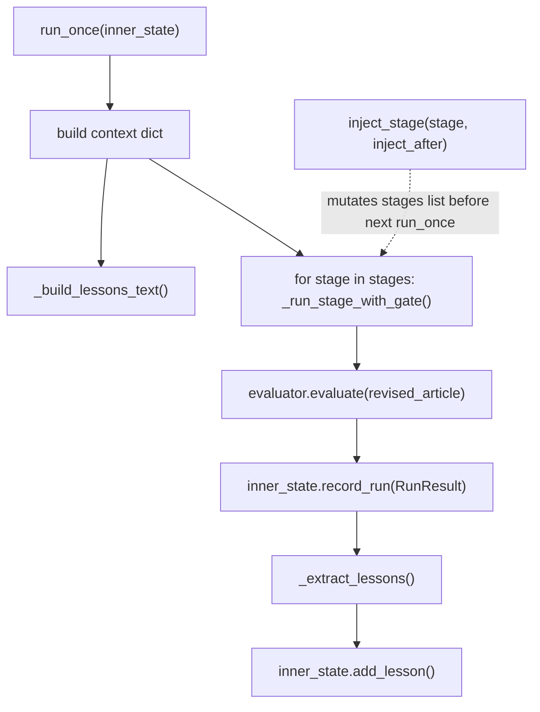

# article_opt inner runner (Level 1 execution)

## Overview
`domains/article_opt/runner.py` is the Level-1 workhorse: `InnerRunner` owns the ordered list of pipeline
stages, drives one full pass through all of them for a single "run," evaluates the result, and extracts
lessons for the next run in the same cycle. It is also the one object Level 2 mutates directly —
[`inject_stage`](../catalog/domains/article_opt/runner.md#InnerRunner.inject_stage) is how a
Level-2-generated stage becomes part of a live pipeline, and it is intentionally a permanent, in-place
mutation rather than a copy-on-write operation.

## Diagram

## Design rationale (why it's built this way)
[`stages`](../catalog/domains/article_opt/runner.md#InnerRunner.stages) is a plain Python list built once in
`__init__` from the five concrete stage classes, each constructed with the same `model` string — there is no
registry, factory, or declarative pipeline spec; the pipeline *is* this list, in this order, and
[`inject_stage`](../catalog/domains/article_opt/runner.md#InnerRunner.inject_stage)'s whole implementation is
a linear scan for `s.name == inject_after` followed by `list.insert`. The docstring is explicit that this
mutation is "permanent for this runner instance — clone the runner if you need a clean baseline," which is
exactly why [`domains-article_opt-cli.md`](domains-article_opt-cli.md)'s `cmd_mechresearch` builds a
*second*, independent runner (`val_runner`) for validation rather than reusing the runner used to build
baseline trace data.

Quality control inside a single run is deliberately shallow: rather than a per-stage LLM-judged score,
[`_run_stage_with_gate`](../catalog/domains/article_opt/runner.md#InnerRunner._run_stage_with_gate) assigns a
flat `{"score": 7, "feedback": ""}` to every stage except `revised_output`, where it checks only that the
output is longer than 100 characters (retrying that stage — up to the runner's `max_retries` budget — with
that feedback if not). The comment above it is
explicit about the trade-off: *"Full per-stage scoring would require a stage-level evaluator... For
simplicity, we trust the final article evaluator as ground truth."* — real per-dimension quality signal comes
only from [`evaluate`](../catalog/domains/article_opt/evaluator/article_evaluator.md#ArticleEvaluator.evaluate)
at the end of the run, not from any intermediate stage gate.

## Entry points
- [`run_once`](../catalog/domains/article_opt/runner.md#InnerRunner.run_once) — the only method that executes
  a full pipeline pass; called repeatedly by the inner loop controller (see
  [core-inner_loop.md](core-inner_loop.md)) until convergence or budget, and once directly by
  [`cmd_once`](../catalog/domains/article_opt/cli.md#cmd_once) as a smoke test.
- [`inject_stage`](../catalog/domains/article_opt/runner.md#InnerRunner.inject_stage) — called exactly once
  per validation session, from the Level-2 validation step (see
  [domains-article_opt-mechanism_research.md](domains-article_opt-mechanism_research.md)), before any
  `run_once` call sees the new stage.

## Mechanism (step-by-step)
1. [`run_once`](../catalog/domains/article_opt/runner.md#InnerRunner.run_once) computes the run number from
   `len(inner_state.run_trace) + 1`, builds a namespaced `run_dir` (under a per-`outer_cycle` subdirectory if
   one is set), and assembles the `context` dict — including
   [`_build_lessons_text`](../catalog/domains/article_opt/runner.md#InnerRunner._build_lessons_text)'s output
   under `retrieved_lessons` and the runner's own `prompt_overrides` under `outer_guidance`.
2. [`_build_lessons_text`](../catalog/domains/article_opt/runner.md#InnerRunner._build_lessons_text) formats
   two tiers of lesson material: promoted, high-confidence
   [`inner_skills`](../catalog/core/state.md#InnerLoopState.inner_skills) shown as "Verified Rules," and up to
   eight raw [`inner_lessons`](../catalog/core/state.md#InnerLoopState.inner_lessons) sorted by
   `(run_number, confidence)` descending and tagged `✓`/`~` by confidence — both tiers are injected on
   *every* run regardless of whether any lesson has cleared the confidence bar yet, so a stage always has
   something to read even early in a cycle.
3. For each stage in [`stages`](../catalog/domains/article_opt/runner.md#InnerRunner.stages),
   [`_run_stage_with_gate`](../catalog/domains/article_opt/runner.md#InnerRunner._run_stage_with_gate) calls
   `stage.run(context)`, applies the flat scoring described above, and writes the stage's output string into
   `context["previous_outputs"][stage.name]` so every later stage in the same run can read earlier stages'
   text.
4. After all stages complete, `run_once` calls
   [`evaluate`](../catalog/domains/article_opt/evaluator/article_evaluator.md#ArticleEvaluator.evaluate) on
   the final `revised_output` text (retrying up to three times if the evaluator's own JSON parse fails), maps
   its five rubric dimensions into a fresh set of [`StageScore`](../catalog/core/state.md#StageScore) objects
   (dimension letters `A`–`E`, not stage names — a second, parallel scoring axis from the per-stage scores
   computed in step 3), and builds the [`RunResult`](../catalog/core/state.md#RunResult) that becomes this
   run's entry in [`run_trace`](../catalog/core/state.md#InnerLoopState.run_trace) via
   [`record_run`](../catalog/core/state.md#InnerLoopState.record_run).
5. [`_extract_lessons`](../catalog/domains/article_opt/runner.md#InnerRunner._extract_lessons) makes one more
   LLM call, this time asking specifically for 2–4 structured lessons about *this run* (what editing pattern
   worked or failed, which stage most limited quality), parses the response via
   [`parse_json_response`](../catalog/core/llm_client.md#parse_json_response), and calls
   [`add_lesson`](../catalog/core/state.md#InnerLoopState.add_lesson) for each parsed item — a response that
   fails to parse as a list yields zero lessons for that run rather than raising.
6. [`inject_stage`](../catalog/domains/article_opt/runner.md#InnerRunner.inject_stage) is the one path that
   changes `stages` itself: it linear-scans for the stage named `inject_after`, inserts the new stage
   immediately after it, and raises `ValueError` (listing the available stage names) if no match is found —
   the caller must know the target stage's exact `name`, matching whatever the Level-2 generator (see
   [domains-article_opt-mechanism_research.md](domains-article_opt-mechanism_research.md)) parsed out of the
   LLM's specification text.

## Key data structures
[`stages`](../catalog/domains/article_opt/runner.md#InnerRunner.stages) is the mutable pipeline itself — a
plain list, ordered, mutated in place by `inject_stage`. `prompt_overrides` (set by the inner loop
controller before each cycle — see [core-inner_loop.md](core-inner_loop.md) — not owned by the runner) and
[`outer_cycle`](../catalog/domains/article_opt/runner.md#InnerRunner.outer_cycle) (used purely for
artifact-path namespacing) are the only two pieces of state the outer/Level-1.5 layer sets on a runner
instance from outside. [`RunResult`](../catalog/core/state.md#RunResult) and
[`StageScore`](../catalog/core/state.md#StageScore) are the per-run output records that carry both the
per-stage flat scores and the evaluator's rubric scores, and get archived to disk.

## Dynamics (design intent)
Everything in `run_once` is sequential and synchronous — stages execute strictly in list order, each one
blocking on its own LLM call(s) before the next stage starts, and the evaluator + lesson-extraction calls at
the end of a run happen only after every stage has finished. There is no retry budget shared across stages:
each stage's own `max_retries` (or the runner's global default) governs only that stage's quality-gate loop
inside `_run_stage_with_gate`.

## Edge cases
[`_build_lessons_text`](../catalog/domains/article_opt/runner.md#InnerRunner._build_lessons_text) caps
displayed raw lessons at 8, sorted by `(run_number, confidence)` — a lesson from an early run with high
confidence can be pushed out of the visible window by eight more-recent, lower-confidence lessons, since the
sort key prioritizes recency over confidence. `_run_stage_with_gate`'s short-output retry only fires for the
stage literally named `"revised_output"`; a differently-named Level-2-injected replacement for that stage
would not receive this length check unless it happens to reuse that exact name.

## Open questions
Because [`inject_stage`](../catalog/domains/article_opt/runner.md#InnerRunner.inject_stage) mutates `stages`
permanently and [`_run_stage_with_gate`](../catalog/domains/article_opt/runner.md#InnerRunner._run_stage_with_gate)
gives every stage but `revised_output` an unconditional score of 7, an injected Level-2 stage's own output
quality is never independently gated within a run — its effect only shows up indirectly, through whatever the
final evaluator scores after it has (or hasn't) changed `previous_outputs` for the stages downstream of it.

## See also
- [domains-article_opt-mechanism_research.md](domains-article_opt-mechanism_research.md) — the only caller
  of `inject_stage`, and the source of the stage classes it inserts.
- [domains-article_opt-pipeline-base.md](domains-article_opt-pipeline-base.md) — the `BaseStage` contract
  every entry in `stages` satisfies.
- [domains-article_opt-outer.md](domains-article_opt-outer.md) — the source of `prompt_overrides`, read here
  via the `outer_guidance` context key.
- [domains-article_opt-cli.md](domains-article_opt-cli.md) — where runners are constructed
  (`make_runner`) and where `run_once`/`run_cycle` are ultimately triggered from.
- [core-inner_loop.md](core-inner_loop.md) — `InnerLoopController`, the controller that calls `run_once`
  repeatedly and sets `prompt_overrides`/`outer_cycle` before each cycle.
- [domains-train_opt-runner.md](domains-train_opt-runner.md) — the analogous Level-1 executor in the paper's
  headline GPT-pretraining domain, driving a training config instead of an article-editing pipeline.
- [../../../sources/bilevel-autoresearch.md](../../../sources/bilevel-autoresearch.md) — paper framing;
  this module is the unmodified "Level 1" the paper describes — the object both Level 1.5 and Level 2 act
  on but never replace outright (Level 1.5 adjusts its inputs, Level 2 splices new stages into it).
