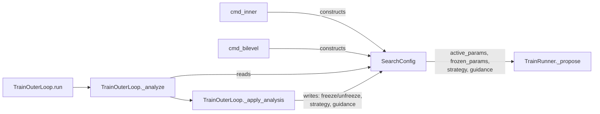

# SearchConfig — the Level 1.5 control surface

## Overview
[`SearchConfig`](../catalog/domains/train_opt/config.md#SearchConfig) is the one piece of shared, mutable
state between Level 1 (the inner loop, [`TrainRunner`](domains-train_opt-runner.md)) and Level 1.5 (the
outer loop, [`TrainOuterLoop`](domains-train_opt-outer.md)): a plain dataclass holding which hyperparameters
are currently searchable, which are frozen, a `strategy` label, a free-text `guidance` string, and the two
timing knobs (`inner_budget`, `time_budget`). It is deliberately *data, not code* — the module docstring
states the design intent directly: "The outer loop modifies this config to change HOW the inner loop
searches, not WHAT it searches for." Level 1.5 is the only writer (via
[`_apply_analysis`](domains-train_opt-outer.md)); Level 1 is the primary reader, almost entirely through the
[`active_params`](../catalog/domains/train_opt/config.md#SearchConfig.active_params) property.

## Diagram

## Design rationale (why it's built this way)
`SearchConfig` is this repo's most literal embodiment of the paper's own distinction between Level 1.5 and
Level 2: "Level 1.5 can redirect search diversity but cannot change the proposal generation logic, the
acceptance criterion, or the loop structure" (paper §2.6). The entire `SearchConfig` surface is six fields
and one derived property — there is no code path by which anything reachable through `SearchConfig` can alter
*how* [`TrainRunner`](domains-train_opt-runner.md) proposes or accepts changes, only *which* parameters it
is allowed to touch and what text gets prepended to its prompt.

`editable_params`'s default factory hardcodes the exact 15 hyperparameter names Karpathy's `train.py`
exposes (`ASPECT_RATIO`, `HEAD_DIM`, `WINDOW_PATTERN`, `TOTAL_BATCH_SIZE`, the four learning-rate fields,
`WEIGHT_DECAY`, `ADAM_BETAS`, the three schedule ratios, `DEPTH`, `DEVICE_BATCH_SIZE`) — this is the fixed
vocabulary both Level 1's proposals and Level 1.5's freeze/unfreeze directives are restricted to.

> [!inferred] The catalog signature for [`strategy`](../catalog/domains/train_opt/config.md#SearchConfig.strategy)
> shows `Literal['explore']` and its sibling `guidance` field shows an equally narrow inferred type — these
> are static-analysis artifacts of SCIP narrowing a type to the single default value it observed, not an
> actual enum constraint. The source comment on `strategy` lists
> `"explore", "exploit", "focused_lr", "architecture_search"` as valid values, and
> [`TrainOuterLoop._apply_analysis`](domains-train_opt-outer.md) writes `"focused"` too — the field is a
> plain `str`. A reader trusting the catalog signature literally would be misled.

## Entry points
- [`SearchConfig`](../catalog/domains/train_opt/config.md#SearchConfig) — constructed once per experiment by
  [`cmd_inner`](../catalog/domains/train_opt/cli.md#cmd_inner) or
  [`cmd_bilevel`](../catalog/domains/train_opt/cli.md#cmd_bilevel), and passed into `TrainRunner` as the
  runner's `search_config`.
- [`active_params`](../catalog/domains/train_opt/config.md#SearchConfig.active_params) — the derived
  property both `TrainRunner._propose` and `TrainOuterLoop` read every cycle; it is the only place
  `frozen_params` actually takes effect.

## Mechanism (step-by-step)
1. [`cmd_inner`](../catalog/domains/train_opt/cli.md#cmd_inner) and
   [`cmd_bilevel`](../catalog/domains/train_opt/cli.md#cmd_bilevel) each construct one
   [`SearchConfig`](../catalog/domains/train_opt/config.md#SearchConfig) from CLI-supplied
   `inner_budget`/`time_budget`, leaving `editable_params`, `frozen_params`, `strategy`, and `guidance` at
   their cold-start defaults — no parameter starts frozen and no guidance text exists before the first
   outer cycle.
2. `TrainRunner._propose` reads `search_config`'s
   [`strategy`](../catalog/domains/train_opt/config.md#SearchConfig.strategy), `frozen_params`, and
   `guidance` directly, and calls
   [`active_params`](../catalog/domains/train_opt/config.md#SearchConfig.active_params) — a property whose
   body is `[p for p in editable_params if p not in frozen_params]`, backed by
   [`frozen_params`](../catalog/domains/train_opt/config.md#SearchConfig.frozen_params) — to build the set
   of parameters the LLM is told it may still change.
3. [`_apply_analysis`](../catalog/domains/train_opt/outer.md#TrainOuterLoop._apply_analysis) (see
   [`domains-train_opt-outer`](domains-train_opt-outer.md)) is the **only** writer outside construction: it
   appends to / removes from [`frozen_params`](../catalog/domains/train_opt/config.md#SearchConfig.frozen_params)
   and overwrites [`strategy`](../catalog/domains/train_opt/config.md#SearchConfig.strategy) and `guidance`
   based on the outer LLM's JSON verdict for that cycle — the sole channel through which Level 1.5 acts on
   Level 1.
4. [`run`](../catalog/domains/train_opt/outer.md#TrainOuterLoop.run) and
   [`_analyze`](../catalog/domains/train_opt/outer.md#TrainOuterLoop._analyze) (both on
   [`TrainOuterLoop`](domains-train_opt-outer.md)) read
   [`active_params`](../catalog/domains/train_opt/config.md#SearchConfig.active_params),
   [`frozen_params`](../catalog/domains/train_opt/config.md#SearchConfig.frozen_params), and
   [`strategy`](../catalog/domains/train_opt/config.md#SearchConfig.strategy) back out of the same
   `search_config` object to log the current state and to describe it to the outer LLM before asking for
   the next verdict — Level 1.5 always reasons about the config it itself last wrote, closing the loop
   within a single `SearchConfig` instance shared for the whole experiment.
5. [`cmd_bilevel`](../catalog/domains/train_opt/cli.md#cmd_bilevel) is what actually turns this into a
   two-level experiment: it wires a second (outer) LLM client and a `TrainOuterLoop` around the same
   `runner`/`search_config` pair that a bare `cmd_inner` run would use alone, then calls
   [`run`](../catalog/domains/train_opt/outer.md#TrainOuterLoop.run).

## Key data structures
- `SearchConfig.editable_params` — fixed list of the 15 hyperparameter names Level 1 is ever allowed to
  propose changes to; never modified after construction.
- `SearchConfig.frozen_params` — the outer loop's block-list; the *only* field `_apply_analysis` mutates by
  appending/removing entries.
- `SearchConfig.strategy` / `SearchConfig.guidance` — free-form text injected into every proposal prompt;
  `guidance` is fully overwritten (not appended to) each cycle the outer loop fires.

## Dynamics (design intent)
`SearchConfig` has no independent lifecycle of its own — it is a single long-lived object shared by
reference between the `TrainRunner` and `TrainOuterLoop` instances for the duration of one experiment.
There is no versioning, snapshotting, or locking around it: reads and writes are synchronous and
single-threaded, one inner iteration or one outer analysis at a time.

## Edge cases
`_propose`'s `simple_mode` branch (see [`domains-train_opt-runner`](domains-train_opt-runner.md)) still
reads `active_params`/`frozen_params` and silently drops any LLM-proposed parameter not in `active_params`
rather than erroring — so a `SearchConfig` produced by an aggressive freeze pass can cause proposals to be
partially discarded post-hoc, logged only as a warning.

## Open questions
The catalog's inferred `Literal[...]` types on `strategy`/`guidance`/`time_budget` (see Design rationale)
could mislead a tool or reader that trusts them as an actual value constraint rather than an SCIP artifact
of the single observed default.

## See also
- [`domains-train_opt-outer`](domains-train_opt-outer.md) — the sole writer of `SearchConfig` (Level 1.5).
- [`domains-train_opt-runner`](domains-train_opt-runner.md) — the primary reader (Level 1).
- [`domains-train_opt-mechanism_research`](domains-train_opt-mechanism_research.md) — Level 2, which never
  touches `SearchConfig` directly; it patches `runner.py` instead.
- [`domains-article_opt-outer`](domains-article_opt-outer.md) — the sibling domain's analogous Level-1.5
  control surface.
- [`../../../sources/bilevel-autoresearch`](../../../sources/bilevel-autoresearch.md) — paper summary; see
  "Level 1.5 vs. Level 2: parameters vs. structure."
- [`../../autoresearch/overview`](../../autoresearch/overview.md) — Karpathy's `autoresearch`, the Level-1
  benchmark this domain reproduces.
