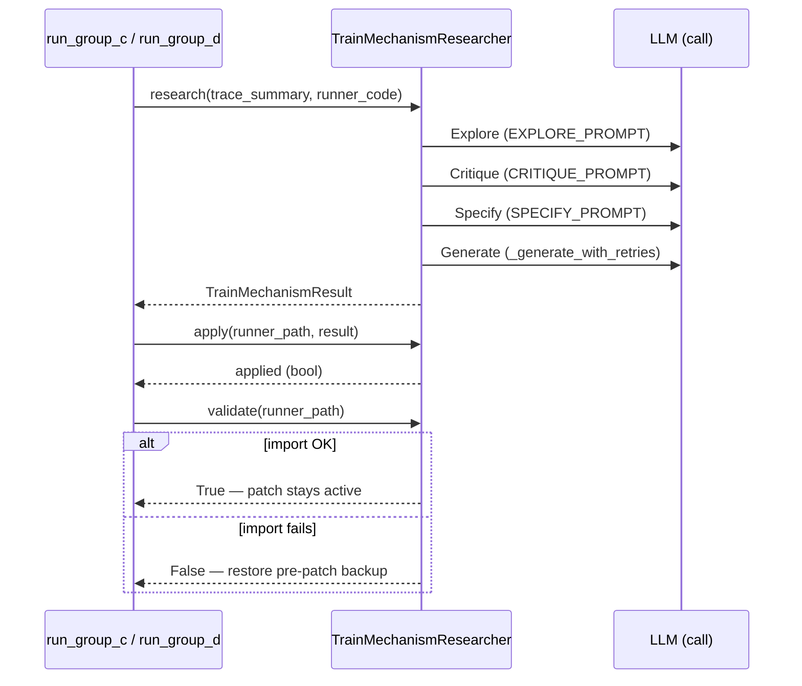

# TrainMechanismResearcher — Level 2's Explore→Critique→Specify→Generate dialogue

<!-- connect:up:begin -->
> **Cross-repo concept:** part of [hypothesis-generation](../../../concepts/hypothesis-generation.md), [mechanism-level-self-improvement](../../../concepts/mechanism-level-self-improvement.md) across this wiki's repos.
<!-- connect:up:end -->
## Overview
`TrainMechanismResearcher` is
the paper's Level 2, in full: a fixed, human-authored 4-round LLM dialogue that reads the inner loop's trace
and `runner.py` source, converges on **one** new-or-replacement mechanism, writes it as a Python code
fragment, and hands it off for activation-or-revert. The module docstring lays out the pipeline exactly:
"1. Explore ... 2. Critique ... 3. Specify ... 4. Generate ... 5. Apply ... 6. Fix ... 7. Validate." The
class inherits its retry/syntax-check skeleton from `core.BaseMechanismResearcher` (shared with the
article-revision domain) and supplies only the training-domain-specific prompts and four AST/regex-based
code-surgery strategies for patching `TrainRunner`.

## Diagram

## Design rationale (why it's built this way)
[`apply`](../catalog/domains/train_opt/mechanism_research.md#TrainMechanismResearcher.apply) always writes a
`.py.bak_<session_id>` backup **before** attempting any patch, and
[`validate`](../catalog/domains/train_opt/mechanism_research.md#TrainMechanismResearcher.validate) runs the
import check as a **separate subprocess** rather than importing in-process — the docstring is explicit:
"Uses a subprocess to avoid polluting the current process's module cache." This is the concrete mechanism
behind the paper's claim that the generated module is "validated by dynamically importing it (`importlib`)
before activation," and plausibly the exact boundary implicated in the paper's own flagged limitation — a
"dynamic load fragility bug (`sys.modules` registration)" that once made mechanism injections silently fall
back to the unmodified runner. Running the check out-of-process is a defensive design against exactly that
class of same-process import-cache corruption.

[`_parse_spec_metadata`](../catalog/domains/train_opt/mechanism_research.md#TrainMechanismResearcher._parse_spec_metadata)
falls back to safe defaults (`"new_helper_class"` strategy, a synthesized `mechanism_name`) whenever the
LLM's free-text Specify round doesn't parse cleanly — a robustness-over-precision choice appropriate for a
pipeline meant to run unattended overnight.

## Entry points
- [`research`](../catalog/domains/train_opt/mechanism_research.md#TrainMechanismResearcher.research) — the
  Level-2 entry point, invoked between inner-loop batches by
  [`run_group_c`](../catalog/experiments/ablations/paper_ablation/run_ablation.md#run_group_c) and
  [`run_group_d`](../catalog/experiments/ablations/paper_ablation/run_ablation.md#run_group_d).
- [`apply`](../catalog/domains/train_opt/mechanism_research.md#TrainMechanismResearcher.apply) — patches
  `runner.py` according to the generated result's `implementation_strategy`.
- [`validate`](../catalog/domains/train_opt/mechanism_research.md#TrainMechanismResearcher.validate) — the
  dynamic-import activation gate.

## Mechanism (step-by-step)
1. [`research`](../catalog/domains/train_opt/mechanism_research.md#TrainMechanismResearcher.research) infers
   a bottleneck heuristically via
   [`_infer_bottleneck`](../catalog/domains/train_opt/mechanism_research.md#TrainMechanismResearcher._infer_bottleneck)
   if none is given and summarizes the existing mechanism library via
   [`_summarize_existing_mechanisms`](../catalog/domains/train_opt/mechanism_research.md#TrainMechanismResearcher._summarize_existing_mechanisms),
   then **Round 1 (Explore)** asks the LLM, via
   [`EXPLORE_PROMPT`](../catalog/domains/train_opt/mechanism_research.md#EXPLORE_PROMPT)/
   [`EXPLORE_SYSTEM`](../catalog/domains/train_opt/mechanism_research.md#EXPLORE_SYSTEM), to propose 3–4
   mechanism hypotheses drawn from any field ("optimization theory, evolutionary algorithms, Bayesian
   optimization, statistical physics, reinforcement learning, or anything else you find useful").
2. **Round 2 (Critique)** scores each hypothesis (impact × feasibility ÷ complexity) via
   [`CRITIQUE_PROMPT`](../catalog/domains/train_opt/mechanism_research.md#CRITIQUE_PROMPT)/
   [`CRITIQUE_SYSTEM`](../catalog/domains/train_opt/mechanism_research.md#CRITIQUE_SYSTEM) and ends with a
   single `**Selected**: N` line, which
   [`_extract_selected`](../catalog/domains/train_opt/mechanism_research.md#TrainMechanismResearcher._extract_selected)
   pulls out (falling back to the last 800 characters of the Explore output if no such line is found).
3. **Round 3 (Specify)** turns the selected hypothesis into an implementation spec — a mechanism name, one
   of four `implementation_strategy` values (`new_method`/`replace_method`/`new_helper_class`/`modify_init`),
   and a target symbol — via
   [`SPECIFY_PROMPT`](../catalog/domains/train_opt/mechanism_research.md#SPECIFY_PROMPT)/
   [`SPECIFY_SYSTEM`](../catalog/domains/train_opt/mechanism_research.md#SPECIFY_SYSTEM), parsed by
   [`_parse_spec_metadata`](../catalog/domains/train_opt/mechanism_research.md#TrainMechanismResearcher._parse_spec_metadata)
   with the safe-default fallback described above; the runner-class context it's shown comes from
   [`_extract_runner_section`](../catalog/domains/train_opt/mechanism_research.md#TrainMechanismResearcher._extract_runner_section).
4. **Round 4 (Generate)** is
   [`_generate_with_retries`](../catalog/domains/train_opt/mechanism_research.md#TrainMechanismResearcher._generate_with_retries):
   one [`CODEGEN_PROMPT`](../catalog/domains/train_opt/mechanism_research.md#CODEGEN_PROMPT) call followed by
   up to `max_code_retries` syntax-check/[`FIX_PROMPT`](../catalog/core/base_mechanism_research.md#FIX_PROMPT)
   round-trips, using Python's own `compile()` (via
   [`_syntax_check`](../catalog/core/base_mechanism_research.md#BaseMechanismResearcher._syntax_check) /
   [`_strip_fences`](../catalog/core/base_mechanism_research.md#BaseMechanismResearcher._strip_fences)) as
   the correctness oracle gating each retry before the fragment is handed to `apply()` (which alone writes
   it into `runner.py`). The base-class
   [`_generate_with_retries`](../catalog/core/base_mechanism_research.md#BaseMechanismResearcher._generate_with_retries)
   supplies the generic retry loop that both this domain and the article-revision domain share, calling out
   through [`client`](../catalog/core/base_mechanism_research.md#BaseMechanismResearcher.client) (an
   [`LLMClient`](../catalog/core/llm_client.md#LLMClient)) and
   [`call`](../catalog/core/llm_client.md#LLMClient.call).
5. All four rounds' outputs are packaged into one
   [`TrainMechanismResult`](../catalog/domains/train_opt/mechanism_research.md#TrainMechanismResult) — not
   yet applied — and summarized to disk via
   [`_save_summary`](../catalog/domains/train_opt/mechanism_research.md#TrainMechanismResearcher._save_summary).
6. [`apply`](../catalog/domains/train_opt/mechanism_research.md#TrainMechanismResearcher.apply) is a
   separate, later call: it always backs up the current `runner.py` first, then dispatches on
   `implementation_strategy` to
   [`_insert_helper_class`](../catalog/domains/train_opt/mechanism_research.md#TrainMechanismResearcher._insert_helper_class),
   [`_replace_method`](../catalog/domains/train_opt/mechanism_research.md#TrainMechanismResearcher._replace_method),
   or [`_append_to_init`](../catalog/domains/train_opt/mechanism_research.md#TrainMechanismResearcher._append_to_init)
   (via [`_ast_append_to_init`](../catalog/domains/train_opt/mechanism_research.md#TrainMechanismResearcher._ast_append_to_init)),
   then re-runs a file-level syntax check on the *whole* patched file — a second check on top of Round 4's
   fragment-level check — before writing, setting
   [`applied`](../catalog/domains/train_opt/mechanism_research.md#TrainMechanismResult.applied) and, on
   failure, [`validation_error`](../catalog/domains/train_opt/mechanism_research.md#TrainMechanismResult.validation_error).
7. [`validate`](../catalog/domains/train_opt/mechanism_research.md#TrainMechanismResearcher.validate) is the
   activation gate: it spawns a fresh `python -c "import <module>"` subprocess against the patched file, out
   of process, so a broken import cannot corrupt the currently-running experiment's own module cache —
   literally the paper's "validated by dynamically importing it (`importlib`) before activation."
8. Activate-or-revert itself is orchestrated one layer up, in
   [`run_group_c`](../catalog/experiments/ablations/paper_ablation/run_ablation.md#run_group_c) and
   [`run_group_d`](../catalog/experiments/ablations/paper_ablation/run_ablation.md#run_group_d): they call
   `apply()`, and only if it succeeds do they call `validate()`; a failed `validate()` restores the
   pre-patch backup file that `apply()` had written — exactly the paper's "if the import fails, the
   pre-patch backup is restored and the old mechanism keeps running."

## Key data structures
[`TrainMechanismResult`](../catalog/domains/train_opt/mechanism_research.md#TrainMechanismResult) —
[`session_id`](../catalog/domains/train_opt/mechanism_research.md#TrainMechanismResult.session_id),
[`hypothesis`](../catalog/domains/train_opt/mechanism_research.md#TrainMechanismResult.hypothesis),
[`mechanism_name`](../catalog/domains/train_opt/mechanism_research.md#TrainMechanismResult.mechanism_name),
[`implementation_strategy`](../catalog/domains/train_opt/mechanism_research.md#TrainMechanismResult.implementation_strategy),
[`target`](../catalog/domains/train_opt/mechanism_research.md#TrainMechanismResult.target),
[`code`](../catalog/domains/train_opt/mechanism_research.md#TrainMechanismResult.code),
[`code_retries`](../catalog/domains/train_opt/mechanism_research.md#TrainMechanismResult.code_retries),
[`applied`](../catalog/domains/train_opt/mechanism_research.md#TrainMechanismResult.applied), and
[`validation_error`](../catalog/domains/train_opt/mechanism_research.md#TrainMechanismResult.validation_error)
— the one artifact threading all four rounds together and back out to the ablation harness.

## Dynamics (design intent)
Rounds are strictly sequential — each round's prompt embeds the previous round's raw text output verbatim,
with no parallelism across rounds. Only Round 4 (code generation) has a retry loop
([`max_code_retries`](../catalog/core/base_mechanism_research.md#BaseMechanismResearcher.max_code_retries));
Rounds 1–3 have no retry mechanism at all — a malformed Explore/Critique/Specify response degrades via
string-parsing fallbacks (see Edge cases) rather than triggering another LLM call.

## Edge cases
If the Specify round's text doesn't contain a recognizably-formatted strategy or name,
[`_parse_spec_metadata`](../catalog/domains/train_opt/mechanism_research.md#TrainMechanismResearcher._parse_spec_metadata)
silently defaults to `"new_helper_class"` — so most malformed specs still produce a class-append action
rather than failing outright. If the generated code names a
[`_replace_method`](../catalog/domains/train_opt/mechanism_research.md#TrainMechanismResearcher._replace_method)
target that doesn't exist in `TrainRunner`, the AST-based replacement raises and the regex fallback also
fails to match, which `apply()` catches as a `patch_apply_error` — returning `False` with no partial write,
so a bad target name fails closed rather than corrupting the file.

## Open questions
Whether generated code that imports an unavailable third-party package (the paper's reverted
GP-Regressor/`sklearn` case) is caught at `validate()`'s subprocess-import step or only later, at an actual
runtime import inside a reloaded module elsewhere in the harness, is not directly evidenced by anything in
this packet's Subgraph — the subprocess import of the whole patched module should catch it, but that is a
reading of `validate`'s described behavior, not a directly traced execution.

## See also
- [`domains-train_opt-outer`](domains-train_opt-outer.md) — Level 1.5; notably does **not** call into this
  class at all (see that page's Design rationale).
- [`domains-train_opt-runner`](domains-train_opt-runner.md) — the `TrainRunner`/`runner.py` this class
  patches.
- [`domains-article_opt-mechanism_research`](domains-article_opt-mechanism_research.md) — the sibling
  domain's own Level-2 researcher, sharing the same `core.BaseMechanismResearcher` skeleton.
- [`core-base_mechanism_research`](core-base_mechanism_research.md),
  [`core-llm_client`](core-llm_client.md) — the domain-agnostic framework this class builds on.
- [`../../../sources/bilevel-autoresearch`](../../../sources/bilevel-autoresearch.md) — paper summary; see
  "Level 2 — mechanism research and code injection" and "What Level 2 actually discovered."
- [`../../autoresearch/overview`](../../autoresearch/overview.md) — the Level-1 benchmark Level 2's
  generated mechanisms ultimately try to improve search over.
