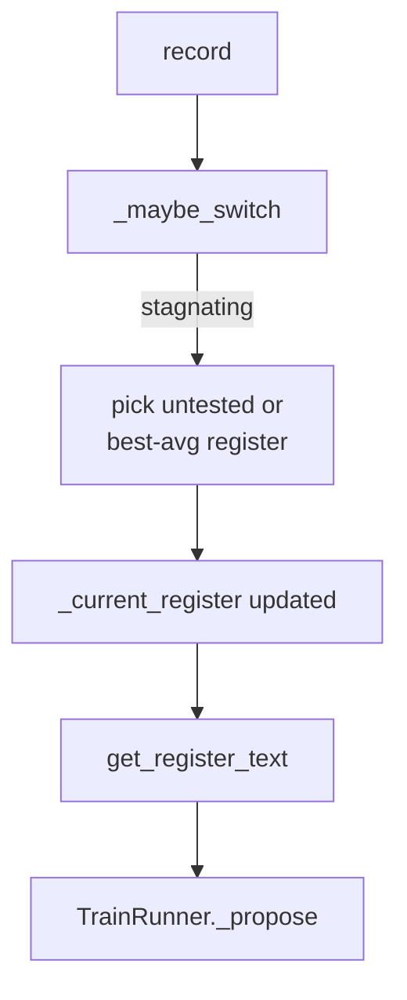

# RegisterAdaptation — adaptive prompt register selection

`RegisterAdaptation` is one of the ~40 named "Improvement" helper mechanisms wired into
[`domains-train_opt-runner`](domains-train_opt-runner.md)'s non-`simple_mode` `TrainRunner`: a small,
outcome-driven switcher among three *fixed*, hand-written prompt-wrapping styles.

## Overview
The module's own docstring frames it as "Translation Theory Mechanism 38": the idea that the *register* —
formal academic, informal/casual, or terse-numerical — of the text wrapped around the proposal prompt
measurably changes the character of the LLM's hyperparameter proposals, so the module tracks which of the
three fixed registers has produced the best recent `val_bpb` deltas and switches among them when the current
one stagnates. It never writes or evaluates new code — it selects, at each iteration, one of three
pre-written text blocks. Despite almost certainly having originated from some earlier session in the same
creative style as dozens of similarly-flavored modules in this file (permaculture, astronomy, paleontology,
translation-theory metaphors are all represented), it is today a static Level-1 prompt-content helper, not
an instance of the paper's Level-2 mechanism-generation machinery: it does not read/write/import Python code
at runtime, and there is no path from this module back into `runner.py`'s own logic.

## Diagram

## Design rationale (why it's built this way)
The docstring states the intent precisely: "Formal prompts elicit conservative, well-reasoned but timid
proposals. Informal prompts elicit creative but riskier ideas. Terse numerical prompts elicit precise but
narrow changes. ... During early exploration, use informal/creative register. During late exploitation, use
formal/precise register. During stagnation, switch register to break patterns."

[`_maybe_switch`](../catalog/domains/train_opt/mechanisms/register_adaptation.md#RegisterAdaptation._maybe_switch)'s
untested-register-first rule — if an alternative register has fewer than `_min_samples` observations, jump to
it before ever comparing historical averages — is a simple explore-before-exploit heuristic: a register with
too little data is preferred over one with a known-but-mediocre track record, on the reasoning that its true
quality is still unknown.

> [!inferred] `_current_register` starts fixed at `"formal"` — there is exactly one active register at any
> time, never more, and switching is a hard cutover rather than a blend. This mirrors, at a much smaller
> scale, the paper's own framing of Level 2 as having no growing archive: a single active choice, replaced
> wholesale rather than accumulated.

## Entry points
- [`record`](../catalog/domains/train_opt/mechanisms/register_adaptation.md#RegisterAdaptation.record) —
  called once per inner iteration from
  [`run_iteration`](../catalog/domains/train_opt/runner.md#TrainRunner.run_iteration)'s post-training
  bookkeeping, with that iteration's `val_bpb`/status outcome.
- [`get_register_text`](../catalog/domains/train_opt/mechanisms/register_adaptation.md#RegisterAdaptation.get_register_text) —
  called from [`_propose`](../catalog/domains/train_opt/runner.md#TrainRunner._propose) to build the
  register-specific prompt fragment for the *current* register before every proposal.

## Mechanism (step-by-step)
1. Every outcome is pushed through
   [`record`](../catalog/domains/train_opt/mechanisms/register_adaptation.md#RegisterAdaptation.record),
   which computes a `delta_bpb` and an `improved` flag, appends the observation to the current register's
   entry in [`_outcomes`](../catalog/domains/train_opt/mechanisms/register_adaptation.md#RegisterAdaptation._outcomes)
   (keyed by [`_current_register`](../catalog/domains/train_opt/mechanisms/register_adaptation.md#RegisterAdaptation._current_register)),
   and increments [`_iters_in_register`](../catalog/domains/train_opt/mechanisms/register_adaptation.md#RegisterAdaptation._iters_in_register)
   while resetting or incrementing
   [`_stagnation_count`](../catalog/domains/train_opt/mechanisms/register_adaptation.md#RegisterAdaptation._stagnation_count).
2. Once `_iters_in_register` reaches
   [`_switch_window`](../catalog/domains/train_opt/mechanisms/register_adaptation.md#RegisterAdaptation._switch_window)
   (default 4), `record` calls
   [`_maybe_switch`](../catalog/domains/train_opt/mechanisms/register_adaptation.md#RegisterAdaptation._maybe_switch) —
   registers are otherwise sticky; there is no per-iteration re-evaluation.
3. `_maybe_switch` only actually switches if the current register's outcomes contain zero improvements over
   the last `_switch_window` entries, or the stagnation counter alone has already reached `_switch_window`;
   otherwise it is a no-op, reading from
   [`_outcomes`](../catalog/domains/train_opt/mechanisms/register_adaptation.md#RegisterAdaptation._outcomes)
   and [`_stagnation_count`](../catalog/domains/train_opt/mechanisms/register_adaptation.md#RegisterAdaptation._stagnation_count).
4. When switching, it prefers an under-sampled register (fewer than
   [`_min_samples`](../catalog/domains/train_opt/mechanisms/register_adaptation.md#RegisterAdaptation._min_samples)
   observations in [`_REGISTERS`](../catalog/domains/train_opt/mechanisms/register_adaptation.md#_REGISTERS))
   as free exploration; otherwise it picks whichever register has the lowest historical average
   `delta_bpb`, falling back to simple round-robin cycling through `_REGISTERS` if there's no data to
   compare.
5. [`get_register_text`](../catalog/domains/train_opt/mechanisms/register_adaptation.md#RegisterAdaptation.get_register_text)
   is what actually reaches the LLM: it renders
   [`get_register_prefix`](../catalog/domains/train_opt/mechanisms/register_adaptation.md#RegisterAdaptation.get_register_prefix)'s
   fixed prefix text for the current register (one of
   [`REGISTER_FORMAL`](../catalog/domains/train_opt/mechanisms/register_adaptation.md#REGISTER_FORMAL),
   [`REGISTER_INFORMAL`](../catalog/domains/train_opt/mechanisms/register_adaptation.md#REGISTER_INFORMAL),
   [`REGISTER_TERSE`](../catalog/domains/train_opt/mechanisms/register_adaptation.md#REGISTER_TERSE)), plus a
   live performance table across all three registers and, if any switch has happened, a one-line
   explanation of the most recent entry in
   [`_switch_log`](../catalog/domains/train_opt/mechanisms/register_adaptation.md#RegisterAdaptation._switch_log).
6. [`_propose`](../catalog/domains/train_opt/runner.md#TrainRunner._propose) calls `get_register_text` once
   per proposal and splices its output into the multi-candidate prompt alongside roughly twenty other
   signal blocks from sibling helper mechanisms.

## Key data structures
- [`_outcomes`](../catalog/domains/train_opt/mechanisms/register_adaptation.md#RegisterAdaptation._outcomes) —
  `register_name -> [{iteration, delta_bpb, status}, ...]`; the per-register performance history everything
  else derives from.
- [`_switch_log`](../catalog/domains/train_opt/mechanisms/register_adaptation.md#RegisterAdaptation._switch_log) —
  append-only audit trail of past switches (from, to, reason).
- [`_current_register`](../catalog/domains/train_opt/mechanisms/register_adaptation.md#RegisterAdaptation._current_register) —
  single active register name; never more than one active at a time.
- [`_REGISTERS`](../catalog/domains/train_opt/mechanisms/register_adaptation.md#_REGISTERS) — the fixed,
  hand-authored `{name: prefix_text}` map of exactly three registers; never grows or shrinks at runtime.

## Dynamics (design intent)
Evaluation and switching happen inline inside
[`record`](../catalog/domains/train_opt/mechanisms/register_adaptation.md#RegisterAdaptation.record),
synchronously with the training result being recorded — there is no separate scheduling pass. The switch
decision only ever looks at the *current* register's own recent window to decide *whether* to switch, and
only compares *historical, all-time* averages across candidates to decide *which* register to switch to —
it never compares recent-window performance across registers.

## Edge cases
If two non-current registers are tied on zero prior samples,
[`_maybe_switch`](../catalog/domains/train_opt/mechanisms/register_adaptation.md#RegisterAdaptation._maybe_switch)
picks whichever
[`_REGISTERS`](../catalog/domains/train_opt/mechanisms/register_adaptation.md#_REGISTERS) dict-iteration
order surfaces first, since `_REGISTERS` is a plain dict literal (insertion order: formal, informal, terse).
Once every register has at least `_min_samples` observations, ties on best average delta similarly resolve
by first-seen order in the loop, not by any explicit tie-break rule.

## Open questions
`get_current_register` (visible in source) is not referenced by any caller in this packet's Subgraph — it
is presumably used for logging or debugging elsewhere in `runner.py`, out of scope for this page's citable
symbols.

## See also
- [`domains-train_opt-runner`](domains-train_opt-runner.md) — the `TrainRunner` this helper is wired into
  and the ~40-mechanism library it's one member of.
- [`domains-train_opt-mechanism_research`](domains-train_opt-mechanism_research.md) — the actual Level-2
  code-generation machinery, which this module is explicitly *not* an instance of.
- [`domains-train_opt-mechanisms-seasonal_cycling`](domains-train_opt-mechanisms-seasonal_cycling.md) —
  a sibling fixed-arm helper mechanism, contrasted in that page's Dynamics section.
- [`../../../sources/bilevel-autoresearch`](../../../sources/bilevel-autoresearch.md) — paper summary; see
  "What Level 2 actually discovered" for the paper's own account of mechanism provenance.
