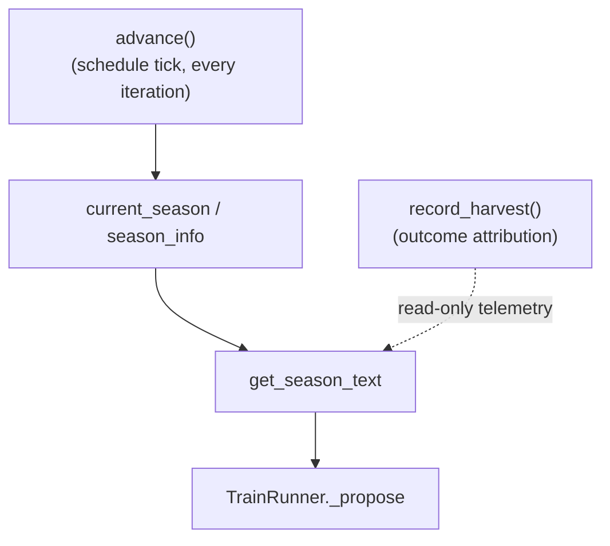

# SeasonalCycling — scheduled crop-rotation through parameter families

`SeasonalCycling` is another of the ~40 named "Improvement" helper mechanisms wired into
[`domains-train_opt-runner`](domains-train_opt-runner.md)'s non-`simple_mode` `TrainRunner`: a fixed,
time-scheduled round-robin rotation through four hand-authored hyperparameter "families."

## Overview
The docstring's permaculture analogy states the failure mode this guards against directly: "the LLM tends to
'plant the same crop' — it finds that LR tweaks improve `val_bpb` and then spends 10+ iterations making tiny
LR adjustments while ignoring schedule params, architecture, or optimizer settings." Unlike a reactive
detector that only notices after a plateau has already happened, seasonal cycling is **preventive and
schedule-driven**: every fixed number of iterations ("season length"), the "in-season" parameter family
advances to the next of four fixed groups — Spring (learning rates), Summer (schedule), Autumn
(optimizer/batch), Winter (architecture) — regardless of whether the current season is actually producing
improvements. The signal is explicitly *advisory*: the LLM is told which family is in season and encouraged
to prioritize it, but nothing here freezes any parameter (that remains Level 1.5's job via `SearchConfig`).

## Diagram

## Design rationale (why it's built this way)
The docstring is explicit that this module is deliberately *preventive*, contrasting itself with a reactive
sibling: "PlateauDetector catches one symptom (same params with diminishing returns) but only triggers after
the damage is done. Seasonal cycling is PREVENTIVE: it divides iterations into 'seasons' and assigns each
season a preferred parameter family, ensuring systematic rotation through the full parameter space." And:
"The seasonal signal is advisory, not mandatory: the LLM is told which family is 'in season' ... but can
still change other params if there is a strong reason" — a soft nudge layered into the prompt text, never a
hard constraint.

> [!inferred] Because [`advance`](../catalog/domains/train_opt/mechanisms/seasonal_cycling.md#SeasonalCycling.advance)
> never reads harvest data to decide when to rotate, the schedule is intentionally decoupled from outcome —
> this contrasts with
> [`domains-train_opt-mechanisms-register_adaptation`](domains-train_opt-mechanisms-register_adaptation.md),
> whose switching *is* outcome-driven. Reading both modules together suggests the file's authors deliberately
> explored both "fixed schedule" and "outcome-adaptive" flavors of the same underlying idea (rotate among a
> small fixed set of options) as separate named mechanisms, rather than converging on one.

## Entry points
- [`advance`](../catalog/domains/train_opt/mechanisms/seasonal_cycling.md#SeasonalCycling.advance) — the
  schedule tick, called once per inner iteration.
- [`get_season_text`](../catalog/domains/train_opt/mechanisms/seasonal_cycling.md#SeasonalCycling.get_season_text) —
  called from [`_propose`](../catalog/domains/train_opt/runner.md#TrainRunner._propose) to build the
  seasonal prompt fragment before every proposal.

## Mechanism (step-by-step)
1. [`advance`](../catalog/domains/train_opt/mechanisms/seasonal_cycling.md#SeasonalCycling.advance)
   increments
   [`_iteration_in_season`](../catalog/domains/train_opt/mechanisms/seasonal_cycling.md#SeasonalCycling._iteration_in_season)
   and the current season's entry in
   [`_season_attempts`](../catalog/domains/train_opt/mechanisms/seasonal_cycling.md#SeasonalCycling._season_attempts);
   once `_iteration_in_season` reaches
   [`_season_length`](../catalog/domains/train_opt/mechanisms/seasonal_cycling.md#SeasonalCycling._season_length)
   it rotates
   [`_current_season_idx`](../catalog/domains/train_opt/mechanisms/seasonal_cycling.md#SeasonalCycling._current_season_idx)
   to the next season, wrapping modulo over
   [`SEASON_ORDER`](../catalog/domains/train_opt/mechanisms/seasonal_cycling.md#SEASON_ORDER).
2. [`current_season`](../catalog/domains/train_opt/mechanisms/seasonal_cycling.md#SeasonalCycling.current_season)
   and [`season_info`](../catalog/domains/train_opt/mechanisms/seasonal_cycling.md#SeasonalCycling.season_info)
   are simple derived properties over `_current_season_idx` and the fixed
   [`SEASONS`](../catalog/domains/train_opt/mechanisms/seasonal_cycling.md#SEASONS) table, giving the current
   season's name, parameter set, and description.
3. [`record_harvest`](../catalog/domains/train_opt/mechanisms/seasonal_cycling.md#SeasonalCycling.record_harvest)
   is called after each training result; if the change improved `val_bpb`, the improvement is credited to
   whichever season(s) own the parameter(s) actually changed — via
   [`SEASON_ORDER`](../catalog/domains/train_opt/mechanisms/seasonal_cycling.md#SEASON_ORDER) and
   [`SEASONS`](../catalog/domains/train_opt/mechanisms/seasonal_cycling.md#SEASONS) — into
   [`_season_harvests`](../catalog/domains/train_opt/mechanisms/seasonal_cycling.md#SeasonalCycling._season_harvests),
   **regardless of which season is currently active** when the credit is recorded.
4. [`get_season_text`](../catalog/domains/train_opt/mechanisms/seasonal_cycling.md#SeasonalCycling.get_season_text)
   renders the current season's name and description, which active params are "in-season" for this run, a
   preview of the next season via
   [`SEASON_ORDER`](../catalog/domains/train_opt/mechanisms/seasonal_cycling.md#SEASON_ORDER) /
   [`SEASONS`](../catalog/domains/train_opt/mechanisms/seasonal_cycling.md#SEASONS), and — once any harvest
   exists in
   [`_season_harvests`](../catalog/domains/train_opt/mechanisms/seasonal_cycling.md#SeasonalCycling._season_harvests) —
   a per-season hit-rate/average-improvement table built from
   [`_season_attempts`](../catalog/domains/train_opt/mechanisms/seasonal_cycling.md#SeasonalCycling._season_attempts),
   ending with an explicit but non-binding instruction to prioritize in-season parameters.
5. [`_propose`](../catalog/domains/train_opt/runner.md#TrainRunner._propose) calls `get_season_text` once per
   proposal, passing the current `SearchConfig.active_params`, and splices the rendered text into the
   multi-candidate prompt alongside the other helper mechanisms' signal blocks.

## Key data structures
- [`_season_harvests`](../catalog/domains/train_opt/mechanisms/seasonal_cycling.md#SeasonalCycling._season_harvests) —
  `season_name -> [delta_bpb, ...]` for every credited improvement; the only outcome-derived state in this
  module.
- [`_season_attempts`](../catalog/domains/train_opt/mechanisms/seasonal_cycling.md#SeasonalCycling._season_attempts) —
  `season_name -> attempt count`, used purely for the hit-rate report.
- [`_current_season_idx`](../catalog/domains/train_opt/mechanisms/seasonal_cycling.md#SeasonalCycling._current_season_idx) /
  [`_iteration_in_season`](../catalog/domains/train_opt/mechanisms/seasonal_cycling.md#SeasonalCycling._iteration_in_season) —
  the fixed, non-adaptive schedule state; advances strictly by iteration count.
- [`SEASONS`](../catalog/domains/train_opt/mechanisms/seasonal_cycling.md#SEASONS) /
  [`SEASON_ORDER`](../catalog/domains/train_opt/mechanisms/seasonal_cycling.md#SEASON_ORDER) — the fixed
  four-family table and rotation order; never modified at runtime.

## Dynamics (design intent)
The schedule itself is a pure round-robin clock:
[`advance`](../catalog/domains/train_opt/mechanisms/seasonal_cycling.md#SeasonalCycling.advance) never
consults [`record_harvest`](../catalog/domains/train_opt/mechanisms/seasonal_cycling.md#SeasonalCycling.record_harvest)'s
data to decide when to rotate. Harvest history is read-only telemetry surfaced to the LLM through
[`get_season_text`](../catalog/domains/train_opt/mechanisms/seasonal_cycling.md#SeasonalCycling.get_season_text),
never fed back into the rotation length or order — a deliberate contrast with
[`domains-train_opt-mechanisms-register_adaptation`](domains-train_opt-mechanisms-register_adaptation.md),
whose switching *is* outcome-driven.

## Edge cases
[`record_harvest`](../catalog/domains/train_opt/mechanisms/seasonal_cycling.md#SeasonalCycling.record_harvest)
does nothing on a `"crash"` status and does nothing when the delta is not an improvement — only positive
harvests are ever recorded, so a season with all discards shows `0/N` in the hit-rate table forever, never a
negative count.

## Open questions
Because harvest crediting looks at "which season owns any changed parameter" rather than "which season was
active when the change was proposed," an improvement made during, say, Winter that happens to touch an
active Spring-family parameter credits Spring's harvest tally even though the LLM was never nudged toward
Spring that iteration. This measures parameter-family productivity independent of nudge timing, but the
source and docstring don't address whether that's the intended semantics or an overlooked interaction.

## See also
- [`domains-train_opt-runner`](domains-train_opt-runner.md) — the `TrainRunner` this helper is wired into.
- [`domains-train_opt-mechanisms-register_adaptation`](domains-train_opt-mechanisms-register_adaptation.md) —
  a sibling fixed-arm helper mechanism with outcome-driven (rather than schedule-driven) switching.
- [`domains-train_opt-mechanism_research`](domains-train_opt-mechanism_research.md) — the actual Level-2
  code-generation machinery, which this module is explicitly *not* an instance of.
- [`../../../sources/bilevel-autoresearch`](../../../sources/bilevel-autoresearch.md) — paper summary; see
  the `TOTAL_BATCH_SIZE` trace analysis for a concrete example of the parameter-fixation failure mode this
  module targets.
