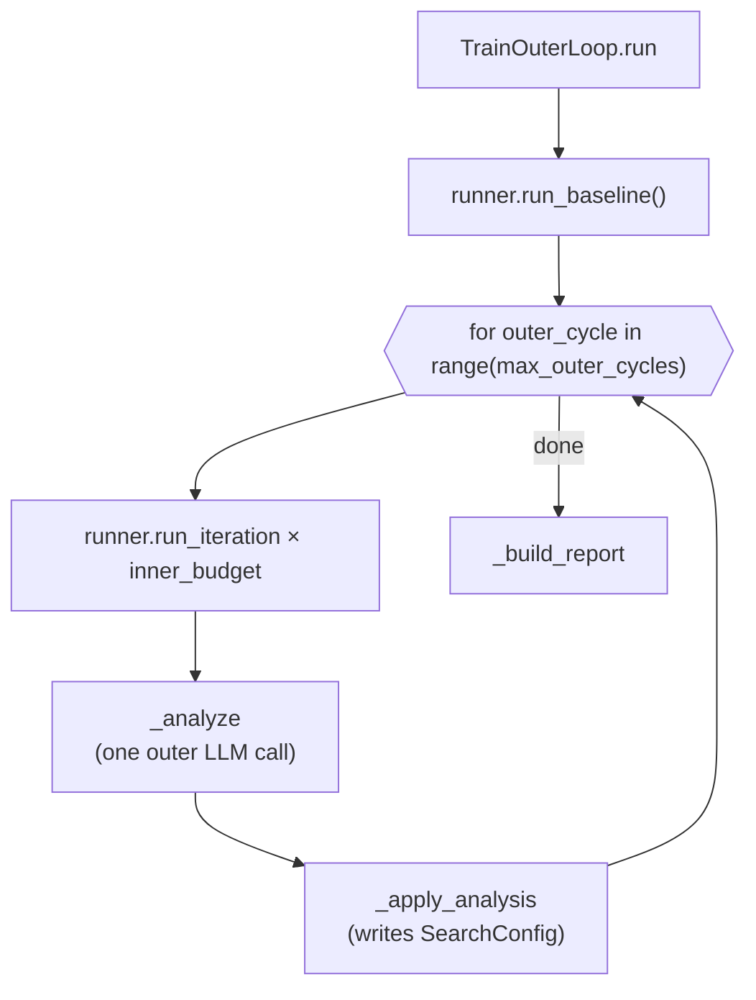

# TrainOuterLoop — the Level 1.5 search-strategy loop

<!-- connect:up:begin -->
> **Cross-repo concept:** part of [closed-loop-experiment-design](../../../concepts/closed-loop-experiment-design.md) across this wiki's repos.
<!-- connect:up:end -->
## Overview
`TrainOuterLoop` is exactly the paper's Level 1.5: a
loop around a fixed number of inner-loop iterations, after which one more LLM call
([`_analyze`](../catalog/domains/train_opt/outer.md#TrainOuterLoop._analyze)) reads the accumulated trace
and returns a JSON verdict (strategy / freeze-params / unfreeze-params / guidance), which
[`_apply_analysis`](../catalog/domains/train_opt/outer.md#TrainOuterLoop._apply_analysis) writes straight
onto the shared `SearchConfig`. It notably **never touches Level 2**: this module has no reference to
`TrainMechanismResearcher`, never generates or writes code, and never reloads a module. Level 2's
research/apply/validate/revert orchestration lives entirely one layer further out, in the ablation harness's
`run_group_c`, which runs `TrainOuterLoop` only as a labeled phase between Level-2 rounds. So in this repo's
source layout, Level 1.5 is a clean, self-contained module, and Level 2's activation is glue that sits
*above* it rather than inside it — worth stating plainly since it's easy to assume from the paper's
narrative that the outer loop *is* where Level 2 lives.

## Diagram

## Design rationale (why it's built this way)
`_apply_analysis`'s freeze logic is bounded by two explicit safety constants,
`MAX_FREEZE_PER_CYCLE = 5` and `MIN_ACTIVE_PARAMS = 4`, documented in-line as "Improvement 17: limit to max 5
new freezes per cycle, and ensure at least 4 params remain active" — a defensive guard against an outer LLM
turn that tries to freeze everything into a corner from which the inner loop has nothing left to search.

The outer loop's system prompt is the prompt-level enforcement of the paper's Level-1.5/Level-2
boundary: "Your job is NOT to propose hyperparameter changes — that is the inner loop's job. Your job is to
optimize HOW the inner loop searches." Level 1.5 is instructed to only ever emit process knobs (which
params, how aggressively, in what order), never parameter *values* — matching the paper's own framing that
Level 1.5 "adjusts parameters of the existing mechanism" rather than replacing it.

## Entry points
- [`run`](../catalog/domains/train_opt/outer.md#TrainOuterLoop.run) — the top-level entry point; called from
  `cli.cmd_bilevel` for a whole experiment, and per-batch by the ablation harness's `run_group_b`/`run_group_c`.
- [`_analyze`](../catalog/domains/train_opt/outer.md#TrainOuterLoop._analyze) — the one Level-1.5 LLM call per
  outer cycle.
- [`_apply_analysis`](../catalog/domains/train_opt/outer.md#TrainOuterLoop._apply_analysis) — the sole writer
  of the runner's `search_config`.

## Mechanism (step-by-step)
1. [`run`](../catalog/domains/train_opt/outer.md#TrainOuterLoop.run) first calls
   [`run_baseline`](../catalog/domains/train_opt/runner.md#TrainRunner.run_baseline) once to establish the
   starting `val_bpb`, then for each outer cycle runs `inner_budget` inner iterations via
   [`run_iteration`](../catalog/domains/train_opt/runner.md#TrainRunner.run_iteration), logging the
   [`runner`](../catalog/domains/train_opt/outer.md#TrainOuterLoop.runner)'s current
   [`strategy`](../catalog/domains/train_opt/config.md#SearchConfig.strategy),
   [`active_params`](../catalog/domains/train_opt/config.md#SearchConfig.active_params), and
   [`frozen_params`](../catalog/domains/train_opt/config.md#SearchConfig.frozen_params) at the top of every
   cycle.
2. After the inner batch, [`_analyze`](../catalog/domains/train_opt/outer.md#TrainOuterLoop._analyze) builds
   a per-parameter change-history table (tried/kept counts) from
   [`results`](../catalog/domains/train_opt/runner.md#TrainTrace.results) and asks the outer LLM (via
   [`call`](../catalog/core/llm_client.md#LLMClient.call)) to return a JSON diagnosis using
   [`best_bpb`](../catalog/domains/train_opt/runner.md#TrainTrace.best_bpb),
   [`best_iteration`](../catalog/domains/train_opt/runner.md#TrainTrace.best_iteration), and
   [`summary`](../catalog/domains/train_opt/runner.md#TrainTrace.summary) as context; a parse failure (via
   [`parse_json_response`](../catalog/core/llm_client.md#parse_json_response)) degrades gracefully to a
   no-op verdict that keeps the existing
   [`guidance`](../catalog/domains/train_opt/config.md#SearchConfig.guidance) and
   [`strategy`](../catalog/domains/train_opt/config.md#SearchConfig.strategy) unchanged.
3. [`_apply_analysis`](../catalog/domains/train_opt/outer.md#TrainOuterLoop._apply_analysis) applies at most
   three kinds of change to the shared `search_config`: `strategy` (only if it's one of
   `explore`/`exploit`/`focused`), freezing entries into
   [`frozen_params`](../catalog/domains/train_opt/config.md#SearchConfig.frozen_params) (bounded by the two
   safety caps above and checked against
   [`editable_params`](../catalog/domains/train_opt/config.md#SearchConfig.editable_params) and
   [`active_params`](../catalog/domains/train_opt/config.md#SearchConfig.active_params) membership), and
   unconditionally removing entries the analysis names for unfreezing — plus fully overwriting
   [`guidance`](../catalog/domains/train_opt/config.md#SearchConfig.guidance) with a fresh, cycle-numbered
   instruction block.
4. [`run`](../catalog/domains/train_opt/outer.md#TrainOuterLoop.run) writes a per-cycle audit entry (cycle
   number, raw analysis, `best_bpb`, post-apply config) and persists both the cycle's `analysis.json` and
   the running `outer_trace.json` under
   [`artifacts_dir`](../catalog/domains/train_opt/outer.md#TrainOuterLoop.artifacts_dir) after every single
   cycle, so a crashed or killed run still leaves a legible history of every Level-1.5 decision made so far.
5. [`_build_report`](../catalog/domains/train_opt/outer.md#TrainOuterLoop._build_report) assembles the final
   summary — `best_val_bpb`/`best_iteration` from
   [`best_bpb`](../catalog/domains/train_opt/runner.md#TrainTrace.best_bpb) and
   [`best_iteration`](../catalog/domains/train_opt/runner.md#TrainTrace.best_iteration), keeps/discards/crashes
   counted from
   [`status`](../catalog/domains/train_opt/runner.md#TrainResult.status), and a full per-iteration trace from
   [`results`](../catalog/domains/train_opt/runner.md#TrainTrace.results),
   [`description`](../catalog/domains/train_opt/runner.md#TrainResult.description),
   [`iteration`](../catalog/domains/train_opt/runner.md#TrainResult.iteration), and
   [`val_bpb`](../catalog/domains/train_opt/runner.md#TrainResult.val_bpb) — that callers like
   `cli.cmd_bilevel` print or persist.
6. In the ablation harness, [`run`](../catalog/domains/train_opt/outer.md#TrainOuterLoop.run) is invoked
   **per Level-2 batch**, not once for a whole experiment:
   [`run_group_c`](../catalog/experiments/ablations/paper_ablation/run_ablation.md#run_group_c) constructs a
   fresh `TrainOuterLoop` (and a fresh, possibly Level-2-patched `TrainRunner`) every
   `LEVEL2_CYCLE_INTERVAL` outer cycles, so a `TrainOuterLoop` instance's own `outer_trace` history resets
   every time Level 2 fires — Level 1.5 has no memory of its own past decisions across a Level-2 mechanism
   swap, only what's re-derivable from the shared trace passed to the fresh runner.

## Key data structures
- `outer_trace` — the append-only, in-memory list of `{cycle, analysis, best_bpb, config_after}` dicts; the
  audit log of every Level-1.5 decision within one `TrainOuterLoop` instance's lifetime.
- [`artifacts_dir`](../catalog/domains/train_opt/outer.md#TrainOuterLoop.artifacts_dir) — where each cycle's
  `analysis.json` and the cumulative `outer_trace.json` are persisted.

## Dynamics (design intent)
Level 1.5 runs synchronously and in lock-step with Level 1: there is no overlap between the batch of inner
iterations and the single outer analysis call that follows them — every outer cycle is strictly `N` inner
iterations, then exactly one outer LLM call, then one apply step, in that fixed order.

## Edge cases
A parse failure in `_analyze` produces an inert verdict (no freezes, no strategy change, unchanged guidance)
rather than raising, keeping the experiment alive through a malformed LLM response. The two freeze safety
caps throttle a single bad outer-LLM turn rather than rejecting it outright — a turn that names ten
freeze-worthy parameters still freezes up to five (or fewer, if `MIN_ACTIVE_PARAMS` would be violated first)
rather than freezing none.

## Open questions
> [!inferred] `_apply_analysis` **overwrites** `guidance` each cycle rather than appending to it
> (`config.guidance = f"## Outer Loop Guidance (Cycle {cycle+1})\n{new_guidance}"`), so any earlier cycle's
> guidance text is entirely lost unless the outer LLM re-states it. Whether this is intentional context
> management (avoiding unbounded prompt growth) or a source of "guidance amnesia" over a long run is not
> addressed by the source or docstrings — this is a reading of the code, not a stated design decision.

Confirmed by reading the source directly: `TrainOuterLoop` does not import or reference
`TrainMechanismResearcher` anywhere — Level 2 orchestration genuinely lives outside this class, in the
ablation harness, not inside it.

## See also
- [`domains-train_opt-mechanism_research`](domains-train_opt-mechanism_research.md) — Level 2, orchestrated
  *around* this class by the ablation harness, not from within it.
- [`domains-train_opt-runner`](domains-train_opt-runner.md) — the Level 1 loop this class wraps in batches.
- [`domains-train_opt-config`](domains-train_opt-config.md) — the `SearchConfig` this class is the sole
  writer of.
- [`domains-article_opt-outer`](domains-article_opt-outer.md) — the sibling domain's analogous Level-1.5
  loop.
- [`../../../sources/bilevel-autoresearch`](../../../sources/bilevel-autoresearch.md) — paper summary; see
  "Level 1.5 — outer *search-strategy* loop" and "Level 1.5 vs. Level 2: parameters vs. structure."
- [`../../autoresearch/overview`](../../autoresearch/overview.md) — the Level-1 benchmark this loop's
  parameter re-weighting acts on.
