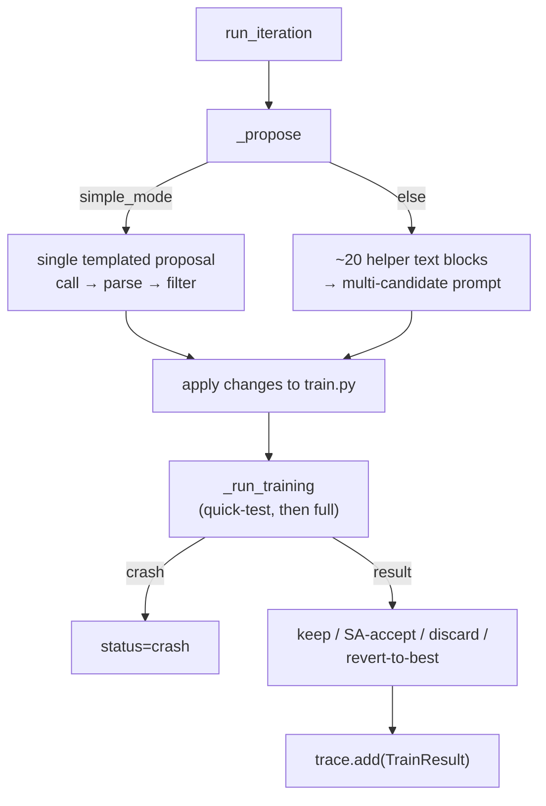

# TrainRunner — the Level 1 inner loop

<!-- connect:up:begin -->
> **Cross-repo concept:** part of [closed-loop-experiment-design](../../../concepts/closed-loop-experiment-design.md), [hypothesis-generation](../../../concepts/hypothesis-generation.md) across this wiki's repos.
<!-- connect:up:end -->
## Overview
`TrainRunner` implements Karpathy's exact
propose→train→evaluate→keep/discard cycle (the paper's Level 1) for GPT-pretraining hyperparameters — this
domain's reproduction of the paper's headline `val_bpb` benchmark. The class has **two personalities**
gated by a single flag, `simple_mode`: with `simple_mode=True` (used by the formal ablation harness's Groups
A, B, C, D as the paper's clean baseline) a single LLM call proposes a change and the loop keeps only strict
improvements. With `simple_mode=False` (the default for interactive `cmd_inner`/`cmd_bilevel` runs) the same
class layers on ~40 numbered "Improvement" mechanisms — multi-candidate proposal-with-picker, simulated-
annealing acceptance, revert-to-best, crash memory, and two dozen signal generators borrowed from permaculture,
astronomy, paleontology, and translation-theory metaphors — all feeding text into one large prompt. That
split matters for reading this repo: "Level 1" here is not one fixed artifact but two — the bare,
paper-faithful baseline used for controlled ablation, and a much richer library that is largely the
sedimented residue of many past Level-2 sessions across prior experiments, folded permanently into the
canonical file rather than left as one currently-active, swappable mechanism.

## Diagram

## Design rationale (why it's built this way)
The `_propose` docstring documents the multi-candidate design directly: "Uses multi-candidate proposal
(Improvement 2): 1. LLM generates 3 candidates in one call. 2. LLM picks the best candidate in a second
call. This filters bad ideas with ~1 extra LLM call instead of wasting GPU time." — a deliberate trade of
one cheap LLM call against an expensive 300-second training run.

The `simple_mode` branch's own comment calls the rest of the class "Level 2 mechanisms" ("skip all Level 2
mechanisms — use single [prompt] directly", paraphrased). Read against the paper's strict three-level vocabulary
this is loose terminology: almost none of runner.py's ~40 improvements are the *live* Level-2 code-injection
machinery (that lives in [`domains-train_opt-mechanism_research`](domains-train_opt-mechanism_research.md));
most are static, permanently-committed Level-1 helpers that plausibly *originated* from past Level-2
sessions in earlier experiment rounds and were hand-folded into the canonical `runner.py`.

> [!inferred] The two register/seasonal helper modules examined elsewhere in this silo
> ([`domains-train_opt-mechanisms-register_adaptation`](domains-train_opt-mechanisms-register_adaptation.md),
> [`domains-train_opt-mechanisms-seasonal_cycling`](domains-train_opt-mechanisms-seasonal_cycling.md)) are
> two concrete examples of exactly this: numbered "Improvement" modules with the same code style as
> everything else in `__init__`, most plausibly checked-in output of earlier Level-2 sessions rather than
> hand-designed from scratch — but this is a reading of the file's structure and naming convention, not a
> directly cited fact.

## Entry points
- [`run_iteration`](../catalog/domains/train_opt/runner.md#TrainRunner.run_iteration) — one inner-loop
  iteration; called by [`cmd_inner`](../catalog/domains/train_opt/cli.md#cmd_inner), by
  [`TrainOuterLoop.run`](domains-train_opt-outer.md), and by the ablation harness's
  [`run_group_a`](../catalog/experiments/ablations/paper_ablation/run_ablation.md#run_group_a) and
  [`run_group_d`](../catalog/experiments/ablations/paper_ablation/run_ablation.md#run_group_d).
- [`run_baseline`](../catalog/domains/train_opt/runner.md#TrainRunner.run_baseline) — runs the unmodified
  `train.py` once, before any proposals, to establish the `val_bpb` every later iteration is compared
  against.
- [`_propose`](../catalog/domains/train_opt/runner.md#TrainRunner._propose) — the LLM call site; branches
  on `simple_mode`.

## Mechanism (step-by-step)
1. [`run_iteration`](../catalog/domains/train_opt/runner.md#TrainRunner.run_iteration) extracts the current
   hyperparameters from `self.current_code` and calls
   [`_propose`](../catalog/domains/train_opt/runner.md#TrainRunner._propose) to get an LLM-proposed change
   set for this iteration.
2. In `simple_mode`, `_propose` issues one single-shot templated proposal call via
   [`call`](../catalog/core/llm_client.md#LLMClient.call), parses it with
   [`parse_json_response`](../catalog/core/llm_client.md#parse_json_response), and filters the returned
   `changes` down to [`active_params`](../catalog/domains/train_opt/config.md#SearchConfig.active_params) —
   any parameter the outer loop has since frozen via
   [`frozen_params`](../catalog/domains/train_opt/config.md#SearchConfig.frozen_params) is silently dropped
   with a warning, not rejected as an error.
3. Outside `simple_mode`, `_propose` first assembles roughly twenty text blocks from helper objects — e.g.
   [`get_season_text`](../catalog/domains/train_opt/mechanisms/seasonal_cycling.md#SeasonalCycling.get_season_text),
   [`get_register_text`](../catalog/domains/train_opt/mechanisms/register_adaptation.md#RegisterAdaptation.get_register_text),
   [`get_warning_text`](../catalog/domains/train_opt/mechanisms/crash_memory.md#CrashMemory.get_warning_text),
   [`check_plateau`](../catalog/domains/train_opt/mechanisms/plateau_detector.md#PlateauDetector.check_plateau),
   [`generate_crossover`](../catalog/domains/train_opt/mechanisms/elite_pool.md#ElitePool.generate_crossover) —
   and splices them into one multi-candidate prompt requesting three candidates plus a follow-up pick,
   consistent with the "multi-candidate with picker" docstring above.
4. Back in `run_iteration`, the accepted changes are applied to the working `train.py` text and a 15-second
   quick-test smoke run executes first (skipped entirely in `simple_mode`) to catch obvious crashes or
   divergence before spending the full budget, via
   [`_run_training`](../catalog/domains/train_opt/runner.md#TrainRunner._run_training).
5. The full training run also goes through
   [`_run_training`](../catalog/domains/train_opt/runner.md#TrainRunner._run_training); a `None` return
   means a crash, which is fed to
   [`record`](../catalog/domains/train_opt/mechanisms/crash_memory.md#CrashMemory.record) (crash memory) so
   future prompts carry a warning about that change.
6. Keep/discard: a strictly better [`val_bpb`](../catalog/domains/train_opt/runner.md#TrainResult.val_bpb)
   (below [`best_bpb`](../catalog/domains/train_opt/runner.md#TrainTrace.best_bpb)) is always kept and
   becomes the new `current_code`; outside `simple_mode`, a worse result instead goes through a simulated-
   annealing acceptance draw with a cooling temperature, and after several non-improving iterations the
   runner reverts `current_code` back to the best-known code as a safety valve. `simple_mode` skips all of
   this and does a strict binary keep/discard. Every outcome is recorded via
   [`add`](../catalog/domains/train_opt/runner.md#TrainTrace.add) onto the shared
   [`trace`](../catalog/domains/train_opt/runner.md#TrainRunner.trace).
7. Outside `simple_mode`, the same outcome fans out to every helper's own bookkeeping call — e.g.
   [`advance`](../catalog/domains/train_opt/mechanisms/seasonal_cycling.md#SeasonalCycling.advance),
   [`record`](../catalog/domains/train_opt/mechanisms/register_adaptation.md#RegisterAdaptation.record),
   [`check_surprise`](../catalog/domains/train_opt/mechanisms/target_of_opportunity.md#TargetOfOpportunity.check_surprise),
   [`build_rules`](../catalog/domains/train_opt/mechanisms/gene_regulatory_network.md#GeneRegulatoryNetwork.build_rules) —
   so every helper's internal state, and therefore next iteration's prompt text, reflects this iteration's
   result.
8. Two families of callers construct `TrainRunner` differently:
   [`cmd_inner`](../catalog/domains/train_opt/cli.md#cmd_inner) is the interactive entry point that runs the
   full, non-`simple_mode` runner directly; the ablation harness's
   [`run_group_a`](../catalog/experiments/ablations/paper_ablation/run_ablation.md#run_group_a) constructs it
   with `simple_mode=True` for the paper's clean Level-1-only baseline, while
   [`run_group_d`](../catalog/experiments/ablations/paper_ablation/run_ablation.md#run_group_d) also uses
   `simple_mode=True` but interleaves Level-2 mechanism-research sessions between fixed-size batches of
   iterations, with no `TrainOuterLoop` at all.

## Key data structures
- [`TrainResult`](../catalog/domains/train_opt/runner.md#TrainResult) — one iteration's record:
  [`iteration`](../catalog/domains/train_opt/runner.md#TrainResult.iteration),
  [`val_bpb`](../catalog/domains/train_opt/runner.md#TrainResult.val_bpb),
  [`status`](../catalog/domains/train_opt/runner.md#TrainResult.status) (`"keep"`/`"discard"`/`"crash"`),
  [`changes`](../catalog/domains/train_opt/runner.md#TrainResult.changes),
  [`description`](../catalog/domains/train_opt/runner.md#TrainResult.description) (the LLM's stated
  hypothesis).
- `TrainTrace` — the append-only list of [`results`](../catalog/domains/train_opt/runner.md#TrainTrace.results)
  plus running [`best_bpb`](../catalog/domains/train_opt/runner.md#TrainTrace.best_bpb) bookkeeping via
  [`add`](../catalog/domains/train_opt/runner.md#TrainTrace.add) and rendered via
  [`summary`](../catalog/domains/train_opt/runner.md#TrainTrace.summary).
- Helper accumulators like [`_pool`](../catalog/domains/train_opt/mechanisms/elite_pool.md#ElitePool._pool)
  (ElitePool's top-K configs) and
  [`_fossils`](../catalog/domains/train_opt/mechanisms/fossil_record.md#FossilRecord._fossils) each
  privately hold their own slice of search history, consumed only through their own `get_*_text` methods.

## Dynamics (design intent)
> [!inferred] Read from source (not cited, since the specific temperature fields are outside this packet's
> Subgraph): the simulated-annealing acceptance probability is `exp(-delta/T)` where `T` starts at a fixed
> initial temperature and is multiplied by a cooling-rate constant on every SA-evaluated iteration, and
> revert-to-best resets `T` to half its initial value — so exploration willingness decays monotonically
> across a run except for a partial reset each time the runner reverts to its best-known code.

`run_iteration` is fully synchronous: propose → quick-test → full-train → decide → record, one iteration at
a time, with no overlap between the LLM call and the GPU training run.

## Edge cases
Frozen parameters proposed anyway are dropped silently (a log warning, not an exception) rather than
causing the iteration to fail. A quick-test crash is distinguished from an *infrastructure* error (checked
before recording a real crash) so that flaky test harness failures don't get misattributed to the proposed
hyperparameter change. Revert-to-best fires only after several consecutive non-improving iterations and only
outside `simple_mode` — a `simple_mode` run has no such safety net and simply accumulates discards.

## Open questions
Whether the ~15 helper objects' accumulated histories (elite pool, crash memory, register/season stats,
etc.) survive across the ablation harness's per-batch dynamic module reload in Group C — each batch
reconstructs a fresh `TrainRunner` from a possibly Level-2-patched module — is not addressed by anything in
this packet's Subgraph; it would need to be checked against
[`domains-train_opt-outer`](domains-train_opt-outer.md)'s harness-level code.

## See also
- [`domains-train_opt-config`](domains-train_opt-config.md) — the `SearchConfig` this class reads every
  iteration.
- [`domains-train_opt-outer`](domains-train_opt-outer.md) — Level 1.5, which wraps `run_iteration` in
  batches.
- [`domains-train_opt-mechanism_research`](domains-train_opt-mechanism_research.md) — Level 2, which patches
  this very file's `runner.py` at a different code path than the one shipped here.
- [`domains-train_opt-mechanisms-register_adaptation`](domains-train_opt-mechanisms-register_adaptation.md),
  [`domains-train_opt-mechanisms-seasonal_cycling`](domains-train_opt-mechanisms-seasonal_cycling.md) — two
  of the ~40 helper mechanisms wired into this class.
- [`domains-article_opt-runner`](domains-article_opt-runner.md) — the sibling no-GPU domain's Level-1 loop.
- [`../../../sources/bilevel-autoresearch`](../../../sources/bilevel-autoresearch.md) — paper summary; see
  "Level 1 — inner autoresearch loop" and the `TOTAL_BATCH_SIZE` trace analysis.
- [`../../autoresearch/overview`](../../autoresearch/overview.md) — Karpathy's `autoresearch`, the exact
  benchmark this loop reproduces.
