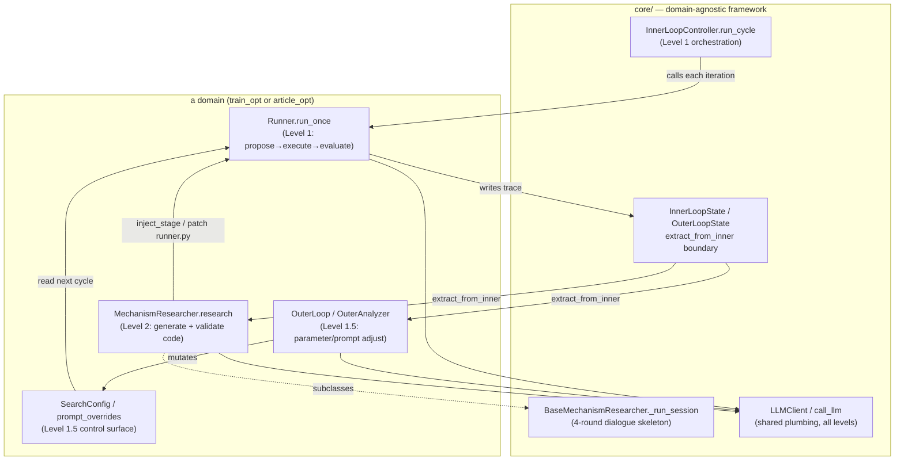
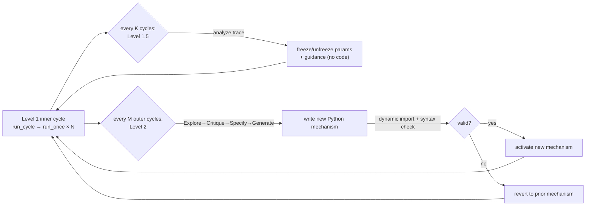

# bilevel-autoresearch — what it is and how it fits together

## In one paragraph
Bilevel Autoresearch is the reference implementation of the paper
[*Bilevel Autoresearch: Meta-Autoresearching Itself*](../../sources/bilevel-autoresearch.md) (arXiv:2603.23420).
It wraps an **outer autoresearch loop** around an **inner autoresearch loop** — the inner loop is the familiar
propose→execute→evaluate→keep/discard ratchet (modeled on [Karpathy's `autoresearch`](../autoresearch/overview.md)),
and the outer loop optimizes not the task but *how the inner loop searches*. The outer loop is split into two
responsibilities the paper names **Level 1.5** and **Level 2**: Level 1.5 reads the inner loop's proposal/outcome
trace and adjusts existing search *parameters* (freeze/unfreeze which knobs are searchable, shift strategy, add
guidance text) — a knob on a fixed mechanism; Level 2 runs a fixed, human-authored 4-round
**Explore→Critique→Specify→Generate** LLM dialogue that reads the inner runner's *code* and **writes brand-new
Python search-mechanism code** (Tabu Search, multi-armed-bandit proposal, orthogonal design-of-experiments),
validates it by dynamic import, and either activates it or reverts to the prior mechanism. The central empirical
claim is that the gain (~5× on the paper's GPT-pretraining benchmark) comes from the *bilevel architecture* — the
same LLM runs every level; only the code-generation layer (Level 2) is load-bearing. The repo ships this as a
domain-agnostic `core/` framework plus two domains that instantiate it: `train_opt` (the paper's headline
GPT-pretraining `val_bpb` experiment) and `article_opt` (a lighter, no-GPU 5-stage article-revision demo).

## Core architecture

## Main concepts

**The unmodified Level 1 loop.** [`InnerLoopController.run_cycle`](concepts/core-inner_loop.md) is the fixed
orchestration the outer loop is *never* allowed to rewrite: call `runner.run_once`, read back a score, check
convergence, repeat to a budget. All domain specifics live behind the injected `runner`, which is exactly what lets
Levels 1.5 and 2 change *how* proposals are generated without touching this loop. See
[`core-inner_loop`](concepts/core-inner_loop.md).

**The inner/outer information boundary.** [`core/state.py`](concepts/core-state.md) draws a hard line via
`OuterLoopState.extract_from_inner`, which the docstring calls "the ONLY sanctioned path for inner→outer
information flow." It returns process statistics (scores, convergence, retry counts) but deliberately never the
task artifact itself — so every outer-level decision reasons over a summary, never the raw article/config. See
[`core-state`](concepts/core-state.md).

**Level 1.5 — parameter adjustment, never code.** Each domain's outer analyzer
([`train_opt`](concepts/domains-train_opt-outer.md), [`article_opt`](concepts/domains-article_opt-outer.md)) reads a
completed cycle's trace and emits *parameter* changes only: `train_opt` mutates a
[`SearchConfig`](concepts/domains-train_opt-config.md) (freeze/unfreeze which hyperparameters are searchable, a
strategy label, a guidance string); `article_opt` emits per-stage prompt-override *text*. The paper's ablation shows
this alone gives no reliable gain — it re-weights within a fixed mechanism.

**Level 2 — mechanism research that writes code.** The load-bearing layer.
[`BaseMechanismResearcher`](concepts/core-base_mechanism_research.md) owns the paper's 4-round
Explore→Critique→Specify→Generate dialogue once, in `core/`; each domain subclasses it:
[`TrainMechanismResearcher`](concepts/domains-train_opt-mechanism_research.md) generates and patches new search
mechanisms into `runner.py`, and [`MechanismResearcher`](concepts/domains-article_opt-mechanism_research.md)
generates new `BaseStage` pipeline stages. Both emit *and execute* new Python, validated by dynamic import before
activation. This is the concept the paper calls **mechanism-level self-improvement**.

**Activate-or-revert, archive size 1.** Level 2 never keeps a population of mechanisms: it generates *one*
candidate, backs up the prior code, validates the new one (a syntax check plus, in `train_opt`, an out-of-process
subprocess import that grounds the paper's `sys.modules`-fragility footnote), and either activates it or restores
the backup. There is no growing archive and no stepping-stone resampling — a hill-climb at the mechanism level. See
[`domains-train_opt-mechanism_research`](concepts/domains-train_opt-mechanism_research.md).

**Shared, undifferentiated LLM plumbing.** Every level bottoms out in the same
[`LLMClient` / `call_llm`](concepts/core-llm_client.md) primitives and the same JSON parser — no special retry policy
or parser for the meta-level. That sameness is itself evidence for the paper's claim that the *architecture*, not a
stronger meta-model, produces the gain. The one real fork is global module state (`call_llm`) vs. an instance
(`LLMClient`) so inner and outer models can run side-by-side. See [`core-llm_client`](concepts/core-llm_client.md).

**Two domains, one framework.** `train_opt` is the paper's headline experiment: an LLM proposes hyperparameter edits
to Karpathy's `train.py`, trains for a 300s budget, measures `val_bpb`
([runner](concepts/domains-train_opt-runner.md)). `article_opt` is a no-GPU demo: a 5-stage
Analysis→Hypotheses→Planning→Assessment→Revision pipeline ([base stage](concepts/domains-article_opt-pipeline-base.md),
[runner](concepts/domains-article_opt-runner.md)) scored by rubric, where Level 2 generates new *pipeline stages*
instead of *search mechanisms*. The two prove the `core/` bilevel skeleton is genuinely domain-agnostic.

**Sedimented, agent-originated mechanisms.** `train_opt` ships two fixed helper modules —
[`register_adaptation`](concepts/domains-train_opt-mechanisms-register_adaptation.md) (a 3-register prompt-text
switcher) and [`seasonal_cycling`](concepts/domains-train_opt-mechanisms-seasonal_cycling.md) (a 4-season round-robin
schedule) — that read as *outputs* of past Level-2 sessions now checked in as static Level-1 helpers, not as the live
code-generation machinery. Useful as concrete examples of the *shape* of what Level 2 produces.

## How a run flows
A full three-level run (`train_opt bilevel` / `article_opt run`) is a nested loop:
[`run_cycle`](concepts/core-inner_loop.md) drives the inner ratchet by repeatedly calling the domain
[runner](concepts/domains-train_opt-runner.md); every K inner cycles the
[Level 1.5 outer loop](concepts/domains-train_opt-outer.md) reads the extracted trace
([`extract_from_inner`](concepts/core-state.md)) and rewrites the [`SearchConfig`](concepts/domains-train_opt-config.md)
or prompt overrides; every M outer cycles [Level 2](concepts/domains-train_opt-mechanism_research.md) runs its
4-round dialogue, generates a new mechanism, validates it by import, and patches it into the runner or reverts. The
CLI ([`article_opt`](concepts/domains-article_opt-cli.md)) exposes each layer as a separate subcommand (full run,
inner-only, single-pass smoke test, standalone Level-2 session) for debugging.

## Map of the wiki
- *What is Level 1 and why is it never rewritten?* → [`core-inner_loop`](concepts/core-inner_loop.md)
- *What can the outer loop see about the inner loop?* → [`core-state`](concepts/core-state.md)
- *How does Level 1.5 adjust the search (parameters/prompts, no code)?* →
  [`domains-train_opt-outer`](concepts/domains-train_opt-outer.md) /
  [`domains-article_opt-outer`](concepts/domains-article_opt-outer.md) and
  [`domains-train_opt-config`](concepts/domains-train_opt-config.md)
- *How does Level 2 actually write and validate new mechanism code?* →
  [`core-base_mechanism_research`](concepts/core-base_mechanism_research.md) (the shared dialogue) then
  [`domains-train_opt-mechanism_research`](concepts/domains-train_opt-mechanism_research.md) /
  [`domains-article_opt-mechanism_research`](concepts/domains-article_opt-mechanism_research.md)
- *Where do generated mechanisms get spliced in?* → [runner `inject_stage`/patching](concepts/domains-article_opt-runner.md)
- *What does the LLM plumbing look like?* → [`core-llm_client`](concepts/core-llm_client.md)
- *What do Level-2 outputs look like once checked in?* →
  [`register_adaptation`](concepts/domains-train_opt-mechanisms-register_adaptation.md) /
  [`seasonal_cycling`](concepts/domains-train_opt-mechanisms-seasonal_cycling.md)
- *Exhaustive per-module symbol index* → [`catalog/`](catalog/) · *concept table* → [`index.md`](index.md)

The bilevel system's relationship to the paper is written up in
[`../../sources/bilevel-autoresearch.md`](../../sources/bilevel-autoresearch.md); its place among this wiki's other
self-improvement systems is in [`mechanism-level-self-improvement`](../../concepts/mechanism-level-self-improvement.md).
