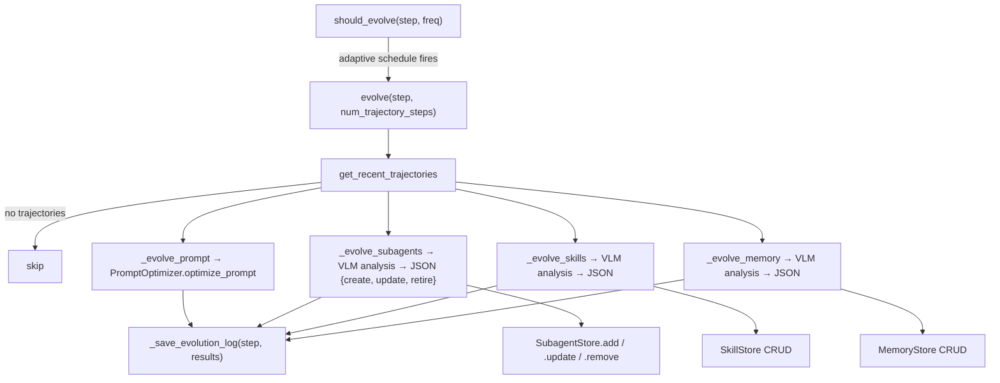

# HarnessEvolver — the Refiner, CRUD over prompt/subagents/skills/memory

<!-- connect:up:begin -->
> **Cross-repo concept:** part of [self-referential-code-rewriting](../../../concepts/self-referential-code-rewriting.md) across this wiki's repos.
<!-- connect:up:end -->
## Overview

`HarnessEvolver` is the paper's headline
mechanism made concrete: the class whose own module docstring calls it *"Full harness evolution for the
ContinualHarness scaffold... adds subagent, skill, and memory evolution"* on top of an inherited
prompt-optimizer. `evolve` fires
periodically mid-episode, reads a window of recent trajectories, and runs four independent passes — prompt,
subagents, skills, memory — each of which asks a vision-language model to analyze what just happened and
propose concrete create/update/retire edits, which the pass then applies directly to the corresponding
store.

## Diagram

## Design rationale (why it's built this way)

**Evolution frequency is adaptive, not fixed, and the caller's own argument is overridden.**
`should_evolve`'s docstring states this explicitly: *"Uses adaptive frequency: evolve more often early (every 25 steps for the first
200 steps) to bootstrap the harness quickly, then back off to every 100 steps once capabilities stabilize.
The caller's `frequency` arg is ignored in favor of the adaptive schedule."* A `MIN_WARMUP_STEPS = 25` floor
also blocks any evolution before the agent has produced enough trajectory to analyze.

**Every evolution pass is independently fault-isolated.** `evolve`'s own docstring: *"Each pass is independent — if one fails, the others still run and the evolution log is
always saved."* The implementation wraps each of the four passes in its own `try`/`except`, storing an
`{"error": str(e)}` result for a failed pass rather than aborting the whole evolution cycle — a prompt
rewrite failing does not block subagent or memory evolution from still landing that generation.

**Each CRUD pass is: summarize context → ask the model for a structured plan → apply it verbatim.**
`_evolve_subagents` is the clearest instance: it builds a prompt containing the current subagent registry
overview, a formatted trajectory summary, and extracted tool-failure patterns (`_extract_tool_failures`),
asks the model for a JSON object with `create`/`update`/`retire` arrays, and then applies each array
directly against the subagent store (`store.add(...)`, `store.update(sid, **fields)`,
`store.remove(sid)`) — the model's structured recommendation *is* the CRUD operation, with no
intermediate human review step.

**Tool names are validated against a fixed availability set before a new subagent is created.** Every
proposed `available_tools` list is filtered against `_ALWAYS_AVAILABLE_TOOLS`, and an empty result falls
back to `["press_buttons"]` — the model cannot invent a tool that doesn't exist in the scaffold; this is a
structural guard, not a prompt instruction.

**Lengths are hard-capped, not just requested.** Created subagent `system_instructions` and `directive`
text are truncated to 12,000 characters (`[:12000]`) and `max_turns` is clamped to at most 50
(`min(spec.get("max_turns", 25), 50)`) regardless of what the model proposed — bounding how much an evolved
component can cost even if the model's proposal is unreasonable.

## Entry points
- `HarnessEvolver.evolve` — the single entry point that runs all four passes and persists the result;
  called from [`PokeAgent.run_step`](../catalog/agents/PokeAgent.md#PokeAgent.run_step) (per this page's
  own packet subgraph, which cites `run_step`'s reference to `harness_evolver`).
- `HarnessEvolver.should_evolve` — the gate the caller
  ([`PokeAgent.run_step`](../catalog/agents/PokeAgent.md#PokeAgent.run_step)) checks before invoking
  `evolve`.

## Mechanism (step-by-step)
1. The caller ([`PokeAgent.run_step`](../catalog/agents/PokeAgent.md#PokeAgent.run_step), which holds the
   `harness_evolver` reference) checks `should_evolve`'s adaptive frequency schedule.
2. `evolve` pulls a window of recent trajectories (`num_trajectory_steps`, default 50) via the same
   run-scoped machinery [`PokeAgent.run_step`](../catalog/agents/PokeAgent.md#PokeAgent.run_step) reads;
   an empty window short-circuits with `{"skipped": True, "reason": "no_trajectories"}`.
3. Four independently-wrapped passes run in sequence, all triggered from the same
   [`PokeAgent.run_step`](../catalog/agents/PokeAgent.md#PokeAgent.run_step) call site: `_evolve_prompt`
   delegates to the composed `PromptOptimizer`; `_evolve_subagents`, `_evolve_skills`, and `_evolve_memory`
   each build a context-specific prompt, call the model, parse its JSON response via
   `_parse_json_response`, and apply the create/update/retire arrays directly against the corresponding
   store (see [`utils-stores-subagents`](utils-stores-subagents.md) for the store-side
   `BaseStore.add`/`.update`/`.remove` this ultimately calls).
4. `_save_evolution_log` records the full result set for this generation — the same generation whose
   [`PokeAgent.run_step`](../catalog/agents/PokeAgent.md#PokeAgent.run_step) call triggered it — and
   `self.generation` increments.

## Key data structures
- `_ALWAYS_AVAILABLE_TOOLS` — the fixed set of tool names any evolved subagent's `available_tools` is
  validated against.
- The evolution-pass result shape — `{"created": [...], "updated": [...], "retired": [...], "analysis":
  str}` — uniform across passes, letting `_save_evolution_log` treat all four the same way.

## Edge cases
- `should_evolve` returns `False` outright for `current_step <= 0` in addition to the warmup floor — a
  defensive guard against evolving before or exactly at the run's start.
- A subagent `update` recommendation missing an `id` field is silently skipped (`if not sid: continue`)
  rather than raising — a malformed model response degrades gracefully per-item, not per-pass.

## See also
- [`agents-tools-registry`](agents-tools-registry.md) — how an evolved subagent's tool becomes callable by
  the orchestrator.
- Doc-concept: the `System-Design/architecture/harness_evolver.md` design doc this module implements (see
  the doc-concepts step for this silo).
