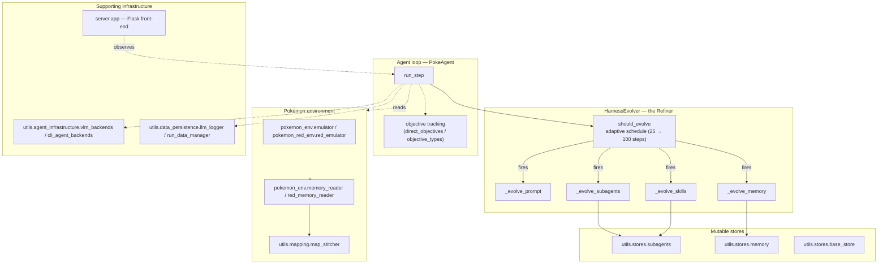

# continual-harness — what it is and how it fits together

> Grounded code wiki for [sethkarten/continual-harness](https://github.com/sethkarten/continual-harness),
> Karten et al.'s own reference implementation of the **Continual Harness** paper, pinned @ `bbab97ad73`.
> This is the *implementation* companion to the paper summary in
> [`../../sources/continual-harness.md`](../../sources/continual-harness.md). Read that for *what the paper
> claims and why it matters* (reset-free mid-episode adaptation, the immutable-base-prompt boundary); read
> this for *how the reference code actually implements it*, grounded in a live PokéAgent Challenge harness.

## In one paragraph
The paper's headline contribution — a **Refiner** that performs reset-free, evidence-backed CRUD edits to
its own operating apparatus mid-episode — is one class in a much larger repo: most of the codebase is
Pokémon-game infrastructure (emulator control, memory reading, map stitching, a Flask server for a human/VLM
front-end) that exists to *give* the Refiner something long-running to operate over. The mechanism itself
lives in [`HarnessEvolver`](concepts/agents-utils-harness_evolver.md): four independently fault-isolated CRUD
passes — prompt, sub-agents, skills, memory — each firing on an adaptive schedule (every 25 steps for the
first 200, then every 100), asking a VLM to review a trajectory window and apply `create`/`update`/`retire`
edits **directly** against the corresponding store, with no human review step and hard length/turn caps
regardless of what the model proposed. The one thing the Refiner never touches is the base orchestrator
policy — see [`immutable-base-prompt`](doc-concepts/immutable-base-prompt.md).

## Core architecture

## Main concepts
- **The Refiner itself.** [`HarnessEvolver`](concepts/agents-utils-harness_evolver.md) — the paper's
  headline mechanism made concrete: four fault-isolated passes on an adaptive schedule, editing prompt,
  sub-agents, skills, and memory directly against their stores. → also see
  [`reset-free-harness-evolution`](doc-concepts/reset-free-harness-evolution.md).
- **The mutable stores.** [`utils-stores-subagents`](concepts/utils-stores-subagents.md),
  [`utils-stores-memory`](concepts/utils-stores-memory.md), and
  [`utils-stores-base_store`](concepts/utils-stores-base_store.md) are what the Refiner's `create`/`update`/
  `retire` edits actually mutate — the durable-state side of the CRUD loop.
- **Registries.** [`agents-tools-registry`](concepts/agents-tools-registry.md) and
  [`agents-subagents-utils-registry`](concepts/agents-subagents-utils-registry.md) are how the agent
  discovers what tools/sub-agents currently exist, including ones the Refiner has just created.
- **The immutable boundary.** [`agents-prompts-paths`](concepts/agents-prompts-paths.md) is where the
  never-rewritten base orchestrator policy path lives — see
  [`immutable-base-prompt`](doc-concepts/immutable-base-prompt.md) for why this line matters.
- **The agent loop.** [`agents-PokeAgent`](concepts/agents-PokeAgent.md) and
  [`agents-vision_only_agent`](concepts/agents-vision_only_agent.md) are the two agent variants that drive a
  game episode, tracking progress via
  [`agents-objectives-direct_objectives`](concepts/agents-objectives-direct_objectives.md) /
  [`agents-objectives-objective_types`](concepts/agents-objectives-objective_types.md).
- **Pokémon environment plumbing** (what auto-discovery centrality-ranked toward, and most of this silo's
  page count): two parallel game backends —
  [`pokemon_env-emulator`](concepts/pokemon_env-emulator.md)/[`pokemon_env-memory_reader`](concepts/pokemon_env-memory_reader.md)/[`pokemon_env-enums`](concepts/pokemon_env-enums.md)/[`pokemon_env-emerald_utils`](concepts/pokemon_env-emerald_utils.md)
  for Pokémon Emerald, and
  [`pokemon_red_env-red_emulator`](concepts/pokemon_red_env-red_emulator.md)/[`pokemon_red_env-red_memory_reader`](concepts/pokemon_red_env-red_memory_reader.md)/[`pokemon_red_env-red_map_reader`](concepts/pokemon_red_env-red_map_reader.md)/[`pokemon_red_env-utils-red_metatile_behavior`](concepts/pokemon_red_env-utils-red_metatile_behavior.md)
  for Pokémon Red — plus a shared [`utils-mapping-map_stitcher`](concepts/utils-mapping-map_stitcher.md) and
  [`utils-state_formatter`](concepts/utils-state_formatter.md).
- **Supporting infrastructure.**
  [`utils-agent_infrastructure-vlm_backends`](concepts/utils-agent_infrastructure-vlm_backends.md) /
  [`utils-agent_infrastructure-cli_agent_backends`](concepts/utils-agent_infrastructure-cli_agent_backends.md)
  abstract the model backend; [`utils-data_persistence-llm_logger`](concepts/utils-data_persistence-llm_logger.md)
  / [`utils-data_persistence-run_data_manager`](concepts/utils-data_persistence-run_data_manager.md) persist
  run history; [`server-app`](concepts/server-app.md) is the Flask front-end a human or VLM observer connects
  through.

## How a run flows
`PokeAgent.run_step` (or `vision_only_agent`'s variant) drives one game step: read emulator memory, decide
and execute an action, update objective tracking. Every step increments a counter `HarnessEvolver.should_evolve`
checks against the adaptive schedule (every 25 steps through step 200, then every 100); when it fires, the
four evolution passes run independently — a prompt review, a sub-agent review, a skill review, a memory
review — each asking a VLM to analyze the recent trajectory window and propose `create`/`update`/`retire`
edits, applied **directly** against the relevant store (`utils.stores.*`) with no human approval gate,
subject to hard truncation (12000-char) and turn (50-turn) caps regardless of what the model proposed. The
base orchestrator policy path in `agents.prompts.paths` is never a target of any pass. `server.app` lets a
human or VLM watch the same live state the agent loop is reading.

## Map of the wiki
- *"How does the self-editing Refiner actually work?"* → [`agents-utils-harness_evolver`](concepts/agents-utils-harness_evolver.md),
  [`reset-free-harness-evolution`](doc-concepts/reset-free-harness-evolution.md).
- *"What can never be edited?"* → [`immutable-base-prompt`](doc-concepts/immutable-base-prompt.md).
- *"Where do the edits actually land?"* → [`utils-stores-subagents`](concepts/utils-stores-subagents.md),
  [`utils-stores-memory`](concepts/utils-stores-memory.md).
- *"How does the game environment work?"* → [`pokemon_env-emulator`](concepts/pokemon_env-emulator.md),
  [`pokemon_red_env-red_emulator`](concepts/pokemon_red_env-red_emulator.md).
- *Exhaustive per-module symbol index* → [`catalog/`](catalog/); *concept table + coverage* →
  [`index.md`](index.md).

## Cross-repo concepts
[`agents-utils-harness_evolver`](concepts/agents-utils-harness_evolver.md) is tagged
[`self-referential-code-rewriting`](../../concepts/self-referential-code-rewriting.md) — the Refiner edits
the agent's own prompt/sub-agents/skills/memory (its operating apparatus), the same class of target that
concept page's DGM discussion frames, though via a different mechanism (VLM-proposed CRUD edits with hard
caps, vs. DGM's benchmark-validated whole-file patches). See
[`rlm-continual-harness-composition`](../prime-agent/doc-concepts/rlm-continual-harness-composition.md) for
the same mechanism's TypeScript reimplementation in the shipped `prime-agent` product.

**Tooling note.** Auto-discovery (SCIP centrality ranking) surfaced 24 concepts, all Pokémon-environment
infrastructure — it missed `agents/utils/harness_evolver.py` (the paper's actual headline mechanism)
entirely. Added as explicit config seeds; even seeded, per-packet symbol resolution fell back to generic
top-importance discovery for both seeded files, so `agents-utils-harness_evolver` and
`agents-tools-registry` were written from direct source reading rather than their packets. See `log.md`'s
2026-08-12 `ingest-code | continual-harness` entry for the full account.
