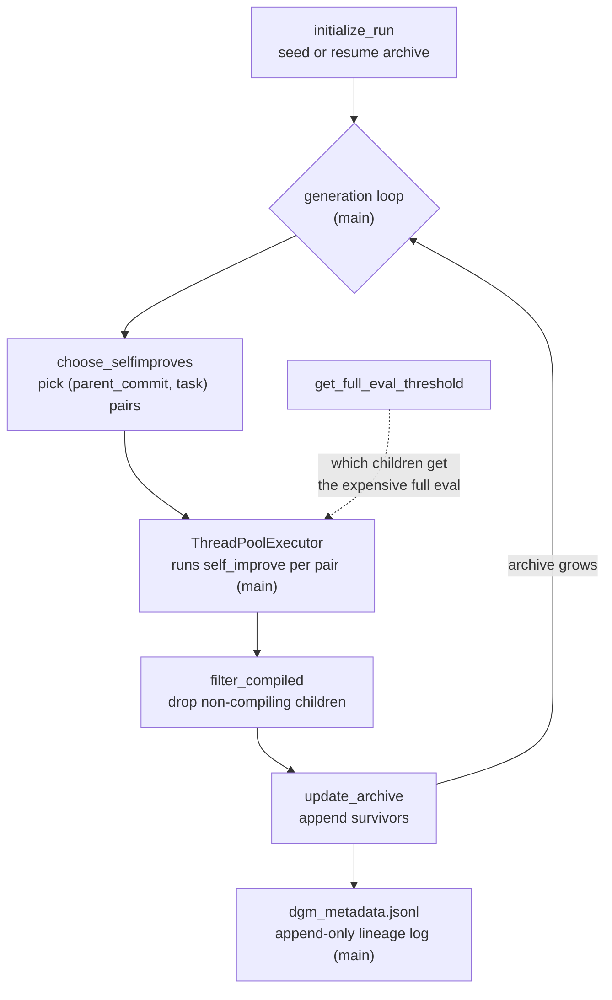

# The DGM outer loop — archive and stepping-stone parent selection

## Overview
`DGM_outer.py` is the process a user actually launches (`python DGM_outer.py`) and the part of the system
that is **not** rewritten by the agent: it owns the archive of every coding-agent variant the run has
produced, decides which archive member gets to be a parent for the next generation, and decides which
freshly produced children are admitted back into the archive. Where the self-editing agent (see the sibling
`coding_agent`/`self_improve_step` concepts) is the thing being evolved, this module is the fixed evolutionary
machinery doing the evolving — a growing population, not a single mutating lineage.

## Diagram

## Design rationale (why it's built this way)
The archive is deliberately **not** a fitness-gated set. The default
[`update_archive`](../catalog/DGM_outer.md#update_archive) method is `'keep_all'`: every child that survives
the `filter_compiled` viability check — i.e. it still compiles and produced *some* usable evaluation
output — is appended to the archive regardless of whether its score improved on its parent. The alternative, `'keep_better'`, imposes a fitness floor (the *original* initial-agent score minus
`noise_leeway`, not the parent's own score) and is used for ablations, not the default run. This is exactly
the "growing archive vs. single ratchet" distinction: a hill-climber would discard a child that scored worse
than its parent; DGM's default keeps it, because that child may itself be the stepping stone to a later
breakthrough its parent could never have reached directly.

Parent selection makes the same bet more explicit.
[`choose_selfimproves`](../catalog/DGM_outer.md#choose_selfimproves)'s default `method='score_child_prop'`
computes, per candidate parent, a sigmoid of its accuracy score (`1/(1+exp(-10*(score-0.5)))`) multiplied by
an *inverse child-count* term (`1/(1+children_count)`), normalizes to a probability distribution, and then
samples parents **categorically** (`random.choices`, not `argmax`) — so every archive member, however weak,
keeps a non-zero chance of being resampled, and nodes that have already spawned many children are
deliberately deprioritized in favor of less-explored ones. This is the paper's "stepping-stone" selection:
performance-biased but never performance-*exclusive*, and explicitly novelty-seeking via the child-count
penalty rather than pure greedy exploitation. Two other `method` values make the space of alternatives
concrete: `'best'` is a deterministic, no-stochasticity selection that sorts the archive by
`accuracy_score` and takes a `selfimprove_size`-length slice (as written it sorts *ascending* and takes the
lowest-scoring slice — apparently a bug, since the name and intent imply the top scorers; either way there
are no stepping stones), and the
`run_baseline == 'no_darwin'` branch always resamples the single most-recently-produced commit — an explicit
ablation of the archive mechanism itself, collapsing the search back to one continuously mutating lineage.
Comparing these is exactly how the paper isolates the archive's contribution from everything else DGM does.

[`get_full_eval_threshold`](../catalog/DGM_outer.md#get_full_eval_threshold) rations the expensive full
SWE-bench evaluation: it computes the second-highest score currently in the archive (floored at `0.4`) and
[`main`](../catalog/DGM_outer.md#main) passes that threshold into each self-improvement attempt so only
children that look competitive with the *existing* elite are worth the full, costly evaluation — cheaper
partial evaluation covers the rest. This keeps the archive's growth affordable without gating *admission*
into the archive on it.

> [!inferred] Note what this module does **not** do: it never edits `choose_selfimproves`,
> `update_archive`, or its own selection probabilities. The archive/parent-selection machinery is the fixed,
> human-owned floor of the search — only the coding agent underneath it (its tools, prompts, and
> orchestration in `coding_agent.py`/`tools/`/`prompts/`) is in the agent's own edit scope. See
> [`../../../concepts/self-referential-code-rewriting.md`](../../../concepts/self-referential-code-rewriting.md)
> for that boundary.

## Entry points
- [`main`](../catalog/DGM_outer.md#main) — the CLI entry point (`python DGM_outer.py`); parses generation
  count, self-improve batch size/worker count, parent-selection method, archive-update method, and baseline
  flags, then drives the generation loop described below.

## Mechanism (step-by-step)
1. **Bootstrap or resume the archive.** [`initialize_run`](../catalog/DGM_outer.md#initialize_run) either
   seeds a brand-new archive as `['initial']` (the frozen starting agent) or, given `--continue_from`, loads
   the previous run's last archive and generation counter via
   [`load_dgm_metadata`](../catalog/utils/evo_utils.md#load_dgm_metadata) — every DGM lineage always traces
   back to the same single `'initial'` root.
2. **Select this generation's (parent, task) pairs.** For each of `selfimprove_size` slots,
   [`choose_selfimproves`](../catalog/DGM_outer.md#choose_selfimproves) first rebuilds a `candidates` map
   from every archive member's `metadata.json` (score, unresolved/empty-patch instance ids, and a
   `children_count` derived by walking each candidate's recorded `parent_commit`), then samples a parent per
   the method above, then — for that parent — either dispatches to one of three fixed maintenance tasks
   (`solve_empty_patches`, `solve_stochasticity`, `solve_contextlength`, each gated by its own random
   trigger and, for context length, by
   [`any_exceeding_context_length`](../catalog/DGM_outer.md#any_exceeding_context_length) scanning that
   parent's eval logs via
   [`find_selfimprove_eval_logs`](../catalog/prompts/self_improvement_prompt.md#find_selfimprove_eval_logs))
   or falls through to picking a random still-unresolved SWE-bench/Polyglot instance as the concrete task.
3. **Fan out self-improvement attempts concurrently.** [`main`](../catalog/DGM_outer.md#main) submits one
   job per selected `(parent_commit, entry)` pair to a `ThreadPoolExecutor` sized by `selfimprove_workers`,
   each running the (out-of-subgraph) `self_improve` step — see the sibling `self_improve_step` concept page
   for what happens inside that job — collecting each result with a 1.5-hour timeout so one hung attempt
   cannot stall the generation.
4. **Filter to viable children.** Back in [`main`](../catalog/DGM_outer.md#main), the `filter_compiled`
   helper (reading each child's `metadata.json` via [`load_json_file`](../catalog/utils/common_utils.md#load_json_file))
   drops any `run_id` that failed to compile or produced only empty patches — this is the *minimal viability
   bar* the archive still enforces even under `keep_all`; a child must at least still be a working agent to
   be considered at all.
5. **Grow the archive.** [`update_archive`](../catalog/DGM_outer.md#update_archive) appends the surviving
   `run_id`s — unconditionally under the default `keep_all`, or gated by
   [`get_original_score`](../catalog/DGM_outer.md#get_original_score) minus a noise leeway under
   `keep_better`.
6. **Persist the lineage record.** [`main`](../catalog/DGM_outer.md#main) appends one JSON line to
   `dgm_metadata.jsonl` per generation — the generation number, which pairs were attempted, which children
   resulted, which of those compiled, and the new archive snapshot — making the entire evolutionary history
   (which commit is whose parent, at every generation) reconstructable after the fact.
7. **Loop.** [`main`](../catalog/DGM_outer.md#main) repeats steps 2–6 for `max_generation` generations
   (default 80), each iteration operating over the archive as it stood at the end of the previous one — so a
   node added in generation 3 is immediately eligible to be sampled by
   [`choose_selfimproves`](../catalog/DGM_outer.md#choose_selfimproves) as a parent in generation 4,
   weighted by the same stepping-stone formula as every pre-existing member.

## Key data structures
- **`archive`** — a plain `list[str]` of commit/run ids (directory names under `output_dir`), threaded
  through [`initialize_run`](../catalog/DGM_outer.md#initialize_run) →
  [`choose_selfimproves`](../catalog/DGM_outer.md#choose_selfimproves) →
  [`update_archive`](../catalog/DGM_outer.md#update_archive) → next generation. It is never pruned — only
  appended to (under `keep_all`) — so it is the full population, not a fixed-size elite set.
- **`candidates`** (local to `choose_selfimproves`) — one entry per archive member: `accuracy_score`,
  `total_unresolved_ids`/`total_emptypatch_ids`/`total_resolved_ids` (which SWE-bench/Polyglot instances that
  variant still fails, produced empty patches for, or already solves), and a `children_count` reconstructed
  by walking every other candidate's stored `parent_commit` — this is what the inverse-child-count novelty
  term in `score_child_prop` reads.
- **`dgm_metadata.jsonl`** — the append-only, one-line-per-generation record written by
  [`main`](../catalog/DGM_outer.md#main): the ground truth for reconstructing any lineage (e.g. tracing a
  specific SWE-bench-solving agent back through every ancestor that made it possible).

## Dynamics (design intent)
Generations run **sequentially** (`main`'s `for gen_num in range(...)` loop), but the
`selfimprove_size` attempts *within* one generation run **concurrently** via `ThreadPoolExecutor` — the
archive is only mutated once, after all of that generation's futures resolve or time out, avoiding
concurrent-write races on `update_archive` and `dgm_metadata.jsonl`. The 1.5-hour
per-future timeout in [`main`](../catalog/DGM_outer.md#main) means a single hung self-improve attempt is
dropped from that generation (logged as an error) rather than blocking the whole run indefinitely.

## Edge cases
- A candidate whose `metadata.json` is missing or malformed (e.g. the SWE-eval crashed, or the child never
  produced a valid patch) is caught and simply excluded from `candidates` in
  [`choose_selfimproves`](../catalog/DGM_outer.md#choose_selfimproves) — it stays in `archive` but can never
  again be selected as a parent.
- `run_baseline='no_darwin'` bypasses the whole scoring/sampling computation and always takes the *last*
  candidate in insertion order — a deliberate ablation, not a normal code path.
- [`get_full_eval_threshold`](../catalog/DGM_outer.md#get_full_eval_threshold) falls back to a hard floor of
  `0.4` whenever the archive has fewer than two eligible full-eval scores, so early generations (before the
  archive has grown) don't get an artificially low or undefined threshold.

## Open questions
- The out-of-subgraph `self_improve` function (defined in `self_improve_step.py`, imported at the top of
  `DGM_outer.py`) is what each `ThreadPoolExecutor` future actually runs; its internals — including where
  the agent's self-editing and re-validation happen — are covered by the sibling `self_improve_step` concept
  page rather than here, since this packet's subgraph stops at the dispatch call in `main`.
- Nothing in this subgraph shows the archive ever being pruned or capped in size; whether a very long run
  (many generations) is expected to hit a practical size limit on `output_dir` or on `choose_selfimproves`'s
  `O(archive)` candidate-rebuild isn't settled by this code alone.

## See also
- [`self_improve_step`](self_improve_step.md) — what happens inside one dispatched self-improvement attempt
  (diagnosis, the agent editing itself, harness re-evaluation).
- [`coding_agent`](coding_agent.md) — the agent being evolved; its scaffold is the actual self-modification
  target, not this module.
- [`../../../concepts/evolutionary-self-improvement.md`](../../../concepts/evolutionary-self-improvement.md) —
  the cross-repo concept this module is the clearest in-wiki instance of.
- [`../../../sources/darwin-godel-machine.md`](../../../sources/darwin-godel-machine.md) — the paper this
  code implements.
