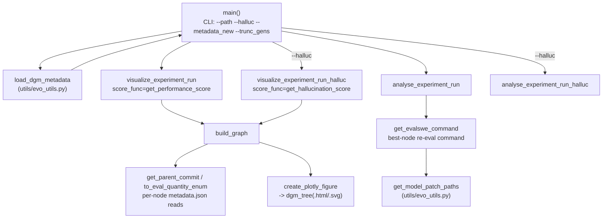

# visualize_archive — plotting the archive's lineage tree offline

## Overview
`analysis/visualize_archive.py` is a standalone CLI script a human runs *after* (or during) a DGM run to see
what the archive actually looks like: it reads the same `dgm_metadata.jsonl` lineage file and per-node
`metadata.json` files that `DGM_outer.py` writes at runtime, reconstructs the parent->child tree as an
`nx.DiGraph`, and renders it as an interactive Plotly HTML page (plus a static SVG) with nodes colored by
score and a highlighted path tracing the lineage from the frozen `'initial'` agent to whichever node scored
best. It also prints/saves plain-text statistics and ready-to-copy re-evaluation commands. None of this
feeds back into the run - it is purely an offline read of the archive, never a participant in it.

## Diagram

## Design rationale (why it's built this way)
[`build_graph`](../catalog/analysis/visualize_archive.md#build_graph) is deliberately generic over *which*
metric it plots: its own docstring calls it a "Generic helper to build a DiGraph with node attributes from
the archives," parameterized by a `score_func` callable, so the same tree-construction code serves both the
standard accuracy view (`score_func=`[`get_performance_score`](../catalog/analysis/visualize_archive.md#get_performance_score))
and the hallucination view (`score_func=get_hallucination_score`) via
[`visualize_experiment_run`](../catalog/analysis/visualize_archive.md#visualize_experiment_run) and
[`visualize_experiment_run_halluc`](../catalog/analysis/visualize_archive.md#visualize_experiment_run_halluc)
respectively. The dispatch mechanism itself is worth noticing: `build_graph` branches on `if score_func ==
get_performance_score`, i.e. Python function-object *identity*, to decide how to compute the root node's
score inline - a compact way to share one function across two metrics without a separate enum/string
argument, but one that would silently mis-route if a wrapped or partial version of either scorer were ever
passed instead of the bare function.

The plot exists to answer a specific question a raw archive listing can't: not just "what's the best
score," but "was the archive's growth a stepping-stone path or a single ratchet." That is exactly what
[`create_plotly_figure`](../catalog/analysis/visualize_archive.md#create_plotly_figure)'s lineage
highlighting computes - it finds the shortest path from `'initial'` to the single best-scoring node and
draws that specific chain of edges thicker (width 5) than the rest of the tree (width 1). The code sorts both
lineage and non-lineage edges into score-increased/decreased/unchanged pools, but in the current source every
edge trace is rendered solid `color="black"` — the per-direction colors (the docstring's "retains each edge's
color") are commented out, so only edge *thickness* (lineage vs. not), not color, is visually distinct. This
turns the archive's full parent->child graph (which, per
`DGM_outer`'s default `keep_all` policy, keeps every viable child regardless of whether it beat its parent)
into a visual answer to "which ancestors actually mattered to the eventual winner," without altering how the
archive itself was grown.

Each node's outline color (red/orange/green, from
[`get_evalquantity`](../catalog/analysis/visualize_archive.md#get_evalquantity) via
[`to_eval_quantity_enum`](../catalog/analysis/visualize_archive.md#to_eval_quantity_enum) bucketing
`total_submitted_instances` into [`EvalQuantity`](../catalog/analysis/visualize_archive.md#EvalQuantity)'s
`SMALL`/`MED`/`BIG`) exists so a viewer can't mistake a high score reached on a handful of instances for one
validated on the full benchmark - the color is a visual confidence signal layered on top of the score color,
not a second metric.

> [!inferred] `get_evalswe_command` (used by `analyse_experiment_run`) and the whole analysis/plotting
> module exist purely to point a human at a follow-up action - a copy-pasteable `test_swebench.py --full_eval`
> command for the top-scoring node(s) - rather than to trigger anything automatically; nothing in this
> subgraph shows the script invoking that command itself.

## Entry points
- [`main`](../catalog/analysis/visualize_archive.md#main) - the CLI entry point (`python
  analysis/visualize_archive.py --path <dgm_dir> [--halluc] [--metadata_new] [--trunc_gens N]`); the only way
  this module is invoked.
- [`build_graph`](../catalog/analysis/visualize_archive.md#build_graph) - the shared tree-construction
  routine both visualization functions call; reached once per `--halluc`/non-`--halluc` pass.
- [`get_performance_score`](../catalog/analysis/visualize_archive.md#get_performance_score) - the default
  per-node metric reader every non-hallucination code path (graph building, statistics) ultimately calls.
- [`to_eval_quantity_enum`](../catalog/analysis/visualize_archive.md#to_eval_quantity_enum) - converts a raw
  instance count into the `SMALL`/`MED`/`BIG` bucket used for node border coloring; reached from
  `get_evalquantity` for every node in the graph.

## Mechanism (step-by-step)
1. **Parse CLI args and load the archive's lineage record.**
   [`main`](../catalog/analysis/visualize_archive.md#main) reads `--path`, `--halluc`, `--metadata_new`, and
   `--trunc_gens`, then loads every generation's archive snapshot via
   [`load_dgm_metadata`](../catalog/utils/evo_utils.md#load_dgm_metadata) from `dgm_dir/dgm_metadata.jsonl`,
   optionally truncating to the first `--trunc_gens` entries.
2. **Build the accuracy-score tree.** [`build_graph`](../catalog/analysis/visualize_archive.md#build_graph)
   seeds the graph with a root `"initial"` node read directly from `initial/metadata.json`, then for every
   archive generation's recorded `children`, looks up each child's parent via
   [`get_parent_commit`](../catalog/analysis/visualize_archive.md#get_parent_commit), forces the child's
   score to `0.0` if it isn't in that generation's `children_compiled` list (an uncompiled child is drawn as
   worthless regardless of what its own `metadata.json` might otherwise say), and otherwise calls
   [`get_performance_score`](../catalog/analysis/visualize_archive.md#get_performance_score) for its real
   accuracy score - every node also gets an eval-quantity bucket and a Graphviz `dot`-layout position.
3. **Render the interactive/static figures.**
   [`create_plotly_figure`](../catalog/analysis/visualize_archive.md#create_plotly_figure) locates the
   highest-scoring node, computes the shortest path from `"initial"` to it to identify "lineage" edges,
   builds separate thin/thick Plotly line traces for non-lineage/lineage edges (further split by
   score-increased/decreased/unchanged), and a marker trace whose fill color follows a
   dark-blue-to-green-to-yellow score colorscale and whose border color follows the `EvalQuantity` bucket -
   then writes both an interactive `dgm_tree.html` and a static `dgm_tree.svg` (or the `_new`/`_halluc`
   variants) under `dgm_dir`.
4. **Compute and persist plain-text statistics.**
   [`analyse_experiment_run`](../catalog/analysis/visualize_archive.md#analyse_experiment_run) walks the same
   archive generations, but - unlike `build_graph` - only considers children that are actually in
   `children_compiled`, computing best/worst/average score across just those, then appends
   [`get_evalswe_command`](../catalog/analysis/visualize_archive.md#get_evalswe_command)-generated re-run
   commands for whichever node(s) tie for the best score, and writes the whole report to
   `dgm_analysis(.txt)` while also printing it.
5. **Repeat both passes for the hallucination metric, if requested.** When `--halluc` is passed,
   [`visualize_experiment_run_halluc`](../catalog/analysis/visualize_archive.md#visualize_experiment_run_halluc)
   and
   [`analyse_experiment_run_halluc`](../catalog/analysis/visualize_archive.md#analyse_experiment_run_halluc)
   repeat steps 2-4 with
   [`get_hallucination_score`](../catalog/analysis/visualize_archive.md#get_hallucination_score) in place of
   `get_performance_score` - but `analyse_experiment_run_halluc` includes *every* child (scoring uncompiled
   ones as `0.0`) rather than excluding them outright, a different inclusion rule than
   `analyse_experiment_run`'s (see Edge cases).
6. **Generate a manual re-evaluation command for the best node(s).**
   [`get_evalswe_command`](../catalog/analysis/visualize_archive.md#get_evalswe_command) calls
   [`get_model_patch_paths`](../catalog/utils/evo_utils.md#get_model_patch_paths) to chase a node's
   `parent_commit` chain all the way back to `'initial'`, collecting every ancestor's `model_patch.diff` in
   chronological order, and formats a `python test_swebench.py --full_eval --num_samples 50
   --model_patch_paths "..." --model_name_or_path dgmnode_<node_id>` string - the exact same lineage-walk
   `self_improve_step.py` uses at runtime to seed a child's container, reused here purely to build a
   copy-pasteable command.

## Key data structures
- **`archives`** - the list of per-generation dicts `main` loads via
  [`load_dgm_metadata`](../catalog/utils/evo_utils.md#load_dgm_metadata); each has `children`,
  `children_compiled`, and `archive` keys that `build_graph`/`analyse_experiment_run*` iterate over.
  `load_dgm_metadata` itself parses the file by splitting its raw text on `'\n{'` and re-adding the brace,
  rather than one-JSON-object-per-line - implying entries in `dgm_metadata.jsonl` are written as
  multi-line/pretty-printed JSON blocks, not strict JSONL.
- **`graph`** (an `nx.DiGraph`) - the structure
  [`build_graph`](../catalog/analysis/visualize_archive.md#build_graph) returns, with per-node attributes
  `run_id`, `compiled`, `archived`, `score`, `eval_quantity`, and a plotting `index`; `pos` is the paired
  Graphviz-layout coordinate dict consumed by
  [`create_plotly_figure`](../catalog/analysis/visualize_archive.md#create_plotly_figure).
- **[`EvalQuantity`](../catalog/analysis/visualize_archive.md#EvalQuantity)** - a plain string-constant
  class (`SMALL`/`MED`/`BIG`) used only as a marker-border-color key, not a scoring input.

## Dynamics (design intent)
> [!inferred] This script has no concurrency or scheduling of its own - `main` runs its steps strictly
> sequentially, reading a snapshot of whatever `dgm_metadata.jsonl`/`metadata.json` files exist on disk at
> invocation time. Nothing in this subgraph indicates it is safe (or unsafe) to run concurrently with an
> in-progress `DGM_outer.py` run still appending to those same files.

## Edge cases
- The same "uncompiled child" case is handled three different ways across this module:
  [`build_graph`](../catalog/analysis/visualize_archive.md#build_graph) still adds the node to the graph but
  forces its score to `0.0`; [`analyse_experiment_run`](../catalog/analysis/visualize_archive.md#analyse_experiment_run)
  excludes it from its statistics entirely (only children in `children_compiled` are counted at all); and
  [`analyse_experiment_run_halluc`](../catalog/analysis/visualize_archive.md#analyse_experiment_run_halluc)
  includes it like `build_graph` does, scored at `0.0`. A reader comparing "number of compiled runs" in the
  text report against the node count in the plotted tree should expect them to disagree.
- [`build_graph`](../catalog/analysis/visualize_archive.md#build_graph)'s root-node score computation
  branches on `score_func == get_performance_score` (function-object identity) rather than an explicit flag
  - passing any other callable that computes the same accuracy metric would fall through to the
  hallucination branch instead.
- [`get_hallucination_score`](../catalog/analysis/visualize_archive.md#get_hallucination_score) only adds
  `percent_toolutilized` to `solved_halluc_score` when the latter is *exactly* `1.0`, giving the metric a
  discontinuous range: strictly `[0, 1)` when unsolved, and `[1, 2]` only once solved.
- [`create_plotly_figure`](../catalog/analysis/visualize_archive.md#create_plotly_figure) raises
  `ValueError("Graph has no nodes")` if `scores` is empty, and falls back to an empty `lineage_edges` set
  (skipping the thick-path highlight, not crashing) if `nx.shortest_path` finds no path from `'initial'` to
  the best node.

## Open questions
- [`get_run_info`](../catalog/analysis/plot_comparison.md#get_run_info) (`analysis/plot_comparison.py`) and
  [`main`](../catalog/analysis/plot_progress.md#main) (`analysis/plot_progress.py`) are sibling scripts in
  this subgraph that independently re-derive very similar "walk archives, track best/avg score per
  iteration" logic using the same `load_dgm_metadata`/`get_performance_score`/`get_parent_commit` building
  blocks, rather than sharing code with `analyse_experiment_run` here; whether that duplication is
  intentional (each script needs subtly different output) isn't settled by this subgraph.
- Nothing here shows how large `dgm_metadata.jsonl`/the archive tree are expected to grow, or whether this
  visualization is expected to scale to very long (many-generation) runs.

## See also
- [`DGM_outer`](../DGM_outer.md) - writes the `dgm_metadata.jsonl` lineage file and per-node `metadata.json`
  files this script reads; the archive/parent-selection loop whose result is what gets plotted here.
