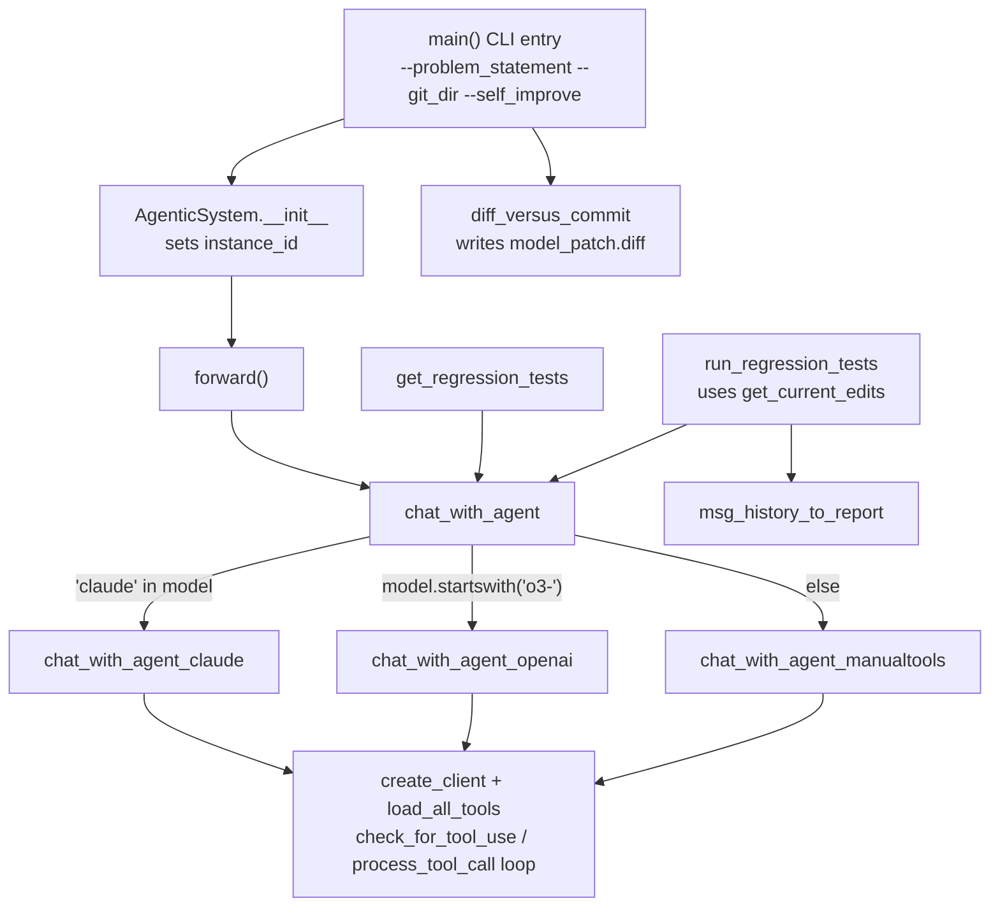

# AgenticSystem — the coding agent DGM evolves (and that edits itself)

## Overview
`coding_agent.py`'s `AgenticSystem` is the frozen foundation-model harness that both solves SWE-bench/Polyglot
issues *and* — when pointed at its own source tree — edits the very tools/prompts/orchestration that make up
DGM. The class itself is deliberately generic: [`forward`](../catalog/coding_agent.md#AgenticSystem.forward)
builds one instruction string and hands it to
[`chat_with_agent`](../catalog/llm_withtools.md#chat_with_agent), which routes to one of three model-family
implementations (Claude tool-use, OpenAI's responses API, or a manual `<tool_use>`-tag fallback for models
with no native function calling) so that whatever LLM `self.code_model` names can drive the same two tools
(a bash shell and a whole-file editor, loaded generically by
[`load_all_tools`](../catalog/tools/__init__.md#load_all_tools)) through the same tool-call loop. The
striking thing on reading the source: **nothing inside this module branches on `self.self_improve`** except
one line that renames the run for logging. The self-referential loop everyone means when they say "DGM edits
itself" is not a code path inside `AgenticSystem` — it is an emergent consequence of what `git_tempdir` and
`problem_statement` are set to by the caller (see the sibling `self_improve_step` page): when they point at a
container holding DGM's *own* code, "make changes to the files in `{self.git_tempdir}`" means "edit your own
tools, prompts, and workflow."

## Diagram

## Design rationale (why it's built this way)
The most surprising fact this packet's source reveals is that `self.self_improve` is essentially inert
inside `AgenticSystem`. In `__init__` it does exactly one thing:
[`instance_id`](../catalog/coding_agent.md#AgenticSystem.instance_id) is set to `'dgm'` whenever
`self_improve` is true, overriding whatever `--instance_id` was passed on the CLI. Nothing else — not
[`forward`](../catalog/coding_agent.md#AgenticSystem.forward)'s instruction template, not which tools are
loaded, not which `chat_with_agent` branch runs — reads that flag. The self-editing behavior instead falls
out of a level of indirection one layer up: the sibling `self_improve_step` process builds a container whose
`/dgm/` directory *is* the parent agent's accumulated code, then execs
`coding_agent.py --problem_statement <diagnosis> --self_improve --git_dir /dgm/`. From `AgenticSystem`'s point
of view this is just another `git_tempdir` to solve a problem in — it has no idea the "repository" it is
editing is itself. This is a clean design: the harness that solves an external GitHub issue and the harness
that rewrites DGM's own tools are the *same forty lines of code*; self-reference is a property of the
deployment, not a special case in the agent.

The `chat_with_agent` three-way split
([`chat_with_agent_claude`](../catalog/llm_withtools.md#chat_with_agent_claude),
[`chat_with_agent_openai`](../catalog/llm_withtools.md#chat_with_agent_openai),
[`chat_with_agent_manualtools`](../catalog/llm_withtools.md#chat_with_agent_manualtools)) exists because
"call an LLM with tools" is not one API: Claude's Messages API, OpenAI's Responses API, and models with no
native function-calling support each need a different request shape and a different way of detecting that the
model asked for a tool. [`check_for_tool_use`](../catalog/llm_withtools.md#check_for_tool_use) itself branches
three ways for exactly this reason — Claude via `response.stop_reason`, OpenAI via scanning
`response.output` for a `function_call`, and everything else via regex-matching a `<tool_use>{...}</tool_use>`
block that [`get_tooluse_prompt`](../catalog/prompts/tooluse_prompt.md#get_tooluse_prompt) taught the model to
emit in its system message. Keeping this dispatch in one small function
([`chat_with_agent`](../catalog/llm_withtools.md#chat_with_agent)) is what lets `self.code_model` — and by
extension a self-edit that swaps which model the agent uses — be a one-line change rather than a rewrite of
`forward`.

`get_regression_tests`/`run_regression_tests` exist as a *self-attested* validation harness, distinct from the
one-shot `forward()` that produces a candidate fix. Rather than a separate verifier, the same agent (via
another `chat_with_agent` call) is asked first to locate the regression tests relevant to a change, then —
in a second call — to actually run them against the diff produced by
[`get_current_edits`](../catalog/coding_agent.md#AgenticSystem.get_current_edits) and report the outcome. It
is worth being explicit that this is *not* the mechanism that ultimately decides whether a self-improvement
attempt is accepted into DGM's archive — that decision is the SWE-bench/Polyglot harness re-run described in
the sibling `self_improve_step` page. `run_regression_tests` is this module's own internal review step, useful
whenever `AgenticSystem` is used to solve any task, self-improvement or not.

> [!inferred] Because `self.instance_id` is forced to `'dgm'` in self-improve mode,
> [`msg_history_to_report`](../catalog/utils/eval_utils.md#msg_history_to_report)'s downstream
> [`parse_eval_output`](../catalog/utils/eval_utils.md#parse_eval_output) call resolves the repo key to the
> literal string `"dgm"`, and [`MAP_REPO_TO_PARSER`](../catalog/utils/swe_log_parsers.md#MAP_REPO_TO_PARSER)
> maps that key to [`parse_log_pytest`](../catalog/utils/swe_log_parsers.md#parse_log_pytest) — i.e. a
> self-improvement run's own regression-test report is parsed as plain pytest output, unlike the per-repo
> parsers (e.g. [`parse_log_django`](../catalog/utils/swe_log_parsers.md#parse_log_django)) used for external
> SWE-bench repos.

## Entry points
- [`main`](../catalog/coding_agent.md#main) — the process `self_improve_step.py` execs inside a container
  (`python coding_agent.py --problem_statement ... --git_dir ... --self_improve`) and the same script SWE-bench
  evaluation invokes for an ordinary issue; it constructs `AgenticSystem`, calls
  [`forward`](../catalog/coding_agent.md#AgenticSystem.forward), then writes the resulting
  [`diff_versus_commit`](../catalog/utils/git_utils.md#diff_versus_commit) output to `model_patch.diff`.
- [`forward`](../catalog/coding_agent.md#AgenticSystem.forward) — the method that actually drives the agent:
  builds one instruction embedding
  [`problem_statement`](../catalog/coding_agent.md#AgenticSystem.problem_statement) and
  [`test_description`](../catalog/coding_agent.md#AgenticSystem.test_description), then calls
  [`chat_with_agent`](../catalog/llm_withtools.md#chat_with_agent) once.
- [`get_regression_tests`](../catalog/coding_agent.md#AgenticSystem.get_regression_tests) — an optional,
  separately-invoked step (not called from `forward` itself in this subgraph) that asks the agent to locate
  the tests relevant to the problem before any fix is attempted.
- [`run_regression_tests`](../catalog/coding_agent.md#AgenticSystem.run_regression_tests) — validates a
  candidate fix by handing the agent the diff from
  [`get_current_edits`](../catalog/coding_agent.md#AgenticSystem.get_current_edits) plus the regression-test
  summary and asking it to execute them.

## Mechanism (step-by-step)
1. **The CLI is the same for a SWE task and a self-edit.**
   [`main`](../catalog/coding_agent.md#main) parses `--problem_statement`, `--git_dir`, `--base_commit`, and
   `--self_improve`, constructs one `AgenticSystem`, and calls
   [`forward`](../catalog/coding_agent.md#AgenticSystem.forward). Whether this run is "solve a GitHub issue"
   or "rewrite your own tools" is entirely a function of what `--git_dir`/`--problem_statement` were set to by
   the caller — `main` itself does not distinguish the two.
2. **`forward` issues one instruction and defers everything to `chat_with_agent`.**
   [`forward`](../catalog/coding_agent.md#AgenticSystem.forward) formats
   [`git_tempdir`](../catalog/coding_agent.md#AgenticSystem.git_tempdir),
   [`problem_statement`](../catalog/coding_agent.md#AgenticSystem.problem_statement), and
   [`test_description`](../catalog/coding_agent.md#AgenticSystem.test_description) into a single "make changes
   to the files in `{git_tempdir}` to address `{problem_statement}`" prompt and passes it, with
   [`code_model`](../catalog/coding_agent.md#AgenticSystem.code_model) (default
   [`CLAUDE_MODEL`](../catalog/llm_withtools.md#CLAUDE_MODEL)), straight to
   [`chat_with_agent`](../catalog/llm_withtools.md#chat_with_agent). `forward` never inspects the returned
   message history — the effect it cares about is the filesystem diff left behind in `git_tempdir`, retrieved
   later by [`main`](../catalog/coding_agent.md#main) via
   [`diff_versus_commit`](../catalog/utils/git_utils.md#diff_versus_commit).
3. **`chat_with_agent` dispatches on the model name, not on the task.**
   [`chat_with_agent`](../catalog/llm_withtools.md#chat_with_agent) checks `'claude' in model`, then
   `model.startswith('o3-')`, else falls through to the manual-tool-use path — routing to
   [`chat_with_agent_claude`](../catalog/llm_withtools.md#chat_with_agent_claude),
   [`chat_with_agent_openai`](../catalog/llm_withtools.md#chat_with_agent_openai), or
   [`chat_with_agent_manualtools`](../catalog/llm_withtools.md#chat_with_agent_manualtools) respectively. This
   is the same three-way split regardless of whether the instruction from step 2 describes an external repo
   or DGM's own source — the routing knows nothing about self-improvement.
4. **Each branch runs its own create-client / load-tools / tool-call loop.** All three branches call
   [`create_client`](../catalog/llm.md#create_client) to build a model-specific client,
   [`load_all_tools`](../catalog/tools/__init__.md#load_all_tools) to dynamically import every tool module
   under `tools/` (the bash shell and the whole-file editor, in this checkout), then loop:
   [`get_response_withtools`](../catalog/llm_withtools.md#get_response_withtools) (Claude/OpenAI) or
   [`get_response_from_llm`](../catalog/llm.md#get_response_from_llm) (manual) calls the model,
   [`check_for_tool_use`](../catalog/llm_withtools.md#check_for_tool_use) inspects the response for a tool
   call, and [`process_tool_call`](../catalog/llm_withtools.md#process_tool_call) executes it against the
   loaded tools' functions — repeating until the model stops requesting tools. When the file the loop is
   editing happens to be `coding_agent.py`, `llm_withtools.py`, or a file under `tools/`/`prompts/`, this loop
   *is* the self-rewrite.
5. **Cross-model shims paper over the resulting message-history formats.**
   [`convert_msg_history`](../catalog/llm_withtools.md#convert_msg_history) (via
   [`convert_msg_history_claude`](../catalog/llm_withtools.md#convert_msg_history_claude)/
   [`convert_block_claude`](../catalog/llm_withtools.md#convert_block_claude) or
   [`convert_msg_history_openai`](../catalog/llm_withtools.md#convert_msg_history_openai)) and
   [`convert_tool_info`](../catalog/llm_withtools.md#convert_tool_info) (with its nested
   [`add_additional_properties`](../catalog/llm_withtools.md#convert_tool_info.add_additional_properties)
   helper, which OpenAI's strict function-calling schema requires) exist purely so the same tool definitions
   and message history can be replayed across model families — necessary because a self-edit can, in
   principle, change which `code_model` a *future* generation's agent uses.
6. **Validation is a second, separate agent conversation, not a static check.**
   [`get_regression_tests`](../catalog/coding_agent.md#AgenticSystem.get_regression_tests) sends a fresh
   instruction through [`chat_with_agent`](../catalog/llm_withtools.md#chat_with_agent) asking the agent to
   locate and describe relevant regression tests, then
   [`run_regression_tests`](../catalog/coding_agent.md#AgenticSystem.run_regression_tests) sends another
   instruction — this time embedding the diff from
   [`get_current_edits`](../catalog/coding_agent.md#AgenticSystem.get_current_edits) plus that regression-test
   summary — asking the agent to actually execute them, and finally
   [`msg_history_to_report`](../catalog/utils/eval_utils.md#msg_history_to_report) scrapes the resulting
   transcript for a `Tool Result:` message and hands it to
   [`parse_eval_output`](../catalog/utils/eval_utils.md#parse_eval_output) (dispatching through
   [`MAP_REPO_TO_PARSER`](../catalog/utils/swe_log_parsers.md#MAP_REPO_TO_PARSER)) to turn raw test-runner
   output into a structured pass/fail report.

## Key data structures
- **`self.problem_statement` / `self.test_description` / `self.git_tempdir` / `self.base_commit`**
  ([`problem_statement`](../catalog/coding_agent.md#AgenticSystem.problem_statement),
  [`test_description`](../catalog/coding_agent.md#AgenticSystem.test_description),
  [`git_tempdir`](../catalog/coding_agent.md#AgenticSystem.git_tempdir),
  [`base_commit`](../catalog/coding_agent.md#AgenticSystem.base_commit)) — the entire task description is
  these four plain attributes, set once in `__init__` and never mutated; every instruction string in
  `forward`/`get_regression_tests`/`run_regression_tests` is a template over exactly these fields, which is
  why the class cannot tell an external issue from a self-edit task.
- **`self.instance_id`** ([`instance_id`](../catalog/coding_agent.md#AgenticSystem.instance_id)) — the one
  field `self_improve` actually touches; forced to `'dgm'` so downstream report parsing
  ([`msg_history_to_report`](../catalog/utils/eval_utils.md#msg_history_to_report)) picks the DGM-specific
  branch instead of trying to infer a SWE-bench repo name from a real `instance_id`.
- **`self.code_model`** ([`code_model`](../catalog/coding_agent.md#AgenticSystem.code_model)) — defaults to
  [`CLAUDE_MODEL`](../catalog/llm_withtools.md#CLAUDE_MODEL); this single string is what
  [`chat_with_agent`](../catalog/llm_withtools.md#chat_with_agent)'s three-way dispatch keys off of, so a
  self-edit to this one assignment is enough to change which model family drives every future generation's
  agent.
- **`new_msg_history`** (threaded through every `chat_with_agent*` variant) — the accumulating list of
  user/assistant/tool-result turns; it is what
  [`convert_msg_history`](../catalog/llm_withtools.md#convert_msg_history) normalizes and what
  [`msg_history_to_report`](../catalog/utils/eval_utils.md#msg_history_to_report) scans backwards over to find
  the last tool-execution result.

## Dynamics (design intent)
Logging is thread-local by construction:
[`safe_log`](../catalog/coding_agent.md#safe_log) looks up
[`get_thread_logger`](../catalog/coding_agent.md#get_thread_logger), which reads a per-thread logger out of
[`thread_local`](../catalog/coding_agent.md#thread_local) rather than a single module-level logger. Every
`chat_with_agent*` call is passed `logging=safe_log` from
[`forward`](../catalog/coding_agent.md#AgenticSystem.forward)/
[`get_regression_tests`](../catalog/coding_agent.md#AgenticSystem.get_regression_tests)/
[`run_regression_tests`](../catalog/coding_agent.md#AgenticSystem.run_regression_tests), which is what makes it
safe for the sibling `DGM_outer`/`self_improve_step` machinery to run many `AgenticSystem` instances
concurrently (one per `ThreadPoolExecutor` worker, per the `DGM_outer` page) without their chat transcripts
interleaving into one file.

## Edge cases
- All three `chat_with_agent_*` implementations wrap their tool-call loop in a bare
  `try`/`except Exception: pass` (visible in the source backing
  [`chat_with_agent_claude`](../catalog/llm_withtools.md#chat_with_agent_claude),
  [`chat_with_agent_openai`](../catalog/llm_withtools.md#chat_with_agent_openai), and
  [`chat_with_agent_manualtools`](../catalog/llm_withtools.md#chat_with_agent_manualtools)). A mid-loop failure
  — an API error that survives `get_response_withtools`'/`get_response_from_llm`'s own `backoff` retries, or a
  malformed tool call — is swallowed silently and whatever partial `new_msg_history` had accumulated so far is
  returned as if it were complete. `forward` does not check for success; a silently-truncated run just looks
  like an agent that stopped early.
- [`get_regression_tests`](../catalog/coding_agent.md#AgenticSystem.get_regression_tests) extracts the final
  message's text with a `try`/`except: pass` around a `['content'][-1]['text']` lookup; if that shape doesn't
  match (e.g. a different model's message format), it silently falls back to returning the raw message dict
  instead of a text summary, which then gets embedded verbatim into the next instruction template in
  [`run_regression_tests`](../catalog/coding_agent.md#AgenticSystem.run_regression_tests).
- `run_regression_tests` has the same [`code_model`](../catalog/coding_agent.md#AgenticSystem.code_model) grade
  the fix it (or an ancestor of it) just produced — there is no separate verifier model in this subgraph; the
  agent is asked to review, then execute, its own regression tests.

## Open questions
- The concrete tools `load_all_tools` discovers (a bash shell and a whole-file view/create/edit tool in this
  checkout) are outside this packet's subgraph, so exactly what the edit tool's interface constrains a
  self-edit to (e.g. whole-file overwrite vs. a patch/diff format) isn't grounded here — see the sibling
  `self_improve_step` page for how the resulting edit is packaged as `model_patch.diff` and re-validated.
- Nothing in this subgraph shows `forward` invoking
  [`get_regression_tests`](../catalog/coding_agent.md#AgenticSystem.get_regression_tests)/
  [`run_regression_tests`](../catalog/coding_agent.md#AgenticSystem.run_regression_tests) itself; whether/when
  they are called (versus being invoked separately by an evaluation harness) isn't settled by this module
  alone.
- Whether a self-edit that changes `chat_with_agent`'s own dispatch logic or `AgenticSystem.__init__`'s
  handling of `self_improve` could break the very mechanism `self_improve_step` depends on to re-invoke the
  agent (a self-edit "poisoning" its own re-invocation contract) is not something this subgraph's static
  structure can settle — only the re-evaluation step described in the sibling `self_improve_step` page would
  catch it empirically.

## See also
- [`self_improve_step`](self_improve_step.md) — the orchestration that builds the container, diagnoses the
  problem statement this module's `forward` receives, invokes `main` with `--self_improve`, and re-evaluates
  the result on SWE-bench/Polyglot.
- [`DGM_outer`](DGM_outer.md) — the outer archive and stepping-stone parent-selection loop that decides which
  `AgenticSystem` variant (which past self-edit) gets to be a parent for the next self-improvement attempt.
- [`../../../concepts/self-referential-code-rewriting.md`](../../../concepts/self-referential-code-rewriting.md) —
  the cross-repo concept this module instantiates: the same generic task-solving loop, pointed at its own
  source, is the entire self-modification mechanism.
- [`../../../sources/darwin-godel-machine.md`](../../../sources/darwin-godel-machine.md) — the paper this code
  implements.
