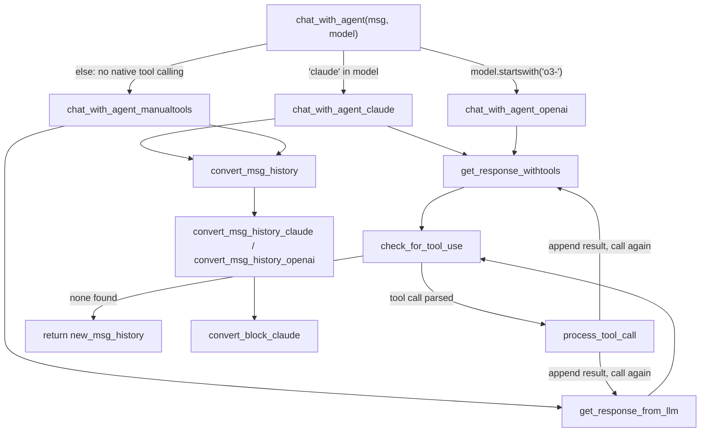

# LLM Tool-Use Abstraction (llm_withtools)

## Overview
`llm_withtools.py` is the layer that lets DGM's coding agent (`AgenticSystem`, see
[coding_agent.md](coding_agent.md)) call tools — read a file, run a shell command, edit code —
regardless of which underlying LLM is driving the conversation. The single key idea: there is no
shared "tool calling" API to build one loop against, so the module gives up on one loop and instead
runs **three structurally different request/response/retry loops** behind one dispatch function,
[`chat_with_agent`](../catalog/llm_withtools.md#chat_with_agent), and converts between their message
formats only when a conversation needs to keep going across a model swap. Claude and OpenAI's `o3-`
family get native, schema-based tool calling through
[`get_response_withtools`](../catalog/llm_withtools.md#get_response_withtools); everything else
(`gpt-4o-*`, `o1-*`, DeepSeek, Llama) gets tool use simulated purely through prompting, via
[`get_response_from_llm`](../catalog/llm.md#get_response_from_llm) in `llm.py`.

## Diagram

## Design rationale (why it's built this way)
The three `chat_with_agent_*` functions look like duplicated boilerplate at a glance, but each mirrors
a genuinely different provider contract at three levels simultaneously, not just formatting: request
shape, response shape, and how history accumulates. [`chat_with_agent_claude`](../catalog/llm_withtools.md#chat_with_agent_claude)
and [`chat_with_agent_openai`](../catalog/llm_withtools.md#chat_with_agent_openai) both pass a
structured `tools=` schema into [`get_response_withtools`](../catalog/llm_withtools.md#get_response_withtools)
(Claude's `client.messages.create(..., tool_choice=..., tools=...)` vs. the `o3-` family's
`client.responses.create(..., input=messages, tools=..., parallel_tool_calls=False)`), but the two
SDKs disagree on what a "tool call happened" response looks like (`stop_reason == "tool_use"` plus a
content block vs. a `response.output` list containing a `function_call`-typed item) and on how the next
turn's history is assembled (Claude appends `{"role": "assistant", "content": response.content}` then a
`tool_result` block; the `o3-` path appends the raw `function_call` object plus a
`function_call_output` dict). [`chat_with_agent_manualtools`](../catalog/llm_withtools.md#chat_with_agent_manualtools)
is architecturally different, not just differently shaped: it never builds a `tools=` schema at all.
Instead [`get_tooluse_prompt`](../catalog/prompts/tooluse_prompt.md#get_tooluse_prompt) reads every
tool file's *raw Python source* off disk and pastes it into the system message — "Get the prompt for
using the available tools. Prompt needed for LLMs without in-built tool calling." — and the model is
asked to emit a `<tool_use>{'tool_name': ..., 'tool_input': ...}</tool_use>` text tag, which
[`check_for_tool_use`](../catalog/llm_withtools.md#check_for_tool_use) recovers with a regex plus
`ast.literal_eval` (safer than `eval`, but still trusts the model to emit a well-formed Python dict
literal). Given how differently these three worlds shape both the wire protocol and the accumulated
history, a single generic loop would need adapters at every step anyway; three near-identical loops
that each mirror their own SDK are easier to read and debug in isolation, at the cost of having to keep
three copies of the same "load tools → call → check → execute → loop" shape in sync by hand.

A second rationale shows up in [`convert_tool_info`](../catalog/llm_withtools.md#convert_tool_info):
Claude's tool schema (`name`/`description`/`input_schema`) passes through unchanged, but OpenAI's
strict function-calling mode requires every property to be listed in `required` (optional ones get a
`null` type variant added) and `additionalProperties: False` on every nested object — hence the
recursive [`add_additional_properties`](../catalog/llm_withtools.md#convert_tool_info.add_additional_properties)
helper. This isn't a style choice; it's OpenAI's JSON-schema validator forcing a rewrite of Claude's
looser schema.

> [!inferred] All three `chat_with_agent_*` bodies wrap their entire tool-use loop in a bare
> `try: ... except Exception: pass`, returning whatever `new_msg_history` had accumulated so far. The
> source gives no comment explaining this choice, but its effect is to make the outer `chat_with_agent`
> fail *silently and partially* on any bug in the loop (a malformed tool response, a `StopIteration` from
> assuming a tool-use block exists, an unexpected SDK shape) rather than propagating — very different
> failure semantics from the retry/backoff handling described below, which only covers transient API
> errors.

## Entry points
- [`chat_with_agent`](../catalog/llm_withtools.md#chat_with_agent) — the model-agnostic front door.
  Every caller in this codebase goes through it rather than picking a `chat_with_agent_*` variant
  directly: [`forward`](../catalog/coding_agent.md#AgenticSystem.forward) (SWE-bench's `AgenticSystem`),
  its Polyglot sibling [`forward`](../catalog/coding_agent_polyglot.md#AgenticSystem.forward),
  [`get_regression_tests`](../catalog/coding_agent.md#AgenticSystem.get_regression_tests), and
  [`run_regression_tests`](../catalog/coding_agent.md#AgenticSystem.run_regression_tests) — "Run the
  regression tests and get the test report." — all call it with a fresh instruction string and an empty
  `msg_history`. The module's own `__main__` block (a one-line smoke test,
  [`msg`](../catalog/llm_withtools.md#msg) = `"hello!"`) hits it directly too.
- [`get_response_withtools`](../catalog/llm_withtools.md#get_response_withtools) — where control lands
  for any Claude or `o3-` turn that needs an actual API round trip with tools attached; it is the
  single choke point that both native-tool-calling `chat_with_agent_*` variants share.
- [`get_response_from_llm`](../catalog/llm.md#get_response_from_llm) — the parallel choke point for the
  no-native-tool-calling path, reused unmodified from `llm.py`'s older, pre-tool-use single-response
  API (the file's header credits SakanaAI's AI-Scientist as its origin).

## Mechanism (step-by-step)
1. [`chat_with_agent`](../catalog/llm_withtools.md#chat_with_agent) is a pure routing function: it
   inspects the `model` string and picks exactly one of three code paths — `'claude' in model` →
   [`chat_with_agent_claude`](../catalog/llm_withtools.md#chat_with_agent_claude),
   `model.startswith('o3-')` → [`chat_with_agent_openai`](../catalog/llm_withtools.md#chat_with_agent_openai),
   otherwise → [`chat_with_agent_manualtools`](../catalog/llm_withtools.md#chat_with_agent_manualtools).
   Its default argument, [`CLAUDE_MODEL`](../catalog/llm_withtools.md#CLAUDE_MODEL) (a Bedrock Claude
   3.5 Sonnet identifier), means an un-parameterized call goes down the Claude path. Notably, the three
   branches are *not* treated symmetrically afterward: the Claude and manual-tools branches both run
   the returned history through [`convert_msg_history`](../catalog/llm_withtools.md#convert_msg_history),
   but the `o3-` branch explicitly skips it (the source comments "Current version does not support
   cross-model conversion") — so an OpenAI-family turn's history is handed back in its own native shape,
   not the shared generic one.
2. [`chat_with_agent_claude`](../catalog/llm_withtools.md#chat_with_agent_claude) builds one
   Claude-shaped message and calls [`get_response_withtools`](../catalog/llm_withtools.md#get_response_withtools)
   with `tool_choice={"type": "auto"}`; as long as `check_for_tool_use` keeps finding a
   `tool_use` block, it appends the assistant turn and a `tool_result` block, then calls the API again
   with the full accumulated `messages=msg_history + new_msg_history` — Claude's API is stateless per
   call, so the whole transcript is re-sent every iteration.
3. [`chat_with_agent_openai`](../catalog/llm_withtools.md#chat_with_agent_openai) mirrors the same
   load-tools → call → check → execute → loop shape, but against the `o3-` family's `responses.create`
   API with `parallel_tool_calls=False` — the model is constrained to emit at most one function call per
   turn, which matters because [`check_for_tool_use`](../catalog/llm_withtools.md#check_for_tool_use)
   only ever looks at the *first* `function_call`-typed item in `response.output`; a model that ignored
   that constraint and emitted several would have the rest silently dropped from that turn.
4. [`chat_with_agent_manualtools`](../catalog/llm_withtools.md#chat_with_agent_manualtools) is the
   fallback for every model with no built-in tool-calling contract at all — it never constructs a
   `tools=` schema. Instead it builds a `system_message` from
   [`get_tooluse_prompt`](../catalog/prompts/tooluse_prompt.md#get_tooluse_prompt) and drives the
   conversation through [`get_response_from_llm`](../catalog/llm.md#get_response_from_llm), whose own
   internal `if/elif` chain (Claude, `gpt-4o-*`, `o1-`/`o3-`, DeepSeek variants, Llama) is a second,
   independent model-family dispatch — meaning a model can, in principle, reach `get_response_from_llm`'s
   native-ish branches through the "no tool calling" front door too, just without a `tools=` schema ever
   being sent.
5. [`check_for_tool_use`](../catalog/llm_withtools.md#check_for_tool_use) — "Checks if the response
   contains a tool call." — is the seam that hides all three response shapes behind one return contract,
   `{'tool_id', 'tool_name', 'tool_input'}` (or `None`). For Claude it reads `response.stop_reason`; for
   `o3-` it scans `response.output`; for everything else it treats `response` as plain text and regexes
   for a `<tool_use>...</tool_use>` tag, parsing the interior with `ast.literal_eval` — the only one of
   the three branches operating on a string rather than a typed SDK object, and the only one with no
   `tool_id` in its returned dict (there is no API-level call id to track in the prompted-tool-use case).
6. [`process_tool_call`](../catalog/llm_withtools.md#process_tool_call) is the single execution point
   for all three loops: it looks up the tool by name in a `tools_dict` built by every `chat_with_agent_*`
   variant from [`load_all_tools`](../catalog/tools/__init__.md#load_all_tools), calls its function with
   the parsed `tool_input` as kwargs, and turns *any* exception — bad arguments, a tool bug, a missing
   tool name — into an inline error string rather than letting it propagate. This is what lets the loops
   stay simple: a failed tool call is just more text fed back to the model on the next turn, not a
   control-flow event.
7. Because the three families keep history in incompatible shapes, resuming a conversation with a
   *different* model than the one that produced its history requires
   [`convert_msg_history`](../catalog/llm_withtools.md#convert_msg_history) — "Convert message history
   from the model-specific format to a generic format." — which dispatches to
   [`convert_msg_history_claude`](../catalog/llm_withtools.md#convert_msg_history_claude) or
   [`convert_msg_history_openai`](../catalog/llm_withtools.md#convert_msg_history_openai).
   `convert_msg_history_claude` walks every content block through
   [`convert_block_claude`](../catalog/llm_withtools.md#convert_block_claude) — "Convert a single block
   of content from Claude into a standard format." — which folds a `tool_use` block into the same
   `<tool_use>{...}</tool_use>` text tag the manual-tools prompt convention expects, and a `tool_result`
   block into a plain `"Tool Result: ..."` line. In effect, the "generic" format both converters produce
   *is* the manual-tools text convention: Claude and OpenAI's structured tool protocols get downgraded to
   plain text so that a later turn can be handed to a model with no native tool calling at all.
8. [`get_response_withtools`](../catalog/llm_withtools.md#get_response_withtools) and
   [`get_response_from_llm`](../catalog/llm.md#get_response_from_llm) each carry a `@backoff.on_exception`
   decorator (exponential backoff, capped by `max_time`) scoped to known-transient errors
   (`RateLimitError`, `APITimeoutError`, `APIStatusError`). `get_response_withtools` additionally
   implements its own bounded retry *inside* the function body: on any exception it logs and recurses
   with `max_retry - 1` (default 3), which retries immediately (no backoff) and — because the
   `except Exception` clause is unscoped — covers failures the backoff decorator's tuple doesn't name.
   One branch, `if 'Input is too long for requested model' in str(e): pass`, does nothing at all and
   falls through to `raise` regardless — a vestigial special case that no longer changes behavior.

## Key data structures
- **`msg_history`** — not one shape but three: a list of `{"role", "content": [...]}` dicts with typed
  content blocks for Claude ([`chat_with_agent_claude`](../catalog/llm_withtools.md#chat_with_agent_claude)),
  a list mixing plain dicts and raw SDK response/`function_call` objects for `o3-`
  ([`chat_with_agent_openai`](../catalog/llm_withtools.md#chat_with_agent_openai)), and whatever
  [`get_response_from_llm`](../catalog/llm.md#get_response_from_llm) returns for everything else. Only
  the first two are ever normalized by [`convert_msg_history`](../catalog/llm_withtools.md#convert_msg_history).
- **The tool-use dict** — `{'tool_id', 'tool_name', 'tool_input'}`, the canonical return shape of
  [`check_for_tool_use`](../catalog/llm_withtools.md#check_for_tool_use) that all three loops branch on;
  the manual-tools path's version omits `tool_id`.
- **`tools_dict`** — built fresh in every `chat_with_agent_*` call from
  [`load_all_tools`](../catalog/tools/__init__.md#load_all_tools) as `{name: {info, function, name}}`,
  the lookup table [`process_tool_call`](../catalog/llm_withtools.md#process_tool_call) executes
  against.
- **The tool-use prompt** — [`get_tooluse_prompt`](../catalog/prompts/tooluse_prompt.md#get_tooluse_prompt)
  is not a JSON schema at all; it is the literal Python source of every file under `tools/`, concatenated
  into fenced code blocks inside the system message, plus the `<tool_use>` tag format instruction.

## Dynamics (design intent)
Each `chat_with_agent_*` loop is strictly sequential and single-tool-per-turn — there is no concurrent
tool execution or speculative multi-call handling in any of the three variants; the `while tool_use:`
loops call the LLM, execute at most the one tool call [`check_for_tool_use`](../catalog/llm_withtools.md#check_for_tool_use)
surfaced, and call the LLM again, with the OpenAI path explicitly enforcing this via
`parallel_tool_calls=False`. Retry behavior operates on two independent layers with different
philosophies: [`get_response_withtools`](../catalog/llm_withtools.md#get_response_withtools)'s
backoff+bounded-recursion combination retries a failed *individual API call* automatically, while a
failure anywhere else in the surrounding loop is caught by the outer `except Exception: pass` in
[`chat_with_agent_claude`](../catalog/llm_withtools.md#chat_with_agent_claude) /
[`chat_with_agent_openai`](../catalog/llm_withtools.md#chat_with_agent_openai) /
[`chat_with_agent_manualtools`](../catalog/llm_withtools.md#chat_with_agent_manualtools) and simply ends
the conversation turn, returning whatever history exists so far, with no re-raise and no retry.

## Edge cases
- [`convert_msg_history`](../catalog/llm_withtools.md#convert_msg_history) has signature
  `(msg_history, model=None)` but its body immediately does `if 'claude' in model:` — calling it with
  the default `model=None` raises a `TypeError`, not a graceful no-op; every real call site happens to
  pass a concrete `model` string.
- In the Claude loop, [`check_for_tool_use`](../catalog/llm_withtools.md#check_for_tool_use) assumes
  that if `response.stop_reason == "tool_use"` then a `tool_use`-typed block definitely exists in
  `response.content` (`next(block for block in response.content if block.type == "tool_use")` with no
  default) — if that assumption is ever wrong, the resulting `StopIteration` is swallowed by
  [`chat_with_agent_claude`](../catalog/llm_withtools.md#chat_with_agent_claude)'s outer
  `except Exception: pass` rather than surfacing as an error.
- The manual-tools path's tool-call detection is a text convention, not a protocol: if the underlying
  model emits a `<tool_use>` tag whose interior isn't a valid Python dict literal (or doesn't include
  both `tool_name` and `tool_input`), `ast.literal_eval` fails and
  [`check_for_tool_use`](../catalog/llm_withtools.md#check_for_tool_use) silently returns `None` — the
  loop exits as if the model had chosen not to use a tool at all.
- History produced by the `o3-` path is never passed through
  [`convert_msg_history`](../catalog/llm_withtools.md#convert_msg_history) (the conversion call is
  present in source but commented out in [`chat_with_agent`](../catalog/llm_withtools.md#chat_with_agent)),
  so it stays in OpenAI's native shape — feeding it into a later
  [`chat_with_agent_claude`](../catalog/llm_withtools.md#chat_with_agent_claude) or
  [`chat_with_agent_manualtools`](../catalog/llm_withtools.md#chat_with_agent_manualtools) call would
  hand those loops history in a shape neither `convert_msg_history_claude` nor the manual-tools
  convention was written to expect.

## Open questions
> [!inferred] The source does not explain why cross-model history conversion is implemented and applied
> for the Claude and manual-tools branches but explicitly left unapplied for the `o3-` branch (the
> comment only asserts the limitation, not the reason) — whether this is a real format-conversion
> difficulty or simply not yet implemented is not settled by anything in this packet.

> [!inferred] Whether the blanket `except Exception: pass` around each tool-use loop is deliberate
> fault-tolerance (better to return a truncated but usable transcript than crash the whole agent turn)
> or an oversight that also masks genuine bugs is not stated anywhere in the source, docstrings, or
> comments available here.

The packet's subgraph does not include the definitions of the individual files under `tools/` (only the
generic loader, [`load_all_tools`](../catalog/tools/__init__.md#load_all_tools)), so how a specific
tool's `tool_info()`/`tool_function` pair is authored is out of scope for this page.

## See also
- [coding_agent.md](coding_agent.md) — `AgenticSystem`, the sole consumer of
  [`chat_with_agent`](../catalog/llm_withtools.md#chat_with_agent) in this packet, and the concept page
  for the coding-agent loop this module supplies LLM/tool plumbing for.
