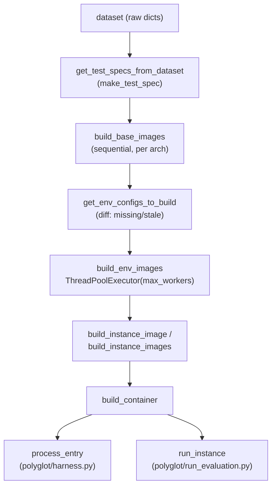

# The Polyglot Docker image-build pipeline — base → environment → instance layering

## Overview
`polyglot/docker_build.py` (explicitly adapted from SWE-bench's own `docker_build.py`, per the file's opening
comment) builds the three layers of Docker image every Polyglot-benchmark evaluation runs inside: one shared
**base** image per CPU architecture carrying every language toolchain the benchmark needs, one **environment**
image per unique dependency set layered on top of it, and one **instance** image per concrete task instance
(a specific repo checked out at a specific commit) layered on top of that. The layering exists purely to
amortize cost: DGM re-evaluates every generation of self-modified coding agent against the same Polyglot task
set, so if each of the hundreds of task instances rebuilt its multi-gigabyte toolchain from scratch, evaluation
would dominate wall-clock time. Instead, [`build_env_images`](../catalog/polyglot/docker_build.md#build_env_images)
and [`build_instance_images`](../catalog/polyglot/docker_build.md#build_instance_images) diff what's already
built against what's needed and only construct the missing (or stale) layers, in parallel.

## Diagram

## Design rationale (why it's built this way)
The three-tier split maps directly onto three different rates of change. The base image — built by
[`build_base_images`](../catalog/polyglot/docker_build.md#build_base_images) from
[`base_dockerfile`](../catalog/polyglot/test_spec.md#TestSpec.base_dockerfile) — installs every language
runtime (Python 3.11, Go, Rust, Node, conda, the JDK) that *any* Polyglot task might need, regardless of which
language that particular instance actually is, because it is keyed only by
[`base_image_key`](../catalog/polyglot/test_spec.md#TestSpec.base_image_key), which is nothing but
`pb.base.<arch>` — one image, ever, per architecture. That coarse key is deliberate: the toolchain install is
the slowest, least-instance-specific part of the pipeline, so it is built once and never varies with the
dataset. The environment image sits one level down: its key,
[`env_image_key`](../catalog/polyglot/test_spec.md#TestSpec.env_image_key), is a SHA-256 hash of the instance's
`env_script_list` (the conda-environment setup commands), so instances that need the identical set of
dependencies automatically share one image, and the hash changes automatically — no manual version bump — the
moment the setup script changes; the property's own docstring is explicit that "if the environment script list
changes, the image will be rebuilt automatically." The instance image is the narrowest layer: it is keyed by
[`instance_image_key`](../catalog/polyglot/test_spec.md#TestSpec.instance_image_key), which embeds the actual
`instance_id`, because this layer's only job is cloning that instance's exact repo at its exact `base_commit`
via [`install_repo_script`](../catalog/polyglot/test_spec.md#TestSpec.install_repo_script) — everything
instance-specific, and nothing else.

Because the key hierarchy alone can't detect "the base image was rebuilt with a fix but the env image's hash
didn't change," both [`get_env_configs_to_build`](../catalog/polyglot/docker_build.md#get_env_configs_to_build)
and [`build_instance_image`](../catalog/polyglot/docker_build.md#build_instance_image) additionally compare
Docker's own `Created` timestamps between an image and the layer it depends on, removing the stale downstream
image so it will be rebuilt. Only the environment-level check
([`get_env_configs_to_build`](../catalog/polyglot/docker_build.md#get_env_configs_to_build)) cascades further:
when a base image is newer than its env image, it first removes every instance image that depends on that env
image via [`find_dependent_images`](../catalog/polyglot/docker_utils.md#find_dependent_images) before removing
the env image itself; [`build_instance_image`](../catalog/polyglot/docker_build.md#build_instance_image), being
the leaf layer, simply removes its own image when its env image is newer and rebuilds — no dependent lookup.
This is a second, orthogonal staleness check layered on top of the content-hash keys, needed precisely because
the keys are static once assigned.

> [!inferred] `env_image_key`'s own docstring also warns that "old images are not automatically deleted, so
> consider cleaning up old images periodically" — the content-hash scheme is purely additive (a changed setup
> script produces a *new* tag) rather than replacing the old tag in place, so disk usage from superseded
> environment/instance images is left to whatever external cleanup process exists outside this file.

## Entry points
- [`build_base_images`](../catalog/polyglot/docker_build.md#build_base_images) — the first thing any caller
  must run against a fresh dataset; it builds (or, absent `force_rebuild`, skips) the one base image per
  architecture that every downstream environment image depends on.
- [`build_env_images`](../catalog/polyglot/docker_build.md#build_env_images) — the pipeline's main
  orchestration entry, invoked both by [`harness`](../catalog/polyglot/harness.md#harness) (DGM's own
  coding-agent-evaluation loop) and by [`main`](../catalog/polyglot/run_evaluation.md#main) (the
  SWE-bench-style standalone evaluation CLI) before either does any per-instance work.
- [`build_instance_images`](../catalog/polyglot/docker_build.md#build_instance_images) — the batch entry for
  building every instance image a whole dataset needs (chaining `build_env_images` first internally); used
  when instance images are wanted ahead of time rather than lazily per container.
- [`build_container`](../catalog/polyglot/docker_build.md#build_container) — the per-instance entry actually
  reached while evaluating one coding-agent variant: called by
  [`process_entry`](../catalog/polyglot/harness.md#process_entry) in DGM's own harness and by
  [`run_instance`](../catalog/polyglot/run_evaluation.md#run_instance) in the standalone evaluation path, both
  of which need a live, running container (not just a built image) to execute a candidate patch inside.

## Mechanism (step-by-step)
1. Any raw dataset (a list of instance dicts) is normalized once via
   [`get_test_specs_from_dataset`](../catalog/polyglot/test_spec.md#get_test_specs_from_dataset), which maps
   each dict through [`make_test_spec`](../catalog/polyglot/test_spec.md#make_test_spec) into a
   [`TestSpec`](../catalog/polyglot/test_spec.md#TestSpec) — the dataclass that derives every image key,
   Dockerfile, and platform string used from here on. The conversion is a no-op for entries that are already
   `TestSpec` instances, which is what lets every downstream function accept either raw dicts or
   already-converted specs interchangeably.
2. [`build_base_images`](../catalog/polyglot/docker_build.md#build_base_images) groups the dataset's specs by
   [`base_image_key`](../catalog/polyglot/test_spec.md#TestSpec.base_image_key) (effectively: by architecture),
   and for each missing (or, under `force_rebuild`, existing-but-forced) key calls
   [`build_image`](../catalog/polyglot/docker_build.md#build_image) with that spec's
   [`base_dockerfile`](../catalog/polyglot/test_spec.md#TestSpec.base_dockerfile) and no setup scripts at all —
   the base layer needs nothing instance-specific, only the toolchain baked into the Dockerfile text itself.
   This step runs as a plain sequential loop, not a thread pool.
3. [`get_env_configs_to_build`](../catalog/polyglot/docker_build.md#get_env_configs_to_build) walks every spec
   and, per unique [`env_image_key`](../catalog/polyglot/test_spec.md#TestSpec.env_image_key), first asserts
   the corresponding base image exists (raising a plain `Exception` — not
   [`BuildImageError`](../catalog/polyglot/docker_build.md#BuildImageError) — if a caller skipped step 2), then checks whether an environment image with that key already exists *and* is not older
   than its base image; only env images that are missing or stale make it into the returned
   `image_name -> {setup_script, dockerfile, platform}` map, keyed by
   [`setup_env_script`](../catalog/polyglot/test_spec.md#TestSpec.setup_env_script) and
   [`env_dockerfile`](../catalog/polyglot/test_spec.md#TestSpec.env_dockerfile).
4. [`build_env_images`](../catalog/polyglot/docker_build.md#build_env_images) chains steps 2–3 and then, for
   whatever remains in that to-build map, submits one
   [`build_image`](../catalog/polyglot/docker_build.md#build_image) call per image to a
   `ThreadPoolExecutor(max_workers=max_workers)`, tracking completion with a `tqdm` bar and partitioning
   results into `successful`/`failed` lists by catching
   [`BuildImageError`](../catalog/polyglot/docker_build.md#BuildImageError) (an expected, per-image build
   failure) separately from any other exception, so one bad build never stops the rest of the batch from
   finishing.
5. [`build_instance_image`](../catalog/polyglot/docker_build.md#build_instance_image) performs the same
   exists-and-fresh check one layer down: it requires the instance's
   [`env_image_key`](../catalog/polyglot/test_spec.md#TestSpec.env_image_key) image to already exist (raising
   [`BuildImageError`](../catalog/polyglot/docker_build.md#BuildImageError) if not — this *is* the expected
   per-image failure mode, unlike step 3's environment-level check), removes and rebuilds the instance image
   if it predates its environment image, and otherwise builds it fresh via
   [`build_image`](../catalog/polyglot/docker_build.md#build_image) using
   [`install_repo_script`](../catalog/polyglot/test_spec.md#TestSpec.install_repo_script) as its one setup
   script and the instance's [`repo`](../catalog/polyglot/test_spec.md#TestSpec.repo) folder copied into the
   build context.
6. [`build_instance_images`](../catalog/polyglot/docker_build.md#build_instance_images) is the batch analog of
   step 5: it first calls [`build_env_images`](../catalog/polyglot/docker_build.md#build_env_images) for the
   whole dataset, drops any instance whose environment image failed to build, then fans the remaining
   [`build_instance_image`](../catalog/polyglot/docker_build.md#build_instance_image) calls out across another
   `ThreadPoolExecutor`, mirroring step 4's success/failure bookkeeping.
7. [`build_container`](../catalog/polyglot/docker_build.md#build_container) is what a caller reaches to
   actually *run* something: it calls
   [`build_instance_image`](../catalog/polyglot/docker_build.md#build_instance_image) synchronously (building
   the image on demand if it isn't already there), looks up the per-language execution config from
   [`MAP_REPO_VERSION_TO_SPECS`](../catalog/polyglot/constants.md#MAP_REPO_VERSION_TO_SPECS) (root vs.
   non-root user, CPU quota), and creates a detached, `tail -f /dev/null`-sleeping container named via
   [`get_instance_container_name`](../catalog/polyglot/test_spec.md#TestSpec.get_instance_container_name) so
   that callers like [`process_entry`](../catalog/polyglot/harness.md#process_entry) and
   [`run_instance`](../catalog/polyglot/run_evaluation.md#run_instance) can subsequently `exec_run` commands
   inside it; any failure here is cleaned up via
   [`cleanup_container`](../catalog/polyglot/docker_utils.md#cleanup_container) before re-raising as a
   [`BuildImageError`](../catalog/polyglot/docker_build.md#BuildImageError).

## Key data structures
- [`TestSpec`](../catalog/polyglot/test_spec.md#TestSpec) — the dataclass every other function in this pipeline
  is built around (`instance_id`, `repo`, `repo_script_list`, `eval_script_list`, `env_script_list`, `arch`).
  Its properties derive all three image keys and Dockerfiles from those six fields, so the whole cache
  hierarchy is a pure function of a `TestSpec`'s contents — two instances with the same `env_script_list` will
  always compute the same [`env_image_key`](../catalog/polyglot/test_spec.md#TestSpec.env_image_key) and
  therefore share an environment image, without any explicit "which instances share an env" bookkeeping
  anywhere else.
- [`BuildImageError`](../catalog/polyglot/docker_build.md#BuildImageError) — the one exception type this
  pipeline raises for expected build/lookup failures; it carries the failing
  [`image_name`](../catalog/polyglot/docker_build.md#BuildImageError.image_name) and the build's own logger, so
  a `ThreadPoolExecutor` worker's exception can be attributed back to a specific image without extra
  bookkeeping in the caller.
- The `image_name -> {setup_script, dockerfile, platform}` mapping returned by
  [`get_env_configs_to_build`](../catalog/polyglot/docker_build.md#get_env_configs_to_build) — the concrete
  "diff" between what environment images exist and what the dataset needs; it is exactly the work list
  [`build_env_images`](../catalog/polyglot/docker_build.md#build_env_images)'s thread pool consumes.
- Per-build log/artifact directories under
  [`BASE_IMAGE_BUILD_DIR`](../catalog/polyglot/constants.md#BASE_IMAGE_BUILD_DIR),
  [`ENV_IMAGE_BUILD_DIR`](../catalog/polyglot/constants.md#ENV_IMAGE_BUILD_DIR), and
  [`INSTANCE_IMAGE_BUILD_DIR`](../catalog/polyglot/constants.md#INSTANCE_IMAGE_BUILD_DIR), one subdirectory per
  image (named from its key with `:` replaced by `__` so it's filesystem-safe) — each holds the Dockerfile,
  setup scripts, and `setup_logger`/`close_logger`-managed build log actually written to disk for that image.

## Dynamics (design intent)
Base images are built by a plain sequential `for` loop inside
[`build_base_images`](../catalog/polyglot/docker_build.md#build_base_images) — there are at most as many base
images as architectures in play (in practice one, occasionally two), so a thread pool would add complexity for
no benefit. Environment and instance images, by contrast, can number in the hundreds across a full Polyglot
dataset, and both [`build_env_images`](../catalog/polyglot/docker_build.md#build_env_images) and
[`build_instance_images`](../catalog/polyglot/docker_build.md#build_instance_images) parallelize them with a
`ThreadPoolExecutor(max_workers=max_workers)` (default 4), submitting one
[`build_image`](../catalog/polyglot/docker_build.md#build_image) /
[`build_instance_image`](../catalog/polyglot/docker_build.md#build_instance_image) call per image and
harvesting results via `as_completed` against a `futures` dict that maps each future back to the image name or
`TestSpec` it was building — so results can be attributed to the right image even though `as_completed` yields
them in completion order, not submission order. Each future's exception is caught individually (distinguishing
[`BuildImageError`](../catalog/polyglot/docker_build.md#BuildImageError) from any other exception) so that one
failing build is recorded in a `failed` list and the rest of the pool keeps running rather than the whole batch
aborting. Every [`build_image`](../catalog/polyglot/docker_build.md#build_image) call creates its own
[`setup_logger`](../catalog/polyglot/docker_build.md#setup_logger)-issued logger and explicitly
[`close_logger`](../catalog/polyglot/docker_build.md#close_logger)s it in a `finally` block, "to avoid too many
open files" per that function's own comment — a real concern once dozens of worker threads are each opening a
log file concurrently.

## Edge cases
- [`get_env_configs_to_build`](../catalog/polyglot/docker_build.md#get_env_configs_to_build) raises a bare
  `Exception` (not [`BuildImageError`](../catalog/polyglot/docker_build.md#BuildImageError)) if a spec's base
  image is missing entirely — a different, non-recoverable failure mode from the per-image
  `BuildImageError` handling used everywhere else, and it aborts immediately rather than being collected into
  a `failed` list.
- Staleness is detected purely by comparing Docker's `Created` timestamps between adjacent layers (inside
  [`get_env_configs_to_build`](../catalog/polyglot/docker_build.md#get_env_configs_to_build) and
  [`build_instance_image`](../catalog/polyglot/docker_build.md#build_instance_image)); this check only runs
  when one of these functions is actually invoked, so a base image rebuilt outside this pipeline's own call
  sequence won't retroactively invalidate anything until the next time these functions run.
- [`build_image`](../catalog/polyglot/docker_build.md#build_image)'s sanity check that each setup script name
  appears in the Dockerfile text (`if setup_script_name not in dockerfile: logger.warning(...)`) is a plain
  substring test, not a Dockerfile parse — it can miss a script referenced under a different path or name and
  can't distinguish a real omission from a script that's unused on purpose.
- [`build_container`](../catalog/polyglot/docker_build.md#build_container)'s `force_rebuild` only removes the
  *instance* image before rebuilding; it does not itself remove any previously created container of the same
  name — [`process_entry`](../catalog/polyglot/harness.md#process_entry) and
  [`run_instance`](../catalog/polyglot/run_evaluation.md#run_instance) are responsible for clearing out a
  stale container (e.g. via [`cleanup_container`](../catalog/polyglot/docker_utils.md#cleanup_container)) on
  their own side before calling in.

## Open questions
- `env_image_key`'s docstring documents that superseded environment/instance images are never automatically
  deleted, but nothing in this packet's subgraph shows a garbage-collection pass that prunes them.
  > [!inferred] `polyglot/docker_utils.py` (read directly, outside this packet's subgraph) does define
  > cache-level cleanup helpers, but they appear to gate on `sweb.base`/`sweb.env`/`sweb.eval` name prefixes —
  > the original SWE-bench naming this module was forked from — while every image key this pipeline actually
  > produces uses a `pb.*` prefix instead. If that reading is right, that cleanup path may never match any
  > image this file builds; this can't be confirmed from the in-subgraph symbols alone, so it's flagged here
  > rather than stated as fact.
- [`get_test_specs_from_dataset`](../catalog/polyglot/test_spec.md#get_test_specs_from_dataset) is called
  independently inside [`build_base_images`](../catalog/polyglot/docker_build.md#build_base_images),
  [`get_env_configs_to_build`](../catalog/polyglot/docker_build.md#get_env_configs_to_build), and (via a
  separate `map(make_test_spec, ...)`) [`build_instance_images`](../catalog/polyglot/docker_build.md#build_instance_images)
  — each re-derives `TestSpec`s from the same raw dataset rather than one call's result being threaded through
  to the next. The function's own "idempotent" framing suggests this repetition is considered cheap by design,
  but the subgraph doesn't show whether that holds at the dataset sizes a full DGM evaluation run actually
  uses.
- The subgraph gives no visibility into typical Polyglot dataset sizes or language mix, so how much wall-clock
  benefit a given `max_workers` setting realistically provides isn't something this code alone can answer.

## See also
- [`coding_agent`](coding_agent.md) — the agent variant whose code actually runs inside the instance container
  this pipeline builds; this module is the evaluation infrastructure underneath it, not part of the agent
  itself.
- [`self_improve_step`](self_improve_step.md) — the self-improvement attempt that ultimately triggers a
  harness run (and thus this image-build pipeline) to score a candidate agent.
- [`../../../sources/darwin-godel-machine.md`](../../../sources/darwin-godel-machine.md) — the paper whose
  Polyglot-benchmark evaluation this pipeline implements the Docker infrastructure for.
