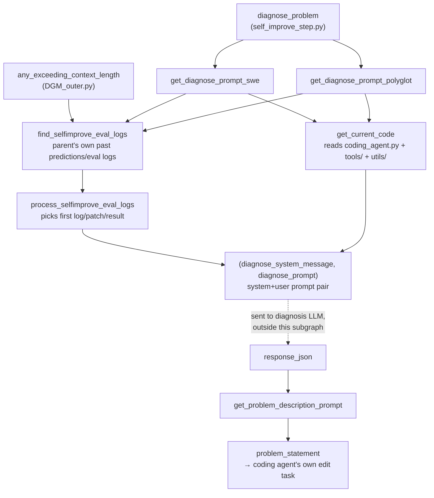

# self_improvement_prompt — diagnosing the agent from its own failures and its own code

## Overview
`prompts/self_improvement_prompt.py` builds the prompt pair the diagnosis model sees *before* any
self-edit happens: not just "here is what the coding agent got wrong," but "here is what the coding agent
got wrong **and here is the coding agent's own current implementation**." It is the plumbing that turns a
failed SWE-bench/Polyglot attempt plus the agent's own source code into a single diagnosis request, and
turns that request's JSON reply into the concrete "problem statement" the coding agent is later told to go
implement (as its own edit task) inside `self_improve_step.py`. Nothing here runs the coding agent or
touches a container — this module only decides *what the diagnosis model gets to see* and *what comes out
the other end*.

## Diagram

## Design rationale (why it's built this way)
The clearest signal of what this module considers "self" versus "harness" is the `exclude_files` list
[`get_diagnose_prompt_swe`](../catalog/prompts/self_improvement_prompt.md#get_diagnose_prompt_swe) and
[`get_diagnose_prompt_polyglot`](../catalog/prompts/self_improvement_prompt.md#get_diagnose_prompt_polyglot)
pass into [`get_current_code`](../catalog/prompts/self_improvement_prompt.md#get_current_code):
`coding_agent.py`, `tools/`, and `utils/` are bundled wholesale, but `utils/evo_utils.py`,
`utils/docker_utils.py`, `utils/swe_log_parsers.py`, and — tellingly — `prompts/self_improvement_prompt.py`
**itself** are excluded. The diagnosis model is shown exactly the code the coding agent is allowed to edit
(its tools, its prompts, its orchestration) and nothing of the harness that dispatches, containerizes, or
diagnoses it — including this very file. That is the same edit-scope boundary the
`self-referential-code-rewriting` concept describes: the thing being changed is the thing doing the
changing, and this module's own `exclude_files` lists are where that boundary is drawn in code, not just in
prose. That is why this page carries the `self-referential-code-rewriting` tag: it is not merely adjacent to
the self-referential loop, it is the concrete mechanism that decides what "self" means for one diagnosis
call.

Pairing the agent's own source with its own failure logs is deliberate, not incidental. If the diagnosis
model only saw a failure log, it could describe a problem in the abstract but couldn't propose a concrete
`implementation_suggestion` grounded in real tool interfaces; if it only saw the source, it would have
nothing to diagnose. [`diagnose_system_message`](../catalog/prompts/self_improvement_prompt.md#diagnose_system_message)'s
own text makes the intent explicit: *"Your task is to identify ONE detailed plan that would improve the
agent's coding ability. The improvement should not be specific to any particular GitHub issue or
repository."* — the failure log is the evidence, the source is what makes the fix implementable, and the
instruction explicitly steers away from issue-specific patches toward general capability improvements.

The SWE and Polyglot variants diverge in how they pick between "diagnose this one failed task" and three
maintenance modes (empty patches, stochasticity, context length). `get_diagnose_prompt_swe` dispatches on
`entry_id` sentinels (`'solve_empty_patches'`, `'solve_stochasticity'`, `'solve_contextlength'`) decided
upstream by `DGM_outer.choose_selfimproves` — a caller-controlled branch. `get_diagnose_prompt_polyglot` has
no such sentinel check at all: it always fetches a real entry's logs first, then rolls `random.random() <
0.25` to trigger the stochasticity prompt, or inspects the fetched `eval_result` for `'empty_patch'` to
trigger the empty-patches prompt. The same three maintenance concerns exist in both paths, but one is driven
by an explicit upstream decision and the other by an inline probabilistic/data-driven check inside this
module — a real asymmetry between the two benchmarks' handling, not just a naming difference.

## Entry points
- [`get_diagnose_prompt_swe`](../catalog/prompts/self_improvement_prompt.md#get_diagnose_prompt_swe) —
  called from `self_improve_step.diagnose_problem` when `polyglot=False`; builds the SWE-bench diagnosis
  system+user prompt pair for one `entry_id`.
- [`get_diagnose_prompt_polyglot`](../catalog/prompts/self_improvement_prompt.md#get_diagnose_prompt_polyglot) —
  the Polyglot counterpart, called from the same `diagnose_problem` call site when `polyglot=True`.
- [`find_selfimprove_eval_logs`](../catalog/prompts/self_improvement_prompt.md#find_selfimprove_eval_logs) —
  reached from both prompt builders above *and* independently from
  [`any_exceeding_context_length`](../catalog/DGM_outer.md#any_exceeding_context_length) in `DGM_outer.py`,
  which calls it with `filter=False` to inspect a parent's raw, unfiltered logs for repeated context-length
  errors before deciding whether to dispatch the `solve_contextlength` maintenance task.
- [`get_problem_description_prompt`](../catalog/prompts/self_improvement_prompt.md#get_problem_description_prompt) —
  the last step; turns the diagnosis model's parsed JSON reply into the actual text handed to the coding
  agent as its self-edit task.

## Mechanism (step-by-step)
1. **Locate the parent's own past attempt at this task.**
   [`find_selfimprove_eval_logs`](../catalog/prompts/self_improvement_prompt.md#find_selfimprove_eval_logs)
   scans `out_dir/commit_id/predictions/*/` for this entry's `.md` transcript and `.json` prediction files
   across every prediction folder found there, reading each transcript through
   [`read_mdlog_file`](../catalog/prompts/self_improvement_prompt.md#read_mdlog_file) (which by default
   strips lines starting with `'Error in get_response_withtools'`) and each prediction JSON through
   [`load_json_file`](../catalog/utils/common_utils.md#load_json_file) to pull out `model_patch` and
   `eval_result`. If no `*_eval.md` shortcut logs exist, it falls back to reading
   `out_dir/commit_id/logs/run_evaluation/{f}/{f}/{entry}/report.json` — the doubled `{f}/{f}/` path is a
   direct consequence of, per the source comment, "how `swe_bench/report.py` is reusing code from
   SWE-bench" — and renders it to text via
   [`get_eval_log_text`](../catalog/prompts/self_improvement_prompt.md#get_eval_log_text).
2. **Collapse to a single representative attempt.**
   [`process_selfimprove_eval_logs`](../catalog/prompts/self_improvement_prompt.md#process_selfimprove_eval_logs)
   takes only the *first* entry from each of the lists returned above ("using only the first logs", per its
   own comment), substituting fixed "no logs/patch/result available, assume the agent failed" strings when a
   list is empty, and truncates the log text at 250,000 characters with a `"<log clipped>"` marker so one
   oversized transcript cannot blow out the diagnosis prompt.
3. **Bundle the coding agent's own current implementation.**
   [`get_current_code`](../catalog/prompts/self_improvement_prompt.md#get_current_code) walks the file/
   directory list (`coding_agent.py`, `tools/`, `utils/`), reading every non-excluded `.py` file plus any
   supplied `patch_files` and concatenating them behind `# <relative path>` headers — this is the "here is
   what you're diagnosing" half described in Design rationale above.
4. **Assemble the system+user prompt pair.** Both
   [`get_diagnose_prompt_swe`](../catalog/prompts/self_improvement_prompt.md#get_diagnose_prompt_swe) and
   [`get_diagnose_prompt_polyglot`](../catalog/prompts/self_improvement_prompt.md#get_diagnose_prompt_polyglot)
   format [`diagnose_system_message`](../catalog/prompts/self_improvement_prompt.md#diagnose_system_message)
   with the bundled code (prefixed by a fixed
   [`coding_agent_summary`](../catalog/prompts/self_improvement_prompt.md#coding_agent_summary) blurb
   describing `coding_agent.py`'s `forward()` entry point and the tool-authoring conventions) as the system
   message, and [`diagnose_prompt`](../catalog/prompts/self_improvement_prompt.md#diagnose_prompt) (or one of
   the three maintenance-mode templates) filled with the processed log/patch/issue text as the user message
   — asking for a strict JSON reply with `log_summarization`, `potential_improvements`,
   `improvement_proposal`, `implementation_suggestion`, and `problem_description` fields.
   > [!inferred] The diagnosis model call itself is out of this subgraph — it happens in
   > `self_improve_step.diagnose_problem`, which passes these two strings to an LLM client and parses the
   > JSON reply.
5. **Turn the diagnosis into the coding agent's actual task.**
   [`get_problem_description_prompt`](../catalog/prompts/self_improvement_prompt.md#get_problem_description_prompt)
   takes that parsed `response_json` and formats only its `implementation_suggestion` and
   `problem_description` fields into a final GitHub-issue-shaped `problem_statement` string (prefixed again
   by the coding-agent summary) — this is what `diagnose_problem` returns, and what `self_improve_step.py`
   then hands to the coding agent as `--problem_statement` for the actual self-edit.

## Key data structures
- **`(md_logs, eval_logs, predicted_patches, eval_results)`** — the four parallel lists
  [`find_selfimprove_eval_logs`](../catalog/prompts/self_improvement_prompt.md#find_selfimprove_eval_logs)
  returns, one entry per prediction folder found for a `(entry, commit_id)` pair; almost always collapsed to
  just their first element by
  [`process_selfimprove_eval_logs`](../catalog/prompts/self_improvement_prompt.md#process_selfimprove_eval_logs)
  before use.
- **`response_json`** — the diagnosis model's parsed reply, a dict of five fields
  (`log_summarization`, `potential_improvements`, `improvement_proposal`, `implementation_suggestion`,
  `problem_description`); only the last two ever leave this module, via
  [`get_problem_description_prompt`](../catalog/prompts/self_improvement_prompt.md#get_problem_description_prompt).
- **`code_text`** — the flat, newline-joined string
  [`get_current_code`](../catalog/prompts/self_improvement_prompt.md#get_current_code) builds by
  concatenating `# <relative path>` header lines with file contents (via
  [`read_file`](../catalog/utils/common_utils.md#read_file)); it is the entire visible "self" the diagnosis
  model reasons about.
- **`get_diagnose_improvement_prompt`** (`prompts/diagnose_improvement_prompt.py`, a sibling module) is this
  module's post-edit counterpart: where `get_diagnose_prompt_swe`/`get_diagnose_prompt_polyglot` diagnose
  a problem *before* any edit exists,
  [`get_diagnose_improvement_prompt`](../catalog/prompts/diagnose_improvement_prompt.md#get_diagnose_improvement_prompt)
  reuses the same
  [`find_selfimprove_eval_logs`](../catalog/prompts/self_improvement_prompt.md#find_selfimprove_eval_logs) /
  [`get_current_code`](../catalog/prompts/self_improvement_prompt.md#get_current_code) /
  [`read_file`](../catalog/utils/common_utils.md#read_file) building blocks to compare a parent's and a
  child's eval logs *after* the edit, for `self_improve_step.py`'s separate `diagnose_improvement` step.

## Dynamics (design intent)
> [!inferred] Nothing in this module is concurrent or scheduled on its own — it is called synchronously,
> once per diagnosis, from inside `self_improve_step.diagnose_problem`. Any concurrency (multiple
> self-improvement attempts diagnosing in parallel) is a property of the caller's `ThreadPoolExecutor`, not
> of this module, and isn't visible in this subgraph.

## Edge cases
- `get_current_code`'s directory-file swap only relabels the *content* it reads for polyglot runs, not the
  header it prints: `if is_polyglot and 'coding_agent.py' in file_path: full_path =
  full_path.replace('coding_agent.py', 'coding_agent_polyglot.py')` happens *after* `rel_path` is already
  computed from the original path, so the bundled code section is still headed `# coding_agent.py` even
  though its contents come from `coding_agent_polyglot.py`.
- `get_diagnose_prompt_polyglot` asserts `entry is not None` (`assert entry, f"Could not find entry with id
  {entry_id}..."`) and will raise if the dataset lookup fails; `get_diagnose_prompt_swe` has no equivalent
  guard on its own `entry` lookup in the non-maintenance branch.
- Because `get_diagnose_prompt_polyglot` always calls
  [`find_selfimprove_eval_logs`](../catalog/prompts/self_improvement_prompt.md#find_selfimprove_eval_logs)
  and looks up the dataset entry *before* deciding which of the three prompt variants to use, the
  stochasticity/empty-patch branches still pay for a full log fetch and dataset scan even though they only
  end up using `md_log` from that work.
- [`read_mdlog_file`](../catalog/prompts/self_improvement_prompt.md#read_mdlog_file)'s default `filter=True`
  strips the exact `'Error in get_response_withtools'` lines that
  [`any_exceeding_context_length`](../catalog/DGM_outer.md#any_exceeding_context_length) depends on finding
  (it calls `find_selfimprove_eval_logs` with `filter=False` specifically to see them) — the normal
  diagnosis path and the context-length maintenance check read the same underlying log file through two
  different filtering settings for different purposes.

## Open questions
- Which archive members get routed to the three maintenance `entry_id` sentinels
  (`solve_empty_patches`/`solve_stochasticity`/`solve_contextlength`) is decided in
  `DGM_outer.choose_selfimproves`, outside this packet's subgraph; this page only shows how
  `get_diagnose_prompt_swe` consumes those sentinels once chosen.
- `get_diagnose_prompt_polyglot`'s `random.random() < 0.25` stochasticity trigger constant isn't explained
  in source or docstring — why 25%, or why polyglot uses a random trigger where SWE uses an explicit
  upstream decision, isn't settled by this subgraph.
- [`get_diagnose_improvement_prompt`](../catalog/prompts/diagnose_improvement_prompt.md#get_diagnose_improvement_prompt)
  shows "called by: (none in subgraph)" — its caller (`self_improve_step.diagnose_improvement`) is outside
  this packet, so only its shared building blocks with this module are visible here.
- Whether `os.listdir`'s folder order (which determines which prediction folder's logs "the first" in
  `process_selfimprove_eval_logs` actually refers to) is meaningfully ordered (e.g. by timestamp) isn't
  shown by this subgraph.

## See also
- [`self_improve_step`](../self_improve_step.md) — the caller: diagnoses via this module, then runs the
  coding agent inside a container to act on the resulting `problem_statement`.
- [`DGM_outer`](../DGM_outer.md) — decides which `(parent_commit, entry_id)` pairs (including the three
  maintenance sentinels) get diagnosed via this module's functions.
- [`../../../concepts/self-referential-code-rewriting.md`](../../../concepts/self-referential-code-rewriting.md) —
  the cross-repo concept whose edit-scope boundary this module's `exclude_files` lists concretely implement.
