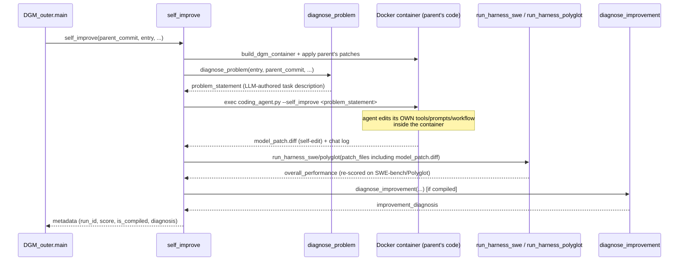

# self_improve — one self-referential edit-and-validate attempt

<!-- connect:up:begin -->
> **Cross-repo concept:** part of [self-referential-code-rewriting](../../../concepts/self-referential-code-rewriting.md) across this wiki's repos.
<!-- connect:up:end -->
## Overview
`self_improve_step.py` implements the unit of work `DGM_outer.py`'s generation loop dispatches once per
selected `(parent_commit, entry)` pair: given one archive parent, diagnose a concrete problem for the coding
agent to work on, **run that same coding agent — inside a container built from the parent's own
codebase — to edit its own source** (tools, prompts, or orchestration), and then re-evaluate the resulting
agent variant on SWE-bench or Polyglot before handing a verdict back to the outer archive. This is where
"self-referential" stops being a slogan and becomes literal: the agent that edits code and the code being
edited are the same repository, and the only thing standing between a bad edit and the archive is whether the
edited agent still runs and how well it scores.

## Diagram

## Design rationale (why it's built this way)
The self-edit happens **inside a disposable container built from the parent's own code**, not the DGM
process's own working directory. [`self_improve`](../catalog/self_improve_step.md#self_improve) calls
[`build_dgm_container`](../catalog/utils/docker_utils.md#build_dgm_container) to construct that container,
applies every patch in the parent's lineage (`get_model_patch_paths` chases `parent_commit` back through
prior patches, so a child agent starts from the *cumulative* code of its whole ancestor chain, not just a
diff against the frozen original), and takes a throwaway git commit inside the container purely so a later
`git diff` isolates *this attempt's* edit from everything inherited. This means each self-improvement attempt
is evaluated against a clean, reproducible snapshot of exactly the agent it is meant to improve — and a
failed or destructive edit inside the container can never corrupt the host DGM process or any other
concurrently running attempt (recall from `DGM_outer` that several of these run in threads at once).

The problem the agent is asked to work on is itself LLM-authored, not hand-written: `diagnose_problem` calls
a separate diagnosis model (`o1-2024-12-17`, distinct from the coding agent's own model) against the
*parent's* prior evaluation logs and current code to produce a `problem_statement` — effectively "look at
what this agent got wrong last time and describe a concrete fix a coding agent could implement." Only after
that succeeds does `self_improve` actually invoke the coding agent (`coding_agent.py` inside the container,
launched with `--self_improve` so it knows its edit target is itself rather than an external repository) and
capture the resulting diff as `model_patch.diff`. This two-model structure (diagnosis model proposes *what*
to fix; coding-agent model executes the edit) means the self-referential loop is not a single model
free-associating changes to itself — the target is always grounded in a specific, previously-observed
failure mode.

An edit is only re-evaluated at all if the container actually produced a non-empty patch file — an edit
that crashes the agent before it emits a diff is caught immediately by `self_improve`'s existence/non-empty
checks on `model_patch_file`, short-circuiting straight to `save_metadata` with no harness run. This is the
cheapest possible viability gate, applied before any expensive SWE-bench/Polyglot evaluation is spent on an
attempt that clearly didn't produce a working self-edit.

> [!inferred] The additional-evaluation escalation inside
> [`run_harness_swe`](../catalog/self_improve_step.md#run_harness_swe) /
> [`run_harness_polyglot`](../catalog/self_improve_step.md#run_harness_polyglot) — running a second, larger
> task list only if the first cheap pass already resolved at least `test_more_threshold` fraction of tasks —
> mirrors the same "don't spend the expensive full evaluation on unpromising candidates" economy that
> `DGM_outer`'s `get_full_eval_threshold` applies at the archive level; here it's applied within one attempt.

## Entry points
- [`self_improve`](../catalog/self_improve_step.md#self_improve) — the function `DGM_outer.main` submits
  to its `ThreadPoolExecutor` once per chosen `(parent_commit, entry)` pair; everything below happens inside
  one call.
- [`main`](../catalog/self_improve_step.md#main) (in this module) — a standalone CLI entry point for running
  a single self-improvement attempt outside the full DGM generation loop, useful for debugging one attempt
  in isolation; it just parses args and calls `self_improve` once.

## Mechanism (step-by-step)
1. **Load the benchmark dataset and set up a fresh working directory.**
   [`self_improve`](../catalog/self_improve_step.md#self_improve) loads either the SWE-bench-Verified or
   Polyglot metadata into a module-level [`dataset`](../catalog/self_improve_step.md#dataset) global, mints
   a timestamped `run_id`, and creates `output_dir` for this attempt's artifacts.
2. **Build a container from the parent's code and apply its lineage of patches.**
   [`build_dgm_container`](../catalog/utils/docker_utils.md#build_dgm_container) constructs the image/
   container after [`remove_existing_container`](../catalog/utils/docker_utils.md#remove_existing_container)
   clears any stale one with the same name; every patch file returned by
   [`get_model_patch_paths`](../catalog/utils/evo_utils.md#get_model_patch_paths) for `parent_commit` is
   copied in via [`copy_to_container`](../catalog/utils/docker_utils.md#copy_to_container) and applied with
   `patch -p1`, so the container's `/dgm/` starts as *exactly* the parent agent's accumulated code, not the
   original.
3. **Diagnose a concrete problem statement.**
   [`diagnose_problem`](../catalog/self_improve_step.md#diagnose_problem) builds a diagnosis prompt via
   [`get_diagnose_prompt_swe`](../catalog/prompts/self_improvement_prompt.md#get_diagnose_prompt_swe) or
   [`get_diagnose_prompt_polyglot`](../catalog/prompts/self_improvement_prompt.md#get_diagnose_prompt_polyglot)
   (which read the parent's prior eval logs), sends it through
   [`get_response_from_llm`](../catalog/llm.md#get_response_from_llm) using a client from
   [`create_client`](../catalog/llm.md#create_client), and retries up to `max_attempts` times if the model's
   reply doesn't parse as JSON — the loop bails out (returns `None`, aborting the whole attempt) rather than
   proceeding with a garbage problem statement.
4. **Run the coding agent inside the container to edit its own code.** `self_improve` execs
   `python /dgm/coding_agent.py --problem_statement <diagnosis> --self_improve` inside the container (a
   30-minute `timeout`-wrapped command), then copies `model_patch.diff` and the chat transcript back out via
   [`copy_from_container`](../catalog/utils/docker_utils.md#copy_from_container) — this is the literal
   self-edit: `coding_agent.py`'s own tools/prompts/workflow are the edit target, executed by that very
   program.
5. **Reject attempts that produced no usable edit.** If `model_patch.diff` is missing or empty,
   [`self_improve`](../catalog/self_improve_step.md#self_improve) calls
   [`save_metadata`](../catalog/self_improve_step.md#save_metadata) and returns immediately — the harness
   below never runs, so a non-productive self-edit costs one container build, not a full evaluation.
6. **Re-evaluate the self-edited agent on the real benchmark.**
   [`run_harness_swe`](../catalog/self_improve_step.md#run_harness_swe) or
   [`run_harness_polyglot`](../catalog/self_improve_step.md#run_harness_polyglot) appends `model_patch.diff`
   to the parent's patch list and runs the SWE-bench/Polyglot harness with it applied, then
   [`get_all_performance`](../catalog/utils/evo_utils.md#get_all_performance) aggregates per-instance results
   into `overall_performance` — this is the empirical validation that stands in for the theoretical Gödel
   machine's formal proof: the edit is judged purely by whether the resulting agent still solves benchmark
   tasks, not by any correctness argument about the edit itself.
7. **Optionally diagnose the improvement (or lack of it).** If `post_improve_diagnose` is set and
   [`is_compiled_self_improve`](../catalog/utils/evo_utils.md#is_compiled_self_improve) confirms the run
   produced a valid, non-empty, compiling result,
   [`diagnose_improvement`](../catalog/self_improve_step.md#diagnose_improvement) asks the diagnosis model
   to compare the parent's and child's eval logs/patches and produce a natural-language
   `improvement_diagnosis` — a human/agent-readable note on what changed and whether it helped, stored
   alongside the score.
8. **Persist metadata and return to the outer loop.**
   [`save_metadata`](../catalog/self_improve_step.md#save_metadata) writes `metadata.json` (score,
   `run_id`, `parent_commit`, `is_compiled`, diagnosis) to disk; `DGM_outer.main`'s
   `ThreadPoolExecutor` future resolves with this dict, which becomes one candidate `update_archive` may
   admit and a future `choose_selfimproves` call may treat as a parent in its own right.

## Key data structures
- **`metadata`** — the per-attempt result dict threaded through every step (`run_id`, `parent_commit`,
  `entry`, `problem_statement`, `model_patch_exists`/`model_patch_notempty`, `overall_performance`,
  `is_compiled`, `improvement_diagnosis`) and written verbatim by
  [`save_metadata`](../catalog/self_improve_step.md#save_metadata) — this is the exact structure
  `DGM_outer.choose_selfimproves`/`update_archive` read back when this run later becomes an archive member.
- **`patch_files`** — the ordered list of every ancestor patch plus this attempt's own
  `model_patch.diff`; because the coding agent is invoked against a parent whose own code is already the
  product of prior self-edits, later generations are self-referential over an accumulating stack of
  self-edits, not just over the single original agent.

## Dynamics (design intent)
Each `self_improve` call is fully self-contained around one Docker container it creates, uses, and (via
[`cleanup_container`](../catalog/utils/docker_utils.md#cleanup_container)) tears down — this is what lets
`DGM_outer.main` run several of these concurrently in a `ThreadPoolExecutor` without attempts stepping on
each other's filesystem state. The 30-minute in-container `timeout` on the coding-agent invocation and the
outer 1.5-hour future timeout in `DGM_outer.main` are two independent backstops against the same failure
mode: a single self-edit attempt that hangs (e.g. the agent gets stuck in a tool-call loop) must not stall an
entire generation.

## Edge cases
- If `entry` is falsy, `self_improve` logs and returns immediately after cleanup — no diagnosis, no agent
  run, no evaluation; this is the same-shape early return as the empty-patch case, just earlier in the
  pipeline.
- [`diagnose_problem`](../catalog/self_improve_step.md#diagnose_problem) and
  [`diagnose_improvement`](../catalog/self_improve_step.md#diagnose_improvement) both recurse on their own
  `max_attempts` countdown when the diagnosis model's output doesn't parse as JSON, returning `None`
  (`diagnose_problem`) or a "failed to comply" placeholder diagnosis rather than raising.
- `run_baseline='no_selfimprove'` skips applying parent patches to the container before running the coding
  agent — an ablation that isolates the effect of the self-edit step itself from everything else in the
  pipeline.

## Open questions
- Whether the accumulating chain of patches (`patch_files` growing by one per generation along a lineage)
  is ever compacted/rebased is not shown in this subgraph — deep lineages could in principle carry a long
  patch stack forward indefinitely.
- The exact criteria [`is_compiled_self_improve`](../catalog/utils/evo_utils.md#is_compiled_self_improve)
  checks are defined in `utils/evo_utils.py`, outside this packet's subgraph; this page only shows that its
  boolean result gates whether `diagnose_improvement` runs at all.

## See also
- [`DGM_outer`](DGM_outer.md) — the archive/parent-selection loop that dispatches `self_improve` and
  consumes its `metadata` result.
- [`coding_agent`](coding_agent.md) — the agent invoked inside the container; its own tools/prompts/
  orchestration are the concrete self-edit target described here.
- [`../../../concepts/self-referential-code-rewriting.md`](../../../concepts/self-referential-code-rewriting.md) —
  the cross-repo concept this module is the clearest in-wiki instance of.
- [`../../../sources/darwin-godel-machine.md`](../../../sources/darwin-godel-machine.md) — the paper this
  code implements.
