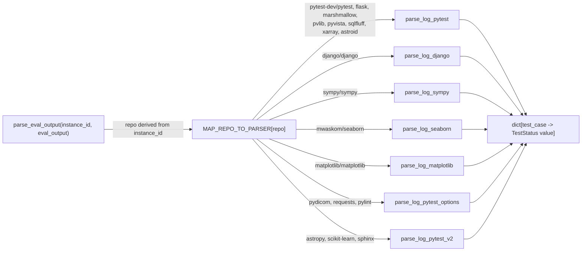

# swe_log_parsers — one status-normalizing parser per test-runner format

## Overview
`utils/swe_log_parsers.py` is evaluation/scoring infrastructure, not one of DGM's headline research
mechanisms: it turns the raw stdout/stderr a target repo's test suite produced after a patch was applied into
one uniform `dict[str, str]` mapping test-case name → status. The catch is that DGM evaluates agents against
roughly eighteen different SWE-bench target repos (Django, Sympy, scikit-learn, matplotlib, seaborn, and
more), and each one's test runner prints pass/fail/error lines in a genuinely different textual shape. Rather
than one generic log grammar, this module is a dispatch table —
[`MAP_REPO_TO_PARSER`](../catalog/utils/swe_log_parsers.md#MAP_REPO_TO_PARSER) — of small,
repo-format-specific parsing functions that all converge on the same
[`TestStatus`](../catalog/utils/swe_log_parsers.md#TestStatus) vocabulary, so everything downstream can treat
"did this test pass" identically regardless of which upstream project produced the log.

## Diagram

## Design rationale (why per-framework parsers instead of one generic one)
The module's shape is a direct consequence of the fact that "PASSED"/"FAILED" is not printed the same way
twice across these projects. [`parse_log_pytest`](../catalog/utils/swe_log_parsers.md#parse_log_pytest)
("Parser for test logs generated with PyTest framework") assumes a line *starts* with a
[`TestStatus`](../catalog/utils/swe_log_parsers.md#TestStatus) value followed by the test id as the second
whitespace token. [`parse_log_django`](../catalog/utils/swe_log_parsers.md#parse_log_django) ("Parser for
test logs generated with Django tester framework") instead handles Django's unittest-style
`test_name (module.Class) ... ok/FAIL/ERROR/skipped` line — and, per its own comment, has to work around test
output that "isn't ideal" because it "spans multiple lines," including a comment-labeled "Temporary,
exclusive fix" for one specific instance (`django__django-7188`) and three separate regexes for known Django
logger quirks where a long print statement splits a test's `... ok` marker across lines.
[`parse_log_sympy`](../catalog/utils/swe_log_parsers.md#parse_log_sympy) ("Parser for test logs generated
with Sympy framework") has to handle a *third*, unrelated shape: sympy's runner reports failures as
underscore-bracketed traceback banners (`____ file.py:N ____`) matched with a whole-log regex, separately
from terse per-line `test_... ok`/` F`/` E` suffix markers matched line-by-line. None of these three formats
is a variant of the others — a single generic parser would have to encode all three grammars (and their
edge-case workarounds) simultaneously, so the module instead keeps one parser body per genuinely distinct
format and lets the dispatch table pick the right one per repo.

Where repos *do* share a format, the module reuses the same function rather than duplicating logic:
[`parse_log_astroid`](../catalog/utils/swe_log_parsers.md#parse_log_astroid),
[`parse_log_flask`](../catalog/utils/swe_log_parsers.md#parse_log_flask),
[`parse_log_marshmallow`](../catalog/utils/swe_log_parsers.md#parse_log_marshmallow),
[`parse_log_pvlib`](../catalog/utils/swe_log_parsers.md#parse_log_pvlib),
[`parse_log_pyvista`](../catalog/utils/swe_log_parsers.md#parse_log_pyvista),
[`parse_log_sqlfluff`](../catalog/utils/swe_log_parsers.md#parse_log_sqlfluff), and
[`parse_log_xarray`](../catalog/utils/swe_log_parsers.md#parse_log_xarray) are all plain aliases to
[`parse_log_pytest`](../catalog/utils/swe_log_parsers.md#parse_log_pytest) — adding a new vanilla-pytest repo
to the map costs one dictionary entry, not a new function. Two more variant families exist for two more
distinct wrinkles:
[`parse_log_pytest_options`](../catalog/utils/swe_log_parsers.md#parse_log_pytest_options) (used by
[`parse_log_pydicom`](../catalog/utils/swe_log_parsers.md#parse_log_pydicom),
[`parse_log_requests`](../catalog/utils/swe_log_parsers.md#parse_log_requests), and
[`parse_log_pylint`](../catalog/utils/swe_log_parsers.md#parse_log_pylint)) additionally parses bracketed
parametrize options like `test_foo[param]` out of the test id, and
[`parse_log_pytest_v2`](../catalog/utils/swe_log_parsers.md#parse_log_pytest_v2) (used by
[`parse_log_astropy`](../catalog/utils/swe_log_parsers.md#parse_log_astropy),
[`parse_log_scikit`](../catalog/utils/swe_log_parsers.md#parse_log_scikit), and
[`parse_log_sphinx`](../catalog/utils/swe_log_parsers.md#parse_log_sphinx)) strips ANSI color codes and
control characters and additionally supports an older pytest ordering where the status token trails the test
name instead of leading it.
[`parse_log_matplotlib`](../catalog/utils/swe_log_parsers.md#parse_log_matplotlib) ("Parser for test logs
generated with PyTest framework") is nearly identical to plain pytest parsing but first rewrites
matplotlib-specific `MouseButton.LEFT`/`MouseButton.RIGHT` enum reprs to plain `1`/`3`, because matplotlib's
own parametrized test ids embed that enum's repr and would otherwise not match the expected test-id strings.
[`parse_log_seaborn`](../catalog/utils/swe_log_parsers.md#parse_log_seaborn) ("Parser for test logs generated
with seaborn testing framework") checks three different textual positions for the status token (line-initial
FAILED, line-initial PASSED, and PASSED embedded mid-line), reflecting that seaborn's runner output ordering
is less consistent than vanilla pytest's.

## Entry points
- [`parse_eval_output`](../catalog/utils/eval_utils.md#parse_eval_output) — the sole call site into this
  module: given a SWE-bench `instance_id` and the raw `eval_output` log text, it derives the target repo,
  looks it up in [`MAP_REPO_TO_PARSER`](../catalog/utils/swe_log_parsers.md#MAP_REPO_TO_PARSER), and invokes
  the resulting parser — this is the boundary where a raw benchmark test log becomes a scoreable result.

## Mechanism (step-by-step)
1. **Derive the repo id and look up its parser.**
   [`parse_eval_output`](../catalog/utils/eval_utils.md#parse_eval_output) special-cases the literal
   `instance_id == 'dgm'` (DGM's own self-tests), and otherwise converts a SWE-bench-style id such as
   `"scikit-learn__scikit-learn-12421"` into `"scikit-learn/scikit-learn"` by replacing `__` with `/` and
   dropping the trailing issue-number segment, then indexes
   [`MAP_REPO_TO_PARSER`](../catalog/utils/swe_log_parsers.md#MAP_REPO_TO_PARSER) with that string; the whole
   function body is wrapped in a `try`/`except Exception: return {}`, so an unrecognized id or a parser that
   raises both fail silently into an empty result.
2. **Vanilla pytest logs.** [`parse_log_pytest`](../catalog/utils/swe_log_parsers.md#parse_log_pytest) scans
   line by line for one starting with a [`TestStatus`](../catalog/utils/swe_log_parsers.md#TestStatus) value
   — normalizing away the `" - "` separator pytest sometimes inserts after a
   [`FAILED`](../catalog/utils/swe_log_parsers.md#TestStatus.FAILED) marker — then takes the second
   whitespace-split token as the test id keyed to the first token as its status; a line that doesn't split
   into at least two tokens is silently skipped.
3. **Django's multi-line unittest-style logs.**
   [`parse_log_django`](../catalog/utils/swe_log_parsers.md#parse_log_django) matches `... ok`/`OK` suffixes
   for [`PASSED`](../catalog/utils/swe_log_parsers.md#TestStatus.PASSED), `... skipped` for
   [`SKIPPED`](../catalog/utils/swe_log_parsers.md#TestStatus.SKIPPED), and both a trailing `... FAIL`/
   `... ERROR` suffix and a leading `FAIL:`/`ERROR:` prefix for
   [`FAILED`](../catalog/utils/swe_log_parsers.md#TestStatus.FAILED)/[`ERROR`](../catalog/utils/swe_log_parsers.md#TestStatus.ERROR),
   plus three additional whole-log regexes for known cases where a long print statement pushes a test's `ok`
   marker onto a following line.
4. **Sympy's traceback-banner-plus-suffix logs.**
   [`parse_log_sympy`](../catalog/utils/swe_log_parsers.md#parse_log_sympy) first regex-matches sympy's
   underscore-bracketed traceback headers across the whole log to mark those tests
   [`FAILED`](../catalog/utils/swe_log_parsers.md#TestStatus.FAILED), then makes a second, line-by-line pass
   over lines starting with `test_`, mapping a trailing `" E"` to
   [`ERROR`](../catalog/utils/swe_log_parsers.md#TestStatus.ERROR), `" F"` to
   [`FAILED`](../catalog/utils/swe_log_parsers.md#TestStatus.FAILED), and `" ok"` to
   [`PASSED`](../catalog/utils/swe_log_parsers.md#TestStatus.PASSED), first stripping a trailing
   `[FAIL]`/`[OK]` tag if present.
5. **Framework-specific pytest variants.**
   [`parse_log_seaborn`](../catalog/utils/swe_log_parsers.md#parse_log_seaborn) and
   [`parse_log_matplotlib`](../catalog/utils/swe_log_parsers.md#parse_log_matplotlib) each pre-process a line
   (checking three token positions for seaborn; substituting `MouseButton` enum reprs for matplotlib) before
   falling back to the same status/test-id split as plain pytest parsing.
6. **Parametrized-option and later-pytest-version variants.**
   [`parse_log_pytest_options`](../catalog/utils/swe_log_parsers.md#parse_log_pytest_options) additionally
   extracts a bracketed `[option]` suffix from the test id (normalizing filesystem-path-shaped options to
   just their basename), while
   [`parse_log_pytest_v2`](../catalog/utils/swe_log_parsers.md#parse_log_pytest_v2) strips ANSI color escapes
   and control characters first and accepts the status token on either side of the test id, to cover an older
   pytest output ordering.
7. **Cheap aliasing for shared formats.** Seven of the eighteen map entries —
   [`parse_log_astroid`](../catalog/utils/swe_log_parsers.md#parse_log_astroid),
   [`parse_log_flask`](../catalog/utils/swe_log_parsers.md#parse_log_flask),
   [`parse_log_marshmallow`](../catalog/utils/swe_log_parsers.md#parse_log_marshmallow),
   [`parse_log_pvlib`](../catalog/utils/swe_log_parsers.md#parse_log_pvlib),
   [`parse_log_pyvista`](../catalog/utils/swe_log_parsers.md#parse_log_pyvista),
   [`parse_log_sqlfluff`](../catalog/utils/swe_log_parsers.md#parse_log_sqlfluff), and
   [`parse_log_xarray`](../catalog/utils/swe_log_parsers.md#parse_log_xarray) — are bound directly to
   [`parse_log_pytest`](../catalog/utils/swe_log_parsers.md#parse_log_pytest) rather than given their own
   body, since those repos' test output needs no special-casing beyond plain pytest parsing.

## Key data structures
- [`TestStatus`](../catalog/utils/swe_log_parsers.md#TestStatus) — the `Enum` every parser converges on:
  [`FAILED`](../catalog/utils/swe_log_parsers.md#TestStatus.FAILED),
  [`PASSED`](../catalog/utils/swe_log_parsers.md#TestStatus.PASSED),
  [`SKIPPED`](../catalog/utils/swe_log_parsers.md#TestStatus.SKIPPED), and
  [`ERROR`](../catalog/utils/swe_log_parsers.md#TestStatus.ERROR) are each cited as produced by at least one
  parser in this subgraph; the enum also defines `XFAIL`, which no cited parser is shown assigning.
- [`MAP_REPO_TO_PARSER`](../catalog/utils/swe_log_parsers.md#MAP_REPO_TO_PARSER) — the `dict[str,
  Callable[[str], dict[str, str]]]` keyed by `"org/repo"` strings (plus a literal `"dgm"` entry reusing
  [`parse_log_pytest`](../catalog/utils/swe_log_parsers.md#parse_log_pytest) for DGM's own tests) that is
  what makes [`parse_eval_output`](../catalog/utils/eval_utils.md#parse_eval_output) generic over every
  target repo without itself knowing any log format.
- The `test_status_map` local `dict[str, str]` built inside every `parse_log_*` function — the one shape
  every wildly different parsing strategy above is required to converge on before returning.

## Dynamics (design intent)
This module is pure, synchronous string processing with no concurrency of its own — a sharp contrast with
the threaded/containerized machinery in the sibling `self_improve_step` concept that eventually calls into
it. What varies between parsers is processing *order*, not concurrency:
[`parse_log_sympy`](../catalog/utils/swe_log_parsers.md#parse_log_sympy) deliberately makes a first whole-log
regex pass (for traceback-banner failures) before a second, independent line-by-line pass (for terse ok/F/E
suffixes), while every other cited parser makes a single line-by-line pass. No test in the repo's configured
test paths references this subgraph's symbols, so — unlike `tools/bash.py`'s test-backed claims — every
behavioral claim above rests on reading the parser bodies directly, not on an automated check.

## Edge cases
- [`parse_eval_output`](../catalog/utils/eval_utils.md#parse_eval_output)'s blanket
  `except Exception: return {}` means a parser crashing on an unexpected log shape (e.g. a pytest version
  whose output escapes [`parse_log_pytest_v2`](../catalog/utils/swe_log_parsers.md#parse_log_pytest_v2)'s
  ANSI-stripping regex) is indistinguishable downstream from "this repo simply produced zero test results" —
  both collapse to the same empty dict.
- The repo-id derivation in
  [`parse_eval_output`](../catalog/utils/eval_utils.md#parse_eval_output) assumes the exact SWE-bench
  `org__repo-NNN` id convention; an id shaped differently silently produces a key absent from
  [`MAP_REPO_TO_PARSER`](../catalog/utils/swe_log_parsers.md#MAP_REPO_TO_PARSER), again falling through to
  the same empty-dict result rather than an explicit "unknown repo" signal.
- [`parse_log_pytest`](../catalog/utils/swe_log_parsers.md#parse_log_pytest) and
  [`parse_log_matplotlib`](../catalog/utils/swe_log_parsers.md#parse_log_matplotlib) both silently drop any
  status-prefixed line that doesn't split into at least two whitespace tokens, rather than treating it as
  parse failure.
- [`parse_log_django`](../catalog/utils/swe_log_parsers.md#parse_log_django) hardcodes a string match for one
  specific instance (`django__django-7188`), explicitly commented as a "Temporary, exclusive fix" — a new
  Django log oddity in a different instance would need its own hand-added special case, not a generalization
  of the existing one.

## Open questions
- Nothing in this subgraph shows how the `TestStatus` strings this module produces are compared against
  SWE-bench's own gold pass/fail lists to produce a final resolved/unresolved verdict — that comparison
  likely happens in code such as `get_all_performance`/`is_compiled_self_improve` (referenced from the
  sibling `self_improve_step` concept, defined in `utils/evo_utils.py`), which is outside this packet's
  subgraph.
- [`TestStatus.XFAIL`](../catalog/utils/swe_log_parsers.md#TestStatus) is defined but no parser cited here is
  shown assigning it; whether any repo's log actually produces that status isn't settled by this subgraph.
- This page does not tag any of the shared self-improvement/discovery concepts: this module is parsing/
  scoring infrastructure with no visible tie, in its own symbols, to the archive, parent selection, or
  self-editing mechanisms those concepts describe.

## See also
- [`self_improve_step`](self_improve_step.md) — the self-improvement attempt whose SWE-bench/Polyglot
  re-evaluation ultimately depends on a parsed, uniform pass/fail verdict like the one this module produces.
- [`../../../sources/darwin-godel-machine.md`](../../../sources/darwin-godel-machine.md) — the paper this
  code implements.
