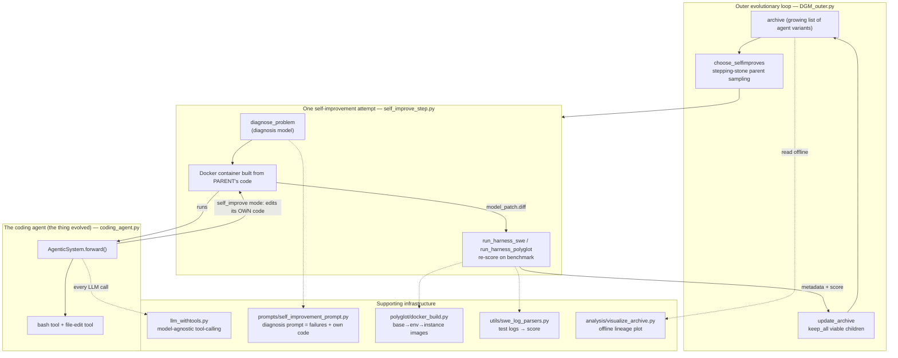

# dgm — what it is and how it fits together

> Grounded code wiki for [jennyzzt/dgm](https://github.com/jennyzzt/dgm) (the **Darwin Gödel Machine**),
> pinned @ `a565fd2d1d`. This is the *implementation* companion to the paper summary in
> [`../../sources/darwin-godel-machine.md`](../../sources/darwin-godel-machine.md) (arXiv:2505.22954) and the
> paper-side concept pages [`evolutionary-self-improvement`](../../concepts/evolutionary-self-improvement.md)
> and [`self-referential-code-rewriting`](../../concepts/self-referential-code-rewriting.md). Read those for
> *what the system claims and why it matters* (the growing archive, the relaxation of the Gödel machine's
> "provably beneficial" to "empirically validated"); read this for *how the code actually implements it*.

## In one paragraph
The Darwin Gödel Machine is a self-improving system: it iteratively edits its own coding-agent code and keeps
each edit only if the edited agent empirically scores better on a coding benchmark. Two design bets make it
distinct. First, **the search is a growing archive, not a single hill-climbing lineage** — every viable agent
variant is kept, and a new parent is sampled *stochastically*, biased toward high performers but never
exclusively the best, so a temporarily-worse "stepping-stone" variant can still seed a later breakthrough
(`DGM_outer.py`). Second, **the improvement is genuinely self-referential** — the thing being edited is the
coding agent's own tools, prompts, and orchestration code, edited by that very agent (`coding_agent.py`
pointed at DGM's own repo, driven per attempt by `self_improve_step.py`). The validation that stands in for
the theoretical Gödel machine's impossible correctness proof is simply re-running the edited agent on
SWE-bench (Python) or Polyglot (six languages) and reading its score. Everything else in the repo —
model-agnostic tool-calling, per-language Docker image builds, per-framework test-log parsing, prompt
construction, offline lineage plotting — is the supporting infrastructure that makes that loop runnable and
measurable.

## Core architecture

## Main concepts
- **The archive and stepping-stone parent selection.** `DGM_outer.py` owns the growing population of agent
  variants and the fixed, human-owned machinery that samples parents (default `score_child_prop`: a sigmoid
  of score times an inverse child-count novelty term, sampled categorically) and admits children (default
  `keep_all`, gated only by a minimal "still compiles" viability check). This is the archive-vs-hill-climb
  distinction made concrete. → [`DGM_outer`](concepts/DGM_outer.md)
- **One self-referential edit-and-validate attempt.** `self_improve_step.py` is the unit of work the outer
  loop dispatches: build a container from the parent's own accumulated code, diagnose a concrete problem,
  run the coding agent inside to edit *itself*, then re-evaluate on SWE-bench/Polyglot before returning a
  verdict. → [`self_improve_step`](concepts/self_improve_step.md)
- **The coding agent being evolved.** `coding_agent.py`'s `AgenticSystem` is the frozen foundation-model
  harness (one prompt + two tools) whose `forward()` solves a task — and whose source *is* the
  self-modification target. A subtle finding: the `self_improve` flag is nearly inert inside the class; the
  self-referential effect comes entirely from `self_improve_step.py` pointing the agent at DGM's own repo.
  → [`coding_agent`](concepts/coding_agent.md)
- **Model-agnostic tool-calling.** `llm_withtools.py` runs three structurally different tool-call loops
  (Claude native, OpenAI `o3-`, and a `<tool_use>`-tag manual fallback) behind one `chat_with_agent`
  dispatch, converting message history across formats only when a conversation must cross a model swap.
  → [`llm_withtools`](concepts/llm_withtools.md)
- **The diagnosis prompt.** `prompts/self_improvement_prompt.py` builds the prompt pair that decides *what
  to improve*: it bundles the agent's prior failure logs **and the agent's own current source code** (with a
  deliberate exclude-list that draws the "self" boundary — tools/prompts/orchestration in scope,
  harness/archive machinery out) into one request for the diagnosis model.
  → [`prompts-self_improvement_prompt`](concepts/prompts-self_improvement_prompt.md)
- **Evaluation infrastructure.** `polyglot/docker_build.py` builds the base→environment→instance Docker
  image layers each evaluation runs inside (amortizing toolchain cost across generations), and
  `utils/swe_log_parsers.py` normalizes each target repo's idiosyncratic test-runner output into a uniform
  pass/fail/error map so a raw log becomes a score.
  → [`polyglot-docker_build`](concepts/polyglot-docker_build.md), [`utils-swe_log_parsers`](concepts/utils-swe_log_parsers.md)
- **The agent's tools.** `tools/bash.py` is the shell-execution tool the agent uses to act — itself one of
  the files the self-referential loop is permitted to rewrite. → [`tools-bash`](concepts/tools-bash.md)
- **Offline analysis.** `analysis/visualize_archive.py` reconstructs and plots the archive's parent→child
  lineage tree from the metadata `DGM_outer.py` writes — a read-only view, never a participant in the loop.
  → [`analysis-visualize_archive`](concepts/analysis-visualize_archive.md)

## How a run flows
`python DGM_outer.py` seeds the archive with the frozen `'initial'` agent, then for each generation:
`choose_selfimproves` samples parents (stepping-stone weighting) → each `(parent, task)` pair is dispatched
concurrently to `self_improve.self_improve`, which builds a container from the parent's code, calls
`diagnose_problem` (diagnosis model, over the parent's own failures + code) to author a problem statement,
runs `coding_agent.py --self_improve` inside the container to produce a self-edit (`model_patch.diff`),
re-scores the edited agent via `run_harness_swe`/`run_harness_polyglot` (using `swe_log_parsers` to turn logs
into a score, inside images built by `docker_build`) → `filter_compiled` drops non-viable children →
`update_archive` appends the survivors → the new archive is written to `dgm_metadata.jsonl`, and the loop
repeats. `analysis/visualize_archive.py` reads that file offline to plot the resulting lineage.

## Map of the wiki
- *"How does the archive/stepping-stone search work?"* → [`DGM_outer`](concepts/DGM_outer.md).
- *"What happens in one self-improvement attempt / how is a self-edit validated?"* →
  [`self_improve_step`](concepts/self_improve_step.md).
- *"What is the agent, and where does 'self-referential' actually happen?"* →
  [`coding_agent`](concepts/coding_agent.md).
- *"How does tool-calling work across different LLMs?"* → [`llm_withtools`](concepts/llm_withtools.md).
- *"How is the improvement target chosen?"* → [`prompts-self_improvement_prompt`](concepts/prompts-self_improvement_prompt.md).
- *"How are agents evaluated (Docker / scoring)?"* → [`polyglot-docker_build`](concepts/polyglot-docker_build.md),
  [`utils-swe_log_parsers`](concepts/utils-swe_log_parsers.md).
- *Exhaustive per-module symbol index* → [`catalog/`](catalog/); *concept table + coverage* →
  [`index.md`](index.md).

## Cross-repo concepts
This silo is the wiki's clearest instance of two paper-side concepts, each linked from its down-block:
- [`evolutionary-self-improvement`](../../concepts/evolutionary-self-improvement.md) — the growing archive vs.
  single-branch hill-climb ([`DGM_outer`](concepts/DGM_outer.md)).
- [`self-referential-code-rewriting`](../../concepts/self-referential-code-rewriting.md) — the agent editing
  the code that constitutes itself ([`coding_agent`](concepts/coding_agent.md),
  [`self_improve_step`](concepts/self_improve_step.md),
  [`prompts-self_improvement_prompt`](concepts/prompts-self_improvement_prompt.md)).
