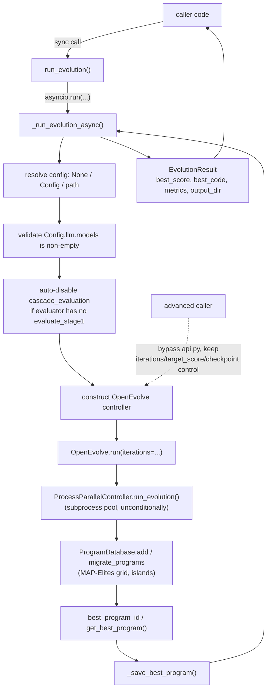

# openevolve.api — the library entry point

## Overview

`openevolve/api.py` is the "front door" for using OpenEvolve as a Python library instead of the
`openevolve-run.py` CLI. It is deliberately thin: it does not implement any part of the AlphaEvolve
recipe itself — no LLM prompting, no cascade evaluation, no MAP-Elites, no island migration. Its whole
job is impedance matching: accept loosely-typed inputs a library caller is likely to already have in
memory (a code string, a file path, a bare Python callable), coerce them into what the real machinery
— the [`OpenEvolve`](../catalog/openevolve/controller.md#OpenEvolve) controller — expects (files on
disk, a resolved [`Config`](../catalog/openevolve/config.md#Config)), run it, and hand back one flat,
easy-to-print result object.

The module's two load-bearing symbols are [`run_evolution`](../catalog/openevolve/api.md#run_evolution),
a synchronous function that is nearly the entire public contract, and
[`EvolutionResult`](../catalog/openevolve/api.md#EvolutionResult), the dataclass it returns. Everything
else in the module (config coercion, the LLM-models sanity check, the cascade-evaluator
auto-detection) exists only to make that one call forgiving of how a real caller is likely to invoke it.

## Diagram

## Design rationale (why it's built this way)

The module makes a few pointed trade-offs, all visible once you read past the signatures:

- **Sync facade over an async core.** [`run_evolution`](../catalog/openevolve/api.md#run_evolution) is
  a plain `def`, but its entire body is `asyncio.run(...)` around
  [`_run_evolution_async`](../catalog/openevolve/api.md#_run_evolution_async). Everything downstream —
  [`OpenEvolve.run`](../catalog/openevolve/controller.md#OpenEvolve.run) and the process-pool
  orchestration underneath it — is a coroutine. The split exists purely so a library caller in a plain
  script never has to know or care that evolution is asyncio-based; a caller already inside an event
  loop (a notebook, an async web handler) can await `_run_evolution_async` directly instead.
- **Config accepts three shapes on purpose.** `config` can be `None`, a `Config` instance, or a path —
  covering "give me sane defaults," "I built a `Config` in code," and "I have a YAML file," which are
  the three realistic ways a library caller arrives with configuration.
- **No silent LLM misconfiguration.** Before anything else runs, `_run_evolution_async` checks
  `config_obj.llm.models` and raises immediately with an example snippet in the message if it's empty,
  rather than letting the failure surface deep inside the LLM ensemble after a controller and database
  have already been constructed.
- **The API narrows, not widens, the controller's surface.** `run_evolution`'s parameters
  (`iterations`, `output_dir`, `cleanup`) are a strict subset of what
  [`OpenEvolve.run`](../catalog/openevolve/controller.md#OpenEvolve.run) actually accepts
  (`target_score`, `checkpoint_path` are controller-only). The trade api.py makes is: give up direct
  access to those two knobs in exchange for flexible input coercion and automatic temp-file lifecycle
  management. A caller who needs `target_score` or checkpoint resume has to construct
  [`OpenEvolve`](../catalog/openevolve/controller.md#OpenEvolve) directly and skip api.py entirely.
- **There is no single-process code path.** [`OpenEvolve.run`](../catalog/openevolve/controller.md#OpenEvolve.run)
  unconditionally builds a `ProcessParallelController` and drives it — there's no branch for "just run
  it in this process." Even a config with a single evaluation worker still pays the cost of a real OS
  subprocess pool, because that's the only execution path the controller has.

## Entry points

1. [`run_evolution`](../catalog/openevolve/api.md#run_evolution) — the synchronous function almost
   every library caller calls. Signature: `initial_program`, `evaluator`, `config=None`,
   `iterations=None`, `output_dir=None`, `cleanup=True`, returning an
   [`EvolutionResult`](../catalog/openevolve/api.md#EvolutionResult).
2. [`_run_evolution_async`](../catalog/openevolve/api.md#_run_evolution_async) — the coroutine
   `run_evolution` wraps. Callers already running inside an event loop can `await` this directly instead
   of going through `run_evolution`, since nesting `asyncio.run` inside a running loop raises.
3. Constructing [`OpenEvolve`](../catalog/openevolve/controller.md#OpenEvolve) and calling
   [`run`](../catalog/openevolve/controller.md#OpenEvolve.run) directly — bypasses api.py entirely. This
   is the only way to reach `target_score` early stopping or `checkpoint_path` resume, since
   `run_evolution` doesn't expose either.

## Mechanism (step-by-step)

1. **Resolve configuration.** [`_run_evolution_async`](../catalog/openevolve/api.md#_run_evolution_async)
   turns the `config` argument into a single [`Config`](../catalog/openevolve/config.md#Config)
   instance: `None` becomes `Config()` defaults, an existing `Config` is used as-is, anything else is
   treated as a YAML path and passed to [`load_config`](../catalog/openevolve/config.md#load_config).
2. **Validate LLM models are configured.** It checks
   [`llm`](../catalog/openevolve/config.md#Config.llm)`.`[`models`](../catalog/openevolve/config.md#LLMConfig.models)
   and raises a `ValueError` with a worked example if the list is empty — evolution cannot run without
   at least one model to propose mutations.
3. **Auto-correct cascade evaluation.** If
   [`cascade_evaluation`](../catalog/openevolve/config.md#EvaluatorConfig.cascade_evaluation) is
   requested in the config, `_run_evolution_async` reads the evaluator's own source and force-disables
   it when the evaluator has no `evaluate_stage1` function — cascade staging only makes sense if the
   evaluator actually defines stages.
4. **Construct the controller.** It builds an
   [`OpenEvolve`](../catalog/openevolve/controller.md#OpenEvolve) instance from the resolved program
   path, evaluator path, and [`Config`](../catalog/openevolve/config.md#Config), and awaits
   [`run`](../catalog/openevolve/controller.md#OpenEvolve.run).
5. **`OpenEvolve.run` drives the real machinery.** Internally it seeds the
   [`database`](../catalog/openevolve/controller.md#OpenEvolve.database) with the initial program via
   [`add`](../catalog/openevolve/database.md#ProgramDatabase.add), then delegates all iteration work to
   `ProcessParallelController.`[`run_evolution`](../catalog/openevolve/process_parallel.md#ProcessParallelController.run_evolution)
   through [`_run_evolution_with_checkpoints`](../catalog/openevolve/controller.md#OpenEvolve._run_evolution_with_checkpoints)
   — this is where LLM-proposed candidates get scored and folded into the MAP-Elites/island database
   (`add`, `migrate_programs`) that this packet's lens is centered on, but api.py itself never touches
   that logic directly.
6. **Resolve and persist the winner.** Once evolution stops, `OpenEvolve.run` resolves the best program
   — preferring the explicitly tracked
   [`best_program_id`](../catalog/openevolve/database.md#ProgramDatabase.best_program_id) and falling
   back to [`get_best_program`](../catalog/openevolve/database.md#ProgramDatabase.get_best_program) —
   and writes it out via
   [`_save_best_program`](../catalog/openevolve/controller.md#OpenEvolve._save_best_program) before
   returning the winning [`Program`](../catalog/openevolve/database.md#Program) (or `None`) to
   `_run_evolution_async`.
7. **Repackage into `EvolutionResult`.** `_run_evolution_async` reads
   [`code`](../catalog/openevolve/database.md#Program.code) and
   [`metrics`](../catalog/openevolve/database.md#Program.metrics) off the winning program, derives
   `best_score` (the `combined_score` metric if present, otherwise the mean of whatever numeric metrics
   exist, otherwise `0.0`), and constructs the final
   [`EvolutionResult`](../catalog/openevolve/api.md#EvolutionResult).

## Key data structures

- [`EvolutionResult`](../catalog/openevolve/api.md#EvolutionResult) — the one object callers see:
  `best_program` (the raw [`Program`](../catalog/openevolve/database.md#Program), or `None`),
  [`best_score`](../catalog/openevolve/api.md#EvolutionResult.best_score) (a single float, always
  present even when nothing evolved successfully), `best_code`, `metrics`, and `output_dir`. Its
  `__repr__` prints only `best_score`, so it reads well at a REPL prompt without dumping an entire
  program's source.
- [`Program`](../catalog/openevolve/database.md#Program) — the database's unit of storage; api.py only
  reads its [`code`](../catalog/openevolve/database.md#Program.code) and
  [`metrics`](../catalog/openevolve/database.md#Program.metrics) fields — it never constructs or
  mutates a `Program` itself.
- [`Config`](../catalog/openevolve/config.md#Config) — the nested configuration object api.py resolves
  from up to three input shapes before handing it to the controller; api.py touches only
  [`llm`](../catalog/openevolve/config.md#Config.llm) and
  [`evaluator`](../catalog/openevolve/config.md#Config.evaluator) directly.
- [`EvaluationResult`](../catalog/openevolve/evaluation_result.md#EvaluationResult) — the richer return
  shape an evaluator function may use instead of a bare `dict`, carrying
  [`metrics`](../catalog/openevolve/evaluation_result.md#EvaluationResult.metrics) plus an
  [`artifacts`](../catalog/openevolve/evaluation_result.md#EvaluationResult.artifacts) side-channel;
  api.py itself never constructs one, but it's what eventually lands in `Program.metrics` by the time
  api.py reads it back out.

## Dynamics (design intent)

api.py's guiding intent is *forgiveness at the boundary, strictness inside*. Every coercion in
`_run_evolution_async` (config shape, cascade-evaluation sanity check, the LLM-models guard) exists to
convert an under-specified library call into exactly the well-formed inputs
[`OpenEvolve`](../catalog/openevolve/controller.md#OpenEvolve) demands, so the controller and everything
under it (evaluator, database, LLM ensemble) can stay strict about its own inputs. The result type
mirrors that: `EvolutionResult` never raises just because evolution produced nothing usable — it
degrades to `best_score=0.0`, empty `metrics`, empty `best_code` — pushing the "did anything work"
judgment call to the caller rather than the library.

## Edge cases

- **No LLM models configured** — `_run_evolution_async` raises `ValueError` before touching the
  filesystem or constructing a controller, specifically so the failure happens before any temp
  directories or output directories are created.
- **Evolution produces no usable program** — `OpenEvolve.run` can return `None` (e.g. everything failed
  evaluation). `_run_evolution_async` handles this by falling back to a zeroed-out result rather than
  propagating an error: `best_score=0.0`, `metrics={}`, `best_code=""`.
- **`cascade_evaluation` silently overridden** — a config that explicitly sets
  [`cascade_evaluation`](../catalog/openevolve/config.md#EvaluatorConfig.cascade_evaluation)`= True`
  gets it force-flipped to `False` with only a config mutation (no exception, no return value signaling
  it happened) if the evaluator file doesn't define stage functions.
- **`output_dir` is `None` on the happy path with `cleanup=True`** — even though a real temporary
  directory was used for the whole run, `EvolutionResult.output_dir` comes back `None` once cleanup has
  removed it, so a caller who wants to inspect logs or checkpoints afterward must pass
  `output_dir=...` and `cleanup=False` up front.

## Open questions

- This packet's subgraph doesn't cover the module's three higher-level convenience wrappers
  (`evolve_function`, `evolve_algorithm`, `evolve_code`) or its private input-materialization helpers —
  they all sit in the same file but weren't pulled into this packet. They're worth a closer look on
  their own: they turn an arbitrary in-memory Python callable into evaluator source code that must
  survive being re-executed in a brand-new subprocess, using `inspect.getsource` for named
  functions/classes but a much more fragile module-global lookup for closures and lambdas — a
  distinction the test suite (`test_evolve_function_evaluator_works_in_subprocess`) suggests was the
  source of a real regression.
- It's not resolved from this packet alone how much of `OpenEvolve.run`'s parallel-controller setup
  (signal handlers, graceful shutdown) is reachable or relevant to a caller going through
  `run_evolution` versus one who constructs `OpenEvolve` directly.

## See also

- [openevolve-controller.md](openevolve-controller.md) — the `OpenEvolve` orchestrator this module
  constructs and calls `run` on.
- [openevolve-process_parallel.md](openevolve-process_parallel.md) — the subprocess-pool machinery
  `OpenEvolve.run` unconditionally delegates iteration work to.
- [../../../sources/alphaevolve.md](../../../sources/alphaevolve.md) — the DeepMind paper this whole
  repo reimplements; api.py is the layer that makes that recipe callable as a single library function.
