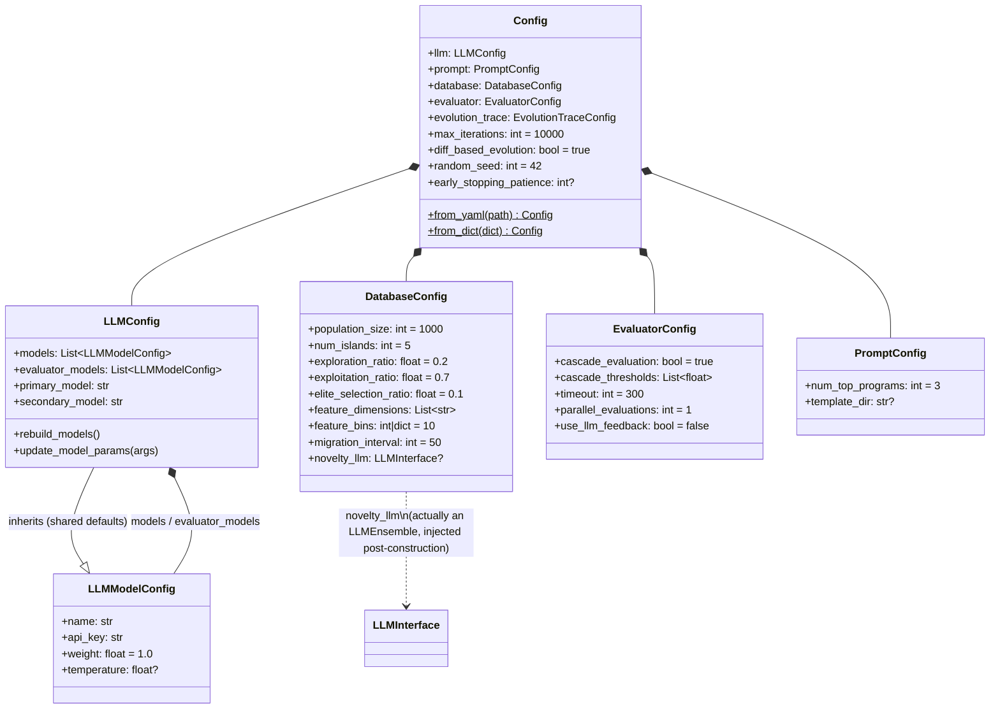
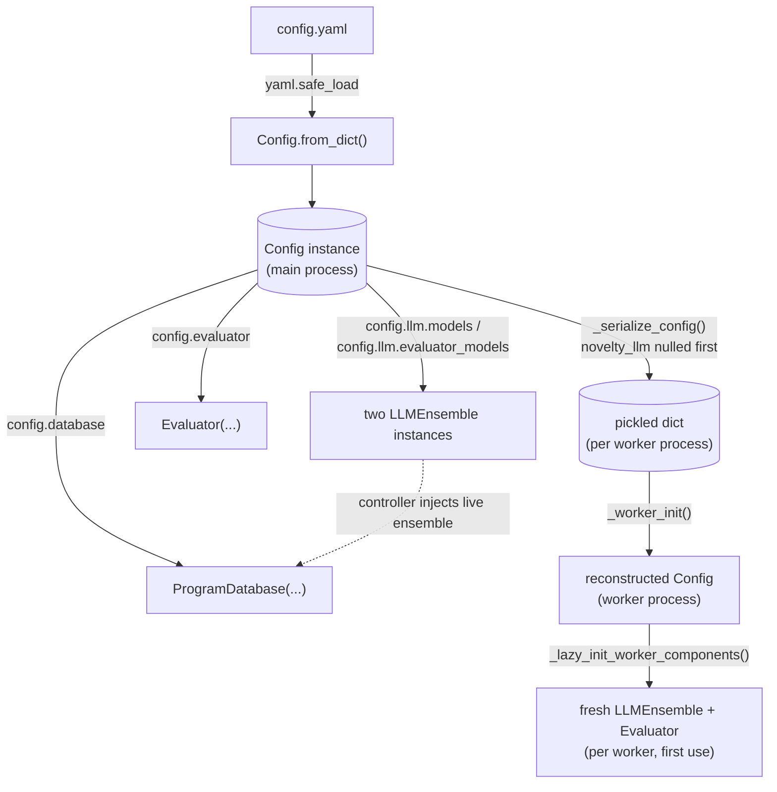

# Config — the knobs behind mutation, evaluation, and the population database

## Overview
[`Config`](../catalog/openevolve/config.md#Config) is a single `@dataclass` — the author's own docstring
calls it "Master configuration for OpenEvolve" — that exists almost entirely to *nest* three other
dataclasses, one per subsystem that makes up the AlphaEvolve recipe: [`llm`](../catalog/openevolve/config.md#Config.llm)
(the mutation operator — which model(s) propose diffs), [`database`](../catalog/openevolve/config.md#Config.database)
(the MAP-Elites/island population that decides which candidates seed the next generation), and
[`evaluator`](../catalog/openevolve/config.md#Config.evaluator) (the cascade scorer that decides whether a
candidate survives). A handful of top-level fields — `max_iterations`, `diff_based_evolution`,
`random_seed`, `checkpoint_interval`, the early-stopping trio — round it out as global evolution-loop
controls that don't belong to any one subsystem. There is no logic of consequence in `Config` itself: it is
a recipe file, not a mechanism. Its only real code is the YAML/dict ingestion path
([`from_dict`](../catalog/openevolve/config.md#Config.from_dict), `from_yaml`) and a couple of
cross-cutting defaults it back-fills between subsystems before handing them off.

## Diagram

## Design rationale (why it's built this way)
Splitting into `LLMConfig` / `DatabaseConfig` / `EvaluatorConfig` / `PromptConfig` sub-dataclasses is more
than cosmetic: it lets each subsystem be constructed and mutated in isolation (tests overwhelmingly do
`config = Config(); config.database.num_islands = 3` rather than passing a nested dict), and it means a
subsystem's own module only ever depends on its own slice of `Config`, never the whole tree. The
[`database`](../catalog/openevolve/config.md#Config.database) field is typed
[`DatabaseConfig`](../catalog/openevolve/config.md#DatabaseConfig) and the
[`llm`](../catalog/openevolve/config.md#Config.llm) field carries a list of
[`LLMModelConfig`](../catalog/openevolve/config.md#LLMModelConfig) — each nested config is independently
constructible with `field(default_factory=...)`, so a bare `Config()` is always immediately usable without
a YAML file at all (every integration test builds one this way).

`LLMConfig` inheriting from `LLMModelConfig` is the same pattern applied one level deeper: the top-level
`llm:` block in a YAML file *is itself* a model config (it has `api_base`, `temperature`, `timeout`, …), and
`update_model_params` broadcasts those fields down onto every entry in `models`/`evaluator_models` — but
only into fields still `None` on the individual model (`if overwrite or getattr(model, key, None) is None`).
This is the mechanism that lets a user set `temperature: 0.7` once at the `llm:` level and have it apply to
every model in an ensemble, while a model that explicitly sets its own `temperature` in the `models:` list
is left alone. It is a deliberate two-tier override: ensemble-wide defaults fill gaps, per-model settings win.

## Entry points
- [`Config`](../catalog/openevolve/config.md#Config) — the dataclass every run starts from; every
  integration test, the CLI, and the library API all construct or load one before touching any subsystem.
- [`load_config`](../catalog/openevolve/config.md#load_config) — "Load configuration from a YAML file or
  use defaults"; the shared function the CLI and the library API both call first.
- [`main_async`](../catalog/openevolve/cli.md#main_async) — the CLI entry point; loads a `Config` then
  layers `--api-base`/`--primary-model`/`--secondary-model` overrides on top before constructing
  `OpenEvolve`.
- [`_run_evolution_async`](../catalog/openevolve/api.md#_run_evolution_async) — the library API's entry
  point; accepts a `Config` object, a path to YAML, or `None` (defaults), and fails fast if no LLM models end
  up configured.
- [`_worker_init`](../catalog/openevolve/process_parallel.md#_worker_init) — the process-pool worker's entry
  point; every worker process rebuilds its own `Config` from a pickled dict rather than inheriting the
  parent's live object.

## Mechanism (step-by-step)
1. A bare [`Config`](../catalog/openevolve/config.md#Config) default-constructs its three subsystem configs
   via `field(default_factory=...)` — [`database`](../catalog/openevolve/config.md#Config.database) becomes
   a fresh [`DatabaseConfig`](../catalog/openevolve/config.md#DatabaseConfig), `llm` a fresh `LLMConfig`,
   `evaluator` a fresh `EvaluatorConfig` — so every field has a working default before any YAML is read.
2. If a YAML file is supplied, [`from_dict`](../catalog/openevolve/config.md#Config.from_dict) is the single
   choke point every dict-shaped config passes through: it eagerly compiles `diff_pattern` to fail fast on a
   bad regex, strips explicit `null` `temperature`/`top_p` entries so `dacite` doesn't choke on them, then
   runs `dacite.from_dict` with `cast=[List, Union]` to coerce the nested structure into typed dataclasses.
3. Still inside [`from_dict`](../catalog/openevolve/config.md#Config.from_dict), two cross-subsystem defaults
   get back-filled: the top-level `random_seed` is copied into `config.database.random_seed` if the database
   didn't set its own, and `prompt.programs_as_changes_description=true` is rejected outright unless
   `diff_based_evolution=true` — full-rewrite mode can't reliably track a running "what changed" description.
4. [`load_config`](../catalog/openevolve/config.md#load_config) wraps step 2: with no config file it falls
   back to a bare `Config()` and pulls `OPENAI_API_KEY`/`OPENAI_API_BASE` from the process environment into
   every model via `update_model_params` — a *second*, independent env-var path from the `${VAR}` resolution
   `LLMModelConfig.__post_init__` does per-field (see Edge cases). Either way it finishes by pushing
   `prompt.system_message` onto every model so a model that never saw the prompt sampler still has one.
5. [`main_async`](../catalog/openevolve/cli.md#main_async) layers CLI flags on top of the loaded `Config`
   and, if `--primary-model`/`--secondary-model` changed, calls `rebuild_models()` to regenerate
   `llm.models` from scratch — the config is designed to be mutated after loading, not just read.
6. In the controller, the three subsystem fields are handed to their owning classes verbatim:
   [`database`](../catalog/openevolve/controller.md#OpenEvolve.database) is built as
   `ProgramDatabase(self.config.database)`, two separate `LLMEnsemble`s are built from `config.llm.models`
   and `config.llm.evaluator_models` (evolution mutation vs. evaluator-side LLM feedback are different model
   pools), and [`evaluator_prompt_sampler`](../catalog/openevolve/controller.md#OpenEvolve.evaluator_prompt_sampler)
   is a `PromptSampler(self.config.prompt)` — every subsystem only ever sees its own slice of `Config`.
7. Once running, [`run_iteration_with_shared_db`](../catalog/openevolve/iteration.md#run_iteration_with_shared_db)
   reads back across subsystem boundaries every generation — `config.prompt.num_top_programs` to size the
   prompt, `config.language`/`config.diff_based_evolution` to pick the mutation format, and
   `database.config.feature_dimensions` (the *database's own copy* of the config, not the controller's) to
   compute the fitness score and feature coordinates shown *for the parent/top/previous programs quoted in
   the prompt* (via `PromptSampler.build_prompt`) — the *child* program's own MAP-Elites coordinates aren't
   labeled here at all; that happens later, when `ProcessParallelController.run_evolution` hands the
   finished child to `database.add()`, which calls the database's own `_calculate_feature_coords` using the
   same `feature_dimensions` field.
8. [`run_evolution`](../catalog/openevolve/process_parallel.md#ProcessParallelController.run_evolution)
   (the process-pool driver) reads the early-stopping trio (`early_stopping_patience`,
   `early_stopping_metric`, `convergence_threshold`) to decide when to stop the loop, and separately reads
   `checkpoint_interval` itself every completed iteration to fire the mid-run `checkpoint_callback`, plus
   `config.database.num_islands` (cached as `self.num_islands` at construction) to size the per-island batches
   throughout. [`_run_evolution_with_checkpoints`](../catalog/openevolve/controller.md#OpenEvolve._run_evolution_with_checkpoints)
   reads `checkpoint_interval` a second time, after `run_evolution` returns, to decide whether one more
   checkpoint is owed for the final iteration — these two functions are the only places top-level `Config`
   fields (as opposed to a subsystem's own nested config) directly gate control flow.
9. For process-based parallelism, [`_serialize_config`](../catalog/openevolve/process_parallel.md#ProcessParallelController._serialize_config)
   flattens `config.llm`/`config.prompt`/`config.database`/`config.evaluator` into plain dicts for pickling
   — but must first null out `config.database.novelty_llm`, because that field holds a live `LLMEnsemble`
   object the controller injected after construction, and `asdict()`'s implicit `deepcopy` cannot serialize
   a live client. [`_worker_init`](../catalog/openevolve/process_parallel.md#_worker_init) then reconstructs
   a fresh `Config` from that dict inside each worker process, and
   [`_lazy_init_worker_components`](../catalog/openevolve/process_parallel.md#_lazy_init_worker_components)
   builds that worker's own `LLMEnsemble`s and `Evaluator` from `_worker_config.llm`/`.evaluator` on first
   use — configuration crosses the process boundary as inert data and is turned back into live objects
   independently in every worker.

## Key data structures
- [`Config`](../catalog/openevolve/config.md#Config) — the root; five nested subsystem configs plus a
  dozen loop-level scalars.
- [`DatabaseConfig`](../catalog/openevolve/config.md#DatabaseConfig) — "Configuration for the program
  database"; the MAP-Elites/island knobs (`population_size`, `num_islands`, `feature_dimensions`,
  `feature_bins`, `elite_selection_ratio`, `exploration_ratio`, `exploitation_ratio`,
  `migration_interval`/`migration_rate`) plus the odd-one-out `novelty_llm` field, typed
  `Optional["LLMInterface"]` and resolved as `Any` for `dacite` — the one place a `Config` object is
  expected to eventually hold a live client rather than plain data.
- [`LLMModelConfig`](../catalog/openevolve/config.md#LLMModelConfig) — "Configuration for a single LLM
  model"; one entry per ensemble member (`name`, `api_key`, `weight`, generation/request parameters,
  `manual_mode`), with `__post_init__` resolving `${VAR}`-style `api_key` values against the environment.
- `LLMConfig` (subclasses `LLMModelConfig`) — the ensemble-wide defaults plus `models`/`evaluator_models`
  lists and the `primary_model`/`secondary_model` backward-compatible single-model shorthand.
- `EvaluatorConfig` / `PromptConfig` / `EvolutionTraceConfig` — the evaluator-cascade, prompt-construction,
  and trace-logging knobs; not directly cited here (see [`openevolve-evaluator`](openevolve-evaluator.md)
  and [`openevolve-llm-ensemble`](openevolve-llm-ensemble.md) for how those fields drive behavior) but they
  hang off `Config` the same way `database` and `llm` do.

## Dynamics (design intent)
The nested-dataclass shape is meant to keep each subsystem's config self-contained enough to construct and
override in isolation — the test suite's dominant pattern is `Config()` followed by targeted attribute
mutation (`config.database.num_islands = 3`, `config.evaluator.cascade_evaluation = False`), never
hand-built nested dicts. The two exceptions to "each subsystem only sees its own slice" are intentional
bridges: `database.novelty_llm` is deliberately given a live model-ensemble reference so the database can
ask an LLM to judge borderline cases (`_llm_judge_novelty`) without re-implementing model access — novelty
detection itself is embedding-based (a separate `EmbeddingClient` built from `config.embedding_model`
computes cosine similarity), and `novelty_llm` is only invoked as the tie-breaker once that embedding check
already flags a candidate as suspiciously close to an existing program — and the top-level
`language`/`diff_based_evolution` fields are read directly by the per-iteration mutation logic because they
describe the *program being evolved*, not any one subsystem.

## Edge cases
- Two independent env-var mechanisms coexist: `${VAR}` syntax in any `LLMModelConfig.api_key` is resolved
  eagerly in `__post_init__` regardless of load path (and raises if the variable is unset), while
  `OPENAI_API_KEY`/`OPENAI_API_BASE` are only pulled from the environment by
  [`load_config`](../catalog/openevolve/config.md#load_config) in its no-YAML-file branch — a YAML-configured
  run that omits `api_key` gets neither unless it explicitly writes `${OPENAI_API_KEY}`.
- `secondary_model_weight` of exactly `0` suppresses the secondary model entirely (the backward-compat path
  only appends it when the weight is `None` or `> 0`), so `secondary_model_weight: 0` in YAML is not the same
  as "equal weight" — it silently drops the model.
- The "no LLM models configured" guard on `primary_model`/`secondary_model` combinations isn't in
  [`from_dict`](../catalog/openevolve/config.md#Config.from_dict) itself — it lives in
  `LLMConfig.__post_init__`, gated "only if this looks like a user config" (some primary/secondary field
  set), and fires for *any* path that constructs an `LLMConfig` with a primary/secondary field set but no
  resulting `models` (calling [`from_dict`](../catalog/openevolve/config.md#Config.from_dict) only reaches
  it as a side effect of `dacite` building the nested `LLMConfig`). A purely programmatic `Config()` never
  sets those fields, so it never trips the check at construction time regardless of path; the empty-`models`
  case that *does* slip through construction is only caught later, in `_run_evolution_async`, before a run
  actually starts.

> [!inferred] Two more quirks are visible in `openevolve/database.py` (not part of this packet's cited
> subgraph, so flagged rather than linked): (1) an `int` `feature_bins` is not used verbatim — `ProgramDatabase`
> raises it to `max(feature_bins, archive_size ** (1/len(feature_dimensions)) + 0.99)`, so the effective grid
> resolution can silently exceed the configured value when the archive is large relative to the number of
> feature dimensions; and (2) `exploration_ratio` and `exploitation_ratio` are not required to sum to 1.0 —
> whatever probability mass is left over becomes a third, unnamed "weighted" (fitness-weighted) sampling mode,
> so the default `0.2`/`0.7` split leaves 10% of parent-sampling decisions in that third mode without any
> config field naming it.

## Open questions
- `EvaluatorConfig`, `LLMConfig`, and `PromptConfig` are not themselves citable symbols in this packet's
  subgraph (only the container fields `evaluator`/`llm`/`database` on `Config`, plus `DatabaseConfig` and
  `LLMModelConfig`, are) — their field-by-field runtime effects belong to
  [`openevolve-evaluator`](openevolve-evaluator.md) and [`openevolve-llm-ensemble`](openevolve-llm-ensemble.md)
  rather than this page.
- `max_tasks_per_child` is a documented `Config` field ("Parallel controller settings") but this packet's
  subgraph doesn't show where `ProcessParallelController` reads it to configure the underlying
  `ProcessPoolExecutor` — worth confirming in the process-parallel page.

## See also
- [`openevolve-controller`](openevolve-controller.md) — the orchestrator that constructs the database,
  evaluator, and LLM ensembles from a `Config` and owns the top-level evolution loop.
- [`openevolve-database`](openevolve-database.md) — what `DatabaseConfig`'s island/MAP-Elites/migration
  fields actually control at runtime.
- [`openevolve-evaluator`](openevolve-evaluator.md) — what `EvaluatorConfig`'s cascade/timeout/retry fields
  actually control at runtime.
- [`openevolve-llm-ensemble`](openevolve-llm-ensemble.md) — how `LLMConfig.models`/`evaluator_models` and
  per-model weights turn into a single sampled model per generation call.
- [`../../../sources/alphaevolve`](../../../sources/alphaevolve.md) — the DeepMind paper this repo
  reimplements; `Config` is OpenEvolve's open-source stand-in for AlphaEvolve's (proprietary) experiment
  configuration.
