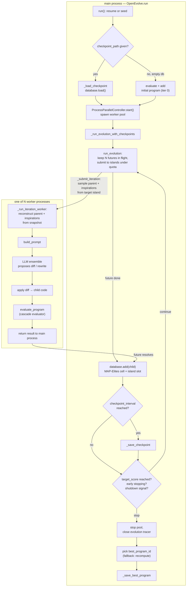

# OpenEvolve's main evolution loop — orchestrating LLM mutation, cascade evaluation, and MAP-Elites/island selection

<!-- connect:up:begin -->
> **Cross-repo concept:** part of [evolutionary-algorithm-discovery](../../../concepts/evolutionary-algorithm-discovery.md) across this wiki's repos.
<!-- connect:up:end -->
## Overview
[`OpenEvolve.run`](../catalog/openevolve/controller.md#OpenEvolve.run) is the single call that turns a seed
program and an evaluator into a lineage of improving programs — the open-source recreation of AlphaEvolve's
outer loop. Its own docstring calls it "Run the evolution process with improved parallel processing," and
that phrase is the key to how the loop is actually built: `run` itself is mostly *setup and teardown*
(resume-or-seed, spin up workers, tear down and pick a winner), while the actual generation-by-generation
work — ask an LLM to propose a diff, apply it, run the cascade evaluator — happens inside a **process
pool**, one iteration per worker process (sampling the parent and its inspirations still happens back in
the main process, before each iteration is submitted), and folding the result back into the
[`database`](../catalog/openevolve/controller.md#OpenEvolve.database) is pipelined so that many iterations
from different islands are always in flight at once rather than run one at a time. The three pillars this page ties
together — the LLM as mutation operator, the programmatic evaluator as selection pressure, and the
MAP-Elites/island `ProgramDatabase` as the population that decides who gets to be a parent next — are each
covered in depth by sibling pages; this page is about the orchestration that makes them into one
closed loop, iteration after iteration, for up to
[`config.max_iterations`](../catalog/openevolve/config.md#Config) iterations or until a target score or
early-stopping condition fires.

## Diagram

## Design rationale (why it's built this way)
**Process pool, not threads or a plain async loop.** LLM calls are I/O-bound and would parallelize fine
under `asyncio`, but evaluating a candidate program means *executing arbitrary generated code*, which is
CPU-bound and, under CPython's GIL, would serialize behind threads. [`run`](../catalog/openevolve/controller.md#OpenEvolve.run)
hands the entire per-iteration workload — prompt building, LLM call, diff application, evaluation — to a
`ProcessPoolExecutor`, so iterations are genuinely concurrent across OS processes. Because a `Config` object
carries things that don't pickle (an LLM ensemble handle attached for novelty scoring), the controller
threads through a hand-written [`_serialize_config`](../catalog/openevolve/process_parallel.md#ProcessParallelController._serialize_config)
rather than relying on `pickle` to do it automatically, and workers rebuild their own `Evaluator`/`LLMEnsemble`/
`PromptSampler` lazily on first use instead of at process-start, so spinning up the pool via
[`start`](../catalog/openevolve/process_parallel.md#ProcessParallelController.start) stays cheap even when
most of those components are expensive to construct.

**A pipeline, not a lockstep generation loop.** `run_evolution` (the method
[`_run_evolution_with_checkpoints`](../catalog/openevolve/controller.md#OpenEvolve._run_evolution_with_checkpoints)
delegates to) does not run "island 1's iteration, then island 2's, then checkpoint, repeat" — it keeps a
bounded number of futures in flight per island and, the instant any one of them completes, submits exactly
one new iteration to whichever island (checked in island-index order) is still under its per-island quota —
not necessarily the island whose future just finished. This means the loop never blocks waiting for the
slowest of a batch; a fast island keeps producing children while a slow one catches up, and the per-island
cap (`island_pending` bounded by `batch_per_island`) is what keeps island populations from becoming lopsided
under uneven completion times.

**Two places track "the best program," on purpose.** MAP-Elites is explicitly a diversity mechanism: a
program can be *evicted from its own feature-grid cell* by a later occupant with a better score on that
cell's dimensions, even if it was the best program ever found. `run`'s own class docstring says as much —
"Ensures the best solution is not lost during the MAP-Elites process" — which is why the database also
maintains [`best_program_id`](../catalog/openevolve/database.md#ProgramDatabase.best_program_id) as a
side-channel independent of the feature grid, and why `run`'s final step prefers that tracked id over
recomputing [`get_best_program`](../catalog/openevolve/database.md#ProgramDatabase.get_best_program) from
scratch — the grid is for maintaining a diverse *breeding population*, not for answering "what's the best
thing we've ever produced."

## Entry points
1. [`main_async`](../catalog/openevolve/cli.md#main_async) — the CLI entry point (`openevolve-run.py`):
   parses arguments, loads/overrides a `Config`, constructs the `OpenEvolve` controller, and calls
   [`run`](../catalog/openevolve/controller.md#OpenEvolve.run).
2. [`_run_evolution_async`](../catalog/openevolve/api.md#_run_evolution_async) — the programmatic
   `run_evolution(...)` API surface for embedding OpenEvolve in other code: prepares a program/evaluator/
   config from flexible inputs (paths, strings, callables) and likewise calls
   [`run`](../catalog/openevolve/controller.md#OpenEvolve.run).
3. [`run`](../catalog/openevolve/controller.md#OpenEvolve.run) itself — callable directly by any code that
   already holds a constructed `OpenEvolve` instance, e.g. tests such as
   [`run_test`](../catalog/tests/test_checkpoint_resume.md#TestCheckpointResume.run_test) and
   [`async_test`](../catalog/tests/test_iteration_counting.md#TestIterationCounting.async_test), which drive
   it directly with `iterations=0` or a small fixed count to check checkpoint and iteration-counting
   behavior in isolation.

## Mechanism (step-by-step)
1. **Decide where to start.** [`run`](../catalog/openevolve/controller.md#OpenEvolve.run) resolves
   `max_iterations` from its argument or [`config`](../catalog/openevolve/controller.md#OpenEvolve.config),
   then checks whether a `checkpoint_path` was given: if so it loads it (restoring `database.last_iteration`
   and every stored `Program`) and resumes at `last_iteration + 1`; otherwise it starts at whatever
   `last_iteration` the (freshly-constructed, empty) [`database`](../catalog/openevolve/controller.md#OpenEvolve.database)
   already reports — normally `0`.
2. **Seed the population, once.** If starting fresh with an empty database, `run` evaluates the initial
   program via [`evaluate_program`](../catalog/openevolve/evaluator.md#Evaluator.evaluate_program), wraps it
   as a [`Program`](../catalog/openevolve/database.md#Program) with `iteration_found=0`, and folds it into
   the database via [`add`](../catalog/openevolve/database.md#ProgramDatabase.add) — this is iteration 0,
   and it happens synchronously in the main process, before any worker pool exists. If it lacks a
   `combined_score` metric, `run` falls back to the plain average of whatever numeric metrics the evaluator
   did return, with a one-time warning, so evolution always has a scalar to optimize toward.
3. **Start the worker pool and hand off the loop.** `run` constructs a `ProcessParallelController`, installs
   `SIGINT`/`SIGTERM` handlers that request graceful shutdown (a second `Ctrl-C` force-exits immediately),
   calls [`start`](../catalog/openevolve/process_parallel.md#ProcessParallelController.start) to spawn the
   process pool, and delegates the actual generation-by-generation work to
   [`_run_evolution_with_checkpoints`](../catalog/openevolve/controller.md#OpenEvolve._run_evolution_with_checkpoints),
   which in turn calls [`run_evolution`](../catalog/openevolve/process_parallel.md#ProcessParallelController.run_evolution)
   with `_save_checkpoint` wired in as its checkpoint callback.
4. **Per iteration, in a worker process:** the parent and its inspirations are chosen *before* the worker
   ever runs — the main process samples them from the target island (`database.sample_from_island`, called
   from `ProcessParallelController._submit_iteration`) and folds the choice into a serializable database
   snapshot passed to the pool. [`_run_iteration_worker`](../catalog/openevolve/process_parallel.md#_run_iteration_worker)
   reconstructs the parent and inspiration `Program` objects from that snapshot by id, calls
   [`build_prompt`](../catalog/openevolve/prompt/sampler.md#PromptSampler.build_prompt) to assemble the
   system/user messages (parent code, its metrics, top and diverse programs, inspirations), sends that to the
   LLM ensemble, parses the response into a code diff (or a full rewrite) and applies it to the parent's
   source, and evaluates the resulting child with its own `Evaluator` instance via
   [`evaluate_program`](../catalog/openevolve/evaluator.md#Evaluator.evaluate_program) — which internally
   dispatches to [`_cascade_evaluate`](../catalog/openevolve/evaluator.md#Evaluator._cascade_evaluate) when
   cascade evaluation is enabled, running increasingly expensive stages and returning an
   [`EvaluationResult`](../catalog/openevolve/evaluation_result.md#EvaluationResult) (`metrics` plus optional
   `artifacts`). The worker returns everything the main process needs to reconstruct the child — it never
   samples from the database or touches the shared database itself.
5. **Fold the result back in, in the main process.** As each future completes,
   [`run_evolution`](../catalog/openevolve/process_parallel.md#ProcessParallelController.run_evolution)
   reconstructs a [`Program`](../catalog/openevolve/database.md#Program) from the worker's result and calls
   [`add`](../catalog/openevolve/database.md#ProgramDatabase.add), which computes its MAP-Elites feature
   coordinates, places it into the target island's slot in
   [`island_feature_maps`](../catalog/openevolve/database.md#ProgramDatabase.island_feature_maps) (replacing
   the prior occupant of that cell if the newcomer scores better), and calls
   [`_enforce_population_limit`](../catalog/openevolve/database.md#ProgramDatabase._enforce_population_limit)
   to evict the weakest programs once the database's total program count exceeds the configured
   `population_size` — a separate cap from the elite `archive` (sized by `archive_size`), which `add`
   maintains on its own and does not touch here. Because database mutation only ever happens here, in the
   single-threaded main process, the concurrency in step 4 never creates a write race.
6. **Periodic housekeeping between iterations.** Every `checkpoint_interval` completed iterations,
   [`run_evolution`](../catalog/openevolve/process_parallel.md#ProcessParallelController.run_evolution)
   invokes the `_save_checkpoint` callback, which calls
   [`save`](../catalog/openevolve/database.md#ProgramDatabase.save) (the full population plus MAP-Elites/
   island metadata) and separately writes out the tracked best program and its metrics. Separately, once an
   island's generation counter advances far enough, the loop calls
   [`migrate_programs`](../catalog/openevolve/database.md#ProgramDatabase.migrate_programs) to move a
   fraction of each island's top performers to its ring-topology neighbors, which is what lets isolated
   islands cross-pollinate without merging into one population.
7. **Stop and report.** The loop in `run_evolution` exits when iterations are exhausted, a child's
   `combined_score` meets `target_score`, an early-stopping patience/convergence condition fires, or a
   shutdown signal was received. Back in [`run`](../catalog/openevolve/controller.md#OpenEvolve.run), the
   final answer is [`best_program_id`](../catalog/openevolve/database.md#ProgramDatabase.best_program_id) if
   the database has one tracked, falling back to
   [`get_best_program`](../catalog/openevolve/database.md#ProgramDatabase.get_best_program) only if it
   doesn't; the winner is written to disk via
   [`_save_best_program`](../catalog/openevolve/controller.md#OpenEvolve._save_best_program) and the
   evolution tracer, if enabled, is flushed and shut down via
   [`close`](../catalog/openevolve/evolution_trace.md#EvolutionTracer.close).

## Key data structures
- [`Program`](../catalog/openevolve/database.md#Program) — the unit of evolution: `id`, `code`, `language`,
  `parent_id`, `generation`, `metrics`, and free-form `metadata` (which is where island assignment and a
  human-readable summary of what changed are stashed). Doc comment: "Represents a program in the database."
- [`ProgramDatabase`](../catalog/openevolve/database.md#ProgramDatabase) — "Database for storing and
  sampling programs during evolution... implements a combination of MAP-Elites algorithm and island-based
  population model." Its `programs` dict is the full population; `islands` partitions program ids into
  isolated sub-populations; `island_feature_maps` is the per-island MAP-Elites grid (feature-coordinates →
  occupant id); `island_generations` drives migration timing (see Mechanism step 6) — the process pool's
  per-island submission addresses islands directly by index rather than reading `current_island`, which
  instead serves as a fallback default island (e.g. when a program has no parent to inherit an island
  from); `best_program_id` and `island_best_programs` are the tracked-best side-channels described above.
- [`Config`](../catalog/openevolve/config.md#Config) / [`DatabaseConfig`](../catalog/openevolve/config.md#DatabaseConfig) —
  the whole run's knobs: `max_iterations`, `checkpoint_interval`, early-stopping settings, and nested
  configs for `llm` (its `models` list is the ensemble), `prompt`, `evaluator`, and `database` (`num_islands`,
  `feature_dimensions`, migration interval/rate).
- [`EvaluationResult`](../catalog/openevolve/evaluation_result.md#EvaluationResult) — the evaluator's return
  contract: mandatory `metrics: Dict[str, float]` plus an optional `artifacts` side-channel for debugging
  data (stdout, stack traces) that never influences selection but can be fed back into the next prompt.

## Dynamics (design intent)
The main process and the worker processes have a strict division of labor: workers are stateless with
respect to the shared database (each one operates on a *snapshot* that already carries a parent/inspiration
set the main process chose before submission, calls the LLM, evaluates, and returns a serializable result);
only the main process, inside
[`run_evolution`](../catalog/openevolve/process_parallel.md#ProcessParallelController.run_evolution), ever
calls [`add`](../catalog/openevolve/database.md#ProgramDatabase.add) or mutates island state. This makes the
"true parallelism" the docstring promises safe: however many iterations run concurrently across processes,
the actual population update is always single-threaded. The iteration-count bookkeeping has a matching
subtlety: when a fresh run seeds the initial program, that consumes iteration `0` outside the pool entirely
(step 2 above), so `run` shifts the evolution loop itself to start at iteration `1` — meaning a caller who
asks for `iterations=N` gets `N` LLM-driven evolutionary iterations *after* the free initial evaluation, not
`N` total. [`async_test`](../catalog/tests/test_iteration_counting.md#TestIterationCounting.async_test) and
[`run_test`](../catalog/tests/test_checkpoint_resume.md#TestCheckpointResume.run_test) both exist specifically
to pin down this counting behavior across fresh starts, `iterations=0` calls, and checkpoint resumption.

## Edge cases
- **`iterations=0` still evaluates the seed.** [`run_test`](../catalog/tests/test_checkpoint_resume.md#TestCheckpointResume.run_test)
  confirms that even a zero-iteration call adds exactly one program (the initial one, evaluated exactly
  once) and that the evolution loop itself is never entered — useful for a "does my evaluator even run"
  smoke test.
- **Resuming never re-adds the initial program.** The fresh-start check in
  [`run`](../catalog/openevolve/controller.md#OpenEvolve.run) requires `start_iteration == 0` *and* an empty
  database, so a checkpoint resume with existing programs always skips straight to evolving from
  `last_iteration + 1`.
- **A shutdown signal can skip the final checkpoint.** `_run_evolution_with_checkpoints` returns immediately
  if the pool's `shutdown_event` got set, before reaching the "save final checkpoint" step at the end of that
  method — so a graceful `Ctrl-C` mid-run relies entirely on whatever periodic checkpoints already landed;
  it does not force one more save on the way out.
- **A single stuck iteration cannot hang the whole run.** `run_evolution` bounds each future's `.result()`
  call at the evaluator timeout plus a 30-second buffer; a timeout logs an error, cancels that future, and
  the loop moves on rather than blocking indefinitely on one runaway evaluation.
- **Migration used to duplicate programs exponentially.** [`migrate_programs`](../catalog/openevolve/database.md#ProgramDatabase.migrate_programs)'s
  ring-topology migration originally allowed already-migrated programs to migrate again, and the codebase's
  own comments record the fallout (one program reached 183 descendant copies); the fix — never re-migrate a
  program that is itself already a migrant — is exercised by
  [`test_migration_preserves_program_quality`](../catalog/tests/integration/test_migration_with_llm.md#TestMigrationWithLLM.test_migration_preserves_program_quality),
  which asserts migrant ids never carry a `_migrant` suffix (the old exponential-naming symptom).

## Open questions
- The subgraph for this packet stops before the actual diff-parsing/application helpers
  (`extract_diffs`/`apply_diff`/`apply_diff_blocks` in `openevolve/utils/code_utils.py`, called inside
  `_run_iteration_worker`) and the island sampling method (`ProgramDatabase.sample_from_island`), which only
  `ProcessParallelController._submit_iteration` calls (in the main process, before submission) — this page
  describes their role (parse the LLM's diff, apply it; pick a parent + inspirations from an island) without
  citing them directly; the sibling database/LLM-ensemble concept pages are the right place to ground
  exactly how they work.
- `run_evolution`'s completion-detection loop polls each pending future with `.done()` in a `while` loop with
  a fixed `asyncio.sleep(0.01)` between checks rather than using an event-driven primitive
  (`concurrent.futures.wait`/`as_completed` bridged into asyncio); this subgraph doesn't show whether that
  polling interval was chosen deliberately to bound CPU overhead versus latency at high worker counts.

## See also
- [`openevolve-database`](openevolve-database.md) — the MAP-Elites/island `ProgramDatabase` this loop reads
  from and writes to every iteration.
- [`openevolve-evaluator`](openevolve-evaluator.md) — the cascade evaluator that scores every candidate this
  loop produces.
- [`openevolve-llm-ensemble`](openevolve-llm-ensemble.md) — the multi-model LLM ensemble that proposes each
  candidate's diff.
- [`openevolve-prompt-sampler`](openevolve-prompt-sampler.md) — how `build_prompt` assembles parent code,
  metrics, and inspirations into the message this loop sends to the LLM.
- [`openevolve-process_parallel`](openevolve-process_parallel.md) — the process-pool machinery
  (`run_evolution`, `_run_iteration_worker`) this page treats as the loop's execution substrate.
- [`openevolve-api`](openevolve-api.md) — the programmatic entry point (`_run_evolution_async`) that wraps
  this loop for library use.
- [`../../../concepts/evolutionary-algorithm-discovery.md`](../../../concepts/evolutionary-algorithm-discovery.md) —
  the cross-repo concept this loop is the clearest in-wiki instance of: candidate = code, mutation = LLM
  diff, selection = programmatic evaluator + population database.
- [`../../../sources/alphaevolve.md`](../../../sources/alphaevolve.md) — the paper whose outer loop this
  code reimplements.
